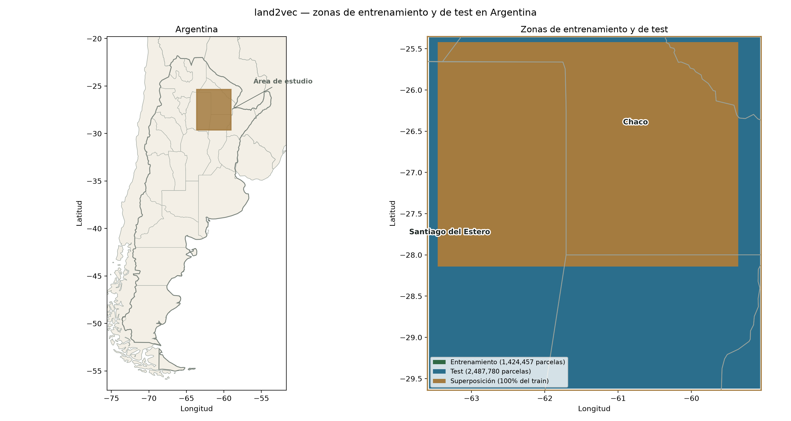
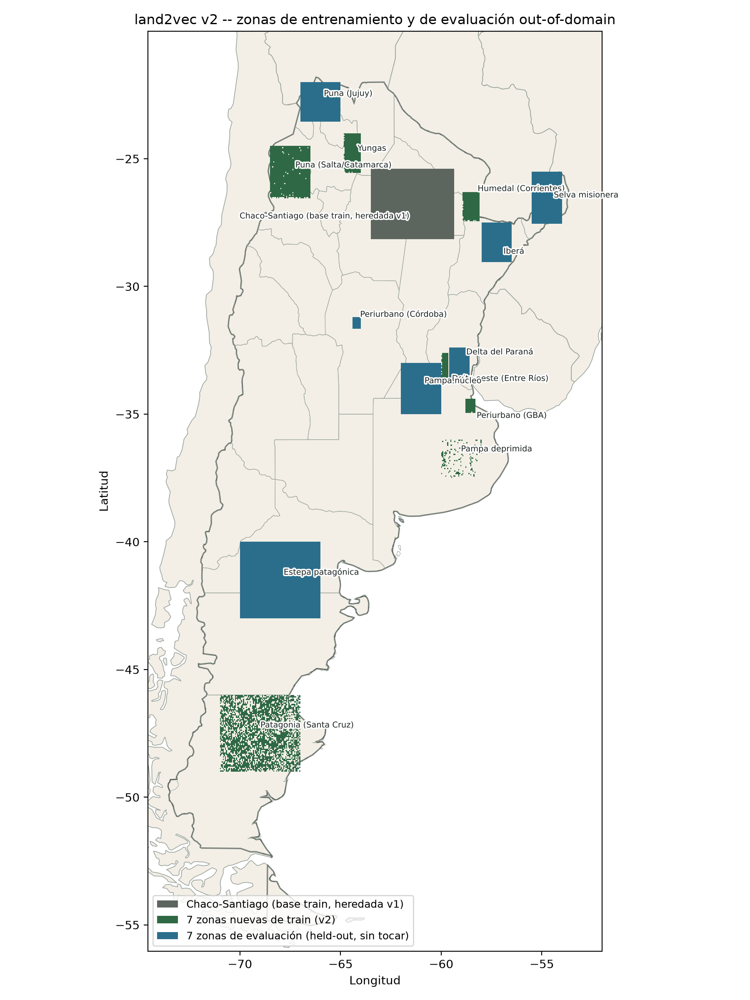

<picture>
  <source media="(prefers-color-scheme: dark)" srcset="imgs/logo-dark.png">
  
</picture>

`land2vec` entrena un modelo de lenguaje tipo GPT (transformer decoder-only,
causal self-attention) sobre **secuencias temporales de uso/cobertura del
suelo** de parcelas entre 2000 y 2022 (zonas de Chaco, Santiago del Estero y
frontera agrícola). La idea es análoga a *word2vec*, pero en vez de predecir
palabras a partir de su contexto, el modelo predice el próximo estado de uso
del suelo de una parcela a partir de su historial de estados anteriores.

Además de ese modelo predictivo (v1, `GPTDecoder`), el repo incluye una
segunda arquitectura (v2, `TrajectoryAutoencoder`) que comprime cada
trayectoria completa en un embedding de baja dimensión -- ver la sección
["v2: embeddings comprimidos"](#v2-embeddings-comprimidos-trajectoryautoencoder)
más abajo.

## Estructura del repo

```
src/land2vec/
  config.py     # dataclass Config con hiperparámetros del modelo/entrenamiento
  tokenizer.py  # Tokenizer estático: vocabulario fijo de estados de uso del suelo
  dataset.py    # Datasets de PyTorch (ventaneado y no ventaneado) + carga de CSV/zip
  model.py      # GPTDecoder (v1, causal) + TrajectoryAutoencoder (v2, embeddings) + run_epoch
  utils.py      # Guardado/carga de config, modelo y métricas
  extract.py    # Extracción de secuencias por píxel desde el netCDF fuente (ESA CCI)
data/           # Secuencias de entrenamiento y de test (CSV/zip) + netCDF fuente (Git LFS)
models/         # Checkpoints entrenados (config.json + model.pt + train_data.csv)
notebooks/      # Notebooks de experimentación ("pruebas") en Google Colab
```

## Instalación

```bash
python -m venv .venv
source .venv/bin/activate      # Windows: .venv\Scripts\activate
pip install -r requirements.txt
pip install -e .
```

O con `scripts/setup_venv.sh`, que hace lo mismo y de paso chequea si
`torch` detecta GPU:

```bash
bash scripts/setup_venv.sh
```

Requiere Python 3.11+ (usa `dataclass(slots=True)` y sintaxis de tipos
moderna) y, para entrenar en GPU, una instalación de PyTorch con soporte
CUDA (el wheel de `torch` en PyPI ya lo trae si tenés drivers NVIDIA
compatibles -- no hace falta instalar el CUDA toolkit aparte).

`data/landcover_timeseries_2000-2022.nc` (ver más abajo) se versiona con
[Git LFS](https://git-lfs.com/) por su tamaño (~189MB). Para clonar el repo
con el archivo real (no solo el puntero):

```bash
git lfs install   # una sola vez por máquina
git clone https://github.com/gefero/land2vec
```

## Datos

Cada fila de un CSV de secuencias representa una parcela, identificada por
`ID`, con una columna `seqs` que contiene su trayectoria anual de estados
separados por `-`, por ejemplo:

```
ID,seqs
0,F-Sh-F-F-F-F-F-F-F-F-F-F-F-F-F-F-F-F-F-Sh-Sh-Sh-Sh
```

El vocabulario de estados (`land2vec.tokenizer.Tokenizer.VOCAB`) es:

| Token   | Significado (código) |
|---------|----|
| `[UNK]` | desconocido / relleno, ignorado en la loss |
| `A`     | estado A |
| `F`     | forestal |
| `G`     | pastizal/grassland |
| `Wt`    | humedal (wetland) |
| `U`     | urbano |
| `Sh`    | arbustal (shrub) |
| `Sp`    | estado Sp |
| `B`     | estado B |
| `Wa`    | agua (water) |
| `Nd`    | sin dato (no data) |

Archivos en `data/`:

- `id_seqs_text_2000_2022_chaco_santiago_frontier.zip` — dataset principal de entrenamiento (Chaco, Santiago del Estero, frontera).
- `id_seqs_text_2000_2022_test_set.zip` — set de test held-out, usado en la evaluación final.
- `test_sample_0/1/2.zip` — muestras adicionales de test.
- `seqs_short.csv` — muestra chica (10 filas) usada para pruebas rápidas/debug.

## Extracción desde el netCDF fuente (`land2vec.extract`)

Los `id_seqs_text_*.zip` / `lat_long_df_*.zip` de `data/` se derivan de
`data/landcover_timeseries_2000-2022.nc`: series anuales 2000-2022 de
[ESA CCI Land Cover](http://www.esa-landcover-cci.org/) (`lccs_class`,
300m de resolución), ya recortadas a Sudamérica — cubre
lat `[-55.0, -20.0]`, lon `[-75.0, -53.0]` (todo el territorio continental
argentino, Uruguay, buena parte de Chile y el sur de Bolivia/Paraguay/Brasil).

El proceso original de extracción (recortar el netCDF a una región,
aplanar píxeles a una grilla con `ID`, mapear los códigos numéricos de
`lccs_class` a los tokens del vocabulario) está documentado en
`src/3_concat_extract_nc_files.ipynb` y reimplementado como funciones
reutilizables en `land2vec.extract`:

```python
from land2vec.extract import load_landcover_dataset, extract_zone, save_zone_csvs

ds = load_landcover_dataset()  # data/landcover_timeseries_2000-2022.nc por defecto

# bbox = (minx, miny, maxx, maxy) en lon/lat
lat_long_df, seqs_df = extract_zone(ds, bbox=(-57.6, -28.6, -57.4, -28.4))

save_zone_csvs(lat_long_df, seqs_df, output_dir=Path("data"), zone_name="ibera")
# -> data/id_seqs_text_2000_2022_ibera.zip, data/lat_long_df_ibera.zip
```

`extract_zone()` reproduce exactamente `id_seqs_text_2000_2022_chaco_santiago_frontier.zip`
al recortar con el mismo bbox (validado píxel a píxel contra el dataset de
entrenamiento). También incluye `drop_constant_sequences()`, para descartar
píxeles cuya secuencia no cambia en todo el período (p. ej. agua
permanente), como hace `src/3_concat_extract_nc_files.ipynb` para el
dataset de entrenamiento.

`land2vec.dataset.load_data()` carga cualquiera de estos archivos y
devuelve:

- `SequenceDataset` (si se pasa `window=`) — ejemplos de next-token
  prediction con ventana deslizante de tamaño fijo.
- `SequenceDatasetNonWindow` (si no se pasa `window`) — usa la secuencia
  completa de cada parcela como un solo ejemplo (padding/batching lo maneja
  el `DataLoader`).

## Cobertura geográfica



Mapa generado con `scripts/plot_train_test_zones.py` a partir de
`data/lat_long_df_*.zip` (coordenadas por parcela) y los límites de
Argentina/provincias en `data/geo/` (Natural Earth). El área de estudio
cae en Chaco y Santiago del Estero; el recuadro marrón en el panel derecho
muestra dónde se superponen las parcelas de entrenamiento y de test.

## Modelo

`GPTDecoder` (`src/land2vec/model.py`) es un transformer decoder causal
"desde cero": embeddings de token + posición, bloques de
self-attention causal (`F.scaled_dot_product_attention`) + feed-forward con
GELU, weight tying entre el embedding de entrada y la capa de salida
(`lm_head`), y un método `generate()` con muestreo por temperatura, top-k y
top-p.

Los hiperparámetros por defecto están en `land2vec.config.Config`
(`block_size`, `n_embd`, `n_head`, `n_layer`, `dropout`, `epochs`, `lr`,
`patience`, `batch_size`, `device`, `seed`, ...).

`land2vec.model.run_epoch()` corre una época de entrenamiento o evaluación
(según si se pasa un `optimizer`), con soporte de AMP (`torch.autocast` +
`GradScaler`) y cross-entropy ponderada que ignora el token `[UNK]`.

## Entrenamiento y evaluación (uso típico)

```python
from land2vec.config import Config
from land2vec.dataset import load_data
from land2vec.model import GPTDecoder, run_epoch
from land2vec.tokenizer import Tokenizer
from land2vec.utils import save_config, save_model, collect_predictions, compute_metrics

config = Config(block_size=22, batch_size=1024)
dataset = load_data(file_path="data/seqs_short.csv")  # o el dataset completo

model = GPTDecoder(
    vocab_size=len(Tokenizer.VOCAB),
    block_size=config.block_size,
    n_embd=config.n_embd,
    n_head=config.n_head,
    n_layer=config.n_layer,
    dropout=config.dropout,
).to(config.device)

# ... entrenar con run_epoch() en un loop con early stopping por patience ...

preds, targets, loss = collect_predictions(model, val_loader, config.device, weights)
metrics = compute_metrics(targets, preds)  # accuracy, macro F1
```

Los checkpoints se guardan/cargan con `save_model`/`load_model` y
`save_config`/`load_config` de `land2vec.utils`, en una carpeta por modelo
dentro de `models/` (`config.json` + `model.pt` + `train_data.csv` con el
historial de entrenamiento).

## Ejemplo de uso: inferencia con un modelo entrenado

Este ejemplo carga el modelo final (`models/full_model`) y predice el
próximo estado de uso del suelo a partir de una secuencia histórica:

```python
from pathlib import Path
import torch

from land2vec.tokenizer import Tokenizer
from land2vec.utils import load_config, load_model

target_folder = Path("models/full_model")
config = load_config(target_folder)
model = load_model(config, target_folder)  # ya queda en eval() y en config.device

# Secuencia histórica de una parcela (estados separados por "-")
seq = "F-Sh-F-F-F-F-F-F-F-F-F-F-F-F-F-F-F-F-F-Sh-Sh-Sh"
tokens = torch.tensor([Tokenizer.encode(seq)], device=config.device)  # (1, T)

# Predecir el próximo estado más probable
with torch.inference_mode():
    logits = model(tokens[:, -config.block_size:])
next_state_id = logits[0, -1].argmax().item()
print(Tokenizer.decode(torch.tensor([next_state_id])))  # p.ej. "Sh"

# Generar varios pasos hacia adelante muestreando (autoregresivo)
generated = model.generate(tokens, max_new_tokens=5, temperature=0.8, top_k=5)
print(Tokenizer.decode(generated[0]))
```

## Notebooks / pruebas experimentales

Los notebooks en `notebooks/` documentan las corridas de experimentación
(diseñados para correr en Google Colab, con carga de datos y de módulos
adaptada a ese entorno). Cada uno sigue el flujo *cargar datos → crear/cargar
modelo → entrenar → evaluar → predecir*:

| Notebook | Qué prueba | Config relevante | Modelo resultante |
|---|---|---|---|
| `prueba_1.ipynb` | Exploración inicial de datos y primer entrenamiento con dataset ventaneado (`window=block_size`) | `patience=6` | `models/patience_6` (no incluido en el repo) |
| `prueba_2.ipynb` | Segunda iteración de entrenamiento, mismo esquema ventaneado | `patience=4` | `models/2026-05-20` |
| `prueba_3.ipynb` | Cambia a dataset **no ventaneado** (secuencia completa por parcela) y a un dataset balanceado; agrega matriz de confusión | `patience=4, batch_size=1024, block_size=22` | `models/balanced_1` |
| `test_1.ipynb` | Retoma el modelo `balanced_1`, continúa el entrenamiento y evalúa contra el set de test held-out (`id_seqs_text_2000_2022_test_set.zip`) | Config heredada de `balanced_1`, `patience=6` | `models/full_model` (modelo final) |

No hay tests automatizados (`pytest` u otro framework); la validación del
proyecto se hace de forma exploratoria en estos notebooks, evaluando
accuracy y F1 macro sobre datos de validación/test y revisando matrices de
confusión.

## Resultados preliminares

> ⚠️ **Resultados preliminares**, obtenidos en `test_2.ipynb` evaluando el
> modelo final (`models/full_model`) sobre el set de test held-out
> (`data/id_seqs_text_2000_2022_test_set.zip`). Sujetos a revisión con más
> datos y validaciones adicionales.

- Parámetros del modelo: 795,520
- Mejor F1 macro en validación (durante entrenamiento, época 1): 0.9886
- **Accuracy (test set)**: 0.9929
- **Macro F1 (test set)**: 0.9005

## Evaluación out-of-domain

> ⚠️ El número anterior mide generalización *dentro* del área de estudio
> (Chaco/Santiago del Estero/frontera agrícola). `notebooks/eval_ood_zones.ipynb`
> evalúa el mismo modelo (`models/full_model`) sobre 7 zonas de Argentina
> geográficamente disjuntas de esa área, construidas con
> `scripts/build_eval_zones.py` (ver `land2vec.extract`), cada una dominada
> por una modalidad de uso de suelo distinta.

| Zona | Mezcla dominante | Accuracy | Macro F1 |
|---|---|---:|---:|
| `puna_noa` | `B`=47.5%, `Sp`=36.9% | 0.6042 | 0.4682 |
| `patagonia_estepa` | `Sp`=54.0%, `Sh`=44.0% | 0.9957 | 0.6502 |
| `misiones_selva` | `F`=70.9%, `A`=23.9% | 0.9982 | 0.6947 |
| `pampa_nucleo` | `A`=89.3% | 0.9993 | 0.7920 |
| `ibera` | `Wt`=51.4%, `F`=22.6% | 0.9951 | 0.7946 |
| `periurbano_cordoba` | `A`=69.0%, `U`=14.5% | 0.9950 | 0.7969 |
| `delta_parana` | `A`=44.0%, `Wt`=34.7%, `G`=13.5% | 0.9971 | 0.8101 |
| **Pooled (7 zonas)** | — | **0.9511** | **0.7507** |

El accuracy no detecta la falla de generalización (se mantiene alto porque
la clase mayoritaria en casi cualquier parcela es "sin cambio interanual");
el macro F1 cae entre 9 y 43 puntos porcentuales respecto al 0.9005
in-domain en las 7 zonas. La caída es más severa en `puna_noa`, la única
zona con peso real de la clase `B` (0% en entrenamiento). Ver
`notebooks/eval_ood_zones.ipynb` para matrices de confusión, accuracy por
posición y el detalle completo.

## v2: embeddings comprimidos (`TrajectoryAutoencoder`)

Modelo final entrenado (`models/autoencoder_v2/`) -- ver
[`docs/v2_autoencoder_training.md`](docs/v2_autoencoder_training.md) para
el detalle completo (arquitectura, los dos barridos de tuneo con sus
resultados, zonas de entrenamiento con mapa, y las curvas de la corrida
final).

La v1 (`GPTDecoder`) predice el próximo estado, pero nunca está obligada a
resumir una trayectoria completa en un vector: no sirve para obtener un
*embedding* por parcela. `land2vec.model.TrajectoryAutoencoder` sí:
comprime los 23 años de una trayectoria (2000-2022) en un vector `z` de
`embed_dim` dimensiones y la reconstruye a partir de ese único vector.

Diferencias clave con `GPTDecoder`:

- **Encoder y decoder bidireccionales** (`Block(..., is_causal=False)`), no
  autorregresivos: el decoder recibe únicamente `z` (difundido a las 23
  posiciones + position embedding), nunca ve los tokens de entrada. Así toda
  la señal de reconstrucción está forzada a pasar por el cuello de botella
  -- un decoder autorregresivo podría reconstruir usando contexto local e
  ignorar `z` casi por completo.
- `encode(x) -> z` (pooling `"mean"` o `"query"`, un query aprendido con
  atención de una sola cabeza) y `decode(z) -> logits` son métodos
  separados; `forward(x)` es `decode(encode(x))`.
- `CausalSelfAttention`/`Block` (`model.py`) ahora aceptan `is_causal: bool
  = True` -- se reutilizan tal cual para ambas arquitecturas; `GPTDecoder`
  no cambia de comportamiento (default `True`).

### Cargar cualquiera de los dos modelos

`Config` suma `arch: Literal["gpt_decoder", "seq_autoencoder"]` (default
`"gpt_decoder"`, así los `config.json` de antes de la v2 siguen cargando
sin tocarlos), más `embed_dim` y `pooling` para la v2. `load_model()`
despacha según `config.arch`:

```python
from land2vec.utils import load_config, load_model

config = load_config("models/autoencoder_v2")
model = load_model(config, "models/autoencoder_v2")  # TrajectoryAutoencoder
z = model.encode(tokens)  # (B, embed_dim)
```

### Datos de entrenamiento

Adrede **distintos** de las 7 zonas de evaluación out-of-domain (que quedan
intactas como benchmark held-out): Chaco-Santiago original + 7 zonas nuevas
en las mismas ecorregiones, construidas con
`scripts/build_eval_zones.py --zone-set train`:

| Zona train | n (filas) | Mezcla dominante (post-submuestreo) | Misma ecorregión que (zona de eval) |
|---|---:|---|---|
| `puna_salta_catamarca` | 31,518 | `B`=65.2%, `Sp`=25.0%, `Sh`=6.4% | `puna_noa` |
| `patagonia_santacruz` | 20,821 | `Sp`=56.6%, `G`=24.5%, `Sh`=11.7% | `patagonia_estepa` |
| `periurbano_gba` | 4,003 | `U`=48.2%, `A`=29.9%, `F`=10.6% | `periurbano_cordoba` |
| `corrientes_humedal` | 17,314 | `F`=35.3%, `Wt`=32.3%, `Sh`=15.3% | `ibera` |
| `delta_oeste` | 3,561 | `Wt`=56.0%, `F`=18.9%, `A`=17.2% | `delta_parana` |
| `pampa_deprimida` | 704 | `A`=58.2%, `U`=13.5%, `Sh`=10.2% | `pampa_nucleo` |
| `yungas` | 20,505 | `F`=40.6%, `A`=33.4%, `Sh`=24.8% | `misiones_selva` |

(Porcentajes calculados sobre las secuencias tal como quedaron después del
submuestreo de constantes -- lo que el modelo efectivamente ve. Detalle
completo, con mapa, en `docs/v2_autoencoder_training.md`.)

Todas verificadas geográficamente disjuntas entre sí, del área de
entrenamiento original y de las 7 zonas de evaluación
(`build_eval_zones.py` corta con error si detecta solapamiento). Además,
como la inmensa mayoría de los píxeles de cualquier zona no cambia nunca en
23 años (ver "Evaluación out-of-domain" más arriba), `extract.subsample_constant_sequences()`
submuestrea las secuencias constantes a lo sumo al 15% del dataset final,
tanto en estas 7 zonas nuevas como en Chaco-Santiago al combinarlas para
entrenar -- si no, el autoencoder aprende poco más que reconstruir "23 años
de lo mismo".

### Mapa de zonas de entrenamiento y evaluación



Generado con `scripts/plot_v2_zones.py` a partir de las coordenadas reales
por píxel. Las 7 zonas de evaluación (azul) son las mismas que ya se usan
como benchmark de la v1 y **nunca se tocan para entrenar la v2**; las 7
nuevas de entrenamiento (verde) están en las mismas ecorregiones, con
bboxes disjuntos.

### El barrido de tuneo, en dos etapas

El modelo es chico, pero barrer dimensión + hiperparámetros a escala
completa (~400K secuencias combinadas) se estimó en 8-15+ horas en CPU --
impráctico fuera de una GPU (en una GTX 1060 de 6GB, ~145-285s/época según
`n_layer`). Se corrió en dos etapas secuenciales, cada una con `d`/config
fija del resto:

```bash
# 1) barrido primario: dimensión del embedding, d en {4,8,12,16,32}
python scripts/train_autoencoder.py --sweep dim --out-dir models/sweep_dim

# 2) barrido secundario (lr, n_layer, pooling, pesos de clase), con d=8 fijo
python scripts/train_autoencoder.py --sweep secondary --embed-dim 8 --out-dir models/sweep_secondary

# 3) modelo final con la config ganadora
python scripts/train_autoencoder.py --embed-dim 8 --n-layer 2 --pooling query --out models/autoencoder_v2
```

**Barrido primario** (`models/sweep_dim/summary.csv`): `d=8` fue el codo
de la curva (macro F1 de reconstrucción 0.8939, a solo 0.0044 del control
no-compresivo `d=32`=0.8983).

**Barrido secundario** (`models/sweep_secondary/summary.csv`, con `d=8`
fijo): `n_layer_2_query` (`lr=1e-3`, `n_layer=2`, `pooling=query`) empató
en la práctica con la mejor corrida (`lr_bajo`, 0.8989 vs. 0.8985) con la
mitad de las capas y la mitad del tiempo por época -- elegida por ese
motivo, no por ser matemáticamente la mejor (ver
`docs/v2_autoencoder_training.md` para la nota completa sobre por qué
comparar corridas con distinto número de épocas no es del todo justo).

**Modelo final** (`models/autoencoder_v2/`): macro F1 0.8971, accuracy
0.9993, `early stopping` en la época 22 (mejor en la 17), 798,216
parámetros. Detalle completo, con curvas de entrenamiento, en
[`docs/v2_autoencoder_training.md`](docs/v2_autoencoder_training.md).

Cada corrida guarda `config.json` + `model.pt` + `train_data.csv` (misma
convención que los modelos de la v1).

### Evaluación de embeddings (`eval_embeddings_v2.ipynb`)

Ejecutado sobre las 7 zonas de evaluación out-of-domain -- ver
[`docs/v2_autoencoder_training.md`](docs/v2_autoencoder_training.md#7-resultados-de-la-evaluación-de-embeddings-eval_embeddings_v2ipynb)
para el detalle completo (matrices de confusión, mapa de clusters, tabla
de probing, PCA). Resumen:

- **Reconstrucción por zona**: accuracy ≥0.9995 en las 7 zonas; el macro
  F1 (0.70-0.90) varía sobre todo por cuántas de las 10 clases del
  vocabulario aparecen en cada zona (no por diferencias reales de calidad
  -- ver el detalle en el doc), así que no es directamente comparable
  entre zonas.
- **Clustering** (`scripts/tune_clustering.py`, barrido de 120 configs sobre
  KMeans/GMM/HDBSCAN/jerárquico x preprocesado de `z`, elegidas por
  silhouette + estabilidad por bootstrap + fidelidad del prototipo
  decodificado + coherencia espacial -- ver el detalle completo en el doc):
  dos niveles. La ganadora sin restricciones es **HDBSCAN** (`k=115`,
  silhouette 0.92, fidelidad de prototipo 0.95) -- muy fina pero poco
  legible. La mejor con `k<=20` es HDBSCAN (`k=12`, fidelidad 0.86), aunque
  su estabilidad bajó de 0.99 a 0.69 al reajustarla con más bootstraps
  (documentada igual, como tipología exploratoria -- ver el doc para el
  detalle de por qué).
- **Probing** (`z` de 8 dims vs. one-hot crudo de 253 dims vs. hidden
  state pooled de la v1, 128 dims): `z` empata en la práctica con las
  representaciones mucho más grandes en "clase dominante" (0.9998) y
  "ecorregión" (0.7918); pierde 2.6 puntos en "hubo transición" (0.9665
  vs. 0.9926 del one-hot) -- el costo de compresión más claro del
  análisis.
- **Próximo paso**: macro F1 restringido a clases con soporte por
  subconjunto (ver `docs/v2_autoencoder_training.md` sección 8).

Extraer embeddings de una zona ya construida, con el modelo final:

```bash
python scripts/extract_embeddings.py --model models/autoencoder_v2 --zone ibera
# -> data/embeddings_ibera.zip (columnas ID, z0..z7)
```

## Modelos entrenados incluidos

**v1 (`GPTDecoder`)**:
- `models/full_model/` — modelo final, entrenado sobre el dataset completo y evaluado en el test set held-out (ver `test_1.ipynb`).
- `models/balanced_1/` — modelo entrenado sobre un dataset balanceado, con secuencias completas sin ventaneo (ver `prueba_3.ipynb`).
- `models/2026-05-20/` — checkpoint intermedio de una corrida anterior (ver `prueba_2.ipynb`).
- `models/first-test.pt` — checkpoint suelto de una prueba temprana.

**v2 (`TrajectoryAutoencoder`)**:
- `models/autoencoder_v2/` — modelo final (`d=8, n_layer=2, pooling=query`), ver `docs/v2_autoencoder_training.md`.
- `models/sweep_dim/d{4,8,12,16,32}/` — las 5 corridas del barrido primario (dimensión del embedding).
- `models/sweep_secondary/<nombre>/` — las 8 corridas del barrido secundario (lr/capas/pooling/pesos), con `d=8` fijo.

Cada carpeta de modelo incluye `config.json` (hiperparámetros usados),
`model.pt` (pesos) y `train_data.csv` (historial de loss/métricas por época).

## Créditos

- **Coordinación**: Germán Rosati (CONICET-EIDAES/UNSAM)
- **Colaboración**: Gonzalo Jara (Lic. en Ciencia de Datos - ECyT/UNSAM)
