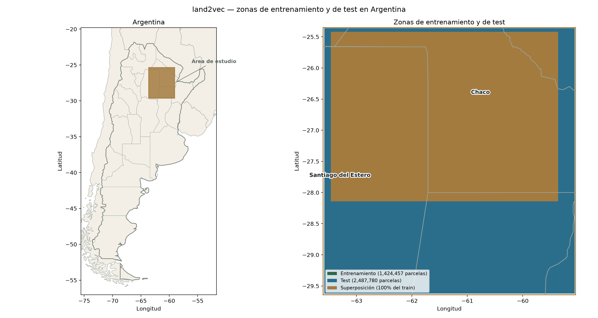
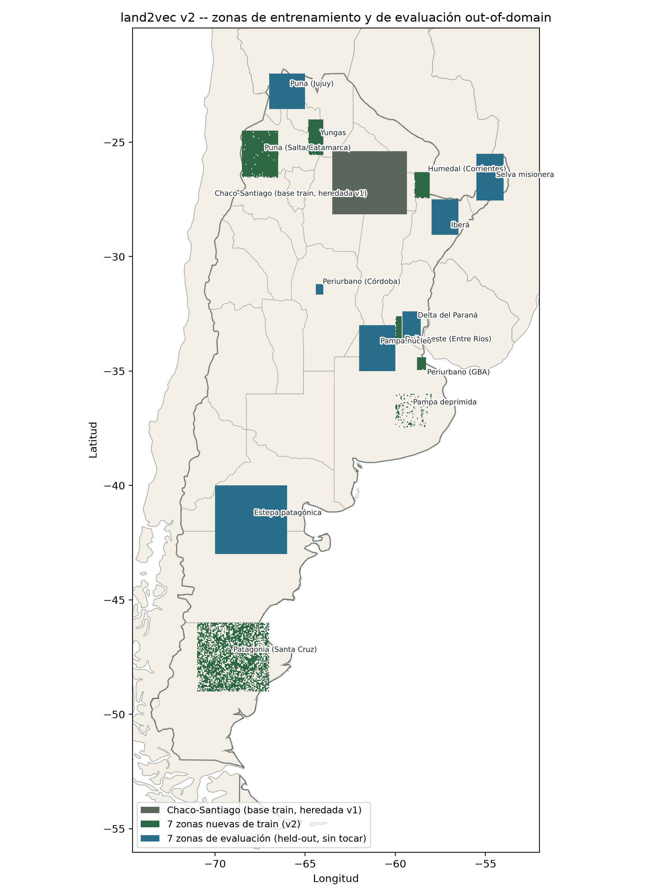

<picture>
  <source media="(prefers-color-scheme: dark)" srcset="imgs/logo-dark.png">
  
</picture>

`land2vec` entrena un modelo de lenguaje tipo GPT (transformer decoder-only,
causal self-attention) sobre **secuencias temporales de uso/cobertura del
suelo** de parcelas entre 2000 y 2022 (zonas de Chaco, Santiago del Estero y
frontera agrícola). La idea es análoga a *word2vec*, pero en vez de predecir
palabras a partir de su contexto, el modelo predice el próximo estado de uso
del suelo de una parcela a partir de su historial de estados anteriores.

Además de ese modelo predictivo (v1, `GPTDecoder`), el repo incluye una
segunda arquitectura (v2, `TrajectoryAutoencoder`) que comprime cada
trayectoria completa en un embedding de baja dimensión -- ver la sección
["v2: embeddings comprimidos"](#v2-embeddings-comprimidos-trajectoryautoencoder)
más abajo.

## Estructura del repo

El repo tiene tres ejercicios: **v1** (`GPTDecoder`, predicción del próximo estado),
**v2** (`TrajectoryAutoencoder` + tipologías, el borrador de paper actual) y
**autoencoder_v3** (reformulación descriptiva: compresión y descripción de trayectorias,
ver [`docs/autoencoder_v3/plan.md`](docs/autoencoder_v3/plan.md)). El código es uno
solo (`src/` y `scripts/`); los productos de cada ejercicio viven en su subcarpeta de
`data/`, `models/`, `notebooks/` y `docs/`. Todas las rutas están centralizadas en
`src/land2vec/paths.py`.

```
src/land2vec/
  paths.py      # rutas del repo (ROOT, DATA, MODEL_V2, seqs_file(), clusters_file(), …)
  config.py     # dataclass Config con hiperparámetros del modelo/entrenamiento
  tokenizer.py  # Tokenizer estático: vocabulario fijo de estados de uso del suelo
  dataset.py    # Datasets de PyTorch (ventaneado y no ventaneado) + carga de CSV/zip
  model.py      # GPTDecoder (v1, causal) + TrajectoryAutoencoder (v2, embeddings) + run_epoch
  utils.py      # Guardado/carga de config, modelo y métricas
  extract.py    # Extracción de secuencias por píxel desde el netCDF fuente (ESA CCI)
  cluster.py    # Pool de trayectorias por zona, submuestreo de constantes, asignación por centroide
  seqdist.py    # Distancias entre secuencias (Optimal Matching, Hamming)
  typology.py   # Firma descriptiva y etiqueta automática por cluster (STATE_COLORS, GLOSSES, auto_label)
  zones.py, geo.py
scripts/                  # se corren desde la raíz del repo: python scripts/<etapa>/<script>.py
  datos/        # build_eval_zones, build_desmonte_labels
  modelo/       # train_autoencoder, extract_embeddings
  clustering/   # tune_clustering, assign_train_clusters, describe_clusters, check_typology, analisis_estabilidad
  validacion/   # eval_desmonte
  viz/          # build_cluster_map, build_crossrun, plot_*, check_cluster_palette, check_crossrun_viewer.js
  imagenes/     # fetch_zone_imagery_gee (+ alternativas pausadas), import_manual_imagery, make_zone_kml
  setup_venv.sh
data/
  landcover_timeseries_2000-2022.nc   # netCDF fuente ESA CCI (Git LFS)
  geo/          # provincias, Sudamérica, polígonos de desmonte (crudos)
  zonas/        # id_seqs_text_2000_2022_<zona>.zip + lat_long_df_<zona>.zip; zonas/full/ sin submuestrear (no versionado)
  desmonte/     # etiquetas de referencia por píxel (desmonte_px*, desmonte_poly_px*)
  v1/           # seqs_short.csv, test_sample_*.zip
  v2/           # embeddings_<zona>.zip, clusters_<set><sufijo>.zip
  autoencoder_v3/
models/
  v1/           # full_model, balanced_1, 2026-05-20, first-test.pt
  v2/           # autoencoder_v2, sweep_dim, sweep_secondary, cluster_v2
  autoencoder_v3/
notebooks/
  v1/           # prueba_*, test_*, 3_concat_extract_nc_files (Colab)
  v2/           # eval_embeddings_v2, eval_ood_zones, cluster_evaluation, desmonte_validation
  v3/
docs/
  v2/           # paper_metodologia, v2_autoencoder_training, analisis_estabilidad, reporte_auditoria
  autoencoder_v3/  # plan
viz/
  typology/     # Navegador estático de tipologías (cómo es cada cluster)
  clusters/     # Visor Leaflet del mapa de clusters (dónde cae cada cluster) + factordata-logo
  crossrun/     # Visor de concordancia entre corridas (si el cluster sobrevive al cambio de corrida)
```

## Instalación

Usá `scripts/setup_venv.sh`, que crea el `.venv`, instala `torch` desde el
canal CUDA correcto (ver abajo), instala el resto y chequea si `torch`
detecta GPU:

```bash
bash scripts/setup_venv.sh
# overrides opcionales:
PYTHON=python3.12 bash scripts/setup_venv.sh          # otro intérprete
TORCH_CUDA_CHANNEL=cu128 bash scripts/setup_venv.sh   # otro canal CUDA
TORCH_CUDA_CHANNEL=cpu bash scripts/setup_venv.sh     # sin GPU
```

A mano es lo mismo, pero **ojo con el wheel de `torch`**: un
`pip install -r requirements.txt` a secas trae el default de PyPI
(actualmente `torch 2.11 +cu130`), que dropeó los kernels de las GPUs
Pascal/Maxwell/Volta (sm_50-sm_72). Para una GTX 10xx (Pascal, sm_61) hay
que usar el wheel **cu126**:

```bash
python -m venv .venv
source .venv/bin/activate      # Windows: .venv\Scripts\activate
pip install torch==2.11.0 torchvision==0.26.0 \
    --index-url https://download.pytorch.org/whl/cu126
pip install -r requirements.txt
pip install -e .
```

Si `torch.cuda.is_available()` da `True` pero las ops en GPU fallan con
`no kernel image is available for execution on the device` (o hay warnings
de `sm_61 not compatible`), es exactamente este problema: reinstalá `torch`
desde `cu126`.

Requiere Python 3.11+ (usa `dataclass(slots=True)` y sintaxis de tipos
moderna). No hace falta instalar el CUDA toolkit aparte: el wheel de `torch`
ya trae las libs CUDA, sólo necesitás drivers NVIDIA compatibles.

`data/landcover_timeseries_2000-2022.nc` (ver más abajo) se versiona con
[Git LFS](https://git-lfs.com/) por su tamaño (~189MB). Para clonar el repo
con el archivo real (no solo el puntero):

```bash
git lfs install   # una sola vez por máquina
git clone https://github.com/gefero/land2vec
```

## Datos

Cada fila de un CSV de secuencias representa una parcela, identificada por
`ID`, con una columna `seqs` que contiene su trayectoria anual de estados
separados por `-`, por ejemplo:

```
ID,seqs
0,F-Sh-F-F-F-F-F-F-F-F-F-F-F-F-F-F-F-F-F-Sh-Sh-Sh-Sh
```

El vocabulario de estados (`land2vec.tokenizer.Tokenizer.VOCAB`) es:

| Token   | Significado (código) |
|---------|----|
| `[UNK]` | desconocido / relleno, ignorado en la loss |
| `A`     | estado A |
| `F`     | forestal |
| `G`     | pastizal/grassland |
| `Wt`    | humedal (wetland) |
| `U`     | urbano |
| `Sh`    | arbustal (shrub) |
| `Sp`    | estado Sp |
| `B`     | estado Bare |
| `Wa`    | agua (water) |
| `Nd`    | sin dato (no data) |

Archivos de la v1 (el layout completo de `data/` está en [Estructura del repo](#estructura-del-repo)):

- `data/zonas/id_seqs_text_2000_2022_chaco_santiago_frontier.zip` — dataset principal de entrenamiento (Chaco, Santiago del Estero, frontera).
- `data/zonas/id_seqs_text_2000_2022_test_set.zip` — set de test held-out, usado en la evaluación final.
- `data/v1/test_sample_0/1/2.zip` — muestras adicionales de test.
- `data/v1/seqs_short.csv` — muestra chica (10 filas) usada para pruebas rápidas/debug.

## Extracción desde el netCDF fuente (`land2vec.extract`)

Los `id_seqs_text_*.zip` / `lat_long_df_*.zip` de `data/` se derivan de
`data/landcover_timeseries_2000-2022.nc`: series anuales 2000-2022 de
[ESA CCI Land Cover](http://www.esa-landcover-cci.org/) (`lccs_class`,
300m de resolución), ya recortadas a Sudamérica — cubre
lat `[-55.0, -20.0]`, lon `[-75.0, -53.0]` (todo el territorio continental
argentino, Uruguay, buena parte de Chile y el sur de Bolivia/Paraguay/Brasil).

El proceso original de extracción (recortar el netCDF a una región,
aplanar píxeles a una grilla con `ID`, mapear los códigos numéricos de
`lccs_class` a los tokens del vocabulario) está documentado en
`notebooks/v1/3_concat_extract_nc_files.ipynb` y reimplementado como funciones
reutilizables en `land2vec.extract`:

```python
from land2vec.extract import load_landcover_dataset, extract_zone, save_zone_csvs

ds = load_landcover_dataset()  # data/landcover_timeseries_2000-2022.nc por defecto

# bbox = (minx, miny, maxx, maxy) en lon/lat
lat_long_df, seqs_df = extract_zone(ds, bbox=(-57.6, -28.6, -57.4, -28.4))

save_zone_csvs(lat_long_df, seqs_df, output_dir=Path("data"), zone_name="ibera")
# -> data/zonas/id_seqs_text_2000_2022_ibera.zip, data/zonas/lat_long_df_ibera.zip
```

`extract_zone()` reproduce exactamente `id_seqs_text_2000_2022_chaco_santiago_frontier.zip`
al recortar con el mismo bbox (validado píxel a píxel contra el dataset de
entrenamiento). También incluye `drop_constant_sequences()`, para descartar
píxeles cuya secuencia no cambia en todo el período (p. ej. agua
permanente), como hace `notebooks/v1/3_concat_extract_nc_files.ipynb` para el
dataset de entrenamiento.

`land2vec.dataset.load_data()` carga cualquiera de estos archivos y
devuelve:

- `SequenceDataset` (si se pasa `window=`) — ejemplos de next-token
  prediction con ventana deslizante de tamaño fijo.
- `SequenceDatasetNonWindow` (si no se pasa `window`) — usa la secuencia
  completa de cada parcela como un solo ejemplo (padding/batching lo maneja
  el `DataLoader`).

## Cobertura geográfica



Mapa generado con `scripts/viz/plot_train_test_zones.py` a partir de
`data/zonas/lat_long_df_*.zip` (coordenadas por parcela) y los límites de
Argentina/provincias en `data/geo/` (Natural Earth). El área de estudio
cae en Chaco y Santiago del Estero; el recuadro marrón en el panel derecho
muestra dónde se superponen las parcelas de entrenamiento y de test.

## v1: predicción del próximo estado (`GPTDecoder`)

> El primer modelo del proyecto. Predice el próximo estado de una parcela a
> partir de su historial; **no produce un embedding por trayectoria** — para
> eso está la [v2](#v2-embeddings-comprimidos-trajectoryautoencoder), que es
> el foco actual. Gonzalo Jara desarrolló el código correspondiente a la v1
> (ver [Créditos](#créditos)).

`GPTDecoder` (`src/land2vec/model.py`) es un transformer decoder causal
"desde cero": embeddings de token + posición, bloques de self-attention
causal (`F.scaled_dot_product_attention`) + feed-forward con GELU, weight
tying entre el embedding de entrada y la capa de salida (`lm_head`), y un
método `generate()` con muestreo por temperatura, top-k y top-p. Los
hiperparámetros están en `land2vec.config.Config`;
`land2vec.model.run_epoch()` corre una época de entrenamiento o evaluación
(según si se pasa un `optimizer`), con AMP (`torch.autocast` + `GradScaler`)
y cross-entropy ponderada que ignora el token `[UNK]`. Los checkpoints se
guardan/cargan con `save_config`/`save_model` y `load_config`/`load_model`
(`land2vec.utils`): una carpeta por modelo en `models/` (`config.json` +
`model.pt` + `train_data.csv`).

El modelo final, `models/v1/full_model/` (795,520 parámetros), sale de una
cadena de corridas en `notebooks/` (pensadas para Google Colab):

| Notebook | Qué prueba | Modelo resultante |
|---|---|---|
| `prueba_1.ipynb` | Exploración inicial + primer entrenamiento con dataset ventaneado (`window=block_size`) | `models/patience_6` (no incluido) |
| `prueba_2.ipynb` | Segunda iteración, mismo esquema ventaneado | `models/v1/2026-05-20` |
| `prueba_3.ipynb` | Dataset **no ventaneado** (secuencia completa por parcela) y balanceado; matriz de confusión | `models/v1/balanced_1` |
| `test_1.ipynb` | Retoma `balanced_1`, sigue entrenando y evalúa contra el test set held-out | `models/v1/full_model` (final) |

No hay tests automatizados (`pytest` u otro framework): la validación es
exploratoria en estos notebooks, mirando accuracy, F1 macro y matrices de
confusión.

### Inferencia con el modelo final

```python
from pathlib import Path
import torch

from land2vec.tokenizer import Tokenizer
from land2vec.utils import load_config, load_model

target_folder = Path("models/v1/full_model")
config = load_config(target_folder)
model = load_model(config, target_folder)  # ya queda en eval() y en config.device

# Secuencia histórica de una parcela (estados separados por "-")
seq = "F-Sh-F-F-F-F-F-F-F-F-F-F-F-F-F-F-F-F-F-Sh-Sh-Sh"
tokens = torch.tensor([Tokenizer.encode(seq)], device=config.device)  # (1, T)

with torch.inference_mode():
    logits = model(tokens[:, -config.block_size:])
next_state_id = logits[0, -1].argmax().item()
print(Tokenizer.decode(torch.tensor([next_state_id])))  # p.ej. "Sh"

# Varios pasos hacia adelante, autoregresivo
generated = model.generate(tokens, max_new_tokens=5, temperature=0.8, top_k=5)
print(Tokenizer.decode(generated[0]))
```

### Resultados in-domain

> ⚠️ **Preliminares** (`test_2.ipynb`, `models/v1/full_model` sobre
> `data/zonas/id_seqs_text_2000_2022_test_set.zip`). Sujetos a revisión con más
> datos y validaciones adicionales.

Sobre el test set held-out del área de estudio (Chaco/Santiago del
Estero/frontera agrícola): accuracy **0.9929**, macro F1 **0.9005** (mejor
F1 macro en validación durante el entrenamiento: 0.9886).

### Evaluación out-of-domain

`notebooks/v2/eval_ood_zones.ipynb` evalúa el mismo modelo sobre 7 zonas de
Argentina geográficamente disjuntas del área de estudio
(`scripts/datos/build_eval_zones.py`, ver `land2vec.extract`), cada una dominada
por una modalidad de uso de suelo distinta:

| Zona | Mezcla dominante | Accuracy | Macro F1 |
|---|---|---:|---:|
| `puna_noa` | `B`=47.5%, `Sp`=36.9% | 0.6042 | 0.4682 |
| `patagonia_estepa` | `Sp`=54.0%, `Sh`=44.0% | 0.9957 | 0.6502 |
| `misiones_selva` | `F`=70.9%, `A`=23.9% | 0.9982 | 0.6947 |
| `pampa_nucleo` | `A`=89.3% | 0.9993 | 0.7920 |
| `ibera` | `Wt`=51.4%, `F`=22.6% | 0.9951 | 0.7946 |
| `periurbano_cordoba` | `A`=69.0%, `U`=14.5% | 0.9950 | 0.7969 |
| `delta_parana` | `A`=44.0%, `Wt`=34.7%, `G`=13.5% | 0.9971 | 0.8101 |
| **Pooled (7 zonas)** | — | **0.9511** | **0.7507** |

El accuracy no detecta la falla de generalización (se mantiene alto porque
la clase mayoritaria en casi cualquier parcela es "sin cambio interanual");
el macro F1 cae entre 9 y 43 puntos porcentuales respecto al 0.9005
in-domain, más severo en `puna_noa` (única zona con peso real de la clase
`B`, 0% en entrenamiento). Ver `notebooks/v2/eval_ood_zones.ipynb` para
matrices de confusión, accuracy por posición y el detalle completo.

## v2: embeddings comprimidos (`TrajectoryAutoencoder`)

Modelo final entrenado (`models/v2/autoencoder_v2/`) -- ver
[`docs/v2/v2_autoencoder_training.md`](docs/v2/v2_autoencoder_training.md) para
el detalle completo (arquitectura, los dos barridos de tuneo con sus
resultados, zonas de entrenamiento con mapa, y las curvas de la corrida
final).

La v1 (`GPTDecoder`) predice el próximo estado, pero nunca está obligada a
resumir una trayectoria completa en un vector: no sirve para obtener un
*embedding* por parcela. `land2vec.model.TrajectoryAutoencoder` sí:
comprime los 23 años de una trayectoria (2000-2022) en un vector `z` de
`embed_dim` dimensiones y la reconstruye a partir de ese único vector.

Diferencias clave con `GPTDecoder`:

- **Encoder y decoder bidireccionales** (`Block(..., is_causal=False)`), no
  autorregresivos: el decoder recibe únicamente `z` (difundido a las 23
  posiciones + position embedding), nunca ve los tokens de entrada. Así toda
  la señal de reconstrucción está forzada a pasar por el cuello de botella
  -- un decoder autorregresivo podría reconstruir usando contexto local e
  ignorar `z` casi por completo.
- `encode(x) -> z` (pooling `"mean"` o `"query"`, un query aprendido con
  atención de una sola cabeza) y `decode(z) -> logits` son métodos
  separados; `forward(x)` es `decode(encode(x))`.
- `CausalSelfAttention`/`Block` (`model.py`) ahora aceptan `is_causal: bool
  = True` -- se reutilizan tal cual para ambas arquitecturas; `GPTDecoder`
  no cambia de comportamiento (default `True`).

### Cargar cualquiera de los dos modelos

`Config` suma `arch: Literal["gpt_decoder", "seq_autoencoder"]` (default
`"gpt_decoder"`, así los `config.json` de antes de la v2 siguen cargando
sin tocarlos), más `embed_dim` y `pooling` para la v2. `load_model()`
despacha según `config.arch`:

```python
from land2vec.utils import load_config, load_model

config = load_config("models/v2/autoencoder_v2")
model = load_model(config, "models/v2/autoencoder_v2")  # TrajectoryAutoencoder
z = model.encode(tokens)  # (B, embed_dim)
```

### Datos de entrenamiento

Adrede **distintos** de las 7 zonas de evaluación out-of-domain (que quedan
intactas como benchmark held-out): Chaco-Santiago original + 7 zonas nuevas
en las mismas ecorregiones, construidas con
`scripts/datos/build_eval_zones.py --zone-set train`:

| Zona train | n (filas) | Mezcla dominante (post-submuestreo) | Misma ecorregión que (zona de eval) |
|---|---:|---|---|
| `puna_salta_catamarca` | 31,518 | `B`=65.2%, `Sp`=25.0%, `Sh`=6.4% | `puna_noa` |
| `patagonia_santacruz` | 20,821 | `Sp`=56.6%, `G`=24.5%, `Sh`=11.7% | `patagonia_estepa` |
| `periurbano_gba` | 4,003 | `U`=48.2%, `A`=29.9%, `F`=10.6% | `periurbano_cordoba` |
| `corrientes_humedal` | 17,314 | `F`=35.3%, `Wt`=32.3%, `Sh`=15.3% | `ibera` |
| `delta_oeste` | 3,561 | `Wt`=56.0%, `F`=18.9%, `A`=17.2% | `delta_parana` |
| `pampa_deprimida` | 704 | `A`=58.2%, `U`=13.5%, `Sh`=10.2% | `pampa_nucleo` |
| `yungas` | 20,505 | `F`=40.6%, `A`=33.4%, `Sh`=24.8% | `misiones_selva` |

(Porcentajes calculados sobre las secuencias tal como quedaron después del
submuestreo de constantes -- lo que el modelo efectivamente ve. Detalle
completo, con mapa, en `docs/v2/v2_autoencoder_training.md`.)

Todas verificadas geográficamente disjuntas entre sí, del área de
entrenamiento original y de las 7 zonas de evaluación
(`build_eval_zones.py` corta con error si detecta solapamiento). Además,
como la inmensa mayoría de los píxeles de cualquier zona no cambia nunca en
23 años (ver "Evaluación out-of-domain" más arriba), `extract.subsample_constant_sequences()`
submuestrea las secuencias constantes a lo sumo al 15% del dataset final,
tanto en estas 7 zonas nuevas como en Chaco-Santiago al combinarlas para
entrenar -- si no, el autoencoder aprende poco más que reconstruir "23 años
de lo mismo".

> **Dónde se aplica ese submuestreo (importa para cartografía).** En
> Chaco-Santiago se aplica **en memoria, al entrenar**: el archivo en `data/`
> conserva sus 1.424.457 píxeles completos. En las **7 zonas nuevas**, en
> cambio, quedó **persistido en disco** (`build_eval_zones.py --zone-set train
> --max-constant-fraction 0.15`), así que sus `id_seqs_text_*`/`lat_long_df_*`
> tienen solo las dinámicas completas más un resto de constantes: entre 704 y
> 31.518 filas por zona, contra las 32.400–1.555.200 de la grilla real.
>
> Para el **entrenamiento y el clustering esto es correcto y deliberado** --
> el clustering, además, ni siquiera las usa: se ajusta sobre el pool dinámico
> de las 7 zonas de **evaluación**, que están completas al 100%
> (`docs/v2/paper_metodologia.md` §4.2). Pero para **dibujar mapas** el recorte se
> filtraba a una etapa donde no correspondía: el fondo de trayectorias
> constantes de esas 7 zonas salía casi vacío (`pampa_deprimida`: 105 píxeles
> constantes de 388.201 reales).
>
> Por eso existe **`data/zonas/full/`**: las mismas 7 zonas re-extraídas del
> netCDF **sin** el tope de constantes, en un directorio aparte para no pisar
> los archivos con los que se entrenó el encoder (las 400.460 filas
> documentadas en `docs/v2/v2_autoencoder_training.md` §4.2). Se usa
> **exclusivamente** para regenerar el fondo cartográfico -- ver "Cobertura
> completa del fondo" en `viz/clusters/README.md`. **No lo uses para
> entrenar**: cambiaría la composición del dataset y rompería la
> reproducibilidad de §4.2/§4.3.

### Mapa de zonas de entrenamiento y evaluación



Generado con `scripts/viz/plot_v2_zones.py` a partir de las coordenadas reales
por píxel. Las 7 zonas de evaluación (azul) son las mismas que ya se usan
como benchmark de la v1 y **nunca se tocan para entrenar la v2**; las 7
nuevas de entrenamiento (verde) están en las mismas ecorregiones, con
bboxes disjuntos.

### El barrido de tuneo, en dos etapas

El modelo es chico, pero barrer dimensión + hiperparámetros a escala
completa (~400K secuencias combinadas) se estimó en 8-15+ horas en CPU --
impráctico fuera de una GPU (en una GTX 1060 de 6GB, ~145-285s/época según
`n_layer`). Se corrió en dos etapas secuenciales, cada una con `d`/config
fija del resto:

```bash
# 1) barrido primario: dimensión del embedding, d en {4,8,12,16,32}
python scripts/modelo/train_autoencoder.py --sweep dim --out-dir models/v2/sweep_dim

# 2) barrido secundario (lr, n_layer, pooling, pesos de clase), con d=8 fijo
python scripts/modelo/train_autoencoder.py --sweep secondary --embed-dim 8 --out-dir models/v2/sweep_secondary

# 3) modelo final con la config ganadora
python scripts/modelo/train_autoencoder.py --embed-dim 8 --n-layer 2 --pooling query --out models/v2/autoencoder_v2
```

**Barrido primario** (`models/v2/sweep_dim/summary.csv`): `d=8` fue el codo
de la curva (macro F1 de reconstrucción 0.8939, a solo 0.0044 del control
no-compresivo `d=32`=0.8983).

**Barrido secundario** (`models/v2/sweep_secondary/summary.csv`, con `d=8`
fijo): `n_layer_2_query` (`lr=1e-3`, `n_layer=2`, `pooling=query`) empató
en la práctica con la mejor corrida (`lr_bajo`, 0.8989 vs. 0.8985) con la
mitad de las capas y la mitad del tiempo por época -- elegida por ese
motivo, no por ser matemáticamente la mejor (ver
`docs/v2/v2_autoencoder_training.md` para la nota completa sobre por qué
comparar corridas con distinto número de épocas no es del todo justo).

**Modelo final** (`models/v2/autoencoder_v2/`): macro F1 0.8971, accuracy
0.9993, `early stopping` en la época 22 (mejor en la 17), 798,216
parámetros. Detalle completo, con curvas de entrenamiento, en
[`docs/v2/v2_autoencoder_training.md`](docs/v2/v2_autoencoder_training.md).

Cada corrida guarda `config.json` + `model.pt` + `train_data.csv` (misma
convención que los modelos de la v1).

### Evaluación de embeddings (`eval_embeddings_v2.ipynb`)

Ejecutado sobre las 7 zonas de evaluación out-of-domain -- ver
[`docs/v2/v2_autoencoder_training.md`](docs/v2/v2_autoencoder_training.md#7-resultados-de-la-evaluación-de-embeddings-eval_embeddings_v2ipynb)
para el detalle completo (matrices de confusión, mapa de clusters, tabla
de probing, PCA). Resumen:

- **Reconstrucción por zona**: accuracy ≥0.9995 en las 7 zonas; el macro
  F1 (0.70-0.90) varía sobre todo por cuántas de las 10 clases del
  vocabulario aparecen en cada zona (no por diferencias reales de calidad
  -- ver el detalle en el doc), así que no es directamente comparable
  entre zonas.
- **Clustering** (`scripts/clustering/tune_clustering.py`, barrido de 276 configs sobre
  KMeans/GMM/HDBSCAN/jerárquico x preprocesado de `z` (crudo/estandarizado/L2),
  elegidas por silhouette + estabilidad por bootstrap + fidelidad del
  prototipo decodificado + coherencia espacial + un tope de ruido para no
  premiar a HDBSCAN por descartar puntos difíciles -- ver el detalle
  completo en el doc): dos niveles, ambos **HDBSCAN** en espacio L2. La
  ganadora sin restricciones (`k=118`, silhouette 0.91, fidelidad de
  prototipo 0.96) es muy fina pero poco legible. La mejor con `k<=20` y
  ruido <=25% (`k=17`, fidelidad 0.74) tiene su estabilidad (0.72) por
  debajo del umbral propio del criterio (0.75) al reajustarla con más
  bootstraps -- documentada igual, como tipología exploratoria (ver el doc
  para el detalle de por qué).
- **Probing** (`z` de 8 dims vs. one-hot crudo de 253 dims vs. hidden
  state pooled de la v1, 128 dims): `z` empata en la práctica con las
  representaciones mucho más grandes en "clase dominante" (0.9998) y
  "ecorregión" (0.7918); pierde 2.6 puntos en "hubo transición" (0.9665
  vs. 0.9926 del one-hot) -- el costo de compresión más claro del
  análisis.
- **Interpretación de las tipologías** (`land2vec.typology` + `land2vec.seqdist`,
  `scripts/clustering/describe_clusters.py`, notebook §5 + navegador estático
  `viz/typology/index.html`): batería descriptiva estilo TraMineR sobre las
  secuencias de cada uno de los 344 clusters -- cronograma, secuencia modal,
  tasas de transición, índices de complejidad -- más un etiquetado automático
  legible (`F»A · monotónica · ~2008 · deforestación para agricultura`), la
  comparación de acuerdo (ARI/NMI) entre las 6 particiones, y sobre las 1.128
  trayectorias distintas: disimilitud entre secuencias (Optimal Matching / DHD /
  Hamming), pseudo-R² de discrepancia, ASW en espacio de secuencias y secuencias
  representativas (`seqrplot`). El navegador y sus datos son **solo locales por
  ahora** (`typology_browser.json` trae trayectorias textuales, no se versiona --
  ver `viz/typology/README.md`). Detalle: `docs/v2/v2_autoencoder_training.md` §7.5.

  ```bash
  python scripts/clustering/describe_clusters.py         # genera viz/typology/typology_browser.json (local, gitignoreado)
  python -m http.server -d viz/typology 8000  # -> http://localhost:8000
  ```
- **Mapa espacial de las clusterizaciones** (`scripts/viz/build_cluster_map.py` +
  visor Leaflet `viz/clusters/index.html`): dónde cae cada cluster sobre el mapa
  real, con un selector para alternar entre las 7 zonas de evaluación OOD y las
  8 de entrenamiento (in-sample para el encoder), export de la vista a PNG/JPG.
  Solo local -- ver
  [§ Visor del mapa de clusters](#visor-del-mapa-de-clusters-vizclusters) más abajo.
- **Concordancia entre corridas** (`scripts/viz/build_crossrun.py` + visor
  `viz/crossrun/index.html`): si un píxel cambia de grupo al cambiar de
  clusterización. Diagrama aluvial entre cualquier par de las 6 corridas
  (selectores de origen y destino), a nivel de cluster o de los 10 procesos
  conceptuales, más una matriz 6×6 de acuerdo. A diferencia de los PNG estáticos
  de `plot_alluvial`, **no descarta el `-1`**: HDBSCAN deja sin tipificar hasta el
  24,2% de los píxeles y el paramétrico 0%, así que a dónde va esa masa es la
  pregunta central (resulta ser sobre todo `oscilante`). A nivel cluster el tooltip
  muestra la **trayectoria más frecuente** de cada grupo como tira coloreada 2000→2022,
  con qué fracción de sus miembros la sigue exacta. Cubre los sets `dynamic` y
  `pooled_subsampled`, y la matriz incluye una medida direccional de **anidamiento**
  que responde si la escalera de granularidad es una jerarquía real: en HDBSCAN lo es
  (fina→gruesa, 0 de 84 clusters partidos), en la familia paramétrica no. El builder es
  solo-stdlib: calcula ARI/NMI a mano desde la contingencia, sin sklearn.

  ```bash
  python scripts/viz/build_crossrun.py             # genera viz/crossrun/crossrun.json (~196 KB)
  python -m http.server -d viz/crossrun 8002   # -> http://localhost:8002
  ```
- **Mapas estáticos de pérdida de cobertura** (`scripts/viz/plot_process_maps.py`):
  6 PNG (uno por corrida) faceteados por región, con las trayectorias de
  deforestación, degradación forestal y urbanización coloreadas por proceso.
  Reusa la clasificación de `build_cluster_map.py`. `python scripts/viz/plot_process_maps.py`
  -> `imgs/process_maps_<corrida>_<set>.png`.
- **Atlas por zona** (`scripts/viz/plot_zone_atlas.py`): un PNG de 3 paneles por
  zona (satelital 2000 · satelital 2022 · píxeles clusterizados coloreados por
  proceso sobre el fondo de trayectorias constantes) -- el mismo contenido del
  visor con "color: proceso" + fondo de constantes activados y el ruido
  oculto, pero como imagen fija. Donde no hay clasificación (ni constante ni
  cluster visible) se ve la satelital 2022 de fondo, igual que en el visor el
  raster va sobre los tiles. Reusa `viz/clusters/data/` tal cual, sin re-correr
  el modelo ni el clustering. La leyenda agrupa **por proceso**, así que las
  seis corridas quedan igual de legibles aunque `fina` tenga 118 clusters.

  ```bash
  python scripts/viz/plot_zone_atlas.py                    # 15 zonas × media/HDBSCAN y media/paramétrico
  python scripts/viz/plot_zone_atlas.py --corrida fine coarse_parametric
  python scripts/viz/plot_zone_atlas.py --zonas yungas pampa_deprimida --dpi 200
  ```

  Salida: `imgs/zone_atlas/<corrida>/<zona>.png`, un subdirectorio por corrida
  (`fine`, `fine_parametric`, `medium`, `medium_parametric`, `coarse`,
  `coarse_parametric`), así que no se pisan entre sí. Necesita numpy +
  matplotlib (local, no corre en el contenedor).
- **Validación externa contra polígonos de desmonte** (`src/land2vec/geo.py` +
  `scripts/datos/build_desmonte_labels.py` + `scripts/validacion/eval_desmonte.py`): cruza las 6
  tipologías contra 216.285 polígonos de desmonte del Chaco Seco (Colección
  13.0, monitoreodesmonte.com.ar, digitalización manual 1976-2024) -- la
  primera validación contra un dato de terceros, no solo interna al espacio
  `z` o a las secuencias. Ganancia acumulada *out-of-fold*, MCC de la regla
  semántica de `classify_process`, detección por polígono ponderada por
  superficie, error temporal contra `FECHA_DESM`, líneas de base sobre la
  secuencia cruda sin modelo. **Resultado principal** (Chaco Seco): la
  granularidad con mayor MCC externo es Fina/HDBSCAN (0,553), no la
  recomendación interna de §5.5 (Media/HDBSCAN) -- discrepancia esperada entre
  selección por métricas internas y desempeño contra un fenómeno observado.
  Detalle completo:
  [`docs/v2/paper_metodologia.md` §5.8](docs/v2/paper_metodologia.md#58-validación-contra-datos-independientes-de-desmonte),
  bitácora de la corrida en `docs/v2/v2_autoencoder_training.md` §9, tablas y
  figuras ya ejecutadas en `notebooks/v2/desmonte_validation.ipynb`.

  ```bash
  python scripts/clustering/assign_train_clusters.py --group all --max-constant-fraction 1.0 --out-tag _full
  python scripts/datos/build_desmonte_labels.py    # cruza las 3 zonas con polígonos
  python scripts/validacion/eval_desmonte.py --n-boot 999
  jupyter nbconvert --to notebook --execute --output desmonte_validation.ipynb notebooks/v2/desmonte_validation.ipynb
  ```
- **Próximo paso**: macro F1 restringido a clases con soporte por
  subconjunto (ver `docs/v2/v2_autoencoder_training.md` sección 8).

Extraer embeddings de una zona ya construida, con el modelo final:

```bash
python scripts/modelo/extract_embeddings.py --model models/v2/autoencoder_v2 --zone ibera
# -> data/v2/embeddings_ibera.zip (columnas ID, z0..z7)
```

### Visor del mapa de clusters (`viz/clusters/`)

Visor estático (Leaflet vendorizado, sin build, sin CDN) para ver **dónde cae
cada cluster** de las 6 clusterizaciones de la v2 sobre el mapa real. Un
selector **Conjunto de zonas** alterna entre las **7 zonas de evaluación**
out-of-domain (el benchmark) y las **8 zonas de entrenamiento** (in-sample
para el encoder, out-of-sample para el clustering -- nunca se mezclan en la
misma vista, ver el detalle y el paso extra de `scripts/clustering/assign_train_clusters.py`
en `viz/clusters/README.md`). Complementa al navegador de tipologías
(`viz/typology/`): aquel responde *cómo es* cada cluster (cronograma, secuencia
modal, índices); éste, *dónde está*.

**Cómo activarlo**

```bash
python scripts/clustering/describe_clusters.py          # (si falta) viz/typology/typology_browser.json — etiquetas y proceso por cluster
python scripts/viz/build_cluster_map.py          # genera viz/clusters/data/*.{json,png} (local, gitignoreado)
python -m http.server -d viz/clusters 8001   # -> http://localhost:8001
```

Para que el conjunto de entrenamiento tenga puntos (no solo fondo/imagen
satelital), hace falta antes extraer sus embeddings y asignarles cluster --
ver "Zonas de entrenamiento" en `viz/clusters/README.md`.

`build_cluster_map.py` solo usa la librería estándar (`csv`/`zipfile`/`json`/`zlib`)
-- no necesita pandas ni torch. Cruza `data/v2/clusters_*.zip` (etiqueta de cluster
por parcela, columnas `ID,zone,cluster`), `data/zonas/lat_long_df_*.zip` (coordenadas,
`ID,latitude,longitude`) y `data/zonas/id_seqs_text_2000_2022_*.zip` (trayectoria cruda
por parcela — para el popup y el fondo de constantes) por la clave `(zone, ID)`
-- el `ID` es el índice posicional *por zona*, no es único entre zonas (ver
`land2vec.cluster.load_zone_coords`). Salida:

- `{set}{suffix}.json` por corrida (~2,6–3 MB): puntos `(lat, lon, seqIdx)`
  aplanados por cluster y por zona + `seqs` (trayectorias crudas deduplicadas).
- `index.json`: manifiesto (corridas, bounds de cada zona, paletas de cluster y
  de proceso, glosas, `constant_colors`, `state_colors`, etiquetas por cluster).
- `constants_<zona>.png` (raster de fondo, decenas de KB) por zona.

Flags: `--only <suffix>` procesa una sola granularidad/familia, `--precision N`
recorta decimales de lat/lon (5 ≈ 1 m, 4 ≈ 11 m), `--no-constants` /
`--only-constants` para el raster de fondo. `scripts/viz/check_cluster_palette.py`
imprime la uniformidad perceptual (ΔE) de las paletas de proceso y de fondo.

Abierto con `file://` el visor no puede hacer `fetch` de los JSON: hay que
servirlo por HTTP (el comando de arriba).

**En qué consiste**

- **Corrida**: granularidad (`fina` / `media` / `gruesa`) × familia
  (`HDBSCAN` / `paramétrico`) -- las 6 celdas de la matriz de
  `tune_clustering.py --select` (ver `docs/v2/v2_autoencoder_training.md` §7.2).
- **Set de etiquetas** -- los dos archivos que deja `--select` por celda:
  - `dinámico · ajuste` (`clusters_dynamic*.zip`): las ~107k secuencias con
    transición sobre las que se **ajustó** el clustering (in-sample).
  - `pool · aplicado` (`clusters_pooled_subsampled*.zip`): ~126k parcelas
    (incluye las constantes submuestreadas al 15%), **asignadas** por centroide
    más cercano; las que quedan lejos de todo centroide salen como `−1` ("sin
    tipificar"). Ver docs §7.2, Nota metodológica.

  En el conjunto de entrenamiento hay un único set, `train · pool aplicado`
  (`clusters_train_pooled*.zip`): mismo criterio de asignación por centroide,
  sobre las 8 zonas de entrenamiento.
- **Vista**: selector de zona (con zoom automático a su bounding box), **modo de
  color** (`proceso` / `cluster`), sliders de tamaño y opacidad de punto, un
  toggle **`tamaño = píxel real (300 m)`** (el marcador escala con el zoom para
  cubrir la huella del píxel ESA CCI, de modo que en zonas densas los puntos se
  toquen; el slider de tamaño pasa a ser un factor, `2.5 = 1×`), un toggle para
  mostrar u ocultar el `−1`, y un toggle **`fondo: trayectorias constantes`**
  (con su propio slider de opacidad).
- **Color por proceso** (modo por defecto): cada cluster se agrupa en un
  **proceso** conceptual según su secuencia modal `inicio»fin`, y se pinta con el
  **hue** de ese proceso. La **luminosidad y el croma** codifican la antigüedad
  del cambio (`anio_cambio`): cambio reciente → claro y pálido, cambio viejo →
  oscuro y saturado. Los colores se generan en **OKLCh** para que la rampa
  temporal de cada proceso tenga pasos perceptualmente parejos (se valida con
  `scripts/viz/check_cluster_palette.py` contra la métrica de
  <https://color-analyzer.streamlit.app/>). La clasificación es determinista
  (`classify_process` en `build_cluster_map.py`, derivada de `modal_seq` +
  `forma` de `viz/typology/typology_browser.json`). Los 10 procesos:

  | proceso | qué agrupa |
  |---|---|
  | **Deforestación — pérdida de bosque** | arranca en bosque (F→agricultura/pastizal); lo que la define es el bosque perdido |
  | **Degradación forestal** | el bosque se abre sin desaparecer: F→arbustal/esparso/suelo desnudo |
  | **Expansión agrícola (sobre pastizal/estepa)** | termina en cultivo y **no** venía de bosque: avance de la frontera agrícola sin pérdida forestal |
  | **Pérdida de vegetación / aridización** | pastizal o arbustal → suelo desnudo / esparso (desertificación, sobrepastoreo) |
  | **Revegetación de suelo árido** | suelo desnudo o esparso que gana cobertura |
  | **Regeneración de bosque** | cualquier cobertura no forestal que termina en bosque |
  | **Dinámica de agua / humedal** | agua o humedal en el inicio o el fin (anegamiento, desecación) |
  | **Urbanización** | cualquier cobertura que termina en suelo urbano |
  | **Oscilante / múltiple** | vuelve al estado inicial o pasa por varios sin dirección clara |
  | **Otro** | el resto |

  (Deforestación y expansión agrícola se distinguen por el **origen**: la primera
  destruye bosque, la segunda avanza sobre pastizal/estepa. El caso F→A es
  deforestación.) El modo `cluster` mantiene la paleta cualitativa cicleada por
  id (útil para identidad, no interpretable).
- **Click en un píxel**: abre un popup con su trayectoria cruda de 23 años
  (`F-F-…-A-A`), su forma colapsada (`F»A`), la etiqueta del cluster y el proceso.
  Además **suma esa trayectoria a la selección del mapa**: el primer click deja
  solo esa, los siguientes se acumulan (los clusters ocultos siguen siendo
  clickeables). Un botón **`✕ ver todas`** arriba a la izquierda resetea. Las
  secuencias van deduplicadas en `{set}{suffix}.json` (`seqs`), y cada punto
  guarda `(lat, lon, seqIdx)`.
- **Leyenda**: en modo `proceso`, agrupada por proceso (cabecera con el color
  base + subtotal + la glosa del proceso al pasar el mouse, filas de clusters
  debajo con su color y etiqueta automática `F»A · monotónica · ~2008 ·
  deforestación para agricultura`); clic en la cabecera aísla el proceso entero,
  clic en una fila **agrega o quita** ese cluster de la selección (multi-select,
  igual que el click en el mapa). En modo `cluster`, lista plana ordenada por
  tamaño. "ver todos" / `✕ ver todas` restablecen. La barra de estado y los
  porcentajes son relativos a lo que se ve (zona, selección, con o sin `−1`), no
  al total de la corrida.
- **Barra lateral**: se arrastra el borde derecho para cambiarle el ancho (se
  recuerda en `localStorage`). El header y el pie de los export llevan el logo de
  factor~data.
- **Fondo de trayectorias constantes**: los píxeles cuya cobertura **no cambió**
  en 2000–2022 (bosque intacto, agua permanente, cultivo estable…) son el ~97% del
  territorio y no se dibujan como puntos. El toggle los muestra como un raster de
  fondo (un PNG por zona, grilla ESA CCI de 300 m reconstruida), coloreado por su
  único estado. La **paleta del fondo es parte del mismo sistema** que la de
  procesos: cada estado comparte el hue de su proceso análogo (bosque = verde
  como "regeneración de bosque"; agua = azul como "dinámica hídrica"; urbano =
  magenta como "urbanización") pero mucho más pálido, para que el fondo retroceda
  y los clusters resalten. Se genera directo de `data/zonas/id_seqs_text_*` +
  `lat_long_df_*`, sin re-correr el modelo. Sirve de contexto espacial detrás de
  los clusters y hace visible por qué el `−1` del set `pool` es sobre todo
  cobertura estable.

**Métodos**

- **Capas base**: OpenStreetMap, OSM Humanitarian y **Esri World Imagery**
  (satélite) con una capa opcional de etiquetas de Esri encima. No hay capa de
  Google: sus tiles no se pueden embeber fuera de la Google Maps JS API con
  clave (ToS). Todas las capas se cargan con `crossOrigin` -- requisito para el
  export.
- **Capa de puntos**: un `L.Layer` propio que dibuja sobre un `<canvas>` y
  redibuja en cada `move`/`zoom` (coalescido con `requestAnimationFrame`).
  `L.circleMarker` no escala a ~100k objetos; un canvas plano sí. Los puntos se
  pintan agrupados por cluster (una llamada de `fillStyle` por cluster) y se
  saltan zonas enteras cuyo bounding box no toca la vista.
- **Fondo de constantes**: un PNG **indexado** por zona (encoder propio con
  `zlib`, sin PIL), sobre una grilla reconstruida a partir de las lat/lon únicas
  (las 7 zonas son grillas rectangulares completas). Se muestra con
  `L.imageOverlay` en `tilePane` (debajo de los puntos) y `image-rendering:
  pixelated`.
- **Exportar vista** (PNG o JPG, escala `1×` o `2×`): sin dependencias, por
  compositing propio. Se calcula el rango de tiles visibles al zoom
  correspondiente (`2×` usa un nivel más de detalle), se bajan con
  `crossOrigin="anonymous"` y se dibujan en un canvas offscreen; encima va el
  fondo de constantes (si está activo), después los puntos con `map.project(...)`;
  y debajo un pie que arma solo: corrida + set, zona y nº de parcelas, leyenda
  compacta (hasta 6 procesos o clusters + la fila de estados del fondo), barra de
  escala (métrica, calculada sobre la latitud del centro) y atribución (OSM /
  Esri). El archivo sale como `land2vec_{set}{suffix}_{zona}_{basemap}.{png,jpg}`.

**Solo local, por ahora**

`viz/clusters/data/` está **gitignoreado**: son coordenadas por parcela cruzadas
con la etiqueta de cluster, se regeneran en la máquina. Leaflet 1.9.4 va
vendorizado en `viz/clusters/vendor/` para que el visor funcione offline. Más
detalle en `viz/clusters/README.md`.

## Modelos entrenados incluidos

**v1 (`GPTDecoder`)**:
- `models/v1/full_model/` — modelo final, entrenado sobre el dataset completo y evaluado en el test set held-out (ver `test_1.ipynb`).
- `models/v1/balanced_1/` — modelo entrenado sobre un dataset balanceado, con secuencias completas sin ventaneo (ver `prueba_3.ipynb`).
- `models/v1/2026-05-20/` — checkpoint intermedio de una corrida anterior (ver `prueba_2.ipynb`).
- `models/v1/first-test.pt` — checkpoint suelto de una prueba temprana.

**v2 (`TrajectoryAutoencoder`)**:
- `models/v2/autoencoder_v2/` — modelo final (`d=8, n_layer=2, pooling=query`), ver `docs/v2/v2_autoencoder_training.md`.
- `models/v2/sweep_dim/d{4,8,12,16,32}/` — las 5 corridas del barrido primario (dimensión del embedding).
- `models/v2/sweep_secondary/<nombre>/` — las 8 corridas del barrido secundario (lr/capas/pooling/pesos), con `d=8` fijo.

Cada carpeta de modelo incluye `config.json` (hiperparámetros usados),
`model.pt` (pesos) y `train_data.csv` (historial de loss/métricas por época).

## Créditos

- **Coordinación**: Germán Rosati (CONICET-EIDAES/UNSAM)
- **Colaboración**: Gonzalo Jara (Lic. en Ciencia de Datos - ECyT/UNSAM) —
  desarrolló el código correspondiente a la [v1](#v1-predicción-del-próximo-estado-gptdecoder)
  (`GPTDecoder`, predicción del próximo estado). La v2
  (`TrajectoryAutoencoder`) y el análisis de tipologías son posteriores.
