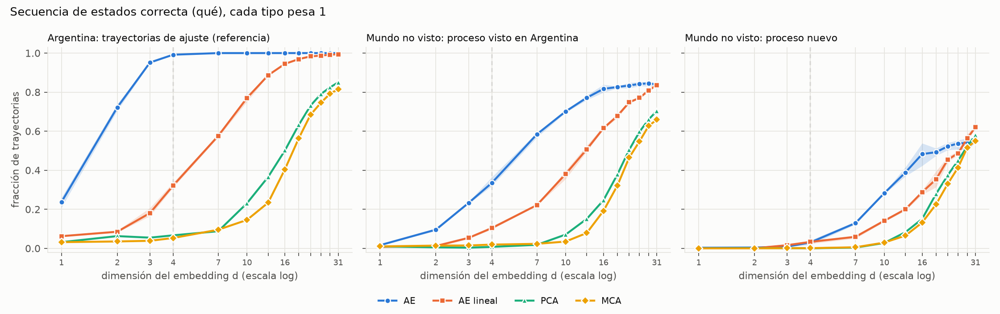
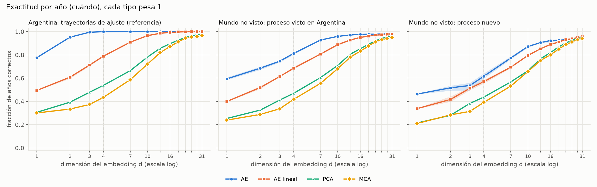
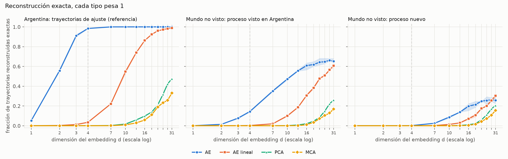
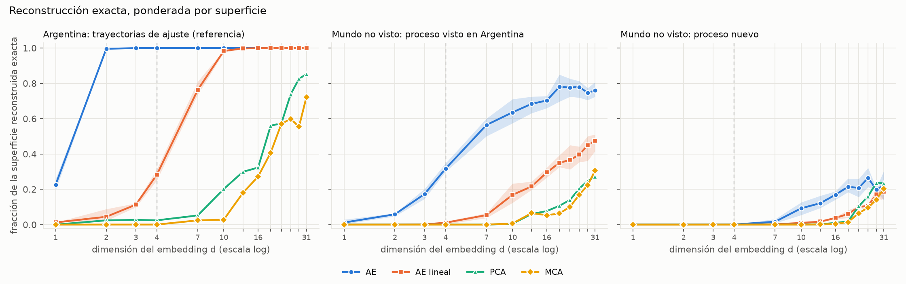
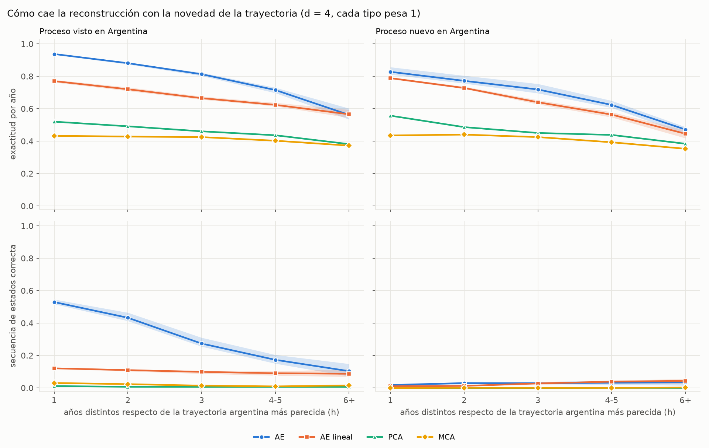
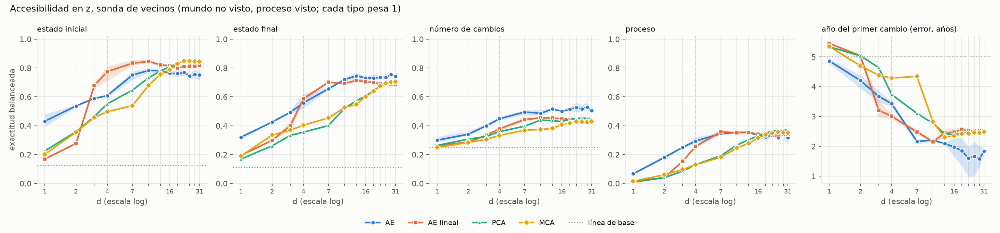
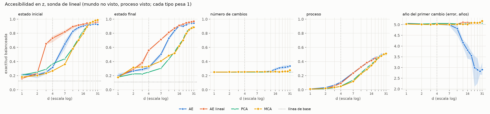
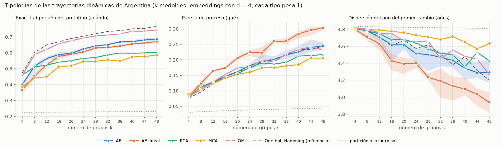
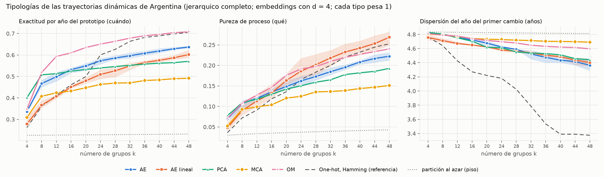
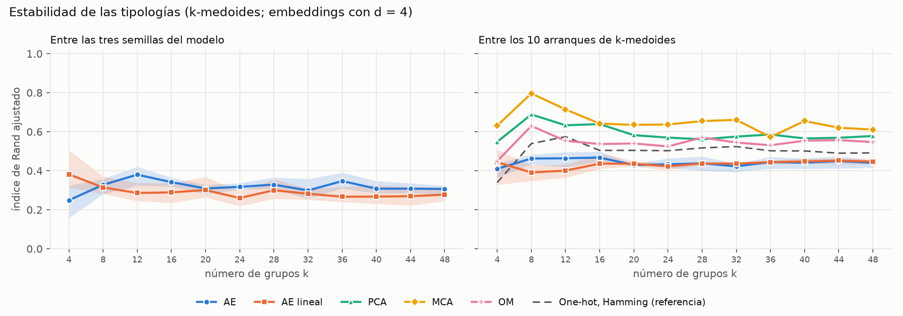

# Pregunta 1: capacidad de compresión de los métodos (resultados)

**Fecha:** 2026-10-08. Ejecuta el [protocolo de evaluación](protocolo_evaluacion.md) (Pregunta 1.1, §2–§7; Pregunta 1.2, §9), fijado antes de correr. Reemplaza al informe anterior de P1 (compresión medida sólo dentro de Argentina), que queda en el historial (`5fae580`).

**Código y salidas**
- Modelos: `scripts/modelo/p1_compresion.py` (`train`, `linear`, `linae`; `ae_apply`, `lin_apply`, `pca_apply` y `mca_apply` los aplican a trayectorias nuevas). Lanzador de los autoencoders: `scripts/modelo/p1_correr_ae.py`.
- Evaluación: `scripts/validacion/evaluacion_pregunta1.py` (`no_vistos`, `codificar`, `reconstruccion`, `accesibilidad`, `tipologias`).
- Resultados: `data/autoencoder_v3/pregunta1/` (`p11_reconstruccion.csv`, `p11_accesibilidad.csv`, `p11_parametros.csv`, `p12_tipologias.csv`, `p12_semillas.csv`, `no_vistos.npz`; los códigos por modelo en `codigos/`, no versionados).
- Figuras: `scripts/viz/pregunta1_figuras.py` → `docs/autoencoder_v3/figuras/p1/`.

**Cómo leer las cifras.** Salvo indicación, cada trayectoria distinta (*tipo*) pesa 1. Para el autoencoder (AE) y el AE lineal se da la media de las tres semillas y, entre paréntesis, el rango mínimo–máximo; **una diferencia menor que ese rango no se interpreta** (protocolo §6).

---

## 1. Resumen

1. **En las trayectorias de ajuste (Argentina) el autoencoder reconstruye todo con d ≥ 3**, como ya se sabía. Pero **esa fidelidad no se traslada a trayectorias que no vio**: con d = 4, la secuencia de estados se reconstruye bien en el 99 % de las trayectorias de Argentina y sólo en el 34 % de las trayectorias del mundo cuyo proceso sí existe en Argentina.
2. **Según la regla fijada en el protocolo (§7), con d = 4 el autoencoder reproduce lo que vio más que una regla general**: ya en las trayectorias que difieren de una argentina en un solo año (h = 1), la secuencia de estados cae de 0,99 a 0,53. Parte de esa caída se debe a que esas trayectorias suelen tener un estado de un solo año (análisis exploratorio, §3.4), pero aun sin ellas la fidelidad cae de 0,84 (h = 1) a 0,15 (h ≥ 4).
3. **La generalización mejora con d.** Con d = 16 a 31 el autoencoder reconstruye la secuencia de estados del 82–84 % de las trayectorias no vistas de proceso conocido, y casi no depende de la distancia a lo visto (sin tramos de un año: 0,99 con h = 1 y 0,84–0,88 con h ≥ 2).
4. **El autoencoder es el que más reconstruye con pocas dimensiones** en las trayectorias no vistas (por ejemplo, con d = 7: secuencia de estados 0,58 frente a 0,22 del AE lineal y ~0,02 de PCA y MCA). **Con d grande el AE lineal lo alcanza** (d = 31: 0,84 ambos) y, en los procesos que no existen en Argentina, lo supera (0,62 frente a 0,55).
5. **La información accesible directamente en z es moderada en todos los métodos** y ninguno domina. Con d = 4 y la sonda de vecinos, el AE es mejor en el número de cambios y el AE lineal en el estado inicial y en el año del cambio.
6. **Tipologías (1.2):** en la información alineada en el tiempo (exactitud por año del prototipo) **OM es el mejor espacio en todos los k** (k = 12: 0,62 frente a 0,56 del AE); sólo lo supera la referencia de Hamming, que está alineada con esa métrica por construcción. En la información de proceso (pureza de proceso) **el AE lineal es el mejor desde k = 12**. El AE queda en un lugar intermedio en ambas.
7. **Las tipologías hechas sobre los embeddings aprendidos dependen mucho de la semilla del modelo**: el índice de Rand ajustado entre semillas es de 0,25 a 0,38 para el AE y de 0,26 a 0,38 para el AE lineal.
8. **Consecuencia para la elección de d = 4.** d = 4 alcanza para reproducir Argentina, pero no para generalizar. Si la representación tiene que valer más allá de las trayectorias de ajuste, los resultados apuntan a d entre 16 y 31. Es una decisión abierta (§7).



---

## 2. Qué se midió

Síntesis del protocolo; el detalle está en [`protocolo_evaluacion.md`](protocolo_evaluacion.md).

- **Métodos:** autoencoder (transformer, ~800.000 parámetros), AE lineal (misma pérdida), PCA y MCA del one-hot. Todos ajustados **sólo con las 7.827 trayectorias de Argentina**, con d ∈ {1, 2, 3, 4, 7, 10, …, 31}.
- **Evaluación:** las **62.121 trayectorias dinámicas del mundo que no existen en Argentina**, que ningún método vio. Se separan por:
  - **A:** si su *proceso* (la secuencia de estados sin fechas) existe en Argentina (43.086, "proceso visto") o no (19.035, "proceso nuevo");
  - **B:** **h**, cuántos de los 31 años difieren de la trayectoria argentina más parecida.
- **1.1 Reconstrucción.** Principales: **exactitud por año** (*cuándo*) y **secuencia de estados correcta** (*qué*). Secundarias: reconstrucción exacta, número de cambios, error de fechado y F1 macro por clase.
- **1.1 Accesibilidad.** Cinco tareas (estado inicial, estado final, número de cambios, proceso, año del primer cambio) predichas desde z con una sonda de 5 vecinos (principal) y una lineal (secundaria), ajustadas con Argentina.
- **1.2 Tipologías.** k-medoides (10 arranques) y jerárquico de enlace completo sobre las 7.818 trayectorias dinámicas de Argentina, sin ponderar, con k de 4 a 48. Espacios: los cuatro métodos con d = 4 (2 y 7 de sensibilidad), OM y el one-hot con distancia de Hamming como referencia.

Tamaño de los modelos (número de parámetros):

| método | d = 1 | d = 4 | d = 31 |
|---|--:|--:|--:|
| AE | 797.441 | 798.212 | 805.151 |
| AE lineal | 1.024 | 3.073 | 21.514 |
| PCA | 682 | 1.705 | 10.912 |
| MCA | 558 | 1.395 | 8.928 |

---

## 3. Pregunta 1.1: reconstrucción

### 3.1 Métricas principales

**Exactitud por año (*cuándo*)**



Argentina (trayectorias de ajuste; referencia):

| d | AE | AE lineal | PCA | MCA |
|---|--:|--:|--:|--:|
| 1 | 0,775 (0,770–0,783) | 0,494 (0,491–0,497) | 0,306 | 0,300 |
| 2 | 0,952 (0,950–0,956) | 0,608 (0,596–0,617) | 0,393 | 0,334 |
| 3 | 0,995 (0,993–0,996) | 0,712 (0,704–0,721) | 0,478 | 0,373 |
| 4 | 0,999 (0,999–1,000) | 0,789 (0,783–0,794) | 0,538 | 0,434 |
| 7 | 1,000 (1,000–1,000) | 0,909 (0,906–0,913) | 0,665 | 0,587 |
| 10 | 1,000 (1,000–1,000) | 0,965 (0,962–0,967) | 0,781 | 0,720 |
| 16 | 1,000 (1,000–1,000) | 0,993 (0,993–0,994) | 0,896 | 0,873 |
| 31 | 1,000 (1,000–1,000) | 1,000 (1,000–1,000) | 0,976 | 0,966 |

Mundo no visto, proceso visto:

| d | AE | AE lineal | PCA | MCA |
|---|--:|--:|--:|--:|
| 1 | 0,594 (0,584–0,607) | 0,400 (0,396–0,405) | 0,253 | 0,239 |
| 2 | 0,685 (0,671–0,698) | 0,519 (0,507–0,531) | 0,325 | 0,288 |
| 3 | 0,746 (0,736–0,753) | 0,614 (0,613–0,616) | 0,412 | 0,336 |
| 4 | 0,812 (0,802–0,821) | 0,685 (0,677–0,698) | 0,469 | 0,417 |
| 7 | 0,928 (0,926–0,930) | 0,807 (0,804–0,812) | 0,605 | 0,555 |
| 10 | 0,959 (0,957–0,961) | 0,888 (0,878–0,895) | 0,709 | 0,681 |
| 16 | 0,977 (0,973–0,979) | 0,950 (0,949–0,952) | 0,853 | 0,832 |
| 31 | 0,980 (0,979–0,980) | 0,981 (0,980–0,981) | 0,960 | 0,949 |

Mundo no visto, proceso nuevo:

| d | AE | AE lineal | PCA | MCA |
|---|--:|--:|--:|--:|
| 1 | 0,463 (0,461–0,465) | 0,338 (0,335–0,341) | 0,214 | 0,210 |
| 2 | 0,517 (0,492–0,535) | 0,417 (0,397–0,443) | 0,280 | 0,284 |
| 3 | 0,537 (0,494–0,560) | 0,513 (0,497–0,521) | 0,383 | 0,314 |
| 4 | 0,616 (0,596–0,640) | 0,570 (0,553–0,586) | 0,437 | 0,391 |
| 7 | 0,773 (0,761–0,787) | 0,694 (0,686–0,700) | 0,567 | 0,531 |
| 10 | 0,872 (0,863–0,879) | 0,795 (0,791–0,799) | 0,663 | 0,656 |
| 16 | 0,923 (0,909–0,933) | 0,890 (0,888–0,892) | 0,820 | 0,802 |
| 31 | 0,939 (0,935–0,943) | 0,956 (0,955–0,957) | 0,950 | 0,942 |

**Secuencia de estados correcta (*qué*)**

Argentina (referencia):

| d | AE | AE lineal | PCA | MCA |
|---|--:|--:|--:|--:|
| 1 | 0,237 (0,208–0,259) | 0,062 (0,059–0,068) | 0,032 | 0,032 |
| 2 | 0,722 (0,705–0,739) | 0,085 (0,081–0,091) | 0,063 | 0,035 |
| 3 | 0,952 (0,946–0,956) | 0,181 (0,165–0,207) | 0,055 | 0,039 |
| 4 | 0,992 (0,990–0,994) | 0,322 (0,311–0,337) | 0,067 | 0,053 |
| 7 | 1,000 (1,000–1,000) | 0,576 (0,568–0,584) | 0,088 | 0,095 |
| 10 | 1,000 (1,000–1,000) | 0,770 (0,751–0,783) | 0,231 | 0,146 |
| 16 | 1,000 (1,000–1,000) | 0,945 (0,944–0,946) | 0,501 | 0,404 |
| 31 | 1,000 (1,000–1,000) | 0,994 (0,993–0,995) | 0,850 | 0,816 |

Mundo no visto, proceso visto:

| d | AE | AE lineal | PCA | MCA |
|---|--:|--:|--:|--:|
| 1 | 0,016 (0,015–0,018) | 0,007 (0,006–0,010) | 0,010 | 0,010 |
| 2 | 0,096 (0,090–0,100) | 0,012 (0,007–0,017) | 0,005 | 0,014 |
| 3 | 0,233 (0,228–0,238) | 0,054 (0,048–0,057) | 0,003 | 0,015 |
| 4 | 0,335 (0,319–0,365) | 0,104 (0,097–0,113) | 0,008 | 0,019 |
| 7 | 0,584 (0,568–0,593) | 0,221 (0,219–0,224) | 0,018 | 0,023 |
| 10 | 0,701 (0,695–0,705) | 0,381 (0,355–0,397) | 0,071 | 0,035 |
| 16 | 0,817 (0,799–0,839) | 0,615 (0,609–0,625) | 0,247 | 0,192 |
| 31 | 0,840 (0,834–0,846) | 0,837 (0,834–0,839) | 0,704 | 0,659 |

Mundo no visto, proceso nuevo:

| d | AE | AE lineal | PCA | MCA |
|---|--:|--:|--:|--:|
| 1 | 0,003 (0,002–0,006) | 0,000 (0,000–0,000) | 0,000 | 0,000 |
| 2 | 0,004 (0,003–0,007) | 0,001 (0,000–0,001) | 0,001 | 0,000 |
| 3 | 0,009 (0,007–0,012) | 0,016 (0,011–0,024) | 0,001 | 0,001 |
| 4 | 0,030 (0,018–0,041) | 0,033 (0,024–0,038) | 0,000 | 0,001 |
| 7 | 0,129 (0,122–0,137) | 0,059 (0,050–0,067) | 0,004 | 0,006 |
| 10 | 0,283 (0,277–0,287) | 0,141 (0,136–0,150) | 0,028 | 0,029 |
| 16 | 0,483 (0,423–0,538) | 0,288 (0,275–0,297) | 0,151 | 0,132 |
| 31 | 0,554 (0,542–0,566) | 0,621 (0,616–0,623) | 0,580 | 0,550 |

Lectura:
- **La distancia entre Argentina y el mundo no visto es la medida de cuánto de la "compresión" era memoria.** Con d = 4, el AE pasa de 0,999 a 0,812 en exactitud por año y de 0,992 a 0,335 en secuencia de estados. Con d = 31, de 1,000 a 0,980 y de 1,000 a 0,840.
- **Con d bajo, el autoencoder es el método que más reconstruye en las trayectorias no vistas**, por márgenes muy superiores al rango entre semillas. Por ejemplo, en proceso visto con d = 7: exactitud por año 0,928 frente a 0,807 (AE lineal), 0,605 (PCA) y 0,555 (MCA); secuencia de estados 0,584 frente a 0,221, 0,018 y 0,023.
- **Con d alto la ventaja desaparece.** En proceso visto con d = 31, el AE y el AE lineal quedan iguales en las dos métricas. En proceso nuevo con d = 31, el AE lineal supera al AE en secuencia de estados (0,621 frente a 0,554) y PCA lo iguala.
- **El autoencoder se satura:** en proceso visto, la secuencia de estados deja de crecer a partir de d ≈ 16 (0,82–0,84), lejos del 1,00 de Argentina.

### 3.2 Reconstrucción exacta por dimensión

**Cada tipo pesa 1**



Argentina (referencia):

| d | AE | AE lineal | PCA | MCA |
|---|--:|--:|--:|--:|
| 1 | 0,052 (0,047–0,054) | 0,000 (0,000–0,001) | 0,000 | 0,000 |
| 2 | 0,558 (0,546–0,576) | 0,003 (0,002–0,004) | 0,000 | 0,000 |
| 3 | 0,911 (0,894–0,924) | 0,012 (0,011–0,015) | 0,001 | 0,000 |
| 4 | 0,984 (0,980–0,990) | 0,035 (0,031–0,039) | 0,001 | 0,001 |
| 7 | 1,000 (1,000–1,000) | 0,222 (0,217–0,228) | 0,002 | 0,001 |
| 10 | 1,000 (1,000–1,000) | 0,547 (0,522–0,562) | 0,017 | 0,009 |
| 16 | 1,000 (1,000–1,000) | 0,863 (0,857–0,870) | 0,098 | 0,058 |
| 31 | 1,000 (1,000–1,000) | 0,988 (0,986–0,989) | 0,476 | 0,330 |

Mundo no visto, proceso visto:

| d | AE | AE lineal | PCA | MCA |
|---|--:|--:|--:|--:|
| 1 | 0,000 (0,000–0,000) | 0,000 (0,000–0,000) | 0,000 | 0,000 |
| 2 | 0,014 (0,013–0,016) | 0,000 (0,000–0,000) | 0,000 | 0,000 |
| 3 | 0,077 (0,068–0,086) | 0,001 (0,001–0,001) | 0,000 | 0,000 |
| 4 | 0,144 (0,136–0,154) | 0,002 (0,002–0,003) | 0,000 | 0,000 |
| 7 | 0,351 (0,342–0,364) | 0,020 (0,018–0,021) | 0,000 | 0,000 |
| 10 | 0,473 (0,459–0,483) | 0,100 (0,089–0,108) | 0,001 | 0,001 |
| 16 | 0,608 (0,562–0,637) | 0,307 (0,298–0,323) | 0,021 | 0,011 |
| 31 | 0,653 (0,635–0,682) | 0,607 (0,591–0,618) | 0,260 | 0,170 |

Mundo no visto, proceso nuevo:

| d | AE | AE lineal | PCA | MCA |
|---|--:|--:|--:|--:|
| 1 | 0,000 (0,000–0,000) | 0,000 (0,000–0,000) | 0,000 | 0,000 |
| 2 | 0,000 (0,000–0,000) | 0,000 (0,000–0,000) | 0,000 | 0,000 |
| 3 | 0,000 (0,000–0,001) | 0,000 (0,000–0,000) | 0,000 | 0,000 |
| 4 | 0,002 (0,002–0,002) | 0,000 (0,000–0,001) | 0,000 | 0,000 |
| 7 | 0,025 (0,022–0,031) | 0,002 (0,002–0,003) | 0,000 | 0,000 |
| 10 | 0,087 (0,073–0,098) | 0,014 (0,012–0,015) | 0,000 | 0,000 |
| 16 | 0,197 (0,150–0,226) | 0,071 (0,056–0,082) | 0,010 | 0,003 |
| 31 | 0,258 (0,221–0,292) | 0,304 (0,284–0,318) | 0,206 | 0,155 |

**Ponderada por superficie** (área en km² en el mundo; píxeles en Argentina)



Argentina (referencia):

| d | AE | AE lineal | PCA | MCA |
|---|--:|--:|--:|--:|
| 1 | 0,226 (0,196–0,258) | 0,012 (0,012–0,013) | 0,000 | 0,000 |
| 2 | 0,996 (0,995–0,996) | 0,044 (0,022–0,088) | 0,024 | 0,000 |
| 3 | 1,000 (1,000–1,000) | 0,113 (0,099–0,121) | 0,027 | 0,000 |
| 4 | 1,000 (1,000–1,000) | 0,283 (0,251–0,313) | 0,024 | 0,000 |
| 7 | 1,000 (1,000–1,000) | 0,763 (0,736–0,810) | 0,052 | 0,024 |
| 10 | 1,000 (1,000–1,000) | 0,983 (0,974–0,989) | 0,202 | 0,028 |
| 16 | 1,000 (1,000–1,000) | 0,999 (0,999–0,999) | 0,323 | 0,272 |
| 31 | 1,000 (1,000–1,000) | 1,000 (1,000–1,000) | 0,852 | 0,722 |

Mundo no visto, proceso visto:

| d | AE | AE lineal | PCA | MCA |
|---|--:|--:|--:|--:|
| 1 | 0,012 (0,003–0,029) | 0,000 (0,000–0,000) | 0,000 | 0,000 |
| 2 | 0,059 (0,047–0,064) | 0,000 (0,000–0,000) | 0,000 | 0,000 |
| 3 | 0,173 (0,146–0,202) | 0,001 (0,000–0,003) | 0,000 | 0,000 |
| 4 | 0,317 (0,300–0,347) | 0,011 (0,002–0,018) | 0,000 | 0,000 |
| 7 | 0,564 (0,501–0,601) | 0,054 (0,038–0,065) | 0,000 | 0,000 |
| 10 | 0,636 (0,574–0,710) | 0,169 (0,124–0,233) | 0,005 | 0,006 |
| 16 | 0,703 (0,660–0,727) | 0,296 (0,267–0,323) | 0,077 | 0,053 |
| 31 | 0,760 (0,724–0,807) | 0,476 (0,417–0,511) | 0,272 | 0,306 |

Mundo no visto, proceso nuevo:

| d | AE | AE lineal | PCA | MCA |
|---|--:|--:|--:|--:|
| 1 | 0,000 (0,000–0,000) | 0,000 (0,000–0,000) | 0,000 | 0,000 |
| 2 | 0,000 (0,000–0,000) | 0,000 (0,000–0,000) | 0,000 | 0,000 |
| 3 | 0,000 (0,000–0,000) | 0,000 (0,000–0,000) | 0,000 | 0,000 |
| 4 | 0,001 (0,000–0,002) | 0,000 (0,000–0,001) | 0,000 | 0,000 |
| 7 | 0,016 (0,008–0,031) | 0,002 (0,001–0,003) | 0,000 | 0,000 |
| 10 | 0,092 (0,054–0,126) | 0,010 (0,005–0,013) | 0,000 | 0,000 |
| 16 | 0,169 (0,142–0,189) | 0,038 (0,031–0,044) | 0,010 | 0,004 |
| 31 | 0,222 (0,139–0,303) | 0,187 (0,146–0,243) | 0,234 | 0,202 |

Lectura:
- **Por tipo**, la reconstrucción exacta de lo no visto es baja para todos: con d = 4 el AE reconstruye exactas el 14 % de las trayectorias de proceso visto, y con d = 31 el 65 %.
- **Por superficie, el autoencoder se separa mucho más de los métodos lineales**: en proceso visto con d = 31 reconstruye exacta el 76 % de la superficie, frente al 48 % del AE lineal y el 27–31 % de PCA y MCA. Las trayectorias no vistas que más superficie ocupan son las que el AE reconstruye mejor.
- En Argentina, por superficie, el AE ya es exacto con d = 2 (0,996); el AE lineal llega a 0,98 con d = 10.

### 3.3 Cómo cae la reconstrucción con la novedad



Secuencia de estados correcta, d = 4, por estrato:

| estrato | tipos | AE | AE lineal | PCA | MCA |
|---|--:|--:|--:|--:|--:|
| visto, h = 1 | 11.617 | 0,529 (0,517–0,546) | 0,121 (0,117–0,126) | 0,011 | 0,030 |
| visto, h = 2 | 8.927 | 0,433 (0,413–0,464) | 0,110 (0,103–0,115) | 0,007 | 0,023 |
| visto, h = 3 | 8.267 | 0,273 (0,255–0,310) | 0,099 (0,087–0,106) | 0,006 | 0,014 |
| visto, h = 4-5 | 9.786 | 0,173 (0,150–0,204) | 0,090 (0,076–0,103) | 0,006 | 0,009 |
| visto, h = 6+ | 4.489 | 0,103 (0,072–0,148) | 0,087 (0,068–0,115) | 0,006 | 0,015 |
| nuevo, h = 1 | 2.031 | 0,018 (0,010–0,022) | 0,010 (0,008–0,012) | 0,000 | 0,000 |
| nuevo, h = 2 | 1.841 | 0,030 (0,023–0,034) | 0,012 (0,010–0,014) | 0,000 | 0,001 |
| nuevo, h = 3 | 2.583 | 0,029 (0,023–0,038) | 0,027 (0,021–0,033) | 0,000 | 0,000 |
| nuevo, h = 4-5 | 5.487 | 0,032 (0,020–0,046) | 0,038 (0,030–0,046) | 0,001 | 0,000 |
| nuevo, h = 6+ | 7.093 | 0,034 (0,015–0,048) | 0,043 (0,026–0,055) | 0,000 | 0,002 |

Exactitud por año, d = 4:

| estrato | tipos | AE | AE lineal | PCA | MCA |
|---|--:|--:|--:|--:|--:|
| visto, h = 1 | 11.617 | 0,937 (0,933–0,942) | 0,770 (0,762–0,778) | 0,520 | 0,433 |
| visto, h = 2 | 8.927 | 0,881 (0,874–0,886) | 0,720 (0,710–0,732) | 0,491 | 0,428 |
| visto, h = 3 | 8.267 | 0,813 (0,802–0,822) | 0,665 (0,656–0,676) | 0,460 | 0,425 |
| visto, h = 4-5 | 9.786 | 0,715 (0,697–0,730) | 0,624 (0,615–0,637) | 0,436 | 0,403 |
| visto, h = 6+ | 4.489 | 0,562 (0,534–0,602) | 0,566 (0,544–0,594) | 0,381 | 0,372 |
| nuevo, h = 1 | 2.031 | 0,828 (0,811–0,857) | 0,789 (0,782–0,795) | 0,557 | 0,435 |
| nuevo, h = 2 | 1.841 | 0,772 (0,756–0,804) | 0,728 (0,723–0,737) | 0,486 | 0,440 |
| nuevo, h = 3 | 2.583 | 0,719 (0,696–0,753) | 0,640 (0,627–0,654) | 0,450 | 0,425 |
| nuevo, h = 4-5 | 5.487 | 0,624 (0,606–0,649) | 0,564 (0,547–0,579) | 0,438 | 0,393 |
| nuevo, h = 6+ | 7.093 | 0,472 (0,444–0,488) | 0,445 (0,418–0,467) | 0,384 | 0,353 |

Secuencia de estados correcta, d = 31:

| estrato | tipos | AE | AE lineal | PCA | MCA |
|---|--:|--:|--:|--:|--:|
| visto, h = 1 | 11.617 | 0,780 (0,776–0,783) | 0,778 (0,776–0,778) | 0,468 | 0,445 |
| visto, h = 2 | 8.927 | 0,869 (0,860–0,874) | 0,865 (0,865–0,867) | 0,585 | 0,515 |
| visto, h = 3 | 8.267 | 0,834 (0,827–0,846) | 0,835 (0,834–0,837) | 0,739 | 0,640 |
| visto, h = 4-5 | 9.786 | 0,872 (0,865–0,884) | 0,871 (0,867–0,874) | 0,933 | 0,915 |
| visto, h = 6+ | 4.489 | 0,877 (0,857–0,896) | 0,859 (0,844–0,882) | 0,986 | 0,980 |
| nuevo, h = 1 | 2.031 | 0,237 (0,210–0,271) | 0,314 (0,299–0,322) | 0,000 | 0,000 |
| nuevo, h = 2 | 1.841 | 0,416 (0,397–0,439) | 0,482 (0,479–0,485) | 0,052 | 0,016 |
| nuevo, h = 3 | 2.583 | 0,490 (0,483–0,494) | 0,551 (0,531–0,562) | 0,355 | 0,237 |
| nuevo, h = 4-5 | 5.487 | 0,610 (0,596–0,627) | 0,683 (0,678–0,691) | 0,718 | 0,691 |
| nuevo, h = 6+ | 7.093 | 0,659 (0,623–0,685) | 0,722 (0,718–0,725) | 0,859 | 0,852 |

Lectura según la regla del protocolo (§7):
- **Con d = 4, el AE cae fuerte ya en h = 1** (secuencia de estados 0,529, frente a 0,992 en Argentina) y sigue cayendo con h (0,103 con h ≥ 6). Es el patrón que el protocolo identifica con reproducir lo visto más que una regla general.
- **Con d = 31, la caída en h = 1 es menor** (0,780) y la fidelidad no empeora al alejarse.
- **PCA y MCA con d = 31 mejoran con h**, lo que no es esperable si h midiera sólo novedad. El §3.4 lo explica.
- En proceso nuevo, con d = 4, ningún método reconstruye la secuencia de estados (≤ 0,05).

### 3.4 Análisis exploratorio: estados de un año *(no previsto en el protocolo)*

**Por qué.** El patrón de PCA y MCA del §3.3 sugirió que los estratos de h difieren en el tipo de trayectoria. Una trayectoria que difiere en un solo año de una argentina suele ser una argentina con un estado de **un solo año** intercalado (por ejemplo, bosque → rala un año → bosque). Esos tramos son difíciles de reconstruir para cualquier método y a menudo son ruido del producto.

Trayectorias con algún tramo de un año, por estrato:

| estrato | trayectorias con algún tramo de 1 año |
|---|--:|
| Argentina (ajuste) | 8 % |
| visto, h = 1 | 47 % |
| visto, h = 2 | 6 % |
| visto, h = 3 | 3 % |
| visto, h = 4-5 | 2 % |
| visto, h = 6+ | 0 % |
| nuevo, h = 1 | 100 % |
| nuevo, h = 2 | 36 % |
| nuevo, h = 3 | 21 % |
| nuevo, h = 4-5 | 14 % |
| nuevo, h = 6+ | 6 % |

Secuencia de estados correcta, separando las trayectorias con tramos de un año:

| método | Argentina, sin tramo de 1 año (7.156) | visto, h = 1, sin tramo de 1 año (6.137) | visto, h = 1, con tramo de 1 año (5.480) | visto, h = 2–3, sin tramo de 1 año (16.439) | visto, h ≥ 4, sin tramo de 1 año (14.104) |
|---|--:|--:|--:|--:|--:|
| AE, d = 4 | 0,996 (0,994–0,998) | 0,843 (0,831–0,863) | 0,178 (0,160–0,191) | 0,367 (0,348–0,403) | 0,152 (0,126–0,188) |
| AE, d = 7 | 1,000 (1,000–1,000) | 0,964 (0,961–0,966) | 0,306 (0,289–0,319) | 0,638 (0,626–0,645) | 0,489 (0,462–0,508) |
| AE, d = 16 | 1,000 (1,000–1,000) | 0,995 (0,994–0,995) | 0,524 (0,511–0,547) | 0,852 (0,836–0,866) | 0,835 (0,800–0,872) |
| AE, d = 31 | 1,000 (1,000–1,000) | 0,995 (0,994–0,996) | 0,539 (0,530–0,545) | 0,870 (0,865–0,875) | 0,879 (0,868–0,887) |
| AE lineal, d = 4 | 0,347 (0,335–0,365) | 0,208 (0,197–0,218) | 0,023 (0,022–0,026) | 0,108 (0,103–0,115) | 0,090 (0,077–0,108) |
| AE lineal, d = 31 | 0,999 (0,998–0,999) | 0,983 (0,982–0,985) | 0,548 (0,545–0,551) | 0,861 (0,859–0,862) | 0,871 (0,865–0,879) |
| PCA, d = 31 | 0,928 | 0,886 | 0,000 | 0,689 | 0,961 |
| MCA, d = 31 | 0,890 | 0,843 | 0,000 | 0,601 | 0,947 |

Lectura:
- **h está mezclado con la presencia de tramos de un año** (47 % en proceso visto con h = 1; 0–6 % con h ≥ 2). Parte de la caída del AE en h = 1 se debe a eso: **las trayectorias con un tramo de un año casi no se reconstruyen con ningún método ni d** (AE con d = 31: 0,54; PCA y MCA: 0).
- **Aun sin esos tramos, el AE con d = 4 se degrada con la distancia**: 0,996 en Argentina, 0,843 con h = 1, 0,367 con h = 2–3 y 0,152 con h ≥ 4. La conclusión del §3.3 se mantiene.
- **Con d ≥ 16, el AE generaliza a trayectorias sin tramos de un año** (0,99 con h = 1; 0,84–0,88 con h ≥ 2). El AE lineal con d = 31 da lo mismo.
- PCA y MCA con d = 31 reconstruyen mejor que el AE las trayectorias alejadas sin tramos de un año (0,96 y 0,95 con h ≥ 4, frente a 0,88), y fallan por completo cuando hay un tramo de un año.
- Este análisis es **exploratorio**: se definió después de ver los resultados. Sugiere tratar los tramos de un año como un factor propio en lo que sigue (por ejemplo, con medidas como la turbulencia).

### 3.5 Métricas secundarias

d = 4:

| métrica | conjunto | AE | AE lineal | PCA | MCA |
|---|--:|--:|--:|--:|--:|
| número de cambios correcto | Argentina | 0,993 (0,992–0,995) | 0,445 (0,429–0,457) | 0,287 | 0,250 |
| número de cambios correcto | visto | 0,471 (0,460–0,485) | 0,296 (0,284–0,315) | 0,253 | 0,364 |
| número de cambios correcto | nuevo | 0,223 (0,218–0,229) | 0,250 (0,241–0,259) | 0,183 | 0,350 |
| error de fechado (años) | Argentina | 0,004 (0,002–0,005) | 1,682 (1,602–1,760) | 4,034 | 4,907 |
| error de fechado (años) | visto | 0,500 (0,485–0,527) | 2,348 (2,248–2,401) | 5,485 | 4,779 |
| error de fechado (años) | nuevo | 1,584 (1,151–1,871) | 3,046 (2,663–3,450) | 6,905 | 5,694 |
| F1 macro por clase | Argentina | 0,999 (0,999–1,000) | 0,792 (0,786–0,800) | 0,397 | 0,452 |
| F1 macro por clase | visto | 0,809 (0,787–0,825) | 0,696 (0,683–0,713) | 0,356 | 0,395 |
| F1 macro por clase | nuevo | 0,599 (0,570–0,627) | 0,573 (0,558–0,593) | 0,327 | 0,351 |

d = 31:

| métrica | conjunto | AE | AE lineal | PCA | MCA |
|---|--:|--:|--:|--:|--:|
| número de cambios correcto | Argentina | 1,000 (1,000–1,000) | 0,994 (0,994–0,995) | 0,850 | 0,816 |
| número de cambios correcto | visto | 0,855 (0,850–0,859) | 0,847 (0,844–0,850) | 0,705 | 0,660 |
| número de cambios correcto | nuevo | 0,600 (0,595–0,603) | 0,655 (0,652–0,659) | 0,581 | 0,551 |
| error de fechado (años) | Argentina | 0,000 (0,000–0,000) | 0,003 (0,003–0,004) | 0,290 | 0,418 |
| error de fechado (años) | visto | 0,133 (0,111–0,148) | 0,168 (0,159–0,181) | 0,403 | 0,531 |
| error de fechado (años) | nuevo | 0,385 (0,349–0,456) | 0,320 (0,310–0,337) | 0,397 | 0,477 |
| F1 macro por clase | Argentina | 1,000 (1,000–1,000) | 1,000 (1,000–1,000) | 0,974 | 0,967 |
| F1 macro por clase | visto | 0,980 (0,980–0,981) | 0,979 (0,978–0,979) | 0,959 | 0,950 |
| F1 macro por clase | nuevo | 0,937 (0,934–0,942) | 0,953 (0,952–0,955) | 0,948 | 0,941 |

- Con d = 4 el AE acierta el número de cambios en el 47 % de las trayectorias de proceso visto (AE lineal: 30 %) y, cuando acierta la secuencia de estados, fecha los cambios con un error medio de 0,5 años (AE lineal: 2,3). El error de fechado se calcula sólo donde la secuencia de estados es correcta, así que en cada método se promedia sobre un subconjunto distinto (protocolo §4.2).
- El F1 macro por clase muestra que las clases raras se conservan bastante mejor que las trayectorias completas: con d = 31 está entre 0,94 y 0,98 para todos los métodos en lo no visto.

---

## 4. Pregunta 1.1: accesibilidad en z



**Sonda de vecinos (principal), proceso visto.** Exactitud balanceada (promedio de aciertos por clase) o error medio en años:

| tarea | d | AE | AE lineal | PCA | MCA | línea de base |
|---|--:|--:|--:|--:|--:|--:|
| estado inicial | 2 | 0,537 (0,528–0,544) | 0,276 (0,269–0,288) | 0,358 | 0,355 | 0,125 |
| estado inicial | 4 | 0,608 (0,595–0,619) | 0,775 (0,711–0,813) | 0,551 | 0,497 |  |
| estado inicial | 7 | 0,751 (0,718–0,775) | 0,833 (0,820–0,855) | 0,646 | 0,539 |  |
| estado inicial | 31 | 0,751 (0,717–0,777) | 0,818 (0,816–0,820) | 0,850 | 0,843 |  |
| estado final | 2 | 0,425 (0,423–0,427) | 0,298 (0,295–0,301) | 0,261 | 0,335 | 0,111 |
| estado final | 4 | 0,558 (0,519–0,618) | 0,587 (0,570–0,602) | 0,355 | 0,403 |  |
| estado final | 7 | 0,656 (0,651–0,666) | 0,702 (0,694–0,706) | 0,401 | 0,455 |  |
| estado final | 31 | 0,742 (0,739–0,746) | 0,685 (0,680–0,689) | 0,702 | 0,703 |  |
| número de cambios | 2 | 0,341 (0,331–0,361) | 0,287 (0,275–0,295) | 0,307 | 0,284 | 0,250 |
| número de cambios | 4 | 0,448 (0,435–0,459) | 0,378 (0,368–0,385) | 0,359 | 0,333 |  |
| número de cambios | 7 | 0,495 (0,477–0,509) | 0,443 (0,428–0,465) | 0,397 | 0,369 |  |
| número de cambios | 31 | 0,504 (0,498–0,514) | 0,437 (0,431–0,440) | 0,448 | 0,429 |  |
| proceso | 2 | 0,180 (0,173–0,192) | 0,040 (0,037–0,045) | 0,041 | 0,061 | 0,002 |
| proceso | 4 | 0,294 (0,276–0,320) | 0,257 (0,246–0,267) | 0,130 | 0,130 |  |
| proceso | 7 | 0,345 (0,337–0,353) | 0,358 (0,335–0,377) | 0,192 | 0,182 |  |
| proceso | 31 | 0,316 (0,273–0,348) | 0,338 (0,335–0,341) | 0,370 | 0,352 |  |
| año del primer cambio (error, años) | 2 | 4,20 (3,94–4,37) | 5,03 (4,90–5,12) | 5,03 | 4,70 | 5,02 |
| año del primer cambio (error, años) | 4 | 3,43 (3,34–3,50) | 3,01 (2,92–3,09) | 3,74 | 4,29 |  |
| año del primer cambio (error, años) | 7 | 2,17 (2,07–2,23) | 2,48 (2,42–2,56) | 3,11 | 4,35 |  |
| año del primer cambio (error, años) | 31 | 1,84 (1,68–1,93) | 2,52 (2,48–2,54) | 2,51 | 2,49 |  |

**Sonda de vecinos, proceso nuevo:**

| tarea | d | AE | AE lineal | PCA | MCA | línea de base |
|---|--:|--:|--:|--:|--:|--:|
| estado inicial | 2 | 0,312 (0,307–0,316) | 0,174 (0,167–0,181) | 0,263 | 0,235 | 0,111 |
| estado inicial | 4 | 0,341 (0,314–0,377) | 0,544 (0,505–0,586) | 0,422 | 0,321 |  |
| estado inicial | 7 | 0,520 (0,480–0,552) | 0,606 (0,578–0,647) | 0,491 | 0,385 |  |
| estado inicial | 31 | 0,533 (0,513–0,554) | 0,649 (0,645–0,657) | 0,681 | 0,672 |  |
| estado final | 2 | 0,270 (0,264–0,274) | 0,219 (0,204–0,231) | 0,214 | 0,252 | 0,111 |
| estado final | 4 | 0,321 (0,293–0,370) | 0,409 (0,395–0,430) | 0,275 | 0,291 |  |
| estado final | 7 | 0,446 (0,438–0,457) | 0,517 (0,509–0,527) | 0,322 | 0,324 |  |
| estado final | 31 | 0,642 (0,630–0,653) | 0,552 (0,549–0,557) | 0,574 | 0,576 |  |
| número de cambios | 2 | 0,146 (0,133–0,160) | 0,173 (0,167–0,180) | 0,168 | 0,114 | 0,143 |
| número de cambios | 4 | 0,149 (0,110–0,168) | 0,120 (0,111–0,133) | 0,126 | 0,141 |  |
| número de cambios | 7 | 0,152 (0,128–0,180) | 0,153 (0,115–0,181) | 0,197 | 0,133 |  |
| número de cambios | 31 | 0,205 (0,188–0,216) | 0,110 (0,101–0,119) | 0,108 | 0,118 |  |
| año del primer cambio (error, años) | 2 | 5,38 (5,35–5,40) | 4,99 (4,92–5,07) | 5,05 | 5,00 | 4,74 |
| año del primer cambio (error, años) | 4 | 4,77 (4,48–5,25) | 4,13 (4,02–4,24) | 4,49 | 4,97 |  |
| año del primer cambio (error, años) | 7 | 3,53 (3,36–3,68) | 3,51 (3,36–3,69) | 3,97 | 4,93 |  |
| año del primer cambio (error, años) | 31 | 3,13 (2,90–3,38) | 3,78 (3,70–3,86) | 3,85 | 3,81 |  |

**Sonda lineal (secundaria), proceso visto:**

| tarea | d | AE | AE lineal | PCA | MCA | línea de base |
|---|--:|--:|--:|--:|--:|--:|
| estado inicial | 2 | 0,210 (0,165–0,233) | 0,234 (0,218–0,246) | 0,251 | 0,201 | 0,125 |
| estado inicial | 4 | 0,318 (0,302–0,334) | 0,731 (0,674–0,763) | 0,368 | 0,267 |  |
| estado inicial | 7 | 0,648 (0,580–0,702) | 0,819 (0,798–0,846) | 0,438 | 0,361 |  |
| estado inicial | 31 | 0,926 (0,924–0,929) | 0,964 (0,963–0,966) | 0,983 | 0,989 |  |
| estado final | 2 | 0,268 (0,259–0,278) | 0,291 (0,287–0,297) | 0,225 | 0,316 | 0,111 |
| estado final | 4 | 0,314 (0,288–0,338) | 0,558 (0,543–0,567) | 0,250 | 0,332 |  |
| estado final | 7 | 0,504 (0,471–0,529) | 0,711 (0,705–0,718) | 0,304 | 0,406 |  |
| estado final | 31 | 0,943 (0,936–0,951) | 0,968 (0,967–0,970) | 0,903 | 0,885 |  |
| número de cambios | 2 | 0,250 (0,250–0,250) | 0,250 (0,249–0,250) | 0,250 | 0,251 | 0,250 |
| número de cambios | 4 | 0,253 (0,250–0,258) | 0,254 (0,252–0,256) | 0,250 | 0,253 |  |
| número de cambios | 7 | 0,252 (0,250–0,254) | 0,253 (0,252–0,254) | 0,250 | 0,255 |  |
| número de cambios | 31 | 0,338 (0,323–0,354) | 0,258 (0,256–0,260) | 0,255 | 0,276 |  |
| proceso | 2 | 0,031 (0,030–0,033) | 0,015 (0,013–0,017) | 0,014 | 0,019 | 0,002 |
| proceso | 4 | 0,108 (0,098–0,119) | 0,093 (0,086–0,096) | 0,051 | 0,047 |  |
| proceso | 7 | 0,240 (0,227–0,249) | 0,236 (0,228–0,248) | 0,137 | 0,117 |  |
| proceso | 31 | 0,500 (0,490–0,517) | 0,502 (0,500–0,505) | 0,500 | 0,512 |  |
| año del primer cambio (error, años) | 2 | 5,03 (5,02–5,05) | 5,01 (5,01–5,02) | 5,03 | 5,01 | 5,02 |
| año del primer cambio (error, años) | 4 | 5,02 (5,00–5,03) | 5,06 (5,02–5,08) | 5,06 | 5,01 |  |
| año del primer cambio (error, años) | 7 | 5,00 (4,95–5,02) | 5,05 (5,02–5,07) | 5,05 | 5,00 |  |
| año del primer cambio (error, años) | 31 | 2,91 (2,66–3,24) | 5,12 (5,10–5,15) | 5,08 | 5,17 |  |



Lectura:
- **La información accesible en z es moderada en todos los métodos.** Con la sonda de vecinos en proceso visto, el mejor espacio alcanza ~0,8 en el estado inicial, ~0,75 en el final, ~0,5 en el número de cambios y ~0,35 en el proceso. Todos superan la línea de base.
- **Con d = 4 ninguno domina:** el AE es mejor en el número de cambios (0,448 frente a 0,378 del AE lineal) y el AE lineal en el estado inicial (0,775 frente a 0,608) y en el año del cambio (3,0 años de error frente a 3,4). En el estado final y en el proceso las diferencias quedan dentro del rango entre semillas.
- **Con d alto el AE es el que mejor ubica el año del cambio** (1,8 años de error con d = 31, frente a ~2,5 de los demás), pero no el estado inicial.
- **La sonda lineal no recupera el número de cambios en ningún espacio** (exactitud balanceada 0,25, igual a la línea de base, salvo el AE con d = 31: 0,34): esa información sólo es accesible localmente.
- Accesibilidad y reconstrucción no coinciden: el AE reconstruye mucho mejor que el AE lineal con d = 4, pero la información no queda más a mano en su z.

---

## 5. Pregunta 1.2: tipologías



### 5.1 k-medoides (principal), embeddings con d = 4

**Exactitud por año del prototipo (*cuándo*)**

| k | AE | AE lineal | PCA | MCA | OM | One-hot, Hamming (ref.) | azar (piso) |
|---|--:|--:|--:|--:|--:|--:|--:|
| 4 | 0,401 (0,379–0,413) | 0,368 (0,342–0,381) | 0,461 | 0,386 | 0,459 | 0,475 | 0,226 |
| 8 | 0,516 (0,487–0,531) | 0,454 (0,432–0,478) | 0,510 | 0,442 | 0,588 | 0,601 | 0,226 |
| 12 | 0,564 (0,554–0,577) | 0,525 (0,509–0,537) | 0,523 | 0,449 | 0,622 | 0,649 | 0,227 |
| 24 | 0,625 (0,616–0,631) | 0,605 (0,596–0,621) | 0,565 | 0,545 | 0,693 | 0,705 | 0,228 |
| 36 | 0,669 (0,663–0,674) | 0,643 (0,628–0,658) | 0,599 | 0,547 | 0,719 | 0,740 | 0,230 |
| 48 | 0,687 (0,679–0,696) | 0,671 (0,662–0,677) | 0,602 | 0,586 | 0,744 | 0,766 | 0,231 |

**Pureza de proceso (*qué*)**

| k | AE | AE lineal | PCA | MCA | OM | One-hot, Hamming (ref.) | azar (piso) |
|---|--:|--:|--:|--:|--:|--:|--:|
| 4 | 0,080 (0,077–0,084) | 0,082 (0,074–0,088) | 0,079 | 0,087 | 0,083 | 0,076 | 0,030 |
| 8 | 0,111 (0,096–0,122) | 0,123 (0,114–0,134) | 0,112 | 0,109 | 0,103 | 0,096 | 0,032 |
| 12 | 0,129 (0,127–0,130) | 0,165 (0,160–0,170) | 0,128 | 0,123 | 0,128 | 0,122 | 0,034 |
| 24 | 0,182 (0,173–0,188) | 0,225 (0,213–0,231) | 0,175 | 0,160 | 0,177 | 0,171 | 0,038 |
| 36 | 0,216 (0,204–0,230) | 0,260 (0,251–0,270) | 0,192 | 0,181 | 0,219 | 0,215 | 0,041 |
| 48 | 0,245 (0,234–0,257) | 0,303 (0,297–0,308) | 0,217 | 0,205 | 0,232 | 0,244 | 0,044 |

**Dispersión del año del primer cambio (años; menor es mejor)**

| k | AE | AE lineal | PCA | MCA | OM | One-hot, Hamming (ref.) | azar (piso) |
|---|--:|--:|--:|--:|--:|--:|--:|
| 4 | 4,81 (4,80–4,82) | 4,80 (4,78–4,81) | 4,82 | 4,81 | 4,82 | 4,82 | 4,83 |
| 8 | 4,78 (4,75–4,81) | 4,71 (4,67–4,75) | 4,78 | 4,79 | 4,80 | 4,80 | 4,83 |
| 12 | 4,71 (4,66–4,78) | 4,63 (4,56–4,69) | 4,75 | 4,79 | 4,76 | 4,71 | 4,83 |
| 24 | 4,52 (4,40–4,58) | 4,40 (4,34–4,43) | 4,64 | 4,73 | 4,66 | 4,58 | 4,82 |
| 36 | 4,43 (4,35–4,52) | 4,13 (3,96–4,24) | 4,50 | 4,71 | 4,56 | 4,38 | 4,82 |
| 48 | 4,29 (4,17–4,45) | 3,94 (3,82–4,06) | 4,43 | 4,63 | 4,27 | 4,20 | 4,81 |

Lectura:
- **Todas las tipologías superan con amplitud a la partición al azar** en las dos métricas principales.
- **Cuándo:** OM es el mejor espacio en todos los k, por encima del AE fuera del rango entre semillas (k = 12: 0,622 frente a 0,564; k = 48: 0,744 frente a 0,687). Sólo lo supera la referencia de Hamming (0,649 y 0,766), que por construcción está alineada con esta métrica. A partir de k = 8 siguen el AE, el AE lineal, PCA y MCA; con k = 4, PCA queda por encima del AE.
- **Qué:** el AE lineal es el mejor desde k = 12 (k = 48: 0,303 frente a 0,245 del AE y 0,232 de OM). Los demás espacios quedan juntos. **La pureza es baja en todos**: con 48 grupos, la mayoría de las trayectorias de un grupo no comparten el proceso más frecuente del grupo.
- **Las tipologías casi no ordenan el momento del cambio**: la dispersión del año baja de 4,8 años (azar) a 3,9–4,6 con k = 48. El AE lineal es el que más la reduce.
- Ningún espacio produce grupos degenerados con k-medoides (salvo MCA, con un grupo de 37 % de las trayectorias con k = 12).

| k | espacio | grupos con menos de 5 trayectorias | fracción en el grupo mayor |
|---|--:|--:|--:|
| 12 | AE | 0,0 | 0,124 |
| 12 | AE lineal | 0,0 | 0,153 |
| 12 | PCA | 0,0 | 0,152 |
| 12 | MCA | 0,0 | 0,366 |
| 12 | OM | 0,0 | 0,148 |
| 12 | One-hot (Hamming) | 0,0 | 0,135 |
| 48 | AE | 0,0 | 0,041 |
| 48 | AE lineal | 0,0 | 0,046 |
| 48 | PCA | 0,0 | 0,058 |
| 48 | MCA | 1,0 | 0,082 |
| 48 | OM | 0,0 | 0,053 |
| 48 | One-hot (Hamming) | 0,0 | 0,055 |

### 5.2 Jerárquico de enlace completo (sensibilidad)



**Exactitud por año del prototipo**

| k | AE | AE lineal | PCA | MCA | OM | One-hot, Hamming (ref.) | azar (piso) |
|---|--:|--:|--:|--:|--:|--:|--:|
| 4 | 0,336 (0,333–0,339) | 0,278 (0,262–0,310) | 0,401 | 0,309 | 0,347 | 0,262 | 0,226 |
| 8 | 0,467 (0,450–0,483) | 0,366 (0,351–0,389) | 0,507 | 0,407 | 0,518 | 0,360 | 0,226 |
| 12 | 0,499 (0,477–0,520) | 0,407 (0,397–0,412) | 0,513 | 0,424 | 0,593 | 0,412 | 0,227 |
| 24 | 0,573 (0,557–0,584) | 0,509 (0,488–0,531) | 0,539 | 0,463 | 0,651 | 0,601 | 0,228 |
| 36 | 0,608 (0,597–0,618) | 0,565 (0,560–0,573) | 0,557 | 0,481 | 0,690 | 0,682 | 0,230 |
| 48 | 0,637 (0,632–0,642) | 0,602 (0,587–0,623) | 0,570 | 0,492 | 0,708 | 0,705 | 0,232 |

**Pureza de proceso**

| k | AE | AE lineal | PCA | MCA | OM | One-hot, Hamming (ref.) | azar (piso) |
|---|--:|--:|--:|--:|--:|--:|--:|
| 4 | 0,070 (0,064–0,074) | 0,048 (0,040–0,061) | 0,078 | 0,052 | 0,071 | 0,036 | 0,030 |
| 8 | 0,107 (0,095–0,115) | 0,090 (0,078–0,107) | 0,109 | 0,093 | 0,108 | 0,072 | 0,032 |
| 12 | 0,120 (0,112–0,124) | 0,113 (0,099–0,130) | 0,118 | 0,099 | 0,128 | 0,091 | 0,033 |
| 24 | 0,162 (0,149–0,174) | 0,186 (0,169–0,218) | 0,150 | 0,125 | 0,191 | 0,165 | 0,037 |
| 36 | 0,195 (0,189–0,202) | 0,233 (0,218–0,252) | 0,178 | 0,139 | 0,220 | 0,220 | 0,040 |
| 48 | 0,222 (0,212–0,232) | 0,269 (0,249–0,282) | 0,193 | 0,151 | 0,240 | 0,253 | 0,043 |

| k | espacio | grupos con menos de 5 trayectorias | fracción en el grupo mayor |
|---|--:|--:|--:|
| 12 | AE | 0,0 | 0,196 |
| 12 | AE lineal | 0,3 | 0,292 |
| 12 | PCA | 0,0 | 0,176 |
| 12 | MCA | 0,0 | 0,461 |
| 12 | OM | 0,0 | 0,151 |
| 12 | One-hot (Hamming) | 0,0 | 0,569 |
| 48 | AE | 0,0 | 0,056 |
| 48 | AE lineal | 0,7 | 0,091 |
| 48 | PCA | 0,0 | 0,122 |
| 48 | MCA | 2,0 | 0,306 |
| 48 | OM | 0,0 | 0,090 |
| 48 | One-hot (Hamming) | 0,0 | 0,050 |

Lectura: **el orden entre espacios se mantiene** (OM primero en la métrica por año salvo con k = 4, donde lo supera PCA; AE lineal y OM arriba en pureza con k alto), con valores algo menores que con k-medoides. El jerárquico produce grupos más desiguales, sobre todo con el one-hot (un grupo con el 57 % de las trayectorias con k = 12) y con MCA, por eso la referencia de Hamming cae en k bajos.

### 5.3 Estabilidad



Índice de Rand ajustado (1 = particiones idénticas; 0 = coincidencia esperable al azar):

| k | arranques: AE | arranques: AE lineal | arranques: PCA | arranques: MCA | arranques: OM | arranques: one-hot | semillas: AE | semillas: AE lineal |
|---|--:|--:|--:|--:|--:|--:|--:|--:|
| 4 | 0,410 (0,365–0,438) | 0,444 (0,329–0,507) | 0,548 | 0,631 | 0,449 | 0,339 | 0,249 (0,159–0,323) | 0,382 (0,315–0,506) |
| 12 | 0,464 (0,418–0,495) | 0,401 (0,364–0,431) | 0,633 | 0,714 | 0,554 | 0,575 | 0,380 (0,324–0,421) | 0,286 (0,245–0,338) |
| 24 | 0,433 (0,416–0,464) | 0,423 (0,403–0,436) | 0,570 | 0,637 | 0,525 | 0,503 | 0,318 (0,304–0,337) | 0,260 (0,219–0,296) |
| 48 | 0,441 (0,416–0,454) | 0,447 (0,435–0,462) | 0,578 | 0,611 | 0,547 | 0,492 | 0,307 (0,278–0,323) | 0,278 (0,244–0,315) |

- **Entre semillas del modelo, las tipologías del AE y del AE lineal coinciden poco** (0,25–0,38). Dos entrenamientos del mismo modelo, con la misma configuración, producen tipologías bastante distintas.
- **Entre arranques de k-medoides**, el AE y el AE lineal son los menos estables (0,39–0,47); PCA, MCA y OM quedan entre 0,45 y 0,80.
- Esto importa para la tipología final: una tipología sobre un embedding aprendido debería reportar su variación entre semillas, o combinarlas.

### 5.4 Sensibilidad a d

Exactitud por año del prototipo, k-medoides:

| k | espacio | d = 2 | d = 4 | d = 7 |
|---|--:|--:|--:|--:|
| 12 | AE | 0,508 (0,492–0,528) | 0,564 (0,554–0,577) | 0,502 (0,466–0,522) |
| 12 | AE lineal | 0,551 (0,548–0,552) | 0,525 (0,509–0,537) | 0,545 (0,522–0,566) |
| 12 | PCA | 0,478 | 0,523 | 0,616 |
| 12 | MCA | 0,459 | 0,449 | 0,579 |
| 48 | AE | 0,675 (0,658–0,683) | 0,687 (0,679–0,696) | 0,682 (0,679–0,687) |
| 48 | AE lineal | 0,619 (0,610–0,624) | 0,671 (0,662–0,677) | 0,702 (0,695–0,706) |
| 48 | PCA | 0,536 | 0,602 | 0,682 |
| 48 | MCA | 0,501 | 0,586 | 0,630 |

Pureza de proceso, k-medoides:

| k | espacio | d = 2 | d = 4 | d = 7 |
|---|--:|--:|--:|--:|
| 12 | AE | 0,170 (0,155–0,180) | 0,129 (0,127–0,130) | 0,120 (0,115–0,125) |
| 12 | AE lineal | 0,129 (0,125–0,134) | 0,165 (0,160–0,170) | 0,130 (0,120–0,141) |
| 12 | PCA | 0,134 | 0,128 | 0,131 |
| 12 | MCA | 0,143 | 0,123 | 0,127 |
| 48 | AE | 0,298 (0,288–0,315) | 0,245 (0,234–0,257) | 0,238 (0,230–0,245) |
| 48 | AE lineal | 0,190 (0,183–0,194) | 0,303 (0,297–0,308) | 0,272 (0,258–0,283) |
| 48 | PCA | 0,206 | 0,217 | 0,216 |
| 48 | MCA | 0,196 | 0,205 | 0,210 |

Los resultados no cambian de forma sistemática entre d = 2, 4 y 7: el orden entre AE y AE lineal se invierte según k y d. La comparación del §5.1 no depende de haber elegido d = 4.

---

## 6. Respuesta a la Pregunta 1

**¿Qué capacidad de compresión tiene cada método?**

- **Reconstrucción.** El autoencoder tiene la mayor capacidad de compresión **con pocas dimensiones** y es el único que reconstruye bien las trayectorias no vistas que más superficie ocupan. Pero su fidelidad con d bajo está atada a las trayectorias de ajuste: **con d = 4 reproduce Argentina, no una regla general**. Con d ≥ 16 generaliza a procesos conocidos, y ahí el AE lineal lo alcanza en las métricas por tipo.
- **Accesibilidad.** Ningún método deja la información claramente más a mano en z. La ventaja de reconstrucción del AE no se traduce en una representación más fácil de leer.
- **Tipologías.** El espacio del AE no es el mejor para agrupar: OM conserva más información alineada en el tiempo y el AE lineal más información de proceso. Las tipologías de los embeddings aprendidos dependen mucho de la semilla.
- **En conjunto**, la dimensión interna no muestra que el autoencoder describa mejor que las alternativas. Muestra que **comprime mejor con pocas dimensiones dentro de lo que vio**, y que esa ventaja no se sostiene como generalización ni como base para tipologías.

---

## 7. Decisiones que quedan abiertas

1. **d de trabajo.** d = 4 se eligió con el informe anterior, que medía dentro de Argentina. Los resultados sobre trayectorias no vistas apuntan a d = 16–31 si la representación tiene que generalizar. Hay que decidir si d = 4 se mantiene para la tipología final.
2. **Estados de un año.** Afectan a todos los métodos y están mezclados con la novedad. Hay que decidir si se tratan como ruido del producto (por ejemplo, filtrándolos) o como un factor de análisis.
3. **Estabilidad entre semillas.** Si la tipología final se hace sobre un embedding aprendido, hay que definir cómo se maneja su variación entre semillas.

## 8. Límites

- **Tres semillas**: los rangos son aproximados.
- **La configuración del autoencoder no se tuneó** (ancho, épocas, peso de ajuste). Un modelo regularizado o entrenado de otra forma podría generalizar mejor con d bajo.
- **El conjunto no visto es casi todo de trayectorias raras** (mediana de 2 a 9 píxeles por tipo) y viene de otras regiones del mundo: la generalización medida es a ese conjunto.
- **Las métricas de tipología encarnan nociones de parecido:** la exactitud por año está alineada con Hamming (y favorece a OM, que es una distancia de edición), y la pureza de proceso con agrupar por secuencia de estados.
- **El análisis del §3.4 es exploratorio.**

## 9. Desviaciones del protocolo

- **§3.4 (estados de un año)**: análisis agregado después de ver los resultados; se presenta como exploratorio.
- **Corte del jerárquico**: se usa `cut_tree`, que corta en exactamente k grupos. La función habitual (`fcluster`) devolvía menos grupos con la distancia de Hamming por los empates (con k = 4, un solo grupo). No cambia lo fijado en el protocolo ("cortado en los mismos k").
- **AE lineal**: se reentrenó con la misma configuración y semillas para guardar sus pesos (requisito de implementación del protocolo). Reproduce el anterior: reconstrucción idéntica en Argentina y códigos con diferencias de 2×10⁻⁵.

## 10. Cómo reproducirlo

```bash
python scripts/modelo/p1_correr_ae.py --workers 3                # autoencoders (GPU)
python scripts/modelo/p1_compresion.py linear                    # PCA y MCA, con su ajuste
python scripts/modelo/p1_compresion.py linae                     # AE lineal, con sus pesos
python scripts/modelo/p1_compresion.py om                        # distancia OM (para la 1.2)
python scripts/validacion/evaluacion_pregunta1.py no_vistos
python scripts/validacion/evaluacion_pregunta1.py codificar
python scripts/validacion/evaluacion_pregunta1.py reconstruccion
python scripts/validacion/evaluacion_pregunta1.py accesibilidad
python scripts/validacion/evaluacion_pregunta1.py tipologias
python scripts/viz/pregunta1_figuras.py
```

En CPU (8 núcleos), la evaluación tarda alrededor de una hora y cuarto.
