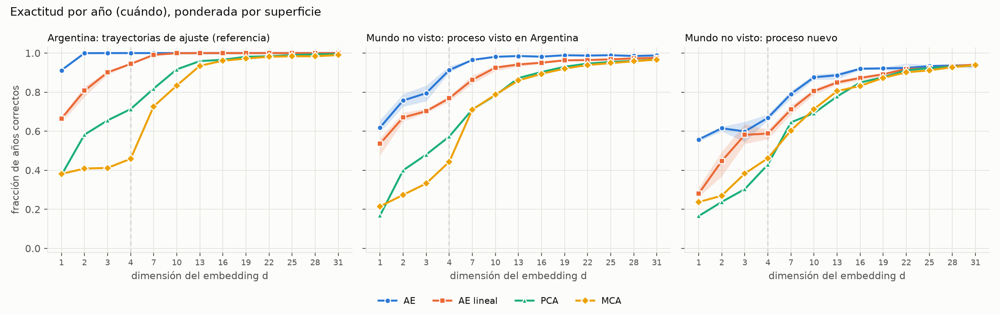
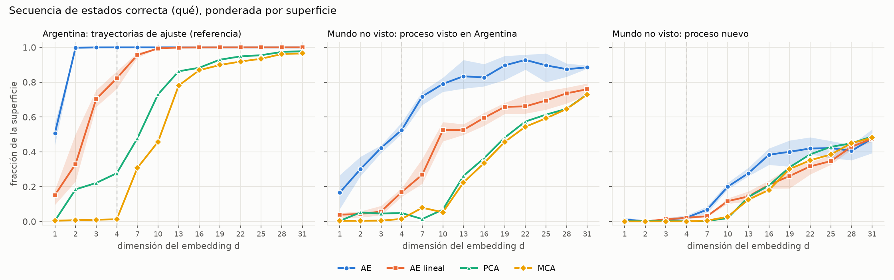
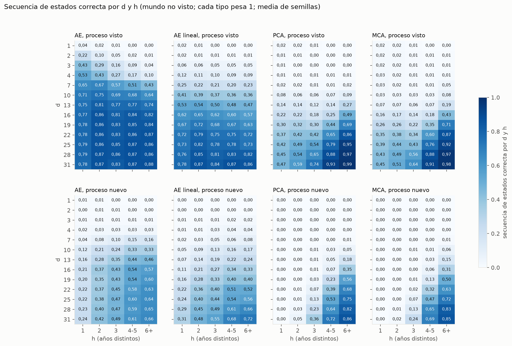
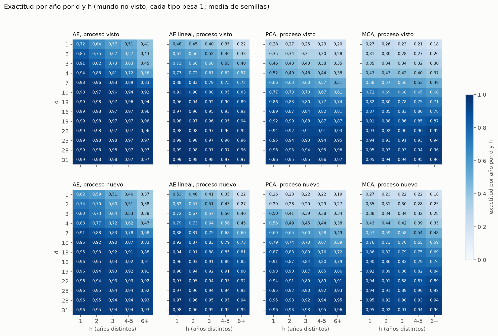
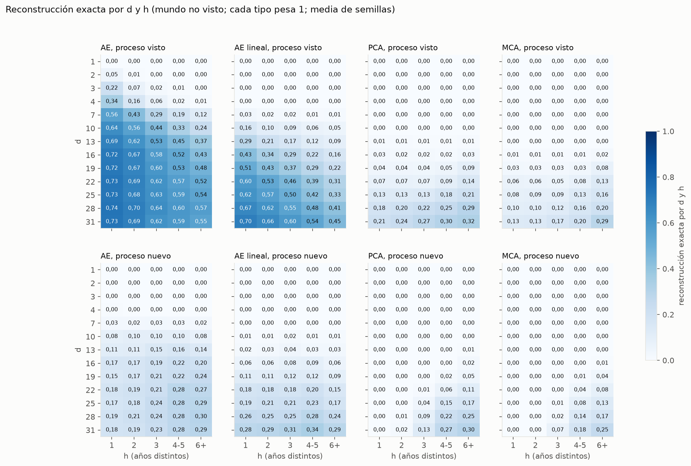

# Pregunta 1: capacidad de compresión de los métodos (resultados)

**Fecha:** 2026-10-08 (reducido el 2026-10-09 a la capacidad de compresión: la accesibilidad en z y las tipologías se eliminaron y se reemplazan por la evaluación por procesos de la Pregunta 2). Ejecuta la Parte I del [protocolo de evaluación](protocolo_evaluacion.md), fijada antes de correr. Reemplaza al informe anterior de P1 (compresión medida sólo dentro de Argentina), que queda en el historial (`5fae580`).

**Código y salidas**
- Modelos: `scripts/modelo/p1_compresion.py` (`train`, `linear`, `linae`; `ae_apply`, `lin_apply`, `pca_apply` y `mca_apply` los aplican a trayectorias nuevas). Lanzador de los autoencoders: `scripts/modelo/p1_correr_ae.py`.
- Evaluación: `scripts/validacion/evaluacion_pregunta1.py` (`no_vistos`, `codificar`, `reconstruccion`).
- Resultados: `data/autoencoder_v3/pregunta1/` (`p11_reconstruccion.csv`, `p11_parametros.csv`, `no_vistos.npz`; los códigos por modelo en `codigos/`, no versionados).
- Figuras: `scripts/viz/pregunta1_figuras.py` → `docs/autoencoder_v3/figuras/p1/`. Informe: `scripts/viz/pregunta1_informe.py`, que rellena `docs/autoencoder_v3/plantillas/p1_resultados.plantilla.md`.

**Cómo leer las cifras.** Las tablas cubren todas las d (1, 2, 3, 4, 7, …, 31). Las que no entran en el texto (métricas ponderadas por superficie, gradiente de novedad para todas las d y métricas secundarias) están en el [anexo](#anexo-tablas-completas). Salvo indicación, cada trayectoria distinta (*tipo*) pesa 1. Para el autoencoder (AE) y el AE lineal se da la media de las tres semillas y, entre paréntesis, el rango mínimo–máximo; **una diferencia menor que ese rango no se interpreta** (protocolo §5).

---

## 1. Resumen

1. **En las trayectorias de ajuste (Argentina) el autoencoder reconstruye todo con d ≥ 3**, como ya se sabía. Pero **esa fidelidad no se traslada a trayectorias que no vio**: con d = 4, la secuencia de estados se reconstruye bien en el 99 % de las trayectorias de Argentina y sólo en el 34 % de las trayectorias del mundo cuyo proceso sí existe en Argentina.
2. **Según la regla fijada en el protocolo (§6), con d = 4 el autoencoder reproduce lo que vio más que una regla general**: ya en las trayectorias que difieren de una argentina en un solo año (h = 1), la secuencia de estados cae de 0,99 a 0,53. Parte de esa caída se debe a que esas trayectorias suelen tener un estado de un solo año (análisis exploratorio, §3.4), pero aun sin ellas la fidelidad cae de 0,84 (h = 1) a 0,15 (h ≥ 4).
3. **La generalización mejora con d.** Con d = 16 a 31 el autoencoder reconstruye la secuencia de estados del 82–84 % de las trayectorias no vistas de proceso conocido, y casi no depende de la distancia a lo visto (sin tramos de un año: 0,99 con h = 1 y 0,84–0,88 con h ≥ 2).
4. **El autoencoder es el que más reconstruye con pocas dimensiones** en las trayectorias no vistas (por ejemplo, con d = 7: secuencia de estados 0,58 frente a 0,22 del AE lineal y ~0,02 de PCA y MCA). **Con d grande el AE lineal lo alcanza** (d = 31: 0,84 ambos) y, en los procesos que no existen en Argentina, lo supera (0,62 frente a 0,55).
5. **Consecuencia para la elección de d = 4.** d = 4 alcanza para reproducir Argentina, pero no para generalizar. Si la representación tiene que valer más allá de las trayectorias de ajuste, los resultados apuntan a d entre 16 y 31. Es una decisión abierta (§5).


---

## 2. Qué se midió

Síntesis del protocolo; el detalle está en [`protocolo_evaluacion.md`](protocolo_evaluacion.md).

- **Métodos:** autoencoder (transformer, ~800.000 parámetros), AE lineal (misma pérdida), PCA y MCA del one-hot. Todos ajustados **sólo con las 7.827 trayectorias de Argentina**, con d ∈ {1, 2, 3, 4, 7, 10, …, 31}.
- **Evaluación:** las **62.121 trayectorias dinámicas del mundo que no existen en Argentina**, que ningún método vio. Se separan por:
  - **A:** si su *proceso* (la secuencia de estados sin fechas) existe en Argentina (43.086, "proceso visto") o no (19.035, "proceso nuevo");
  - **B:** **h**, cuántos de los 31 años difieren de la trayectoria argentina más parecida.
- **Reconstrucción.** Principales: **exactitud por año** (*cuándo*) y **secuencia de estados correcta** (*qué*). Secundarias: reconstrucción exacta, número de cambios, error de fechado y F1 macro por clase.

Tamaño de los modelos (número de parámetros):

| d | AE | AE lineal | PCA | MCA |
|---|--:|--:|--:|--:|
| 1 | 797.441 | 1.024 | 682 | 558 |
| 2 | 797.698 | 1.707 | 1.023 | 837 |
| 3 | 797.955 | 2.390 | 1.364 | 1.116 |
| 4 | 798.212 | 3.073 | 1.705 | 1.395 |
| 7 | 798.983 | 5.122 | 2.728 | 2.232 |
| 10 | 799.754 | 7.171 | 3.751 | 3.069 |
| 13 | 800.525 | 9.220 | 4.774 | 3.906 |
| 16 | 801.296 | 11.269 | 5.797 | 4.743 |
| 19 | 802.067 | 13.318 | 6.820 | 5.580 |
| 22 | 802.838 | 15.367 | 7.843 | 6.417 |
| 25 | 803.609 | 17.416 | 8.866 | 7.254 |
| 28 | 804.380 | 19.465 | 9.889 | 8.091 |
| 31 | 805.151 | 21.514 | 10.912 | 8.928 |

---

## 3. Reconstrucción

### 3.1 Métricas principales

**Exactitud por año (*cuándo*)**


Argentina (trayectorias de ajuste; referencia):

| d | AE | AE lineal | PCA | MCA |
|---|--:|--:|--:|--:|
| 1 | 0,775 (0,770–0,783) | 0,494 (0,491–0,497) | 0,306 | 0,300 |
| 2 | 0,952 (0,950–0,956) | 0,608 (0,596–0,617) | 0,393 | 0,334 |
| 3 | 0,995 (0,993–0,996) | 0,712 (0,704–0,721) | 0,478 | 0,373 |
| 4 | 0,999 (0,999–1,000) | 0,789 (0,783–0,794) | 0,538 | 0,434 |
| 7 | 1,000 (1,000–1,000) | 0,909 (0,906–0,913) | 0,665 | 0,587 |
| 10 | 1,000 (1,000–1,000) | 0,965 (0,962–0,967) | 0,781 | 0,720 |
| 13 | 1,000 (1,000–1,000) | 0,985 (0,985–0,986) | 0,856 | 0,819 |
| 16 | 1,000 (1,000–1,000) | 0,993 (0,993–0,994) | 0,896 | 0,873 |
| 19 | 1,000 (1,000–1,000) | 0,997 (0,997–0,997) | 0,927 | 0,913 |
| 22 | 1,000 (1,000–1,000) | 0,998 (0,998–0,999) | 0,949 | 0,942 |
| 25 | 1,000 (1,000–1,000) | 0,999 (0,999–0,999) | 0,963 | 0,954 |
| 28 | 1,000 (1,000–1,000) | 0,999 (0,999–0,999) | 0,972 | 0,959 |
| 31 | 1,000 (1,000–1,000) | 1,000 (1,000–1,000) | 0,976 | 0,966 |

Mundo no visto, proceso visto:

| d | AE | AE lineal | PCA | MCA |
|---|--:|--:|--:|--:|
| 1 | 0,594 (0,584–0,607) | 0,400 (0,396–0,405) | 0,253 | 0,239 |
| 2 | 0,685 (0,671–0,698) | 0,519 (0,507–0,531) | 0,325 | 0,288 |
| 3 | 0,746 (0,736–0,753) | 0,614 (0,613–0,616) | 0,412 | 0,336 |
| 4 | 0,812 (0,802–0,821) | 0,685 (0,677–0,698) | 0,469 | 0,417 |
| 7 | 0,928 (0,926–0,930) | 0,807 (0,804–0,812) | 0,605 | 0,555 |
| 10 | 0,959 (0,957–0,961) | 0,888 (0,878–0,895) | 0,709 | 0,681 |
| 13 | 0,971 (0,970–0,971) | 0,928 (0,926–0,930) | 0,806 | 0,780 |
| 16 | 0,977 (0,973–0,979) | 0,950 (0,949–0,952) | 0,853 | 0,832 |
| 19 | 0,978 (0,978–0,978) | 0,961 (0,959–0,962) | 0,891 | 0,876 |
| 22 | 0,978 (0,975–0,980) | 0,970 (0,970–0,971) | 0,921 | 0,913 |
| 25 | 0,980 (0,978–0,981) | 0,973 (0,972–0,973) | 0,941 | 0,931 |
| 28 | 0,981 (0,977–0,983) | 0,977 (0,976–0,978) | 0,953 | 0,941 |
| 31 | 0,980 (0,979–0,980) | 0,981 (0,980–0,981) | 0,960 | 0,949 |

Mundo no visto, proceso nuevo:

| d | AE | AE lineal | PCA | MCA |
|---|--:|--:|--:|--:|
| 1 | 0,463 (0,461–0,465) | 0,338 (0,335–0,341) | 0,214 | 0,210 |
| 2 | 0,517 (0,492–0,535) | 0,417 (0,397–0,443) | 0,280 | 0,284 |
| 3 | 0,537 (0,494–0,560) | 0,513 (0,497–0,521) | 0,383 | 0,314 |
| 4 | 0,616 (0,596–0,640) | 0,570 (0,553–0,586) | 0,437 | 0,391 |
| 7 | 0,773 (0,761–0,787) | 0,694 (0,686–0,700) | 0,567 | 0,531 |
| 10 | 0,872 (0,863–0,879) | 0,795 (0,791–0,799) | 0,663 | 0,656 |
| 13 | 0,905 (0,903–0,907) | 0,853 (0,850–0,857) | 0,767 | 0,752 |
| 16 | 0,923 (0,909–0,933) | 0,890 (0,888–0,892) | 0,820 | 0,802 |
| 19 | 0,926 (0,924–0,927) | 0,910 (0,904–0,918) | 0,869 | 0,850 |
| 22 | 0,930 (0,925–0,938) | 0,932 (0,930–0,935) | 0,903 | 0,890 |
| 25 | 0,935 (0,928–0,939) | 0,938 (0,934–0,941) | 0,924 | 0,911 |
| 28 | 0,939 (0,930–0,944) | 0,949 (0,947–0,951) | 0,940 | 0,932 |
| 31 | 0,939 (0,935–0,943) | 0,956 (0,955–0,957) | 0,950 | 0,942 |

**Secuencia de estados correcta (*qué*)**

Argentina (referencia):

| d | AE | AE lineal | PCA | MCA |
|---|--:|--:|--:|--:|
| 1 | 0,237 (0,208–0,259) | 0,062 (0,059–0,068) | 0,032 | 0,032 |
| 2 | 0,722 (0,705–0,739) | 0,085 (0,081–0,091) | 0,063 | 0,035 |
| 3 | 0,952 (0,946–0,956) | 0,181 (0,165–0,207) | 0,055 | 0,039 |
| 4 | 0,992 (0,990–0,994) | 0,322 (0,311–0,337) | 0,067 | 0,053 |
| 7 | 1,000 (1,000–1,000) | 0,576 (0,568–0,584) | 0,088 | 0,095 |
| 10 | 1,000 (1,000–1,000) | 0,770 (0,751–0,783) | 0,231 | 0,146 |
| 13 | 1,000 (1,000–1,000) | 0,887 (0,884–0,890) | 0,366 | 0,234 |
| 16 | 1,000 (1,000–1,000) | 0,945 (0,944–0,946) | 0,501 | 0,404 |
| 19 | 1,000 (1,000–1,000) | 0,969 (0,968–0,970) | 0,632 | 0,563 |
| 22 | 1,000 (1,000–1,000) | 0,983 (0,982–0,985) | 0,731 | 0,684 |
| 25 | 1,000 (1,000–1,000) | 0,987 (0,987–0,988) | 0,790 | 0,745 |
| 28 | 1,000 (1,000–1,000) | 0,991 (0,991–0,992) | 0,824 | 0,792 |
| 31 | 1,000 (1,000–1,000) | 0,994 (0,993–0,995) | 0,850 | 0,816 |

Mundo no visto, proceso visto:

| d | AE | AE lineal | PCA | MCA |
|---|--:|--:|--:|--:|
| 1 | 0,016 (0,015–0,018) | 0,007 (0,006–0,010) | 0,010 | 0,010 |
| 2 | 0,096 (0,090–0,100) | 0,012 (0,007–0,017) | 0,005 | 0,014 |
| 3 | 0,233 (0,228–0,238) | 0,054 (0,048–0,057) | 0,003 | 0,015 |
| 4 | 0,335 (0,319–0,365) | 0,104 (0,097–0,113) | 0,008 | 0,019 |
| 7 | 0,584 (0,568–0,593) | 0,221 (0,219–0,224) | 0,018 | 0,023 |
| 10 | 0,701 (0,695–0,705) | 0,381 (0,355–0,397) | 0,071 | 0,035 |
| 13 | 0,771 (0,760–0,783) | 0,507 (0,496–0,527) | 0,151 | 0,079 |
| 16 | 0,817 (0,799–0,839) | 0,615 (0,609–0,625) | 0,247 | 0,192 |
| 19 | 0,826 (0,820–0,830) | 0,678 (0,668–0,686) | 0,378 | 0,321 |
| 22 | 0,834 (0,820–0,849) | 0,748 (0,741–0,759) | 0,505 | 0,465 |
| 25 | 0,842 (0,832–0,851) | 0,771 (0,767–0,775) | 0,597 | 0,548 |
| 28 | 0,845 (0,830–0,854) | 0,809 (0,802–0,819) | 0,660 | 0,627 |
| 31 | 0,840 (0,834–0,846) | 0,837 (0,834–0,839) | 0,704 | 0,659 |

Mundo no visto, proceso nuevo:

| d | AE | AE lineal | PCA | MCA |
|---|--:|--:|--:|--:|
| 1 | 0,003 (0,002–0,006) | 0,000 (0,000–0,000) | 0,000 | 0,000 |
| 2 | 0,004 (0,003–0,007) | 0,001 (0,000–0,001) | 0,001 | 0,000 |
| 3 | 0,009 (0,007–0,012) | 0,016 (0,011–0,024) | 0,001 | 0,001 |
| 4 | 0,030 (0,018–0,041) | 0,033 (0,024–0,038) | 0,000 | 0,001 |
| 7 | 0,129 (0,122–0,137) | 0,059 (0,050–0,067) | 0,004 | 0,006 |
| 10 | 0,283 (0,277–0,287) | 0,141 (0,136–0,150) | 0,028 | 0,029 |
| 13 | 0,389 (0,369–0,415) | 0,200 (0,193–0,204) | 0,083 | 0,065 |
| 16 | 0,483 (0,423–0,538) | 0,288 (0,275–0,297) | 0,151 | 0,132 |
| 19 | 0,492 (0,474–0,512) | 0,353 (0,313–0,394) | 0,278 | 0,225 |
| 22 | 0,523 (0,503–0,541) | 0,455 (0,441–0,470) | 0,375 | 0,331 |
| 25 | 0,537 (0,507–0,553) | 0,487 (0,478–0,498) | 0,450 | 0,414 |
| 28 | 0,540 (0,503–0,565) | 0,563 (0,547–0,586) | 0,522 | 0,516 |
| 31 | 0,554 (0,542–0,566) | 0,621 (0,616–0,623) | 0,580 | 0,550 |

Las mismas dos métricas ponderadas por superficie (tablas en el anexo A.2):





Lectura:
- **La distancia entre Argentina y el mundo no visto es la medida de cuánto de la "compresión" era memoria.** Con d = 4, el AE pasa de 0,999 a 0,812 en exactitud por año y de 0,992 a 0,335 en secuencia de estados. Con d = 31, de 1,000 a 0,980 y de 1,000 a 0,840.
- **Con d bajo, el autoencoder es el método que más reconstruye en las trayectorias no vistas**, por márgenes muy superiores al rango entre semillas. Por ejemplo, en proceso visto con d = 7: exactitud por año 0,928 frente a 0,807 (AE lineal), 0,605 (PCA) y 0,555 (MCA); secuencia de estados 0,584 frente a 0,221, 0,018 y 0,023.
- **Con d alto la ventaja desaparece.** En proceso visto con d = 31, el AE y el AE lineal quedan iguales en las dos métricas. En proceso nuevo con d = 31, el AE lineal supera al AE en secuencia de estados (0,621 frente a 0,554) y PCA lo iguala.
- **El autoencoder se satura:** en proceso visto, la secuencia de estados deja de crecer a partir de d ≈ 16 (0,82–0,84), lejos del 1,00 de Argentina.

### 3.2 Reconstrucción exacta por dimensión

**Cada tipo pesa 1**


Argentina (referencia):

| d | AE | AE lineal | PCA | MCA |
|---|--:|--:|--:|--:|
| 1 | 0,052 (0,047–0,054) | 0,000 (0,000–0,001) | 0,000 | 0,000 |
| 2 | 0,558 (0,546–0,576) | 0,003 (0,002–0,004) | 0,000 | 0,000 |
| 3 | 0,911 (0,894–0,924) | 0,012 (0,011–0,015) | 0,001 | 0,000 |
| 4 | 0,984 (0,980–0,990) | 0,035 (0,031–0,039) | 0,001 | 0,001 |
| 7 | 1,000 (1,000–1,000) | 0,222 (0,217–0,228) | 0,002 | 0,001 |
| 10 | 1,000 (1,000–1,000) | 0,547 (0,522–0,562) | 0,017 | 0,009 |
| 13 | 1,000 (1,000–1,000) | 0,739 (0,736–0,742) | 0,059 | 0,029 |
| 16 | 1,000 (1,000–1,000) | 0,863 (0,857–0,870) | 0,098 | 0,058 |
| 19 | 1,000 (1,000–1,000) | 0,924 (0,923–0,926) | 0,139 | 0,112 |
| 22 | 1,000 (1,000–1,000) | 0,960 (0,958–0,963) | 0,211 | 0,190 |
| 25 | 1,000 (1,000–1,000) | 0,972 (0,971–0,976) | 0,318 | 0,233 |
| 28 | 1,000 (1,000–1,000) | 0,983 (0,982–0,984) | 0,423 | 0,258 |
| 31 | 1,000 (1,000–1,000) | 0,988 (0,986–0,989) | 0,476 | 0,330 |

Mundo no visto, proceso visto:

| d | AE | AE lineal | PCA | MCA |
|---|--:|--:|--:|--:|
| 1 | 0,000 (0,000–0,000) | 0,000 (0,000–0,000) | 0,000 | 0,000 |
| 2 | 0,014 (0,013–0,016) | 0,000 (0,000–0,000) | 0,000 | 0,000 |
| 3 | 0,077 (0,068–0,086) | 0,001 (0,001–0,001) | 0,000 | 0,000 |
| 4 | 0,144 (0,136–0,154) | 0,002 (0,002–0,003) | 0,000 | 0,000 |
| 7 | 0,351 (0,342–0,364) | 0,020 (0,018–0,021) | 0,000 | 0,000 |
| 10 | 0,473 (0,459–0,483) | 0,100 (0,089–0,108) | 0,001 | 0,001 |
| 13 | 0,557 (0,550–0,569) | 0,187 (0,184–0,192) | 0,008 | 0,001 |
| 16 | 0,608 (0,562–0,637) | 0,307 (0,298–0,323) | 0,021 | 0,011 |
| 19 | 0,620 (0,597–0,651) | 0,384 (0,369–0,395) | 0,046 | 0,034 |
| 22 | 0,643 (0,612–0,684) | 0,477 (0,467–0,493) | 0,085 | 0,072 |
| 25 | 0,648 (0,625–0,684) | 0,510 (0,504–0,519) | 0,149 | 0,104 |
| 28 | 0,662 (0,651–0,683) | 0,565 (0,554–0,573) | 0,222 | 0,129 |
| 31 | 0,653 (0,635–0,682) | 0,607 (0,591–0,618) | 0,260 | 0,170 |

Mundo no visto, proceso nuevo:

| d | AE | AE lineal | PCA | MCA |
|---|--:|--:|--:|--:|
| 1 | 0,000 (0,000–0,000) | 0,000 (0,000–0,000) | 0,000 | 0,000 |
| 2 | 0,000 (0,000–0,000) | 0,000 (0,000–0,000) | 0,000 | 0,000 |
| 3 | 0,000 (0,000–0,001) | 0,000 (0,000–0,000) | 0,000 | 0,000 |
| 4 | 0,002 (0,002–0,002) | 0,000 (0,000–0,001) | 0,000 | 0,000 |
| 7 | 0,025 (0,022–0,031) | 0,002 (0,002–0,003) | 0,000 | 0,000 |
| 10 | 0,087 (0,073–0,098) | 0,014 (0,012–0,015) | 0,000 | 0,000 |
| 13 | 0,138 (0,134–0,144) | 0,029 (0,027–0,034) | 0,003 | 0,001 |
| 16 | 0,197 (0,150–0,226) | 0,071 (0,056–0,082) | 0,010 | 0,003 |
| 19 | 0,215 (0,183–0,249) | 0,107 (0,087–0,124) | 0,022 | 0,017 |
| 22 | 0,248 (0,246–0,251) | 0,174 (0,169–0,177) | 0,059 | 0,043 |
| 25 | 0,256 (0,216–0,296) | 0,200 (0,192–0,212) | 0,111 | 0,073 |
| 28 | 0,263 (0,241–0,286) | 0,254 (0,243–0,271) | 0,170 | 0,108 |
| 31 | 0,258 (0,221–0,292) | 0,304 (0,284–0,318) | 0,206 | 0,155 |

**Ponderada por superficie** (área en km² en el mundo; píxeles en Argentina)


Argentina (referencia):

| d | AE | AE lineal | PCA | MCA |
|---|--:|--:|--:|--:|
| 1 | 0,226 (0,196–0,258) | 0,012 (0,012–0,013) | 0,000 | 0,000 |
| 2 | 0,996 (0,995–0,996) | 0,044 (0,022–0,088) | 0,024 | 0,000 |
| 3 | 1,000 (1,000–1,000) | 0,113 (0,099–0,121) | 0,027 | 0,000 |
| 4 | 1,000 (1,000–1,000) | 0,283 (0,251–0,313) | 0,024 | 0,000 |
| 7 | 1,000 (1,000–1,000) | 0,763 (0,736–0,810) | 0,052 | 0,024 |
| 10 | 1,000 (1,000–1,000) | 0,983 (0,974–0,989) | 0,202 | 0,028 |
| 13 | 1,000 (1,000–1,000) | 0,997 (0,997–0,997) | 0,299 | 0,180 |
| 16 | 1,000 (1,000–1,000) | 0,999 (0,999–0,999) | 0,323 | 0,272 |
| 19 | 1,000 (1,000–1,000) | 1,000 (1,000–1,000) | 0,560 | 0,407 |
| 22 | 1,000 (1,000–1,000) | 1,000 (1,000–1,000) | 0,573 | 0,571 |
| 25 | 1,000 (1,000–1,000) | 1,000 (1,000–1,000) | 0,738 | 0,599 |
| 28 | 1,000 (1,000–1,000) | 1,000 (1,000–1,000) | 0,826 | 0,554 |
| 31 | 1,000 (1,000–1,000) | 1,000 (1,000–1,000) | 0,852 | 0,722 |

Mundo no visto, proceso visto:

| d | AE | AE lineal | PCA | MCA |
|---|--:|--:|--:|--:|
| 1 | 0,012 (0,003–0,029) | 0,000 (0,000–0,000) | 0,000 | 0,000 |
| 2 | 0,059 (0,047–0,064) | 0,000 (0,000–0,000) | 0,000 | 0,000 |
| 3 | 0,173 (0,146–0,202) | 0,001 (0,000–0,003) | 0,000 | 0,000 |
| 4 | 0,317 (0,300–0,347) | 0,011 (0,002–0,018) | 0,000 | 0,000 |
| 7 | 0,564 (0,501–0,601) | 0,054 (0,038–0,065) | 0,000 | 0,000 |
| 10 | 0,636 (0,574–0,710) | 0,169 (0,124–0,233) | 0,005 | 0,006 |
| 13 | 0,684 (0,631–0,725) | 0,216 (0,197–0,244) | 0,060 | 0,065 |
| 16 | 0,703 (0,660–0,727) | 0,296 (0,267–0,323) | 0,077 | 0,053 |
| 19 | 0,780 (0,697–0,850) | 0,350 (0,326–0,393) | 0,107 | 0,063 |
| 22 | 0,776 (0,725–0,826) | 0,366 (0,313–0,450) | 0,140 | 0,101 |
| 25 | 0,779 (0,719–0,813) | 0,397 (0,354–0,442) | 0,205 | 0,170 |
| 28 | 0,746 (0,705–0,774) | 0,449 (0,361–0,501) | 0,247 | 0,223 |
| 31 | 0,760 (0,724–0,807) | 0,476 (0,417–0,511) | 0,272 | 0,306 |

Mundo no visto, proceso nuevo:

| d | AE | AE lineal | PCA | MCA |
|---|--:|--:|--:|--:|
| 1 | 0,000 (0,000–0,000) | 0,000 (0,000–0,000) | 0,000 | 0,000 |
| 2 | 0,000 (0,000–0,000) | 0,000 (0,000–0,000) | 0,000 | 0,000 |
| 3 | 0,000 (0,000–0,000) | 0,000 (0,000–0,000) | 0,000 | 0,000 |
| 4 | 0,001 (0,000–0,002) | 0,000 (0,000–0,001) | 0,000 | 0,000 |
| 7 | 0,016 (0,008–0,031) | 0,002 (0,001–0,003) | 0,000 | 0,000 |
| 10 | 0,092 (0,054–0,126) | 0,010 (0,005–0,013) | 0,000 | 0,000 |
| 13 | 0,121 (0,094–0,164) | 0,017 (0,013–0,021) | 0,002 | 0,001 |
| 16 | 0,169 (0,142–0,189) | 0,038 (0,031–0,044) | 0,010 | 0,004 |
| 19 | 0,214 (0,184–0,261) | 0,060 (0,038–0,082) | 0,018 | 0,014 |
| 22 | 0,208 (0,156–0,259) | 0,099 (0,095–0,107) | 0,103 | 0,065 |
| 25 | 0,264 (0,213–0,322) | 0,106 (0,086–0,120) | 0,160 | 0,096 |
| 28 | 0,198 (0,190–0,207) | 0,171 (0,135–0,199) | 0,236 | 0,142 |
| 31 | 0,222 (0,139–0,303) | 0,187 (0,146–0,243) | 0,234 | 0,202 |

Lectura:
- **Por tipo**, la reconstrucción exacta de lo no visto es baja para todos: con d = 4 el AE reconstruye exactas el 14 % de las trayectorias de proceso visto, y con d = 31 el 65 %.
- **Por superficie, el autoencoder se separa mucho más de los métodos lineales**: en proceso visto con d = 31 reconstruye exacta el 76 % de la superficie, frente al 48 % del AE lineal y el 27–31 % de PCA y MCA. Las trayectorias no vistas que más superficie ocupan son las que el AE reconstruye mejor.
- En Argentina, por superficie, el AE ya es exacto con d = 2 (0,996); el AE lineal llega a 0,98 con d = 10.

### 3.3 Cómo cae la reconstrucción con la novedad


Secuencia de estados correcta, d = 4, por estrato:

| estrato | tipos | AE | AE lineal | PCA | MCA |
|---|--:|--:|--:|--:|--:|
| visto, h = 1 | 11.617 | 0,529 (0,517–0,546) | 0,121 (0,117–0,126) | 0,011 | 0,030 |
| visto, h = 2 | 8.927 | 0,433 (0,413–0,464) | 0,110 (0,103–0,115) | 0,007 | 0,023 |
| visto, h = 3 | 8.267 | 0,273 (0,255–0,310) | 0,099 (0,087–0,106) | 0,006 | 0,014 |
| visto, h = 4-5 | 9.786 | 0,173 (0,150–0,204) | 0,090 (0,076–0,103) | 0,006 | 0,009 |
| visto, h = 6+ | 4.489 | 0,103 (0,072–0,148) | 0,087 (0,068–0,115) | 0,006 | 0,015 |
| nuevo, h = 1 | 2.031 | 0,018 (0,010–0,022) | 0,010 (0,008–0,012) | 0,000 | 0,000 |
| nuevo, h = 2 | 1.841 | 0,030 (0,023–0,034) | 0,012 (0,010–0,014) | 0,000 | 0,001 |
| nuevo, h = 3 | 2.583 | 0,029 (0,023–0,038) | 0,027 (0,021–0,033) | 0,000 | 0,000 |
| nuevo, h = 4-5 | 5.487 | 0,032 (0,020–0,046) | 0,038 (0,030–0,046) | 0,001 | 0,000 |
| nuevo, h = 6+ | 7.093 | 0,034 (0,015–0,048) | 0,043 (0,026–0,055) | 0,000 | 0,002 |

Exactitud por año, d = 4:

| estrato | tipos | AE | AE lineal | PCA | MCA |
|---|--:|--:|--:|--:|--:|
| visto, h = 1 | 11.617 | 0,937 (0,933–0,942) | 0,770 (0,762–0,778) | 0,520 | 0,433 |
| visto, h = 2 | 8.927 | 0,881 (0,874–0,886) | 0,720 (0,710–0,732) | 0,491 | 0,428 |
| visto, h = 3 | 8.267 | 0,813 (0,802–0,822) | 0,665 (0,656–0,676) | 0,460 | 0,425 |
| visto, h = 4-5 | 9.786 | 0,715 (0,697–0,730) | 0,624 (0,615–0,637) | 0,436 | 0,403 |
| visto, h = 6+ | 4.489 | 0,562 (0,534–0,602) | 0,566 (0,544–0,594) | 0,381 | 0,372 |
| nuevo, h = 1 | 2.031 | 0,828 (0,811–0,857) | 0,789 (0,782–0,795) | 0,557 | 0,435 |
| nuevo, h = 2 | 1.841 | 0,772 (0,756–0,804) | 0,728 (0,723–0,737) | 0,486 | 0,440 |
| nuevo, h = 3 | 2.583 | 0,719 (0,696–0,753) | 0,640 (0,627–0,654) | 0,450 | 0,425 |
| nuevo, h = 4-5 | 5.487 | 0,624 (0,606–0,649) | 0,564 (0,547–0,579) | 0,438 | 0,393 |
| nuevo, h = 6+ | 7.093 | 0,472 (0,444–0,488) | 0,445 (0,418–0,467) | 0,384 | 0,353 |

Secuencia de estados correcta, d = 31:

| estrato | tipos | AE | AE lineal | PCA | MCA |
|---|--:|--:|--:|--:|--:|
| visto, h = 1 | 11.617 | 0,780 (0,776–0,783) | 0,778 (0,776–0,778) | 0,468 | 0,445 |
| visto, h = 2 | 8.927 | 0,869 (0,860–0,874) | 0,865 (0,865–0,867) | 0,585 | 0,515 |
| visto, h = 3 | 8.267 | 0,834 (0,827–0,846) | 0,835 (0,834–0,837) | 0,739 | 0,640 |
| visto, h = 4-5 | 9.786 | 0,872 (0,865–0,884) | 0,871 (0,867–0,874) | 0,933 | 0,915 |
| visto, h = 6+ | 4.489 | 0,877 (0,857–0,896) | 0,859 (0,844–0,882) | 0,986 | 0,980 |
| nuevo, h = 1 | 2.031 | 0,237 (0,210–0,271) | 0,314 (0,299–0,322) | 0,000 | 0,000 |
| nuevo, h = 2 | 1.841 | 0,416 (0,397–0,439) | 0,482 (0,479–0,485) | 0,052 | 0,016 |
| nuevo, h = 3 | 2.583 | 0,490 (0,483–0,494) | 0,551 (0,531–0,562) | 0,355 | 0,237 |
| nuevo, h = 4-5 | 5.487 | 0,610 (0,596–0,627) | 0,683 (0,678–0,691) | 0,718 | 0,691 |
| nuevo, h = 6+ | 7.093 | 0,659 (0,623–0,685) | 0,722 (0,718–0,725) | 0,859 | 0,852 |

Todas las d (media de semillas; tablas con rangos en el anexo A.1):







Lectura según la regla del protocolo (§6):
- **Con d = 4, el AE cae fuerte ya en h = 1** (secuencia de estados 0,529, frente a 0,992 en Argentina) y sigue cayendo con h (0,103 con h ≥ 6). Es el patrón que el protocolo identifica con reproducir lo visto más que una regla general.
- **Con d = 31, la caída en h = 1 es menor** (0,780) y la fidelidad no empeora al alejarse.
- **PCA y MCA con d = 31 mejoran con h**, lo que no es esperable si h midiera sólo novedad. El §3.4 lo explica.
- En proceso nuevo, con d = 4, ningún método reconstruye la secuencia de estados (≤ 0,05).

### 3.4 Análisis exploratorio: estados de un año *(no previsto en el protocolo)*

**Por qué.** El patrón de PCA y MCA del §3.3 sugirió que los estratos de h difieren en el tipo de trayectoria. Una trayectoria que difiere en un solo año de una argentina suele ser una argentina con un estado de **un solo año** intercalado (por ejemplo, bosque → rala un año → bosque). Esos tramos son difíciles de reconstruir para cualquier método y a menudo son ruido del producto.

Trayectorias con algún tramo de un año, por estrato:

| estrato | trayectorias con algún tramo de 1 año |
|---|--:|
| Argentina (ajuste) | 8 % |
| visto, h = 1 | 47 % |
| visto, h = 2 | 6 % |
| visto, h = 3 | 3 % |
| visto, h = 4-5 | 2 % |
| visto, h = 6+ | 0 % |
| nuevo, h = 1 | 100 % |
| nuevo, h = 2 | 36 % |
| nuevo, h = 3 | 21 % |
| nuevo, h = 4-5 | 14 % |
| nuevo, h = 6+ | 6 % |

Secuencia de estados correcta, separando las trayectorias con tramos de un año:

| método | Argentina, sin tramo de 1 año (7.156) | visto, h = 1, sin tramo de 1 año (6.137) | visto, h = 1, con tramo de 1 año (5.480) | visto, h = 2–3, sin tramo de 1 año (16.439) | visto, h ≥ 4, sin tramo de 1 año (14.104) |
|---|--:|--:|--:|--:|--:|
| AE, d = 1 | 0,249 (0,219–0,271) | 0,061 (0,049–0,073) | 0,013 (0,011–0,016) | 0,012 (0,011–0,013) | 0,004 (0,002–0,005) |
| AE, d = 2 | 0,754 (0,737–0,771) | 0,393 (0,366–0,409) | 0,027 (0,024–0,029) | 0,080 (0,075–0,088) | 0,017 (0,015–0,019) |
| AE, d = 3 | 0,966 (0,962–0,969) | 0,721 (0,707–0,730) | 0,097 (0,092–0,102) | 0,238 (0,229–0,250) | 0,079 (0,069–0,084) |
| AE, d = 4 | 0,996 (0,994–0,998) | 0,843 (0,831–0,863) | 0,178 (0,160–0,191) | 0,367 (0,348–0,403) | 0,152 (0,126–0,188) |
| AE, d = 7 | 1,000 (1,000–1,000) | 0,964 (0,961–0,966) | 0,306 (0,289–0,319) | 0,638 (0,626–0,645) | 0,489 (0,462–0,508) |
| AE, d = 10 | 1,000 (1,000–1,000) | 0,982 (0,980–0,983) | 0,408 (0,407–0,409) | 0,740 (0,736–0,746) | 0,674 (0,661–0,684) |
| AE, d = 13 | 1,000 (1,000–1,000) | 0,990 (0,990–0,992) | 0,478 (0,453–0,492) | 0,809 (0,802–0,819) | 0,769 (0,747–0,789) |
| AE, d = 16 | 1,000 (1,000–1,000) | 0,995 (0,994–0,995) | 0,524 (0,511–0,547) | 0,852 (0,836–0,866) | 0,835 (0,800–0,872) |
| AE, d = 19 | 1,000 (1,000–1,000) | 0,995 (0,993–0,996) | 0,532 (0,505–0,547) | 0,861 (0,855–0,865) | 0,850 (0,844–0,858) |
| AE, d = 22 | 1,000 (1,000–1,000) | 0,994 (0,993–0,995) | 0,549 (0,542–0,561) | 0,863 (0,846–0,887) | 0,867 (0,848–0,879) |
| AE, d = 25 | 1,000 (1,000–1,000) | 0,996 (0,995–0,996) | 0,554 (0,548–0,564) | 0,872 (0,862–0,882) | 0,876 (0,858–0,891) |
| AE, d = 28 | 1,000 (1,000–1,000) | 0,996 (0,995–0,998) | 0,556 (0,540–0,584) | 0,880 (0,871–0,886) | 0,875 (0,849–0,893) |
| AE, d = 31 | 1,000 (1,000–1,000) | 0,995 (0,994–0,996) | 0,539 (0,530–0,545) | 0,870 (0,865–0,875) | 0,879 (0,868–0,887) |
| AE lineal, d = 1 | 0,062 (0,059–0,068) | 0,017 (0,015–0,023) | 0,014 (0,011–0,019) | 0,007 (0,005–0,011) | 0,001 (0,001–0,002) |
| AE lineal, d = 2 | 0,089 (0,085–0,095) | 0,027 (0,018–0,033) | 0,012 (0,009–0,017) | 0,011 (0,005–0,017) | 0,007 (0,004–0,013) |
| AE lineal, d = 3 | 0,195 (0,178–0,225) | 0,102 (0,099–0,105) | 0,016 (0,013–0,020) | 0,054 (0,047–0,063) | 0,048 (0,043–0,054) |
| AE lineal, d = 4 | 0,347 (0,335–0,365) | 0,208 (0,197–0,218) | 0,023 (0,022–0,026) | 0,108 (0,103–0,115) | 0,090 (0,077–0,108) |
| AE lineal, d = 7 | 0,608 (0,600–0,613) | 0,403 (0,391–0,411) | 0,073 (0,069–0,077) | 0,219 (0,218–0,221) | 0,211 (0,206–0,217) |
| AE lineal, d = 10 | 0,800 (0,782–0,814) | 0,634 (0,601–0,659) | 0,154 (0,143–0,175) | 0,388 (0,366–0,407) | 0,364 (0,333–0,383) |
| AE lineal, d = 13 | 0,909 (0,905–0,915) | 0,795 (0,782–0,803) | 0,235 (0,227–0,240) | 0,531 (0,519–0,548) | 0,478 (0,453–0,513) |
| AE lineal, d = 16 | 0,961 (0,960–0,964) | 0,884 (0,879–0,891) | 0,322 (0,311–0,331) | 0,651 (0,643–0,663) | 0,591 (0,583–0,600) |
| AE lineal, d = 19 | 0,983 (0,982–0,983) | 0,928 (0,924–0,934) | 0,376 (0,358–0,387) | 0,715 (0,700–0,729) | 0,662 (0,656–0,666) |
| AE lineal, d = 22 | 0,993 (0,993–0,993) | 0,959 (0,955–0,964) | 0,457 (0,431–0,474) | 0,783 (0,778–0,791) | 0,743 (0,725–0,757) |
| AE lineal, d = 25 | 0,995 (0,995–0,996) | 0,968 (0,965–0,972) | 0,473 (0,461–0,487) | 0,811 (0,809–0,814) | 0,769 (0,762–0,779) |
| AE lineal, d = 28 | 0,998 (0,997–0,998) | 0,978 (0,977–0,981) | 0,516 (0,510–0,520) | 0,840 (0,829–0,851) | 0,829 (0,819–0,845) |
| AE lineal, d = 31 | 0,999 (0,998–0,999) | 0,983 (0,982–0,985) | 0,548 (0,545–0,551) | 0,861 (0,859–0,862) | 0,871 (0,865–0,879) |
| PCA, d = 1 | 0,030 | 0,015 | 0,022 | 0,011 | 0,001 |
| PCA, d = 2 | 0,061 | 0,015 | 0,010 | 0,004 | 0,001 |
| PCA, d = 3 | 0,055 | 0,007 | 0,003 | 0,003 | 0,003 |
| PCA, d = 4 | 0,067 | 0,015 | 0,006 | 0,007 | 0,006 |
| PCA, d = 7 | 0,093 | 0,040 | 0,006 | 0,016 | 0,017 |
| PCA, d = 10 | 0,251 | 0,140 | 0,010 | 0,064 | 0,077 |
| PCA, d = 13 | 0,399 | 0,270 | 0,001 | 0,133 | 0,187 |
| PCA, d = 16 | 0,546 | 0,418 | 0,001 | 0,207 | 0,330 |
| PCA, d = 19 | 0,689 | 0,575 | 0,001 | 0,326 | 0,525 |
| PCA, d = 22 | 0,797 | 0,706 | 0,000 | 0,439 | 0,723 |
| PCA, d = 25 | 0,862 | 0,795 | 0,000 | 0,536 | 0,853 |
| PCA, d = 28 | 0,900 | 0,851 | 0,000 | 0,622 | 0,920 |
| PCA, d = 31 | 0,928 | 0,886 | 0,000 | 0,689 | 0,961 |
| MCA, d = 1 | 0,030 | 0,015 | 0,022 | 0,011 | 0,001 |
| MCA, d = 2 | 0,034 | 0,019 | 0,024 | 0,015 | 0,007 |
| MCA, d = 3 | 0,038 | 0,022 | 0,025 | 0,016 | 0,006 |
| MCA, d = 4 | 0,053 | 0,031 | 0,029 | 0,019 | 0,011 |
| MCA, d = 7 | 0,099 | 0,044 | 0,020 | 0,017 | 0,024 |
| MCA, d = 10 | 0,157 | 0,055 | 0,007 | 0,029 | 0,045 |
| MCA, d = 13 | 0,254 | 0,126 | 0,001 | 0,065 | 0,109 |
| MCA, d = 16 | 0,441 | 0,308 | 0,001 | 0,160 | 0,265 |
| MCA, d = 19 | 0,615 | 0,490 | 0,001 | 0,255 | 0,471 |
| MCA, d = 22 | 0,747 | 0,664 | 0,001 | 0,378 | 0,689 |
| MCA, d = 25 | 0,814 | 0,741 | 0,001 | 0,456 | 0,819 |
| MCA, d = 28 | 0,864 | 0,807 | 0,000 | 0,549 | 0,923 |
| MCA, d = 31 | 0,890 | 0,843 | 0,000 | 0,601 | 0,947 |

Lectura:
- **h está mezclado con la presencia de tramos de un año** (47 % en proceso visto con h = 1; 0–6 % con h ≥ 2). Parte de la caída del AE en h = 1 se debe a eso: **las trayectorias con un tramo de un año casi no se reconstruyen con ningún método ni d** (AE con d = 31: 0,54; PCA y MCA: 0).
- **Aun sin esos tramos, el AE con d = 4 se degrada con la distancia**: 0,996 en Argentina, 0,843 con h = 1, 0,367 con h = 2–3 y 0,152 con h ≥ 4. La conclusión del §3.3 se mantiene.
- **Con d ≥ 16, el AE generaliza a trayectorias sin tramos de un año** (0,99 con h = 1; 0,84–0,88 con h ≥ 2). El AE lineal con d = 31 da lo mismo.
- PCA y MCA con d = 31 reconstruyen mejor que el AE las trayectorias alejadas sin tramos de un año (0,96 y 0,95 con h ≥ 4, frente a 0,88), y fallan por completo cuando hay un tramo de un año.
- Este análisis es **exploratorio**: se definió después de ver los resultados. Sugiere tratar los tramos de un año como un factor propio en lo que sigue (por ejemplo, con medidas como la turbulencia).

### 3.5 Métricas secundarias

d = 4:

| métrica | conjunto | AE | AE lineal | PCA | MCA |
|---|--:|--:|--:|--:|--:|
| número de cambios correcto | Argentina | 0,993 (0,992–0,995) | 0,445 (0,429–0,457) | 0,287 | 0,250 |
| número de cambios correcto | visto | 0,471 (0,460–0,485) | 0,296 (0,284–0,315) | 0,253 | 0,364 |
| número de cambios correcto | nuevo | 0,223 (0,218–0,229) | 0,250 (0,241–0,259) | 0,183 | 0,350 |
| error de fechado (años) | Argentina | 0,004 (0,002–0,005) | 1,682 (1,602–1,760) | 4,034 | 4,907 |
| error de fechado (años) | visto | 0,500 (0,485–0,527) | 2,348 (2,248–2,401) | 5,485 | 4,779 |
| error de fechado (años) | nuevo | 1,584 (1,151–1,871) | 3,046 (2,663–3,450) | 6,905 | 5,694 |
| F1 macro por clase | Argentina | 0,999 (0,999–1,000) | 0,792 (0,786–0,800) | 0,397 | 0,452 |
| F1 macro por clase | visto | 0,809 (0,787–0,825) | 0,696 (0,683–0,713) | 0,356 | 0,395 |
| F1 macro por clase | nuevo | 0,599 (0,570–0,627) | 0,573 (0,558–0,593) | 0,327 | 0,351 |

d = 31:

| métrica | conjunto | AE | AE lineal | PCA | MCA |
|---|--:|--:|--:|--:|--:|
| número de cambios correcto | Argentina | 1,000 (1,000–1,000) | 0,994 (0,994–0,995) | 0,850 | 0,816 |
| número de cambios correcto | visto | 0,855 (0,850–0,859) | 0,847 (0,844–0,850) | 0,705 | 0,660 |
| número de cambios correcto | nuevo | 0,600 (0,595–0,603) | 0,655 (0,652–0,659) | 0,581 | 0,551 |
| error de fechado (años) | Argentina | 0,000 (0,000–0,000) | 0,003 (0,003–0,004) | 0,290 | 0,418 |
| error de fechado (años) | visto | 0,133 (0,111–0,148) | 0,168 (0,159–0,181) | 0,403 | 0,531 |
| error de fechado (años) | nuevo | 0,385 (0,349–0,456) | 0,320 (0,310–0,337) | 0,397 | 0,477 |
| F1 macro por clase | Argentina | 1,000 (1,000–1,000) | 1,000 (1,000–1,000) | 0,974 | 0,967 |
| F1 macro por clase | visto | 0,980 (0,980–0,981) | 0,979 (0,978–0,979) | 0,959 | 0,950 |
| F1 macro por clase | nuevo | 0,937 (0,934–0,942) | 0,953 (0,952–0,955) | 0,948 | 0,941 |

Todas las d, por tipo y por superficie: anexo A.3.

- Con d = 4 el AE acierta el número de cambios en el 47 % de las trayectorias de proceso visto (AE lineal: 30 %) y, cuando acierta la secuencia de estados, fecha los cambios con un error medio de 0,5 años (AE lineal: 2,3). El error de fechado se calcula sólo donde la secuencia de estados es correcta, así que en cada método se promedia sobre un subconjunto distinto (protocolo §4.2).
- El F1 macro por clase muestra que las clases raras se conservan bastante mejor que las trayectorias completas: con d = 31 está entre 0,94 y 0,98 para todos los métodos en lo no visto.

---

## 4. Respuesta a la Pregunta 1

**¿Qué capacidad de compresión tiene cada método?**

- **Reconstrucción.** El autoencoder tiene la mayor capacidad de compresión **con pocas dimensiones** y es el único que reconstruye bien las trayectorias no vistas que más superficie ocupan. Pero su fidelidad con d bajo está atada a las trayectorias de ajuste: **con d = 4 reproduce Argentina, no una regla general**. Con d ≥ 16 generaliza a procesos conocidos, y ahí el AE lineal lo alcanza en las métricas por tipo.
- **En conjunto**, el autoencoder **comprime mejor con pocas dimensiones dentro de lo que vio**, y esa ventaja no se sostiene como generalización con d bajo. Si su representación sirve para detectar procesos se evalúa en la Pregunta 2.

---

## 5. Decisiones que quedan abiertas

1. **d de trabajo.** d = 4 se eligió con el informe anterior, que medía dentro de Argentina. Los resultados sobre trayectorias no vistas apuntan a d = 16–31 si la representación tiene que generalizar. Hay que decidir si d = 4 se mantiene para la tipología final.
2. **Estados de un año.** Afectan a todos los métodos y están mezclados con la novedad. Para la Pregunta 2 se resolvió con un criterio de persistencia mínima de 3 años (protocolo, Parte II).

## 6. Límites

- **Tres semillas**: los rangos son aproximados.
- **La configuración del autoencoder no se tuneó** (ancho, épocas, peso de ajuste). Un modelo regularizado o entrenado de otra forma podría generalizar mejor con d bajo.
- **El conjunto no visto es casi todo de trayectorias raras** (mediana de 2 a 9 píxeles por tipo) y viene de otras regiones del mundo: la generalización medida es a ese conjunto.
- **El análisis del §3.4 es exploratorio.**

## 7. Desviaciones del protocolo

- **§3.4 (estados de un año)**: análisis agregado después de ver los resultados; se presenta como exploratorio.
- **AE lineal**: se reentrenó con la misma configuración y semillas para guardar sus pesos (requisito de implementación del protocolo). Reproduce el anterior: reconstrucción idéntica en Argentina y códigos con diferencias de 2×10⁻⁵.

## 8. Cómo reproducirlo

```bash
python scripts/modelo/p1_correr_ae.py --workers 3                # autoencoders (GPU)
python scripts/modelo/p1_compresion.py linear                    # PCA y MCA, con su ajuste
python scripts/modelo/p1_compresion.py linae                     # AE lineal, con sus pesos
python scripts/validacion/evaluacion_pregunta1.py no_vistos
python scripts/validacion/evaluacion_pregunta1.py codificar
python scripts/validacion/evaluacion_pregunta1.py reconstruccion
python scripts/viz/pregunta1_figuras.py
python scripts/viz/pregunta1_informe.py                          # este informe (texto en docs/autoencoder_v3/plantillas/)
```

En CPU (8 núcleos), la codificación y la reconstrucción tardan alrededor de media hora.

---

## Anexo: tablas completas

### A.1 Gradiente de novedad, todas las d

Mundo no visto, cada tipo pesa 1, por estrato de h.

**Secuencia de estados correcta, proceso visto**

| método | d | h = 1 (11.617 tipos) | h = 2 (8.927 tipos) | h = 3 (8.267 tipos) | h = 4-5 (9.786 tipos) | h = 6+ (4.489 tipos) |
|---|--:|--:|--:|--:|--:|--:|
| AE | 1 | 0,038 (0,033–0,045) | 0,016 (0,015–0,016) | 0,007 (0,005–0,009) | 0,005 (0,003–0,007) | 0,001 (0,000–0,003) |
| AE | 2 | 0,220 (0,205–0,229) | 0,104 (0,093–0,116) | 0,049 (0,047–0,050) | 0,021 (0,017–0,023) | 0,008 (0,006–0,010) |
| AE | 3 | 0,427 (0,420–0,434) | 0,291 (0,283–0,302) | 0,164 (0,147–0,177) | 0,094 (0,082–0,101) | 0,042 (0,039–0,048) |
| AE | 4 | 0,529 (0,517–0,546) | 0,433 (0,413–0,464) | 0,273 (0,255–0,310) | 0,173 (0,150–0,204) | 0,103 (0,072–0,148) |
| AE | 7 | 0,653 (0,644–0,661) | 0,668 (0,657–0,674) | 0,567 (0,555–0,575) | 0,510 (0,492–0,528) | 0,432 (0,388–0,461) |
| AE | 10 | 0,711 (0,710–0,712) | 0,752 (0,746–0,760) | 0,688 (0,682–0,696) | 0,684 (0,672–0,689) | 0,637 (0,621–0,658) |
| AE | 13 | 0,749 (0,738–0,755) | 0,813 (0,810–0,815) | 0,771 (0,760–0,790) | 0,774 (0,750–0,792) | 0,742 (0,723–0,765) |
| AE | 16 | 0,773 (0,767–0,784) | 0,858 (0,850–0,871) | 0,811 (0,794–0,831) | 0,836 (0,808–0,868) | 0,816 (0,766–0,867) |
| AE | 19 | 0,776 (0,764–0,784) | 0,857 (0,851–0,862) | 0,830 (0,828–0,832) | 0,846 (0,835–0,855) | 0,844 (0,829–0,855) |
| AE | 22 | 0,784 (0,780–0,791) | 0,858 (0,852–0,871) | 0,832 (0,802–0,865) | 0,859 (0,835–0,879) | 0,865 (0,858–0,877) |
| AE | 25 | 0,787 (0,784–0,792) | 0,862 (0,859–0,865) | 0,849 (0,830–0,865) | 0,874 (0,861–0,890) | 0,864 (0,839–0,878) |
| AE | 28 | 0,789 (0,780–0,803) | 0,867 (0,859–0,875) | 0,856 (0,842–0,868) | 0,873 (0,850–0,890) | 0,862 (0,826–0,884) |
| AE | 31 | 0,780 (0,776–0,783) | 0,869 (0,860–0,874) | 0,834 (0,827–0,846) | 0,872 (0,865–0,884) | 0,877 (0,857–0,896) |
| AE lineal | 1 | 0,016 (0,013–0,021) | 0,009 (0,007–0,014) | 0,004 (0,003–0,007) | 0,002 (0,002–0,002) | 0,000 (0,000–0,000) |
| AE lineal | 2 | 0,020 (0,014–0,024) | 0,013 (0,006–0,018) | 0,009 (0,004–0,015) | 0,008 (0,005–0,013) | 0,005 (0,002–0,013) |
| AE lineal | 3 | 0,062 (0,058–0,065) | 0,056 (0,049–0,065) | 0,049 (0,042–0,059) | 0,049 (0,045–0,052) | 0,045 (0,036–0,061) |
| AE lineal | 4 | 0,121 (0,117–0,126) | 0,110 (0,103–0,115) | 0,099 (0,087–0,106) | 0,090 (0,076–0,103) | 0,087 (0,068–0,115) |
| AE lineal | 7 | 0,247 (0,241–0,253) | 0,221 (0,219–0,226) | 0,206 (0,203–0,210) | 0,200 (0,193–0,213) | 0,230 (0,221–0,240) |
| AE lineal | 10 | 0,408 (0,386–0,422) | 0,387 (0,366–0,399) | 0,370 (0,344–0,396) | 0,364 (0,339–0,378) | 0,357 (0,310–0,390) |
| AE lineal | 13 | 0,531 (0,520–0,538) | 0,539 (0,533–0,550) | 0,497 (0,475–0,521) | 0,475 (0,446–0,509) | 0,473 (0,451–0,511) |
| AE lineal | 16 | 0,619 (0,611–0,627) | 0,652 (0,646–0,662) | 0,621 (0,608–0,634) | 0,595 (0,584–0,607) | 0,567 (0,544–0,584) |
| AE lineal | 19 | 0,668 (0,657–0,674) | 0,722 (0,708–0,736) | 0,681 (0,665–0,696) | 0,669 (0,657–0,676) | 0,633 (0,623–0,643) |
| AE lineal | 22 | 0,722 (0,708–0,733) | 0,793 (0,783–0,805) | 0,749 (0,744–0,754) | 0,749 (0,729–0,763) | 0,719 (0,708–0,733) |
| AE lineal | 25 | 0,735 (0,727–0,741) | 0,818 (0,817–0,820) | 0,779 (0,776–0,785) | 0,779 (0,777–0,780) | 0,734 (0,707–0,764) |
| AE lineal | 28 | 0,760 (0,757–0,762) | 0,848 (0,844–0,851) | 0,808 (0,790–0,825) | 0,826 (0,815–0,840) | 0,821 (0,809–0,841) |
| AE lineal | 31 | 0,778 (0,776–0,778) | 0,865 (0,865–0,867) | 0,835 (0,834–0,837) | 0,871 (0,867–0,874) | 0,859 (0,844–0,882) |
| PCA | 1 | 0,019 | 0,016 | 0,007 | 0,002 | 0,000 |
| PCA | 2 | 0,012 | 0,006 | 0,003 | 0,001 | 0,000 |
| PCA | 3 | 0,005 | 0,003 | 0,002 | 0,004 | 0,001 |
| PCA | 4 | 0,011 | 0,007 | 0,006 | 0,006 | 0,006 |
| PCA | 7 | 0,024 | 0,016 | 0,014 | 0,013 | 0,025 |
| PCA | 10 | 0,079 | 0,064 | 0,058 | 0,069 | 0,091 |
| PCA | 13 | 0,143 | 0,139 | 0,115 | 0,145 | 0,273 |
| PCA | 16 | 0,221 | 0,216 | 0,178 | 0,252 | 0,489 |
| PCA | 19 | 0,304 | 0,324 | 0,297 | 0,440 | 0,689 |
| PCA | 22 | 0,373 | 0,418 | 0,421 | 0,647 | 0,861 |
| PCA | 25 | 0,420 | 0,487 | 0,540 | 0,795 | 0,948 |
| PCA | 28 | 0,450 | 0,543 | 0,651 | 0,879 | 0,975 |
| PCA | 31 | 0,468 | 0,585 | 0,739 | 0,933 | 0,986 |
| MCA | 1 | 0,019 | 0,016 | 0,007 | 0,002 | 0,000 |
| MCA | 2 | 0,021 | 0,019 | 0,011 | 0,007 | 0,007 |
| MCA | 3 | 0,023 | 0,021 | 0,011 | 0,006 | 0,006 |
| MCA | 4 | 0,030 | 0,023 | 0,014 | 0,009 | 0,015 |
| MCA | 7 | 0,033 | 0,018 | 0,015 | 0,013 | 0,046 |
| MCA | 10 | 0,032 | 0,030 | 0,026 | 0,029 | 0,079 |
| MCA | 13 | 0,067 | 0,067 | 0,059 | 0,070 | 0,188 |
| MCA | 16 | 0,163 | 0,169 | 0,137 | 0,183 | 0,434 |
| MCA | 19 | 0,259 | 0,263 | 0,223 | 0,354 | 0,709 |
| MCA | 22 | 0,351 | 0,381 | 0,342 | 0,596 | 0,865 |
| MCA | 25 | 0,392 | 0,438 | 0,434 | 0,755 | 0,925 |
| MCA | 28 | 0,426 | 0,490 | 0,564 | 0,883 | 0,974 |
| MCA | 31 | 0,445 | 0,515 | 0,640 | 0,915 | 0,980 |

**Secuencia de estados correcta, proceso nuevo**

| método | d | h = 1 (2.031 tipos) | h = 2 (1.841 tipos) | h = 3 (2.583 tipos) | h = 4-5 (5.487 tipos) | h = 6+ (7.093 tipos) |
|---|--:|--:|--:|--:|--:|--:|
| AE | 1 | 0,006 (0,002–0,010) | 0,006 (0,002–0,010) | 0,004 (0,002–0,007) | 0,003 (0,001–0,005) | 0,002 (0,001–0,003) |
| AE | 2 | 0,005 (0,003–0,006) | 0,006 (0,002–0,009) | 0,006 (0,004–0,009) | 0,004 (0,002–0,008) | 0,003 (0,001–0,006) |
| AE | 3 | 0,009 (0,007–0,010) | 0,012 (0,010–0,012) | 0,010 (0,007–0,012) | 0,009 (0,007–0,011) | 0,008 (0,005–0,013) |
| AE | 4 | 0,018 (0,010–0,022) | 0,030 (0,023–0,034) | 0,029 (0,023–0,038) | 0,032 (0,020–0,046) | 0,034 (0,015–0,048) |
| AE | 7 | 0,044 (0,038–0,050) | 0,080 (0,076–0,089) | 0,104 (0,095–0,108) | 0,153 (0,143–0,164) | 0,158 (0,141–0,174) |
| AE | 10 | 0,122 (0,122–0,123) | 0,214 (0,206–0,222) | 0,243 (0,237–0,249) | 0,326 (0,321–0,334) | 0,327 (0,314–0,344) |
| AE | 13 | 0,157 (0,133–0,189) | 0,277 (0,229–0,332) | 0,346 (0,321–0,383) | 0,442 (0,420–0,471) | 0,458 (0,437–0,470) |
| AE | 16 | 0,207 (0,176–0,234) | 0,370 (0,315–0,401) | 0,430 (0,362–0,485) | 0,539 (0,461–0,603) | 0,567 (0,514–0,629) |
| AE | 19 | 0,200 (0,198–0,204) | 0,349 (0,332–0,373) | 0,433 (0,397–0,475) | 0,539 (0,522–0,560) | 0,599 (0,570–0,615) |
| AE | 22 | 0,217 (0,205–0,240) | 0,370 (0,354–0,382) | 0,449 (0,431–0,459) | 0,577 (0,549–0,592) | 0,635 (0,601–0,676) |
| AE | 25 | 0,225 (0,204–0,242) | 0,380 (0,363–0,412) | 0,471 (0,434–0,493) | 0,604 (0,574–0,619) | 0,640 (0,607–0,669) |
| AE | 28 | 0,233 (0,204–0,259) | 0,401 (0,373–0,432) | 0,467 (0,457–0,479) | 0,594 (0,552–0,626) | 0,648 (0,601–0,672) |
| AE | 31 | 0,237 (0,210–0,271) | 0,416 (0,397–0,439) | 0,490 (0,483–0,494) | 0,610 (0,596–0,627) | 0,659 (0,623–0,685) |
| AE lineal | 1 | 0,000 (0,000–0,000) | 0,000 (0,000–0,001) | 0,000 (0,000–0,000) | 0,000 (0,000–0,000) | 0,000 (0,000–0,000) |
| AE lineal | 2 | 0,000 (0,000–0,000) | 0,000 (0,000–0,001) | 0,001 (0,000–0,001) | 0,001 (0,000–0,001) | 0,001 (0,000–0,001) |
| AE lineal | 3 | 0,006 (0,002–0,012) | 0,008 (0,003–0,016) | 0,011 (0,007–0,017) | 0,016 (0,011–0,024) | 0,023 (0,018–0,032) |
| AE lineal | 4 | 0,010 (0,008–0,012) | 0,012 (0,010–0,014) | 0,027 (0,021–0,033) | 0,038 (0,030–0,046) | 0,043 (0,026–0,055) |
| AE lineal | 7 | 0,018 (0,008–0,031) | 0,030 (0,021–0,047) | 0,048 (0,035–0,064) | 0,064 (0,048–0,073) | 0,079 (0,078–0,081) |
| AE lineal | 10 | 0,050 (0,039–0,057) | 0,087 (0,080–0,100) | 0,130 (0,114–0,145) | 0,157 (0,145–0,167) | 0,173 (0,150–0,188) |
| AE lineal | 13 | 0,075 (0,062–0,084) | 0,135 (0,114–0,153) | 0,186 (0,172–0,201) | 0,224 (0,213–0,234) | 0,240 (0,228–0,260) |
| AE lineal | 16 | 0,107 (0,089–0,125) | 0,210 (0,181–0,228) | 0,272 (0,235–0,303) | 0,337 (0,317–0,352) | 0,327 (0,320–0,335) |
| AE lineal | 19 | 0,158 (0,119–0,181) | 0,282 (0,259–0,316) | 0,326 (0,293–0,370) | 0,399 (0,350–0,442) | 0,402 (0,361–0,450) |
| AE lineal | 22 | 0,224 (0,198–0,240) | 0,361 (0,325–0,398) | 0,403 (0,392–0,409) | 0,514 (0,495–0,533) | 0,518 (0,497–0,539) |
| AE lineal | 25 | 0,237 (0,234–0,239) | 0,403 (0,395–0,417) | 0,439 (0,422–0,467) | 0,535 (0,530–0,546) | 0,560 (0,548–0,574) |
| AE lineal | 28 | 0,292 (0,257–0,319) | 0,448 (0,410–0,475) | 0,490 (0,466–0,512) | 0,610 (0,588–0,636) | 0,661 (0,638–0,681) |
| AE lineal | 31 | 0,314 (0,299–0,322) | 0,482 (0,479–0,485) | 0,551 (0,531–0,562) | 0,683 (0,678–0,691) | 0,722 (0,718–0,725) |
| PCA | 1 | 0,000 | 0,000 | 0,000 | 0,000 | 0,000 |
| PCA | 2 | 0,000 | 0,000 | 0,000 | 0,001 | 0,002 |
| PCA | 3 | 0,000 | 0,000 | 0,000 | 0,001 | 0,002 |
| PCA | 4 | 0,000 | 0,000 | 0,000 | 0,001 | 0,000 |
| PCA | 7 | 0,001 | 0,000 | 0,000 | 0,004 | 0,006 |
| PCA | 10 | 0,001 | 0,003 | 0,012 | 0,026 | 0,048 |
| PCA | 13 | 0,000 | 0,005 | 0,011 | 0,049 | 0,179 |
| PCA | 16 | 0,000 | 0,002 | 0,007 | 0,071 | 0,346 |
| PCA | 19 | 0,000 | 0,003 | 0,029 | 0,227 | 0,560 |
| PCA | 22 | 0,000 | 0,007 | 0,069 | 0,385 | 0,682 |
| PCA | 25 | 0,000 | 0,014 | 0,127 | 0,526 | 0,752 |
| PCA | 28 | 0,000 | 0,028 | 0,233 | 0,635 | 0,817 |
| PCA | 31 | 0,000 | 0,052 | 0,355 | 0,718 | 0,859 |
| MCA | 1 | 0,000 | 0,000 | 0,000 | 0,000 | 0,000 |
| MCA | 2 | 0,000 | 0,000 | 0,000 | 0,000 | 0,000 |
| MCA | 3 | 0,000 | 0,000 | 0,000 | 0,000 | 0,002 |
| MCA | 4 | 0,000 | 0,001 | 0,000 | 0,000 | 0,002 |
| MCA | 7 | 0,000 | 0,001 | 0,002 | 0,005 | 0,010 |
| MCA | 10 | 0,003 | 0,002 | 0,006 | 0,015 | 0,064 |
| MCA | 13 | 0,001 | 0,003 | 0,002 | 0,026 | 0,153 |
| MCA | 16 | 0,000 | 0,002 | 0,005 | 0,060 | 0,306 |
| MCA | 19 | 0,000 | 0,002 | 0,008 | 0,133 | 0,497 |
| MCA | 22 | 0,000 | 0,002 | 0,023 | 0,323 | 0,629 |
| MCA | 25 | 0,000 | 0,004 | 0,067 | 0,467 | 0,725 |
| MCA | 28 | 0,000 | 0,008 | 0,132 | 0,653 | 0,829 |
| MCA | 31 | 0,000 | 0,016 | 0,237 | 0,691 | 0,852 |

**Exactitud por año, proceso visto**

| método | d | h = 1 (11.617 tipos) | h = 2 (8.927 tipos) | h = 3 (8.267 tipos) | h = 4-5 (9.786 tipos) | h = 6+ (4.489 tipos) |
|---|--:|--:|--:|--:|--:|--:|
| AE | 1 | 0,720 (0,710–0,730) | 0,637 (0,625–0,658) | 0,571 (0,562–0,587) | 0,508 (0,498–0,520) | 0,410 (0,396–0,424) |
| AE | 2 | 0,846 (0,836–0,855) | 0,750 (0,735–0,762) | 0,665 (0,647–0,678) | 0,570 (0,552–0,585) | 0,431 (0,421–0,449) |
| AE | 3 | 0,908 (0,893–0,916) | 0,824 (0,811–0,833) | 0,733 (0,720–0,745) | 0,626 (0,620–0,638) | 0,452 (0,441–0,463) |
| AE | 4 | 0,937 (0,933–0,942) | 0,881 (0,874–0,886) | 0,813 (0,802–0,822) | 0,715 (0,697–0,730) | 0,562 (0,534–0,602) |
| AE | 7 | 0,976 (0,975–0,977) | 0,957 (0,957–0,958) | 0,926 (0,924–0,928) | 0,890 (0,887–0,894) | 0,828 (0,815–0,841) |
| AE | 10 | 0,984 (0,983–0,984) | 0,973 (0,971–0,974) | 0,956 (0,953–0,958) | 0,939 (0,936–0,941) | 0,919 (0,914–0,923) |
| AE | 13 | 0,987 (0,987–0,988) | 0,979 (0,978–0,980) | 0,968 (0,967–0,969) | 0,959 (0,958–0,959) | 0,944 (0,942–0,946) |
| AE | 16 | 0,989 (0,988–0,990) | 0,983 (0,981–0,985) | 0,973 (0,969–0,976) | 0,968 (0,962–0,972) | 0,957 (0,949–0,964) |
| AE | 19 | 0,989 (0,988–0,989) | 0,983 (0,983–0,983) | 0,975 (0,975–0,975) | 0,969 (0,969–0,970) | 0,962 (0,960–0,966) |
| AE | 22 | 0,989 (0,988–0,990) | 0,983 (0,982–0,985) | 0,975 (0,971–0,978) | 0,969 (0,965–0,973) | 0,962 (0,958–0,964) |
| AE | 25 | 0,989 (0,989–0,990) | 0,984 (0,984–0,984) | 0,977 (0,975–0,979) | 0,974 (0,971–0,976) | 0,967 (0,963–0,971) |
| AE | 28 | 0,989 (0,989–0,990) | 0,984 (0,983–0,985) | 0,978 (0,975–0,979) | 0,974 (0,968–0,977) | 0,969 (0,957–0,978) |
| AE | 31 | 0,990 (0,990–0,990) | 0,985 (0,984–0,985) | 0,976 (0,975–0,977) | 0,973 (0,972–0,974) | 0,967 (0,963–0,970) |
| AE lineal | 1 | 0,484 (0,480–0,490) | 0,445 (0,441–0,452) | 0,396 (0,392–0,401) | 0,345 (0,344–0,347) | 0,217 (0,213–0,226) |
| AE lineal | 2 | 0,608 (0,594–0,619) | 0,562 (0,549–0,573) | 0,522 (0,508–0,535) | 0,459 (0,448–0,470) | 0,331 (0,326–0,341) |
| AE lineal | 3 | 0,706 (0,704–0,708) | 0,655 (0,652–0,662) | 0,596 (0,591–0,603) | 0,545 (0,542–0,552) | 0,475 (0,458–0,489) |
| AE lineal | 4 | 0,770 (0,762–0,778) | 0,720 (0,710–0,732) | 0,665 (0,656–0,676) | 0,624 (0,615–0,637) | 0,566 (0,544–0,594) |
| AE lineal | 7 | 0,875 (0,871–0,879) | 0,830 (0,825–0,837) | 0,793 (0,787–0,798) | 0,755 (0,748–0,760) | 0,722 (0,709–0,733) |
| AE lineal | 10 | 0,933 (0,928–0,938) | 0,903 (0,895–0,910) | 0,880 (0,871–0,890) | 0,854 (0,843–0,861) | 0,828 (0,808–0,842) |
| AE lineal | 13 | 0,960 (0,960–0,961) | 0,940 (0,939–0,941) | 0,922 (0,921–0,924) | 0,903 (0,899–0,907) | 0,885 (0,876–0,894) |
| AE lineal | 16 | 0,974 (0,973–0,975) | 0,959 (0,959–0,961) | 0,946 (0,945–0,949) | 0,932 (0,930–0,933) | 0,916 (0,915–0,918) |
| AE lineal | 19 | 0,980 (0,979–0,981) | 0,968 (0,967–0,969) | 0,957 (0,955–0,959) | 0,947 (0,943–0,950) | 0,935 (0,934–0,938) |
| AE lineal | 22 | 0,985 (0,984–0,986) | 0,976 (0,976–0,977) | 0,966 (0,966–0,967) | 0,959 (0,958–0,959) | 0,951 (0,950–0,952) |
| AE lineal | 25 | 0,986 (0,986–0,986) | 0,979 (0,978–0,979) | 0,969 (0,969–0,970) | 0,963 (0,961–0,964) | 0,955 (0,953–0,958) |
| AE lineal | 28 | 0,988 (0,988–0,988) | 0,982 (0,982–0,982) | 0,974 (0,972–0,975) | 0,969 (0,967–0,971) | 0,965 (0,962–0,967) |
| AE lineal | 31 | 0,989 (0,989–0,990) | 0,984 (0,983–0,985) | 0,977 (0,976–0,977) | 0,974 (0,974–0,975) | 0,971 (0,969–0,973) |
| PCA | 1 | 0,282 | 0,273 | 0,246 | 0,231 | 0,201 |
| PCA | 2 | 0,354 | 0,342 | 0,313 | 0,305 | 0,282 |
| PCA | 3 | 0,458 | 0,430 | 0,396 | 0,383 | 0,346 |
| PCA | 4 | 0,520 | 0,491 | 0,460 | 0,436 | 0,381 |
| PCA | 7 | 0,656 | 0,628 | 0,599 | 0,570 | 0,509 |
| PCA | 10 | 0,769 | 0,731 | 0,703 | 0,670 | 0,607 |
| PCA | 13 | 0,855 | 0,825 | 0,799 | 0,767 | 0,738 |
| PCA | 16 | 0,893 | 0,866 | 0,844 | 0,819 | 0,809 |
| PCA | 19 | 0,920 | 0,899 | 0,879 | 0,867 | 0,874 |
| PCA | 22 | 0,940 | 0,922 | 0,907 | 0,908 | 0,927 |
| PCA | 25 | 0,952 | 0,938 | 0,927 | 0,939 | 0,952 |
| PCA | 28 | 0,960 | 0,948 | 0,943 | 0,954 | 0,964 |
| PCA | 31 | 0,964 | 0,954 | 0,952 | 0,963 | 0,968 |
| MCA | 1 | 0,271 | 0,260 | 0,233 | 0,214 | 0,180 |
| MCA | 2 | 0,310 | 0,299 | 0,283 | 0,268 | 0,260 |
| MCA | 3 | 0,354 | 0,342 | 0,342 | 0,321 | 0,301 |
| MCA | 4 | 0,433 | 0,428 | 0,425 | 0,403 | 0,372 |
| MCA | 7 | 0,585 | 0,567 | 0,561 | 0,535 | 0,491 |
| MCA | 10 | 0,724 | 0,694 | 0,683 | 0,650 | 0,605 |
| MCA | 13 | 0,825 | 0,797 | 0,778 | 0,746 | 0,711 |
| MCA | 16 | 0,873 | 0,848 | 0,827 | 0,797 | 0,781 |
| MCA | 19 | 0,907 | 0,883 | 0,862 | 0,847 | 0,870 |
| MCA | 22 | 0,934 | 0,915 | 0,896 | 0,897 | 0,924 |
| MCA | 25 | 0,944 | 0,928 | 0,914 | 0,927 | 0,943 |
| MCA | 28 | 0,949 | 0,935 | 0,927 | 0,943 | 0,956 |
| MCA | 31 | 0,955 | 0,941 | 0,937 | 0,951 | 0,964 |

**Exactitud por año, proceso nuevo**

| método | d | h = 1 (2.031 tipos) | h = 2 (1.841 tipos) | h = 3 (2.583 tipos) | h = 4-5 (5.487 tipos) | h = 6+ (7.093 tipos) |
|---|--:|--:|--:|--:|--:|--:|
| AE | 1 | 0,624 (0,591–0,655) | 0,594 (0,589–0,602) | 0,507 (0,499–0,516) | 0,457 (0,450–0,462) | 0,371 (0,368–0,375) |
| AE | 2 | 0,738 (0,695–0,776) | 0,701 (0,678–0,718) | 0,599 (0,570–0,617) | 0,509 (0,480–0,529) | 0,381 (0,367–0,395) |
| AE | 3 | 0,799 (0,755–0,832) | 0,731 (0,690–0,757) | 0,637 (0,588–0,662) | 0,534 (0,488–0,558) | 0,378 (0,339–0,404) |
| AE | 4 | 0,828 (0,811–0,857) | 0,772 (0,756–0,804) | 0,719 (0,696–0,753) | 0,624 (0,606–0,649) | 0,472 (0,444–0,488) |
| AE | 7 | 0,914 (0,913–0,915) | 0,876 (0,874–0,881) | 0,833 (0,822–0,840) | 0,777 (0,767–0,788) | 0,680 (0,662–0,705) |
| AE | 10 | 0,946 (0,941–0,950) | 0,920 (0,918–0,923) | 0,895 (0,891–0,898) | 0,872 (0,864–0,877) | 0,830 (0,815–0,842) |
| AE | 13 | 0,954 (0,952–0,956) | 0,934 (0,930–0,936) | 0,919 (0,917–0,920) | 0,906 (0,905–0,907) | 0,878 (0,872–0,882) |
| AE | 16 | 0,962 (0,958–0,965) | 0,945 (0,939–0,951) | 0,930 (0,919–0,937) | 0,921 (0,904–0,933) | 0,905 (0,888–0,918) |
| AE | 19 | 0,960 (0,959–0,961) | 0,942 (0,941–0,944) | 0,931 (0,927–0,937) | 0,922 (0,919–0,925) | 0,913 (0,909–0,920) |
| AE | 22 | 0,959 (0,958–0,960) | 0,941 (0,939–0,945) | 0,932 (0,929–0,937) | 0,929 (0,923–0,936) | 0,919 (0,911–0,932) |
| AE | 25 | 0,961 (0,961–0,961) | 0,948 (0,945–0,951) | 0,937 (0,933–0,940) | 0,936 (0,930–0,939) | 0,923 (0,911–0,931) |
| AE | 28 | 0,963 (0,962–0,964) | 0,950 (0,945–0,952) | 0,939 (0,934–0,943) | 0,937 (0,926–0,944) | 0,930 (0,918–0,937) |
| AE | 31 | 0,963 (0,963–0,963) | 0,949 (0,948–0,950) | 0,939 (0,938–0,942) | 0,938 (0,934–0,943) | 0,930 (0,924–0,937) |
| AE lineal | 1 | 0,526 (0,524–0,529) | 0,460 (0,459–0,460) | 0,408 (0,406–0,409) | 0,348 (0,345–0,350) | 0,219 (0,215–0,225) |
| AE lineal | 2 | 0,621 (0,615–0,630) | 0,573 (0,562–0,591) | 0,515 (0,496–0,539) | 0,429 (0,408–0,458) | 0,273 (0,248–0,305) |
| AE lineal | 3 | 0,721 (0,717–0,724) | 0,665 (0,658–0,670) | 0,570 (0,561–0,577) | 0,500 (0,475–0,514) | 0,403 (0,383–0,414) |
| AE lineal | 4 | 0,789 (0,782–0,795) | 0,728 (0,723–0,737) | 0,640 (0,627–0,654) | 0,564 (0,547–0,579) | 0,445 (0,418–0,467) |
| AE lineal | 7 | 0,878 (0,873–0,881) | 0,810 (0,804–0,819) | 0,752 (0,746–0,757) | 0,684 (0,678–0,690) | 0,597 (0,587–0,606) |
| AE lineal | 10 | 0,919 (0,916–0,924) | 0,872 (0,869–0,877) | 0,833 (0,827–0,841) | 0,791 (0,783–0,799) | 0,729 (0,722–0,737) |
| AE lineal | 13 | 0,944 (0,943–0,945) | 0,909 (0,906–0,911) | 0,878 (0,873–0,885) | 0,846 (0,843–0,851) | 0,807 (0,804–0,812) |
| AE lineal | 16 | 0,957 (0,955–0,959) | 0,930 (0,925–0,933) | 0,909 (0,905–0,912) | 0,889 (0,886–0,893) | 0,854 (0,848–0,858) |
| AE lineal | 19 | 0,963 (0,960–0,965) | 0,941 (0,937–0,945) | 0,922 (0,917–0,928) | 0,909 (0,899–0,917) | 0,884 (0,878–0,894) |
| AE lineal | 22 | 0,969 (0,968–0,970) | 0,952 (0,950–0,955) | 0,935 (0,934–0,936) | 0,930 (0,928–0,933) | 0,917 (0,912–0,922) |
| AE lineal | 25 | 0,971 (0,970–0,971) | 0,956 (0,956–0,957) | 0,941 (0,939–0,944) | 0,937 (0,934–0,940) | 0,923 (0,917–0,929) |
| AE lineal | 28 | 0,974 (0,972–0,975) | 0,960 (0,959–0,961) | 0,946 (0,945–0,948) | 0,946 (0,945–0,948) | 0,941 (0,938–0,945) |
| AE lineal | 31 | 0,975 (0,975–0,975) | 0,963 (0,963–0,964) | 0,953 (0,951–0,955) | 0,955 (0,953–0,957) | 0,951 (0,950–0,952) |
| PCA | 1 | 0,260 | 0,228 | 0,223 | 0,216 | 0,193 |
| PCA | 2 | 0,293 | 0,284 | 0,287 | 0,289 | 0,267 |
| PCA | 3 | 0,500 | 0,414 | 0,387 | 0,382 | 0,341 |
| PCA | 4 | 0,557 | 0,486 | 0,450 | 0,438 | 0,384 |
| PCA | 7 | 0,692 | 0,647 | 0,604 | 0,577 | 0,490 |
| PCA | 10 | 0,786 | 0,743 | 0,705 | 0,665 | 0,590 |
| PCA | 13 | 0,869 | 0,832 | 0,802 | 0,757 | 0,715 |
| PCA | 16 | 0,910 | 0,875 | 0,841 | 0,799 | 0,787 |
| PCA | 19 | 0,928 | 0,896 | 0,868 | 0,849 | 0,861 |
| PCA | 22 | 0,940 | 0,911 | 0,888 | 0,887 | 0,908 |
| PCA | 25 | 0,947 | 0,921 | 0,902 | 0,916 | 0,932 |
| PCA | 28 | 0,952 | 0,928 | 0,916 | 0,937 | 0,950 |
| PCA | 31 | 0,956 | 0,932 | 0,929 | 0,950 | 0,960 |
| MCA | 1 | 0,266 | 0,233 | 0,223 | 0,216 | 0,179 |
| MCA | 2 | 0,349 | 0,309 | 0,304 | 0,282 | 0,252 |
| MCA | 3 | 0,376 | 0,343 | 0,338 | 0,317 | 0,279 |
| MCA | 4 | 0,435 | 0,440 | 0,425 | 0,393 | 0,353 |
| MCA | 7 | 0,574 | 0,589 | 0,578 | 0,541 | 0,480 |
| MCA | 10 | 0,764 | 0,726 | 0,702 | 0,654 | 0,593 |
| MCA | 13 | 0,855 | 0,818 | 0,793 | 0,747 | 0,694 |
| MCA | 16 | 0,897 | 0,861 | 0,831 | 0,786 | 0,760 |
| MCA | 19 | 0,918 | 0,886 | 0,858 | 0,824 | 0,837 |
| MCA | 22 | 0,936 | 0,906 | 0,880 | 0,870 | 0,891 |
| MCA | 25 | 0,942 | 0,914 | 0,891 | 0,899 | 0,918 |
| MCA | 28 | 0,946 | 0,920 | 0,900 | 0,929 | 0,945 |
| MCA | 31 | 0,951 | 0,924 | 0,913 | 0,940 | 0,955 |

**Reconstrucción exacta, proceso visto**

| método | d | h = 1 (11.617 tipos) | h = 2 (8.927 tipos) | h = 3 (8.267 tipos) | h = 4-5 (9.786 tipos) | h = 6+ (4.489 tipos) |
|---|--:|--:|--:|--:|--:|--:|
| AE | 1 | 0,001 (0,001–0,001) | 0,000 (0,000–0,000) | 0,000 (0,000–0,000) | 0,000 (0,000–0,000) | 0,000 (0,000–0,000) |
| AE | 2 | 0,048 (0,043–0,053) | 0,006 (0,005–0,007) | 0,001 (0,001–0,001) | 0,000 (0,000–0,000) | 0,000 (0,000–0,000) |
| AE | 3 | 0,216 (0,193–0,238) | 0,065 (0,050–0,078) | 0,019 (0,018–0,022) | 0,007 (0,006–0,007) | 0,001 (0,000–0,002) |
| AE | 4 | 0,344 (0,334–0,357) | 0,159 (0,149–0,176) | 0,064 (0,057–0,077) | 0,023 (0,018–0,026) | 0,005 (0,004–0,006) |
| AE | 7 | 0,558 (0,558–0,558) | 0,430 (0,417–0,440) | 0,293 (0,281–0,308) | 0,187 (0,174–0,214) | 0,118 (0,099–0,141) |
| AE | 10 | 0,642 (0,638–0,644) | 0,555 (0,545–0,570) | 0,442 (0,423–0,455) | 0,331 (0,316–0,343) | 0,239 (0,209–0,262) |
| AE | 13 | 0,685 (0,677–0,691) | 0,623 (0,620–0,627) | 0,534 (0,515–0,551) | 0,447 (0,438–0,462) | 0,373 (0,338–0,423) |
| AE | 16 | 0,716 (0,696–0,730) | 0,673 (0,639–0,697) | 0,582 (0,529–0,622) | 0,525 (0,462–0,562) | 0,431 (0,346–0,479) |
| AE | 19 | 0,719 (0,702–0,735) | 0,672 (0,655–0,693) | 0,605 (0,591–0,622) | 0,531 (0,496–0,573) | 0,477 (0,412–0,577) |
| AE | 22 | 0,732 (0,725–0,745) | 0,687 (0,670–0,713) | 0,624 (0,582–0,676) | 0,570 (0,520–0,637) | 0,516 (0,462–0,588) |
| AE | 25 | 0,727 (0,717–0,741) | 0,681 (0,671–0,691) | 0,631 (0,600–0,670) | 0,587 (0,553–0,652) | 0,541 (0,489–0,622) |
| AE | 28 | 0,737 (0,730–0,746) | 0,698 (0,686–0,711) | 0,643 (0,636–0,654) | 0,598 (0,578–0,625) | 0,571 (0,529–0,642) |
| AE | 31 | 0,733 (0,729–0,738) | 0,693 (0,684–0,704) | 0,623 (0,606–0,652) | 0,595 (0,570–0,644) | 0,552 (0,485–0,629) |
| AE lineal | 1 | 0,000 (0,000–0,000) | 0,000 (0,000–0,000) | 0,000 (0,000–0,000) | 0,000 (0,000–0,000) | 0,000 (0,000–0,000) |
| AE lineal | 2 | 0,000 (0,000–0,001) | 0,000 (0,000–0,001) | 0,000 (0,000–0,000) | 0,000 (0,000–0,000) | 0,000 (0,000–0,000) |
| AE lineal | 3 | 0,001 (0,001–0,001) | 0,001 (0,001–0,001) | 0,001 (0,001–0,001) | 0,001 (0,000–0,001) | 0,001 (0,000–0,002) |
| AE lineal | 4 | 0,004 (0,003–0,005) | 0,003 (0,001–0,003) | 0,002 (0,002–0,003) | 0,002 (0,002–0,002) | 0,001 (0,000–0,001) |
| AE lineal | 7 | 0,033 (0,032–0,035) | 0,019 (0,017–0,020) | 0,016 (0,014–0,018) | 0,011 (0,010–0,013) | 0,014 (0,011–0,016) |
| AE lineal | 10 | 0,157 (0,141–0,165) | 0,102 (0,089–0,109) | 0,090 (0,079–0,096) | 0,063 (0,056–0,075) | 0,052 (0,044–0,059) |
| AE lineal | 13 | 0,286 (0,279–0,294) | 0,206 (0,201–0,214) | 0,168 (0,167–0,169) | 0,115 (0,113–0,118) | 0,086 (0,078–0,094) |
| AE lineal | 16 | 0,427 (0,409–0,442) | 0,339 (0,327–0,354) | 0,288 (0,268–0,312) | 0,217 (0,210–0,226) | 0,161 (0,142–0,188) |
| AE lineal | 19 | 0,510 (0,499–0,518) | 0,427 (0,407–0,438) | 0,367 (0,352–0,381) | 0,285 (0,267–0,310) | 0,215 (0,205–0,221) |
| AE lineal | 22 | 0,595 (0,582–0,611) | 0,528 (0,515–0,547) | 0,458 (0,447–0,466) | 0,386 (0,370–0,401) | 0,307 (0,298–0,325) |
| AE lineal | 25 | 0,621 (0,612–0,628) | 0,567 (0,558–0,577) | 0,497 (0,488–0,509) | 0,418 (0,409–0,434) | 0,332 (0,327–0,336) |
| AE lineal | 28 | 0,667 (0,666–0,670) | 0,620 (0,611–0,626) | 0,551 (0,532–0,567) | 0,478 (0,457–0,491) | 0,411 (0,402–0,421) |
| AE lineal | 31 | 0,697 (0,689–0,702) | 0,657 (0,636–0,671) | 0,595 (0,577–0,607) | 0,536 (0,522–0,550) | 0,453 (0,428–0,468) |
| PCA | 1 | 0,000 | 0,000 | 0,000 | 0,000 | 0,000 |
| PCA | 2 | 0,000 | 0,000 | 0,000 | 0,000 | 0,000 |
| PCA | 3 | 0,000 | 0,000 | 0,000 | 0,000 | 0,000 |
| PCA | 4 | 0,000 | 0,000 | 0,000 | 0,000 | 0,000 |
| PCA | 7 | 0,000 | 0,000 | 0,000 | 0,000 | 0,000 |
| PCA | 10 | 0,002 | 0,001 | 0,001 | 0,001 | 0,000 |
| PCA | 13 | 0,010 | 0,009 | 0,006 | 0,005 | 0,008 |
| PCA | 16 | 0,026 | 0,020 | 0,016 | 0,015 | 0,030 |
| PCA | 19 | 0,040 | 0,039 | 0,037 | 0,049 | 0,089 |
| PCA | 22 | 0,074 | 0,073 | 0,070 | 0,095 | 0,144 |
| PCA | 25 | 0,127 | 0,130 | 0,135 | 0,179 | 0,206 |
| PCA | 28 | 0,182 | 0,201 | 0,222 | 0,253 | 0,294 |
| PCA | 31 | 0,209 | 0,241 | 0,270 | 0,304 | 0,320 |
| MCA | 1 | 0,000 | 0,000 | 0,000 | 0,000 | 0,000 |
| MCA | 2 | 0,000 | 0,000 | 0,000 | 0,000 | 0,000 |
| MCA | 3 | 0,000 | 0,000 | 0,000 | 0,000 | 0,000 |
| MCA | 4 | 0,000 | 0,000 | 0,000 | 0,000 | 0,000 |
| MCA | 7 | 0,000 | 0,000 | 0,000 | 0,000 | 0,000 |
| MCA | 10 | 0,000 | 0,001 | 0,001 | 0,000 | 0,001 |
| MCA | 13 | 0,002 | 0,001 | 0,001 | 0,001 | 0,002 |
| MCA | 16 | 0,011 | 0,010 | 0,009 | 0,009 | 0,018 |
| MCA | 19 | 0,030 | 0,027 | 0,025 | 0,034 | 0,077 |
| MCA | 22 | 0,064 | 0,062 | 0,053 | 0,077 | 0,132 |
| MCA | 25 | 0,084 | 0,086 | 0,087 | 0,131 | 0,161 |
| MCA | 28 | 0,100 | 0,104 | 0,120 | 0,162 | 0,200 |
| MCA | 31 | 0,128 | 0,135 | 0,167 | 0,199 | 0,287 |

**Reconstrucción exacta, proceso nuevo**

| método | d | h = 1 (2.031 tipos) | h = 2 (1.841 tipos) | h = 3 (2.583 tipos) | h = 4-5 (5.487 tipos) | h = 6+ (7.093 tipos) |
|---|--:|--:|--:|--:|--:|--:|
| AE | 1 | 0,000 (0,000–0,000) | 0,000 (0,000–0,000) | 0,000 (0,000–0,000) | 0,000 (0,000–0,000) | 0,000 (0,000–0,000) |
| AE | 2 | 0,000 (0,000–0,000) | 0,000 (0,000–0,001) | 0,000 (0,000–0,000) | 0,000 (0,000–0,000) | 0,000 (0,000–0,000) |
| AE | 3 | 0,002 (0,000–0,004) | 0,001 (0,000–0,002) | 0,000 (0,000–0,001) | 0,000 (0,000–0,001) | 0,000 (0,000–0,000) |
| AE | 4 | 0,004 (0,003–0,006) | 0,004 (0,002–0,005) | 0,003 (0,002–0,003) | 0,001 (0,001–0,002) | 0,001 (0,000–0,001) |
| AE | 7 | 0,025 (0,020–0,031) | 0,025 (0,021–0,027) | 0,029 (0,024–0,034) | 0,026 (0,017–0,035) | 0,023 (0,019–0,031) |
| AE | 10 | 0,083 (0,078–0,091) | 0,097 (0,091–0,102) | 0,096 (0,084–0,107) | 0,096 (0,075–0,110) | 0,076 (0,061–0,085) |
| AE | 13 | 0,109 (0,087–0,132) | 0,111 (0,083–0,148) | 0,146 (0,136–0,165) | 0,156 (0,154–0,159) | 0,136 (0,127–0,142) |
| AE | 16 | 0,166 (0,127–0,193) | 0,168 (0,138–0,190) | 0,190 (0,139–0,225) | 0,217 (0,167–0,245) | 0,202 (0,152–0,235) |
| AE | 19 | 0,151 (0,150–0,152) | 0,166 (0,148–0,186) | 0,208 (0,173–0,248) | 0,223 (0,195–0,248) | 0,244 (0,196–0,318) |
| AE | 22 | 0,176 (0,167–0,193) | 0,191 (0,180–0,210) | 0,214 (0,209–0,221) | 0,278 (0,278–0,279) | 0,273 (0,257–0,284) |
| AE | 25 | 0,172 (0,151–0,186) | 0,184 (0,150–0,213) | 0,238 (0,198–0,264) | 0,283 (0,242–0,323) | 0,286 (0,238–0,347) |
| AE | 28 | 0,185 (0,169–0,216) | 0,208 (0,202–0,213) | 0,240 (0,232–0,246) | 0,277 (0,244–0,305) | 0,297 (0,272–0,328) |
| AE | 31 | 0,185 (0,171–0,200) | 0,190 (0,164–0,205) | 0,230 (0,211–0,251) | 0,276 (0,248–0,306) | 0,292 (0,234–0,350) |
| AE lineal | 1 | 0,000 (0,000–0,000) | 0,000 (0,000–0,000) | 0,000 (0,000–0,000) | 0,000 (0,000–0,000) | 0,000 (0,000–0,000) |
| AE lineal | 2 | 0,000 (0,000–0,000) | 0,000 (0,000–0,000) | 0,000 (0,000–0,000) | 0,000 (0,000–0,000) | 0,000 (0,000–0,000) |
| AE lineal | 3 | 0,000 (0,000–0,001) | 0,000 (0,000–0,001) | 0,000 (0,000–0,000) | 0,000 (0,000–0,000) | 0,000 (0,000–0,001) |
| AE lineal | 4 | 0,000 (0,000–0,000) | 0,000 (0,000–0,001) | 0,000 (0,000–0,001) | 0,001 (0,000–0,001) | 0,001 (0,000–0,001) |
| AE lineal | 7 | 0,001 (0,000–0,001) | 0,001 (0,000–0,002) | 0,004 (0,003–0,004) | 0,002 (0,001–0,003) | 0,002 (0,002–0,003) |
| AE lineal | 10 | 0,009 (0,006–0,011) | 0,011 (0,008–0,015) | 0,021 (0,019–0,024) | 0,015 (0,014–0,016) | 0,012 (0,009–0,014) |
| AE lineal | 13 | 0,021 (0,019–0,024) | 0,027 (0,023–0,033) | 0,039 (0,026–0,046) | 0,029 (0,026–0,037) | 0,029 (0,025–0,031) |
| AE lineal | 16 | 0,061 (0,041–0,074) | 0,064 (0,054–0,071) | 0,084 (0,067–0,097) | 0,087 (0,071–0,100) | 0,058 (0,047–0,069) |
| AE lineal | 19 | 0,114 (0,091–0,126) | 0,112 (0,097–0,128) | 0,123 (0,103–0,139) | 0,118 (0,088–0,136) | 0,090 (0,076–0,108) |
| AE lineal | 22 | 0,177 (0,152–0,190) | 0,185 (0,158–0,211) | 0,176 (0,169–0,182) | 0,198 (0,194–0,203) | 0,152 (0,149–0,156) |
| AE lineal | 25 | 0,192 (0,188–0,196) | 0,211 (0,206–0,217) | 0,212 (0,204–0,223) | 0,226 (0,213–0,246) | 0,175 (0,160–0,188) |
| AE lineal | 28 | 0,257 (0,223–0,286) | 0,249 (0,240–0,257) | 0,248 (0,239–0,264) | 0,278 (0,266–0,293) | 0,239 (0,218–0,256) |
| AE lineal | 31 | 0,280 (0,269–0,286) | 0,292 (0,282–0,296) | 0,308 (0,283–0,321) | 0,339 (0,314–0,359) | 0,286 (0,263–0,305) |
| PCA | 1 | 0,000 | 0,000 | 0,000 | 0,000 | 0,000 |
| PCA | 2 | 0,000 | 0,000 | 0,000 | 0,000 | 0,000 |
| PCA | 3 | 0,000 | 0,000 | 0,000 | 0,000 | 0,000 |
| PCA | 4 | 0,000 | 0,000 | 0,000 | 0,000 | 0,000 |
| PCA | 7 | 0,000 | 0,000 | 0,000 | 0,000 | 0,000 |
| PCA | 10 | 0,000 | 0,001 | 0,000 | 0,000 | 0,000 |
| PCA | 13 | 0,000 | 0,000 | 0,000 | 0,001 | 0,007 |
| PCA | 16 | 0,000 | 0,000 | 0,000 | 0,003 | 0,024 |
| PCA | 19 | 0,000 | 0,000 | 0,001 | 0,017 | 0,046 |
| PCA | 22 | 0,000 | 0,000 | 0,010 | 0,063 | 0,107 |
| PCA | 25 | 0,000 | 0,003 | 0,039 | 0,151 | 0,165 |
| PCA | 28 | 0,000 | 0,009 | 0,085 | 0,217 | 0,254 |
| PCA | 31 | 0,000 | 0,018 | 0,127 | 0,266 | 0,296 |
| MCA | 1 | 0,000 | 0,000 | 0,000 | 0,000 | 0,000 |
| MCA | 2 | 0,000 | 0,000 | 0,000 | 0,000 | 0,000 |
| MCA | 3 | 0,000 | 0,000 | 0,000 | 0,000 | 0,000 |
| MCA | 4 | 0,000 | 0,000 | 0,000 | 0,000 | 0,000 |
| MCA | 7 | 0,000 | 0,000 | 0,000 | 0,000 | 0,000 |
| MCA | 10 | 0,000 | 0,000 | 0,000 | 0,000 | 0,001 |
| MCA | 13 | 0,000 | 0,000 | 0,000 | 0,000 | 0,002 |
| MCA | 16 | 0,000 | 0,000 | 0,000 | 0,002 | 0,007 |
| MCA | 19 | 0,000 | 0,000 | 0,001 | 0,010 | 0,036 |
| MCA | 22 | 0,000 | 0,000 | 0,003 | 0,038 | 0,085 |
| MCA | 25 | 0,000 | 0,000 | 0,011 | 0,084 | 0,127 |
| MCA | 28 | 0,000 | 0,000 | 0,023 | 0,139 | 0,173 |
| MCA | 31 | 0,000 | 0,001 | 0,065 | 0,177 | 0,254 |

### A.2 Métricas principales ponderadas por superficie

**Exactitud por año, Argentina (ajuste), ponderada por superficie**

| d | AE | AE lineal | PCA | MCA |
|---|--:|--:|--:|--:|
| 1 | 0,912 (0,908–0,916) | 0,665 (0,644–0,676) | 0,375 | 0,381 |
| 2 | 1,000 (1,000–1,000) | 0,807 (0,776–0,829) | 0,582 | 0,409 |
| 3 | 1,000 (1,000–1,000) | 0,901 (0,890–0,909) | 0,655 | 0,412 |
| 4 | 1,000 (1,000–1,000) | 0,944 (0,940–0,948) | 0,713 | 0,459 |
| 7 | 1,000 (1,000–1,000) | 0,991 (0,990–0,992) | 0,818 | 0,727 |
| 10 | 1,000 (1,000–1,000) | 0,999 (0,999–0,999) | 0,917 | 0,834 |
| 13 | 1,000 (1,000–1,000) | 1,000 (1,000–1,000) | 0,959 | 0,935 |
| 16 | 1,000 (1,000–1,000) | 1,000 (1,000–1,000) | 0,966 | 0,961 |
| 19 | 1,000 (1,000–1,000) | 1,000 (1,000–1,000) | 0,981 | 0,972 |
| 22 | 1,000 (1,000–1,000) | 1,000 (1,000–1,000) | 0,984 | 0,981 |
| 25 | 1,000 (1,000–1,000) | 1,000 (1,000–1,000) | 0,990 | 0,984 |
| 28 | 1,000 (1,000–1,000) | 1,000 (1,000–1,000) | 0,994 | 0,984 |
| 31 | 1,000 (1,000–1,000) | 1,000 (1,000–1,000) | 0,995 | 0,990 |

**Exactitud por año, mundo no visto, proceso visto, ponderada por superficie**

| d | AE | AE lineal | PCA | MCA |
|---|--:|--:|--:|--:|
| 1 | 0,619 (0,596–0,658) | 0,536 (0,477–0,566) | 0,169 | 0,215 |
| 2 | 0,757 (0,726–0,790) | 0,670 (0,650–0,695) | 0,400 | 0,274 |
| 3 | 0,795 (0,754–0,834) | 0,702 (0,693–0,715) | 0,480 | 0,332 |
| 4 | 0,913 (0,899–0,933) | 0,769 (0,752–0,780) | 0,573 | 0,443 |
| 7 | 0,965 (0,963–0,967) | 0,863 (0,844–0,885) | 0,711 | 0,711 |
| 10 | 0,981 (0,978–0,984) | 0,925 (0,908–0,935) | 0,783 | 0,787 |
| 13 | 0,985 (0,984–0,987) | 0,942 (0,931–0,950) | 0,872 | 0,860 |
| 16 | 0,982 (0,979–0,983) | 0,951 (0,944–0,955) | 0,903 | 0,894 |
| 19 | 0,989 (0,987–0,992) | 0,963 (0,961–0,964) | 0,930 | 0,921 |
| 22 | 0,987 (0,984–0,990) | 0,964 (0,961–0,968) | 0,946 | 0,939 |
| 25 | 0,989 (0,988–0,990) | 0,968 (0,963–0,972) | 0,955 | 0,949 |
| 28 | 0,985 (0,981–0,990) | 0,973 (0,967–0,977) | 0,960 | 0,958 |
| 31 | 0,988 (0,983–0,992) | 0,975 (0,971–0,979) | 0,967 | 0,967 |

**Exactitud por año, mundo no visto, proceso nuevo, ponderada por superficie**

| d | AE | AE lineal | PCA | MCA |
|---|--:|--:|--:|--:|
| 1 | 0,558 (0,547–0,566) | 0,280 (0,264–0,310) | 0,166 | 0,237 |
| 2 | 0,615 (0,599–0,624) | 0,447 (0,369–0,496) | 0,238 | 0,270 |
| 3 | 0,599 (0,544–0,648) | 0,581 (0,535–0,636) | 0,303 | 0,383 |
| 4 | 0,668 (0,657–0,686) | 0,588 (0,560–0,608) | 0,429 | 0,462 |
| 7 | 0,791 (0,768–0,806) | 0,711 (0,686–0,732) | 0,645 | 0,604 |
| 10 | 0,876 (0,864–0,890) | 0,805 (0,788–0,816) | 0,693 | 0,713 |
| 13 | 0,887 (0,865–0,899) | 0,849 (0,838–0,862) | 0,778 | 0,805 |
| 16 | 0,920 (0,914–0,927) | 0,873 (0,860–0,880) | 0,849 | 0,832 |
| 19 | 0,922 (0,915–0,926) | 0,892 (0,881–0,898) | 0,876 | 0,873 |
| 22 | 0,924 (0,902–0,946) | 0,919 (0,913–0,925) | 0,912 | 0,901 |
| 25 | 0,933 (0,925–0,940) | 0,922 (0,919–0,926) | 0,923 | 0,912 |
| 28 | 0,936 (0,931–0,945) | 0,933 (0,930–0,936) | 0,931 | 0,928 |
| 31 | 0,936 (0,920–0,946) | 0,941 (0,937–0,943) | 0,937 | 0,938 |

**Secuencia de estados correcta, Argentina (ajuste), ponderada por superficie**

| d | AE | AE lineal | PCA | MCA |
|---|--:|--:|--:|--:|
| 1 | 0,507 (0,439–0,566) | 0,151 (0,096–0,182) | 0,004 | 0,004 |
| 2 | 0,998 (0,997–0,998) | 0,329 (0,230–0,502) | 0,184 | 0,007 |
| 3 | 1,000 (1,000–1,000) | 0,703 (0,658–0,755) | 0,221 | 0,010 |
| 4 | 1,000 (1,000–1,000) | 0,822 (0,762–0,862) | 0,277 | 0,013 |
| 7 | 1,000 (1,000–1,000) | 0,956 (0,940–0,969) | 0,477 | 0,308 |
| 10 | 1,000 (1,000–1,000) | 0,994 (0,993–0,994) | 0,730 | 0,457 |
| 13 | 1,000 (1,000–1,000) | 0,999 (0,999–0,999) | 0,862 | 0,780 |
| 16 | 1,000 (1,000–1,000) | 1,000 (1,000–1,000) | 0,883 | 0,869 |
| 19 | 1,000 (1,000–1,000) | 1,000 (1,000–1,000) | 0,929 | 0,898 |
| 22 | 1,000 (1,000–1,000) | 1,000 (1,000–1,000) | 0,948 | 0,919 |
| 25 | 1,000 (1,000–1,000) | 1,000 (1,000–1,000) | 0,955 | 0,934 |
| 28 | 1,000 (1,000–1,000) | 1,000 (1,000–1,000) | 0,974 | 0,961 |
| 31 | 1,000 (1,000–1,000) | 1,000 (1,000–1,000) | 0,978 | 0,965 |

**Secuencia de estados correcta, mundo no visto, proceso visto, ponderada por superficie**

| d | AE | AE lineal | PCA | MCA |
|---|--:|--:|--:|--:|
| 1 | 0,166 (0,072–0,267) | 0,039 (0,019–0,049) | 0,003 | 0,003 |
| 2 | 0,300 (0,261–0,372) | 0,043 (0,024–0,058) | 0,052 | 0,003 |
| 3 | 0,422 (0,394–0,438) | 0,057 (0,035–0,090) | 0,045 | 0,005 |
| 4 | 0,525 (0,503–0,568) | 0,169 (0,142–0,191) | 0,049 | 0,014 |
| 7 | 0,718 (0,670–0,747) | 0,269 (0,217–0,360) | 0,014 | 0,079 |
| 10 | 0,790 (0,745–0,826) | 0,524 (0,460–0,571) | 0,068 | 0,053 |
| 13 | 0,834 (0,763–0,927) | 0,526 (0,498–0,559) | 0,262 | 0,224 |
| 16 | 0,827 (0,776–0,904) | 0,595 (0,550–0,624) | 0,363 | 0,335 |
| 19 | 0,896 (0,812–0,951) | 0,658 (0,618–0,682) | 0,482 | 0,457 |
| 22 | 0,928 (0,872–0,957) | 0,661 (0,620–0,724) | 0,574 | 0,544 |
| 25 | 0,897 (0,800–0,965) | 0,695 (0,642–0,750) | 0,614 | 0,592 |
| 28 | 0,875 (0,831–0,907) | 0,736 (0,678–0,769) | 0,647 | 0,646 |
| 31 | 0,885 (0,878–0,896) | 0,759 (0,725–0,793) | 0,731 | 0,729 |

**Secuencia de estados correcta, mundo no visto, proceso nuevo, ponderada por superficie**

| d | AE | AE lineal | PCA | MCA |
|---|--:|--:|--:|--:|
| 1 | 0,011 (0,000–0,024) | 0,000 (0,000–0,000) | 0,000 | 0,000 |
| 2 | 0,002 (0,001–0,003) | 0,000 (0,000–0,001) | 0,003 | 0,000 |
| 3 | 0,009 (0,002–0,020) | 0,012 (0,006–0,022) | 0,003 | 0,000 |
| 4 | 0,022 (0,009–0,035) | 0,021 (0,014–0,028) | 0,000 | 0,000 |
| 7 | 0,068 (0,047–0,086) | 0,030 (0,026–0,033) | 0,003 | 0,005 |
| 10 | 0,200 (0,184–0,222) | 0,117 (0,102–0,133) | 0,019 | 0,027 |
| 13 | 0,277 (0,260–0,308) | 0,144 (0,114–0,173) | 0,141 | 0,125 |
| 16 | 0,383 (0,325–0,420) | 0,210 (0,189–0,235) | 0,206 | 0,181 |
| 19 | 0,400 (0,315–0,465) | 0,261 (0,190–0,311) | 0,311 | 0,301 |
| 22 | 0,419 (0,386–0,483) | 0,316 (0,271–0,339) | 0,385 | 0,351 |
| 25 | 0,422 (0,364–0,462) | 0,347 (0,326–0,381) | 0,428 | 0,385 |
| 28 | 0,405 (0,352–0,440) | 0,429 (0,412–0,441) | 0,449 | 0,450 |
| 31 | 0,475 (0,392–0,529) | 0,475 (0,457–0,491) | 0,488 | 0,481 |

### A.3 Métricas secundarias, todas las d

**Número de cambios correcto, Argentina (ajuste), cada tipo pesa 1**

| d | AE | AE lineal | PCA | MCA |
|---|--:|--:|--:|--:|
| 1 | 0,393 (0,375–0,408) | 0,385 (0,378–0,398) | 0,316 | 0,282 |
| 2 | 0,773 (0,757–0,792) | 0,364 (0,336–0,406) | 0,544 | 0,425 |
| 3 | 0,959 (0,955–0,961) | 0,357 (0,343–0,365) | 0,278 | 0,301 |
| 4 | 0,993 (0,992–0,995) | 0,445 (0,429–0,457) | 0,287 | 0,250 |
| 7 | 1,000 (1,000–1,000) | 0,625 (0,618–0,636) | 0,208 | 0,374 |
| 10 | 1,000 (1,000–1,000) | 0,791 (0,775–0,802) | 0,301 | 0,243 |
| 13 | 1,000 (1,000–1,000) | 0,895 (0,893–0,899) | 0,396 | 0,256 |
| 16 | 1,000 (1,000–1,000) | 0,949 (0,948–0,951) | 0,509 | 0,421 |
| 19 | 1,000 (1,000–1,000) | 0,971 (0,970–0,972) | 0,641 | 0,572 |
| 22 | 1,000 (1,000–1,000) | 0,984 (0,982–0,986) | 0,733 | 0,686 |
| 25 | 1,000 (1,000–1,000) | 0,988 (0,987–0,988) | 0,790 | 0,746 |
| 28 | 1,000 (1,000–1,000) | 0,992 (0,991–0,992) | 0,825 | 0,792 |
| 31 | 1,000 (1,000–1,000) | 0,994 (0,994–0,995) | 0,850 | 0,816 |

**Número de cambios correcto, mundo no visto, proceso visto, cada tipo pesa 1**

| d | AE | AE lineal | PCA | MCA |
|---|--:|--:|--:|--:|
| 1 | 0,162 (0,145–0,186) | 0,385 (0,375–0,393) | 0,560 | 0,466 |
| 2 | 0,297 (0,288–0,313) | 0,276 (0,262–0,303) | 0,489 | 0,623 |
| 3 | 0,404 (0,390–0,413) | 0,281 (0,279–0,285) | 0,207 | 0,418 |
| 4 | 0,471 (0,460–0,485) | 0,296 (0,284–0,315) | 0,253 | 0,364 |
| 7 | 0,645 (0,635–0,652) | 0,346 (0,332–0,361) | 0,151 | 0,241 |
| 10 | 0,737 (0,732–0,743) | 0,459 (0,443–0,469) | 0,164 | 0,112 |
| 13 | 0,796 (0,783–0,808) | 0,566 (0,557–0,581) | 0,187 | 0,104 |
| 16 | 0,837 (0,820–0,855) | 0,655 (0,649–0,666) | 0,257 | 0,204 |
| 19 | 0,841 (0,834–0,846) | 0,709 (0,704–0,713) | 0,387 | 0,328 |
| 22 | 0,849 (0,836–0,861) | 0,771 (0,762–0,783) | 0,507 | 0,468 |
| 25 | 0,856 (0,847–0,865) | 0,790 (0,787–0,795) | 0,598 | 0,549 |
| 28 | 0,859 (0,845–0,871) | 0,823 (0,818–0,831) | 0,661 | 0,627 |
| 31 | 0,855 (0,850–0,859) | 0,847 (0,844–0,850) | 0,705 | 0,660 |

**Número de cambios correcto, mundo no visto, proceso nuevo, cada tipo pesa 1**

| d | AE | AE lineal | PCA | MCA |
|---|--:|--:|--:|--:|
| 1 | 0,112 (0,092–0,140) | 0,254 (0,249–0,262) | 0,536 | 0,481 |
| 2 | 0,176 (0,172–0,180) | 0,209 (0,200–0,226) | 0,264 | 0,453 |
| 3 | 0,209 (0,191–0,230) | 0,246 (0,231–0,267) | 0,123 | 0,446 |
| 4 | 0,223 (0,218–0,229) | 0,250 (0,241–0,259) | 0,183 | 0,350 |
| 7 | 0,287 (0,262–0,300) | 0,227 (0,213–0,237) | 0,087 | 0,119 |
| 10 | 0,388 (0,380–0,393) | 0,261 (0,258–0,267) | 0,127 | 0,090 |
| 13 | 0,464 (0,450–0,484) | 0,299 (0,298–0,301) | 0,128 | 0,091 |
| 16 | 0,540 (0,491–0,589) | 0,370 (0,361–0,379) | 0,164 | 0,144 |
| 19 | 0,545 (0,529–0,566) | 0,422 (0,390–0,450) | 0,289 | 0,231 |
| 22 | 0,575 (0,562–0,592) | 0,512 (0,496–0,524) | 0,380 | 0,337 |
| 25 | 0,585 (0,556–0,605) | 0,538 (0,528–0,547) | 0,452 | 0,418 |
| 28 | 0,584 (0,553–0,612) | 0,607 (0,589–0,628) | 0,524 | 0,517 |
| 31 | 0,600 (0,595–0,603) | 0,655 (0,652–0,659) | 0,581 | 0,551 |

**Número de cambios correcto, Argentina (ajuste), ponderada por superficie**

| d | AE | AE lineal | PCA | MCA |
|---|--:|--:|--:|--:|
| 1 | 0,546 (0,483–0,581) | 0,265 (0,153–0,324) | 0,011 | 0,010 |
| 2 | 0,998 (0,998–0,998) | 0,427 (0,332–0,598) | 0,317 | 0,019 |
| 3 | 1,000 (1,000–1,000) | 0,743 (0,701–0,781) | 0,339 | 0,063 |
| 4 | 1,000 (1,000–1,000) | 0,841 (0,788–0,878) | 0,380 | 0,022 |
| 7 | 1,000 (1,000–1,000) | 0,957 (0,942–0,971) | 0,552 | 0,455 |
| 10 | 1,000 (1,000–1,000) | 0,994 (0,994–0,995) | 0,760 | 0,493 |
| 13 | 1,000 (1,000–1,000) | 0,999 (0,999–0,999) | 0,864 | 0,784 |
| 16 | 1,000 (1,000–1,000) | 1,000 (1,000–1,000) | 0,883 | 0,871 |
| 19 | 1,000 (1,000–1,000) | 1,000 (1,000–1,000) | 0,929 | 0,899 |
| 22 | 1,000 (1,000–1,000) | 1,000 (1,000–1,000) | 0,948 | 0,919 |
| 25 | 1,000 (1,000–1,000) | 1,000 (1,000–1,000) | 0,955 | 0,934 |
| 28 | 1,000 (1,000–1,000) | 1,000 (1,000–1,000) | 0,974 | 0,961 |
| 31 | 1,000 (1,000–1,000) | 1,000 (1,000–1,000) | 0,978 | 0,965 |

**Número de cambios correcto, mundo no visto, proceso visto, ponderada por superficie**

| d | AE | AE lineal | PCA | MCA |
|---|--:|--:|--:|--:|
| 1 | 0,414 (0,336–0,474) | 0,377 (0,216–0,459) | 0,185 | 0,171 |
| 2 | 0,479 (0,433–0,503) | 0,404 (0,381–0,416) | 0,489 | 0,276 |
| 3 | 0,572 (0,557–0,586) | 0,352 (0,300–0,427) | 0,381 | 0,205 |
| 4 | 0,623 (0,586–0,665) | 0,340 (0,318–0,373) | 0,395 | 0,179 |
| 7 | 0,794 (0,734–0,824) | 0,413 (0,319–0,525) | 0,076 | 0,410 |
| 10 | 0,805 (0,763–0,831) | 0,560 (0,518–0,592) | 0,113 | 0,142 |
| 13 | 0,859 (0,787–0,936) | 0,592 (0,561–0,627) | 0,293 | 0,273 |
| 16 | 0,854 (0,812–0,929) | 0,640 (0,585–0,687) | 0,372 | 0,353 |
| 19 | 0,903 (0,822–0,953) | 0,687 (0,655–0,713) | 0,488 | 0,461 |
| 22 | 0,933 (0,874–0,964) | 0,682 (0,629–0,749) | 0,574 | 0,544 |
| 25 | 0,899 (0,802–0,967) | 0,706 (0,656–0,753) | 0,614 | 0,592 |
| 28 | 0,895 (0,841–0,935) | 0,746 (0,701–0,772) | 0,647 | 0,646 |
| 31 | 0,891 (0,883–0,900) | 0,762 (0,730–0,794) | 0,731 | 0,729 |

**Número de cambios correcto, mundo no visto, proceso nuevo, ponderada por superficie**

| d | AE | AE lineal | PCA | MCA |
|---|--:|--:|--:|--:|
| 1 | 0,138 (0,117–0,157) | 0,250 (0,246–0,254) | 0,449 | 0,374 |
| 2 | 0,183 (0,145–0,222) | 0,183 (0,147–0,212) | 0,225 | 0,409 |
| 3 | 0,170 (0,150–0,198) | 0,239 (0,180–0,295) | 0,131 | 0,360 |
| 4 | 0,177 (0,153–0,189) | 0,236 (0,170–0,285) | 0,277 | 0,270 |
| 7 | 0,183 (0,173–0,198) | 0,155 (0,132–0,188) | 0,058 | 0,084 |
| 10 | 0,292 (0,266–0,329) | 0,207 (0,190–0,226) | 0,082 | 0,066 |
| 13 | 0,347 (0,314–0,394) | 0,209 (0,194–0,224) | 0,173 | 0,143 |
| 16 | 0,421 (0,365–0,473) | 0,276 (0,259–0,291) | 0,221 | 0,190 |
| 19 | 0,447 (0,341–0,557) | 0,335 (0,276–0,386) | 0,317 | 0,304 |
| 22 | 0,456 (0,413–0,520) | 0,386 (0,317–0,429) | 0,387 | 0,353 |
| 25 | 0,459 (0,386–0,507) | 0,397 (0,371–0,415) | 0,429 | 0,386 |
| 28 | 0,445 (0,389–0,481) | 0,484 (0,447–0,516) | 0,449 | 0,450 |
| 31 | 0,507 (0,424–0,564) | 0,513 (0,496–0,538) | 0,488 | 0,481 |

**Error de fechado (años), Argentina (ajuste), cada tipo pesa 1**

| d | AE | AE lineal | PCA | MCA |
|---|--:|--:|--:|--:|
| 1 | 1,457 (1,437–1,476) | 4,288 (4,183–4,384) | 6,849 | 4,344 |
| 2 | 0,190 (0,177–0,213) | 2,741 (2,394–3,006) | 5,870 | 4,340 |
| 3 | 0,025 (0,019–0,034) | 2,178 (2,113–2,235) | 5,395 | 4,460 |
| 4 | 0,004 (0,002–0,005) | 1,682 (1,602–1,760) | 4,034 | 4,907 |
| 7 | 0,000 (0,000–0,000) | 0,639 (0,607–0,661) | 2,969 | 4,451 |
| 10 | 0,000 (0,000–0,000) | 0,225 (0,209–0,241) | 1,752 | 2,954 |
| 13 | 0,000 (0,000–0,000) | 0,110 (0,104–0,114) | 1,343 | 1,848 |
| 16 | 0,000 (0,000–0,000) | 0,054 (0,048–0,058) | 0,988 | 1,252 |
| 19 | 0,000 (0,000–0,000) | 0,027 (0,026–0,029) | 0,781 | 0,921 |
| 22 | 0,000 (0,000–0,000) | 0,013 (0,012–0,014) | 0,601 | 0,638 |
| 25 | 0,000 (0,000–0,000) | 0,008 (0,007–0,009) | 0,441 | 0,541 |
| 28 | 0,000 (0,000–0,000) | 0,005 (0,004–0,005) | 0,332 | 0,509 |
| 31 | 0,000 (0,000–0,000) | 0,003 (0,003–0,004) | 0,290 | 0,418 |

**Error de fechado (años), mundo no visto, proceso visto, cada tipo pesa 1**

| d | AE | AE lineal | PCA | MCA |
|---|--:|--:|--:|--:|
| 1 | 3,722 (3,278–4,113) | 3,850 (3,215–4,187) | 5,332 | 4,616 |
| 2 | 1,270 (1,198–1,349) | 3,240 (3,118–3,473) | 7,143 | 4,515 |
| 3 | 0,677 (0,627–0,757) | 2,569 (2,477–2,648) | 5,354 | 4,448 |
| 4 | 0,500 (0,485–0,527) | 2,348 (2,248–2,401) | 5,485 | 4,779 |
| 7 | 0,318 (0,306–0,326) | 1,365 (1,249–1,444) | 3,876 | 5,709 |
| 10 | 0,230 (0,216–0,255) | 0,748 (0,742–0,752) | 2,836 | 3,502 |
| 13 | 0,178 (0,174–0,182) | 0,531 (0,500–0,549) | 1,720 | 2,603 |
| 16 | 0,161 (0,141–0,190) | 0,373 (0,343–0,388) | 1,284 | 1,634 |
| 19 | 0,155 (0,130–0,174) | 0,298 (0,288–0,310) | 0,920 | 1,080 |
| 22 | 0,148 (0,121–0,167) | 0,231 (0,223–0,238) | 0,683 | 0,770 |
| 25 | 0,142 (0,117–0,159) | 0,216 (0,204–0,222) | 0,541 | 0,658 |
| 28 | 0,129 (0,117–0,138) | 0,186 (0,181–0,192) | 0,441 | 0,608 |
| 31 | 0,133 (0,111–0,148) | 0,168 (0,159–0,181) | 0,403 | 0,531 |

**Error de fechado (años), mundo no visto, proceso nuevo, cada tipo pesa 1**

| d | AE | AE lineal | PCA | MCA |
|---|--:|--:|--:|--:|
| 1 | 6,127 (4,686–7,393) | 4,222 | — | — |
| 2 | 3,423 (3,324–3,580) | 4,624 (3,727–6,381) | 5,350 | 5,333 |
| 3 | 3,090 (2,336–3,833) | 3,145 (2,734–3,351) | 6,075 | 6,667 |
| 4 | 1,584 (1,151–1,871) | 3,046 (2,663–3,450) | 6,905 | 5,694 |
| 7 | 1,009 (0,856–1,092) | 1,872 (1,771–2,072) | 4,385 | 4,278 |
| 10 | 0,645 (0,573–0,729) | 1,258 (1,153–1,407) | 3,528 | 3,503 |
| 13 | 0,537 (0,507–0,583) | 0,904 (0,849–0,937) | 1,918 | 2,768 |
| 16 | 0,471 (0,429–0,554) | 0,688 (0,628–0,781) | 1,507 | 1,905 |
| 19 | 0,450 (0,368–0,508) | 0,558 (0,545–0,575) | 1,037 | 1,217 |
| 22 | 0,404 (0,392–0,415) | 0,440 (0,432–0,445) | 0,729 | 0,830 |
| 25 | 0,382 (0,312–0,468) | 0,409 (0,392–0,420) | 0,551 | 0,695 |
| 28 | 0,352 (0,336–0,376) | 0,357 (0,340–0,366) | 0,449 | 0,577 |
| 31 | 0,385 (0,349–0,456) | 0,320 (0,310–0,337) | 0,397 | 0,477 |

**Error de fechado (años), Argentina (ajuste), ponderada por superficie**

| d | AE | AE lineal | PCA | MCA |
|---|--:|--:|--:|--:|
| 1 | 1,095 (0,852–1,489) | 2,771 (1,840–3,364) | 7,997 | 3,427 |
| 2 | 0,002 (0,001–0,002) | 2,411 (2,093–2,606) | 3,377 | 3,023 |
| 3 | 0,000 (0,000–0,000) | 1,824 (1,822–1,826) | 3,335 | 4,458 |
| 4 | 0,000 (0,000–0,000) | 1,163 (1,025–1,337) | 2,223 | 6,329 |
| 7 | 0,000 (0,000–0,000) | 0,202 (0,165–0,230) | 1,849 | 3,527 |
| 10 | 0,000 (0,000–0,000) | 0,009 (0,005–0,018) | 1,084 | 3,186 |
| 13 | 0,000 (0,000–0,000) | 0,001 (0,001–0,001) | 0,815 | 1,243 |
| 16 | 0,000 (0,000–0,000) | 0,000 (0,000–0,000) | 0,756 | 0,863 |
| 19 | 0,000 (0,000–0,000) | 0,000 (0,000–0,000) | 0,421 | 0,628 |
| 22 | 0,000 (0,000–0,000) | 0,000 (0,000–0,000) | 0,403 | 0,393 |
| 25 | 0,000 (0,000–0,000) | 0,000 (0,000–0,000) | 0,225 | 0,362 |
| 28 | 0,000 (0,000–0,000) | 0,000 (0,000–0,000) | 0,149 | 0,432 |
| 31 | 0,000 (0,000–0,000) | 0,000 (0,000–0,000) | 0,125 | 0,247 |

**Error de fechado (años), mundo no visto, proceso visto, ponderada por superficie**

| d | AE | AE lineal | PCA | MCA |
|---|--:|--:|--:|--:|
| 1 | 4,541 (2,836–6,350) | 4,493 (4,223–5,021) | 5,729 | 5,315 |
| 2 | 1,211 (0,937–1,608) | 4,450 (2,996–5,230) | 5,549 | 5,217 |
| 3 | 0,665 (0,601–0,777) | 3,003 (2,692–3,353) | 3,258 | 5,314 |
| 4 | 0,401 (0,366–0,429) | 2,765 (2,326–3,411) | 3,550 | 5,976 |
| 7 | 0,202 (0,169–0,245) | 1,148 (1,017–1,260) | 4,018 | 3,482 |
| 10 | 0,212 (0,123–0,365) | 0,796 (0,635–0,896) | 3,287 | 3,850 |
| 13 | 0,180 (0,121–0,264) | 0,696 (0,590–0,783) | 1,484 | 1,360 |
| 16 | 0,186 (0,069–0,280) | 0,605 (0,444–0,784) | 1,072 | 1,276 |
| 19 | 0,173 (0,139–0,238) | 0,552 (0,492–0,665) | 0,822 | 1,215 |
| 22 | 0,222 (0,213–0,227) | 0,495 (0,453–0,517) | 0,756 | 0,944 |
| 25 | 0,173 (0,088–0,256) | 0,476 (0,439–0,550) | 0,628 | 0,759 |
| 28 | 0,202 (0,054–0,296) | 0,460 (0,412–0,554) | 0,572 | 0,588 |
| 31 | 0,173 (0,068–0,269) | 0,396 (0,360–0,462) | 0,586 | 0,519 |

**Error de fechado (años), mundo no visto, proceso nuevo, ponderada por superficie**

| d | AE | AE lineal | PCA | MCA |
|---|--:|--:|--:|--:|
| 1 | 6,560 (3,968–9,670) | 4,240 | — | — |
| 2 | 3,662 (1,695–5,621) | 5,906 (3,599–7,194) | 5,576 | 5,333 |
| 3 | 3,879 (2,374–5,026) | 3,029 (2,495–3,328) | 6,805 | 6,765 |
| 4 | 1,767 (1,555–2,091) | 3,538 (3,323–3,920) | 7,775 | 4,893 |
| 7 | 1,112 (0,683–1,491) | 1,727 (1,577–1,831) | 3,399 | 4,027 |
| 10 | 0,514 (0,357–0,680) | 1,686 (1,479–2,037) | 3,477 | 3,649 |
| 13 | 0,508 (0,374–0,633) | 1,252 (1,229–1,265) | 1,943 | 2,533 |
| 16 | 0,461 (0,388–0,592) | 1,027 (0,879–1,144) | 1,626 | 2,083 |
| 19 | 0,368 (0,333–0,435) | 0,827 (0,685–1,026) | 1,267 | 1,262 |
| 22 | 0,448 (0,310–0,613) | 0,631 (0,560–0,749) | 0,584 | 0,769 |
| 25 | 0,291 (0,185–0,381) | 0,659 (0,589–0,782) | 0,478 | 0,615 |
| 28 | 0,393 (0,319–0,469) | 0,491 (0,431–0,583) | 0,318 | 0,492 |
| 31 | 0,407 (0,253–0,563) | 0,452 (0,364–0,528) | 0,330 | 0,386 |

**F1 macro por clase, Argentina (ajuste), cada tipo pesa 1**

| d | AE | AE lineal | PCA | MCA |
|---|--:|--:|--:|--:|
| 1 | 0,776 (0,770–0,784) | 0,410 (0,406–0,414) | 0,160 | 0,186 |
| 2 | 0,952 (0,950–0,953) | 0,614 (0,592–0,628) | 0,237 | 0,286 |
| 3 | 0,994 (0,993–0,995) | 0,714 (0,706–0,719) | 0,281 | 0,354 |
| 4 | 0,999 (0,999–1,000) | 0,792 (0,786–0,800) | 0,397 | 0,452 |
| 7 | 1,000 (1,000–1,000) | 0,909 (0,904–0,913) | 0,533 | 0,619 |
| 10 | 1,000 (1,000–1,000) | 0,964 (0,959–0,966) | 0,728 | 0,731 |
| 13 | 1,000 (1,000–1,000) | 0,984 (0,984–0,985) | 0,843 | 0,819 |
| 16 | 1,000 (1,000–1,000) | 0,993 (0,993–0,993) | 0,889 | 0,871 |
| 19 | 1,000 (1,000–1,000) | 0,997 (0,997–0,997) | 0,920 | 0,910 |
| 22 | 1,000 (1,000–1,000) | 0,998 (0,998–0,998) | 0,946 | 0,942 |
| 25 | 1,000 (1,000–1,000) | 0,999 (0,999–0,999) | 0,960 | 0,955 |
| 28 | 1,000 (1,000–1,000) | 0,999 (0,999–0,999) | 0,969 | 0,961 |
| 31 | 1,000 (1,000–1,000) | 1,000 (1,000–1,000) | 0,974 | 0,967 |

**F1 macro por clase, mundo no visto, proceso visto, cada tipo pesa 1**

| d | AE | AE lineal | PCA | MCA |
|---|--:|--:|--:|--:|
| 1 | 0,590 (0,575–0,598) | 0,329 (0,324–0,337) | 0,132 | 0,146 |
| 2 | 0,683 (0,670–0,699) | 0,516 (0,493–0,529) | 0,204 | 0,241 |
| 3 | 0,742 (0,732–0,751) | 0,618 (0,610–0,626) | 0,254 | 0,306 |
| 4 | 0,809 (0,787–0,825) | 0,696 (0,683–0,713) | 0,356 | 0,395 |
| 7 | 0,927 (0,924–0,931) | 0,807 (0,805–0,812) | 0,487 | 0,575 |
| 10 | 0,958 (0,957–0,959) | 0,885 (0,874–0,892) | 0,673 | 0,690 |
| 13 | 0,971 (0,970–0,972) | 0,924 (0,922–0,928) | 0,795 | 0,781 |
| 16 | 0,977 (0,974–0,979) | 0,948 (0,946–0,950) | 0,849 | 0,833 |
| 19 | 0,978 (0,977–0,978) | 0,959 (0,957–0,960) | 0,886 | 0,877 |
| 22 | 0,978 (0,976–0,980) | 0,968 (0,967–0,969) | 0,919 | 0,915 |
| 25 | 0,980 (0,979–0,981) | 0,971 (0,970–0,972) | 0,939 | 0,932 |
| 28 | 0,981 (0,977–0,983) | 0,976 (0,974–0,977) | 0,951 | 0,943 |
| 31 | 0,980 (0,980–0,981) | 0,979 (0,978–0,979) | 0,959 | 0,950 |

**F1 macro por clase, mundo no visto, proceso nuevo, cada tipo pesa 1**

| d | AE | AE lineal | PCA | MCA |
|---|--:|--:|--:|--:|
| 1 | 0,443 (0,431–0,457) | 0,261 (0,255–0,271) | 0,110 | 0,125 |
| 2 | 0,495 (0,458–0,514) | 0,399 (0,376–0,421) | 0,178 | 0,220 |
| 3 | 0,518 (0,473–0,541) | 0,511 (0,494–0,527) | 0,239 | 0,271 |
| 4 | 0,599 (0,570–0,627) | 0,573 (0,558–0,593) | 0,327 | 0,351 |
| 7 | 0,761 (0,755–0,768) | 0,680 (0,676–0,683) | 0,452 | 0,535 |
| 10 | 0,865 (0,852–0,874) | 0,782 (0,776–0,788) | 0,630 | 0,653 |
| 13 | 0,899 (0,895–0,902) | 0,841 (0,838–0,846) | 0,750 | 0,747 |
| 16 | 0,919 (0,904–0,930) | 0,882 (0,879–0,885) | 0,816 | 0,802 |
| 19 | 0,922 (0,919–0,924) | 0,903 (0,895–0,911) | 0,864 | 0,849 |
| 22 | 0,927 (0,921–0,935) | 0,926 (0,925–0,929) | 0,900 | 0,891 |
| 25 | 0,932 (0,924–0,936) | 0,934 (0,929–0,936) | 0,921 | 0,911 |
| 28 | 0,936 (0,925–0,941) | 0,946 (0,944–0,948) | 0,937 | 0,932 |
| 31 | 0,937 (0,934–0,942) | 0,953 (0,952–0,955) | 0,948 | 0,941 |

**F1 macro por clase, Argentina (ajuste), ponderada por superficie**

| d | AE | AE lineal | PCA | MCA |
|---|--:|--:|--:|--:|
| 1 | 0,922 (0,917–0,928) | 0,540 (0,537–0,542) | 0,186 | 0,222 |
| 2 | 0,999 (0,999–0,999) | 0,790 (0,747–0,812) | 0,306 | 0,327 |
| 3 | 1,000 (1,000–1,000) | 0,890 (0,880–0,899) | 0,340 | 0,373 |
| 4 | 1,000 (1,000–1,000) | 0,937 (0,929–0,943) | 0,482 | 0,501 |
| 7 | 1,000 (1,000–1,000) | 0,989 (0,988–0,991) | 0,617 | 0,742 |
| 10 | 1,000 (1,000–1,000) | 0,999 (0,999–0,999) | 0,845 | 0,845 |
| 13 | 1,000 (1,000–1,000) | 1,000 (1,000–1,000) | 0,941 | 0,936 |
| 16 | 1,000 (1,000–1,000) | 1,000 (1,000–1,000) | 0,959 | 0,956 |
| 19 | 1,000 (1,000–1,000) | 1,000 (1,000–1,000) | 0,973 | 0,969 |
| 22 | 1,000 (1,000–1,000) | 1,000 (1,000–1,000) | 0,980 | 0,979 |
| 25 | 1,000 (1,000–1,000) | 1,000 (1,000–1,000) | 0,985 | 0,983 |
| 28 | 1,000 (1,000–1,000) | 1,000 (1,000–1,000) | 0,989 | 0,984 |
| 31 | 1,000 (1,000–1,000) | 1,000 (1,000–1,000) | 0,991 | 0,989 |

**F1 macro por clase, mundo no visto, proceso visto, ponderada por superficie**

| d | AE | AE lineal | PCA | MCA |
|---|--:|--:|--:|--:|
| 1 | 0,609 (0,563–0,661) | 0,443 (0,438–0,448) | 0,099 | 0,136 |
| 2 | 0,726 (0,703–0,751) | 0,648 (0,611–0,673) | 0,216 | 0,242 |
| 3 | 0,788 (0,737–0,828) | 0,677 (0,654–0,692) | 0,292 | 0,312 |
| 4 | 0,897 (0,876–0,923) | 0,751 (0,738–0,767) | 0,423 | 0,422 |
| 7 | 0,957 (0,956–0,957) | 0,841 (0,824–0,859) | 0,558 | 0,687 |
| 10 | 0,979 (0,976–0,985) | 0,914 (0,889–0,930) | 0,735 | 0,771 |
| 13 | 0,982 (0,978–0,985) | 0,930 (0,911–0,942) | 0,858 | 0,850 |
| 16 | 0,978 (0,976–0,980) | 0,944 (0,938–0,950) | 0,897 | 0,889 |
| 19 | 0,988 (0,985–0,992) | 0,956 (0,952–0,958) | 0,927 | 0,917 |
| 22 | 0,986 (0,981–0,989) | 0,958 (0,950–0,963) | 0,942 | 0,936 |
| 25 | 0,988 (0,986–0,990) | 0,964 (0,959–0,968) | 0,951 | 0,947 |
| 28 | 0,983 (0,981–0,988) | 0,970 (0,963–0,973) | 0,957 | 0,956 |
| 31 | 0,986 (0,981–0,992) | 0,973 (0,970–0,975) | 0,965 | 0,964 |

**F1 macro por clase, mundo no visto, proceso nuevo, ponderada por superficie**

| d | AE | AE lineal | PCA | MCA |
|---|--:|--:|--:|--:|
| 1 | 0,462 (0,454–0,467) | 0,219 (0,199–0,257) | 0,089 | 0,126 |
| 2 | 0,503 (0,494–0,515) | 0,404 (0,371–0,434) | 0,158 | 0,218 |
| 3 | 0,515 (0,447–0,562) | 0,532 (0,503–0,575) | 0,235 | 0,291 |
| 4 | 0,595 (0,588–0,603) | 0,537 (0,520–0,564) | 0,340 | 0,373 |
| 7 | 0,762 (0,739–0,777) | 0,662 (0,655–0,671) | 0,482 | 0,550 |
| 10 | 0,860 (0,834–0,881) | 0,759 (0,740–0,772) | 0,640 | 0,677 |
| 13 | 0,862 (0,845–0,877) | 0,822 (0,807–0,836) | 0,766 | 0,771 |
| 16 | 0,925 (0,923–0,929) | 0,853 (0,849–0,856) | 0,837 | 0,826 |
| 19 | 0,919 (0,912–0,930) | 0,875 (0,860–0,894) | 0,872 | 0,870 |
| 22 | 0,927 (0,911–0,947) | 0,911 (0,899–0,918) | 0,912 | 0,904 |
| 25 | 0,937 (0,929–0,943) | 0,920 (0,915–0,928) | 0,927 | 0,919 |
| 28 | 0,936 (0,920–0,947) | 0,933 (0,924–0,940) | 0,940 | 0,936 |
| 31 | 0,940 (0,928–0,950) | 0,943 (0,938–0,948) | 0,948 | 0,945 |
