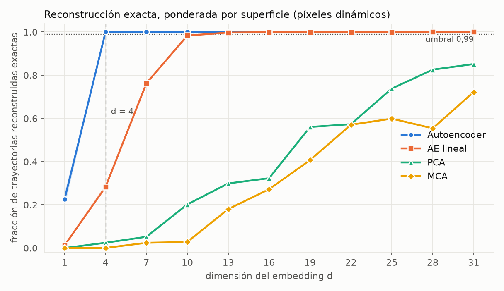
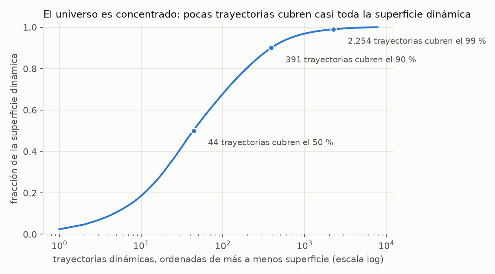
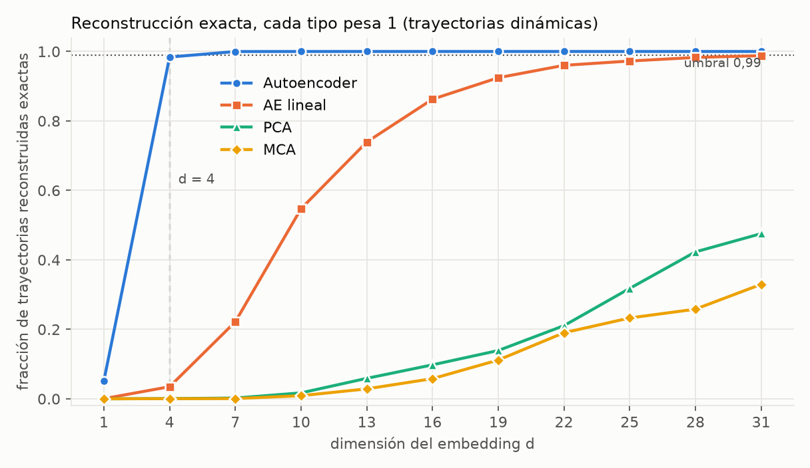
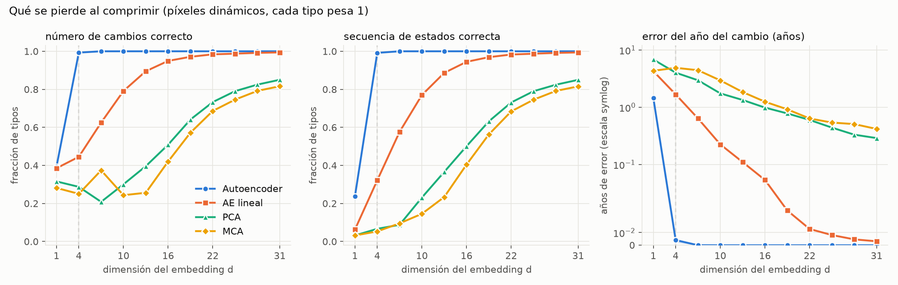
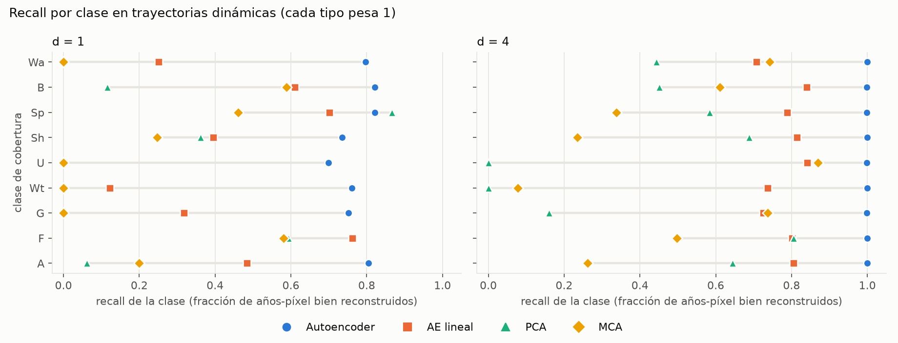
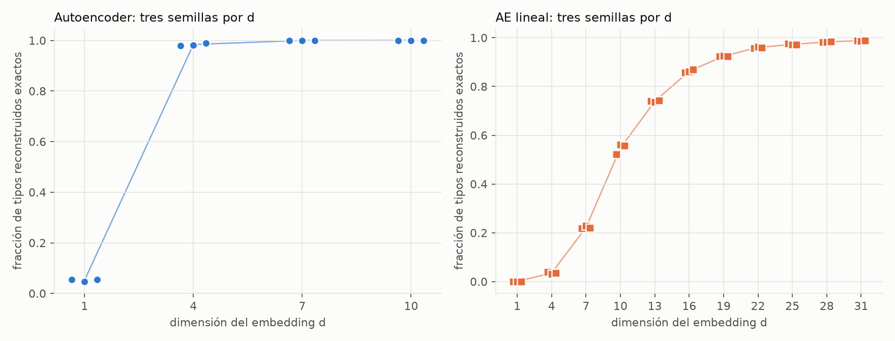
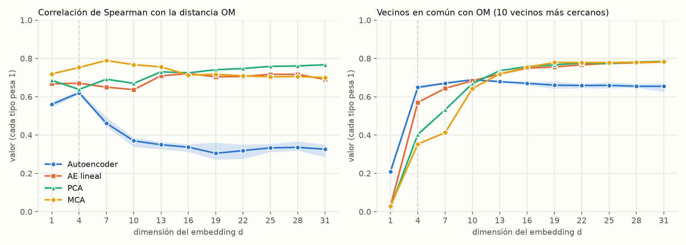

# P1: compresión de las trayectorias de cobertura, Argentina 1992-2022 (resultados)

**Fecha:** 2026-10-08. Ejecuta la pregunta P1 de [`plan.md`](plan.md) §3 sobre el período de 31 años. Reemplaza al informe de P1 de 2000-2022, archivado en el tag `v3-2000-2022`.

**Código y artefactos**
- Entrenamiento y métricas: `scripts/modelo/p1_compresion.py` (subcomandos `om`, `linear`, `train`, `linae`, `eval`); lanzador en paralelo: `scripts/modelo/p1_correr_ae.py`; figuras: `scripts/viz/p1_figuras.py`.
- Métricas: `data/autoencoder_v3/p1_metricas.csv` (8.800 filas: método × d × semilla × subconjunto × ponderación × métrica) y `p1_entropia.csv`.
- Modelos: `models/autoencoder_v3/p1/` (33 autoencoders con su `z`, su reconstrucción, sus pesos y su historia de pérdida; 33 autoencoders lineales; PCA y MCA para cada d). Distancia OM: `data/autoencoder_v3/p1/om_trate.npy` (7.827², 245 MB, no versionar fuera de LFS).
- Figuras: `docs/autoencoder_v3/figuras/p1/`.

---

## 1. Resumen

1. **Con d = 4 el autoencoder reconstruye exactamente el 99,99 % de la superficie dinámica y el 98,4 % de los tipos dinámicos** (cada trayectoria distinta cuenta una vez). Es una compresión de 31 estados por píxel a 4 números reales. Se adopta **d = 4** (decisión del 2026-10-08).
2. **La regla de d\* fijada a priori** (menor d con al menos 99 % de la superficie dinámica reconstruida exacta) da **d\* = 4 para el autoencoder** y **d\* = 13 para el autoencoder lineal**. PCA y MCA no la cumplen ni con d = 31 (85 % y 72 %). La grilla avanza de a 3 (1, 4, 7, …, 31), de modo que **no resuelve entre d = 2, 3 y 4**: se afirma que d = 4 *alcanza*, no que sea el mínimo.
3. **Por tipo hace falta algo más:** el autoencoder pasa el 99 % con d = 7 (99,98 %); con d = 4 queda en 98,4 % (entre 98,0 y 99,0 % según la semilla). El autoencoder lineal sólo llega a 98,8 % con d = 31.
4. **Qué se pierde primero** al bajar d: con d = 1 el autoencoder aún acierta el 78 % de los años por tipo, pero sólo el 24 % de las secuencias de estados y el 39 % del número de cambios; el error del año del cambio es de ~1,5 años. Con d ≥ 4 estos errores desaparecen.
5. **Las semillas no importan desde d = 4:** el autoencoder da lo mismo con las tres semillas en superficie (rango 0,00003) y varía ±0,5 puntos por tipo. El ruido sólo es grande en d = 1.
6. **Las costuras no afectan la fidelidad:** quitar los tipos con cambio en 1994/95 o 2015/16 mueve la reconstrucción exacta a lo sumo ~1 punto.
7. **El autoencoder no mantiene la geometría de OM** cuando d crece. Ponderado por tipo, el Spearman con OM del autoencoder baja de 0,62 (d = 4) a ~0,33 (d ≥ 13), mientras PCA, MCA y el AE lineal quedan en 0,64–0,79. En vecinos en común el autoencoder gana en d bajo (d = 4 y 7) y pierde a partir de d = 13 (0,65–0,68 contra 0,72–0,78).
8. **Advertencia sobre lo que mide P1.** Reconstruir exacto mide *capacidad*, no *estructura*: para distinguir 7.827 tipos hacen falta ~13 bits y 4 números reales alcanzan para indexarlos. El valor de P1 está en las curvas de d bajo y en la comparación contra las alternativas lineales, no en que el autoencoder llegue a 1,0.



---

## 2. Lógica del análisis

### 2.1 La pregunta
P1 pregunta: **¿cuánta información de las trayectorias de cobertura se conserva cuando cada trayectoria se resume en un vector de d números?** Interesa saber (a) qué d hace falta, (b) qué se pierde primero cuando d es insuficiente y (c) si un autoencoder no lineal conserva más que alternativas lineales de la misma dimensión.

No es una pregunta predictiva. No se pregunta si el modelo funciona con datos nuevos, sino cuánta información del universo observado cabe en d dimensiones. Por eso se ajusta y se evalúa sobre el mismo universo, sin partición de validación (ver §7).

### 2.2 El universo: trayectorias distintas, no píxeles
Una **trayectoria** es la secuencia de estados de un píxel durante 31 años (1992-2022). Los estados son 9 clases de cobertura agrupadas desde la leyenda LCCS de ESA CCI, más `Nd` (sin dato), que no aparece:

| Token | Clase |
|---|---|
| A | cultivos y mosaicos con cultivo |
| F | bosque (incluye mosaico árbol-arbusto y bosque inundado) |
| G | herbáceas y pastizal |
| Wt | humedal (vegetación inundada) |
| U | urbano |
| Sh | arbustal |
| Sp | vegetación rala (líquenes, musgos) |
| B | suelo desnudo |
| Wa | agua, nieve y hielo |

El censo de Argentina (36.084.989 píxeles) tiene sólo **7.827 trayectorias distintas**. Cada una es un **tipo**, y lleva asociado `n_px`, la cantidad de píxeles que la comparten. Trabajar con tipos y no con píxeles hace el problema enumerable y evita entrenar sobre millones de filas repetidas.

| Medida | Valor |
|---|---:|
| Píxeles en Argentina | 36.084.989 |
| Trayectorias distintas (tipos) | **7.827** |
| Constantes (31 años iguales) | 9 tipos, 93,5 % de la superficie |
| Dinámicas (al menos un cambio) | 7.818 tipos, 2.346.420 px (6,5 %) |
| Tipos de un solo píxel | 1.729 |
| Máximo de cambios por trayectoria | 4 (1 cambio: 1.380 tipos; 2: 5.950; 3: 487; 4: 1) |
| Tipos que cubren el 50 / 90 / 99 % de la superficie dinámica | 44 / 391 / 2.254 |
| Tipos con un cambio en 1994/95 o 2015/16 (`costura`) | 1.271 (7,7 % de los píxeles dinámicos) |
| Tipos con un cambio en 1998/99 o 1999/00 (`sensor`) | 1.588 (17,2 % de los píxeles dinámicos) |



La concentración importa para leer los resultados: **44 tipos cubren la mitad de la superficie dinámica, pero hay 1.729 tipos de un solo píxel.** Una métrica ponderada por superficie mira sobre todo a los pocos tipos frecuentes; una ponderada por tipo mira a todos por igual, y está dominada por la cola larga de tipos raros. Se reportan las dos.

**Las costuras del producto.** Los mapas de 1992-1994 son prácticamente el mismo mapa en todo el planeta (entre 1992 y 1993 cambian 498.096 de 8.398 millones de píxeles; entre 1993 y 1994, 157.175; entre 1994 y 1995, 6,4 millones). ESA CCI arma la serie retropolando un mapa base de 2003-2012 con cambios detectados por AVHRR a 1 km, que sólo confirma un cambio si persiste más de dos años. Además hay un salto de versión del producto entre 2015 (v2.0.7cds) y 2016 (C3S v2.1.1). Por eso se marcan los tipos con un cambio en 1994/95 y 2015/16 (`costura`) y, aparte, los de 1998/99 y 1999/00, donde cambia el sensor (`sensor`, sensibilidad). **Las marcas no cambian el entrenamiento**: sólo permiten recalcular las métricas sobre el subconjunto sin costura.

### 2.3 La entrada: el one-hot
Cada trayectoria es un vector de 31 estados. Para los métodos lineales se expande a **one-hot**: 31 años × 11 tokens del vocabulario (incluye `[UNK]` y `Nd`) = **341 columnas** de ceros y unos, con un solo 1 por año. De esas 341, 62 nunca valen 1 (tokens que no aparecen). El autoencoder recibe la secuencia de 31 enteros directamente.

### 2.4 Los cuatro métodos y qué los distingue

| Método | Se entrena | Lineal | Reconstrucción | Para qué sirve en la comparación |
|---|---|---|---|---|
| **AE** (autoencoder) | sí, con entropía cruzada por año | no (transformer) | argmax por año del decodificador | Es el modelo de interés |
| **AE lineal** | sí, con la **misma pérdida** y los mismos pesos | sí (una capa en cada sentido) | argmax por año | Separa el efecto de la *no linealidad* del efecto de *entrenar con una pérdida categórica* |
| **PCA** | no (descomposición en valores singulares ponderada) | sí | argmax del one-hot reconstruido | Línea de base clásica |
| **MCA** | no (análisis de correspondencias múltiples ponderado) | sí | argmax de las probabilidades reconstruidas | Línea de base clásica para variables categóricas |

La comparación contra el AE lineal es la que importa: PCA y MCA no optimizan una pérdida categórica, así que compararlos solos contra el AE confunde dos cosas (la no linealidad y el criterio de ajuste). El AE lineal las separa.

**Detalles del autoencoder.** Codificador: embedding de estado más embedding de posición (año), 2 bloques transformer (128 de ancho, 4 cabezas), *pooling* por un query aprendido y una capa lineal a d dimensiones. Decodificador: la capa lineal inversa, se repite sobre los 31 años con embedding de posición, 2 bloques transformer y una cabeza que comparte pesos con el embedding. Unos 0,8 millones de parámetros (798.212 con d = 4; 805.151 con d = 31). Sin *dropout*. AdamW (lr 1e-3, decaimiento 1e-2), 20 épocas de calentamiento y descenso coseno, recorte de gradiente 1,0, **400 épocas con lote de 128** (62 pasos por época, unos 24.800 pasos). El AE lineal usa Adam (lr 1e-2), 3.000 pasos con todo el conjunto.

**Pesos de ajuste.** Los cuatro métodos usan el peso **min(n_px, 100)**, para que las 9 constantes (93,5 % de la superficie) no dominen la pérdida. Con ese tope el universo equivale a unos 2.400 tipos de peso igual.

### 2.5 La grilla: dimensiones y semillas
- **d ∈ {1, 4, 7, 10, 13, 16, 19, 22, 25, 28, 31}** (11 valores, paso 3). La grilla anterior (1, 2, 3, 4, 6, 8, 12, 16) se descartó porque con 31 años podía hacer falta un d mayor.
- **Semillas 0, 1, 2** para el AE y el AE lineal: 33 modelos de cada uno. PCA y MCA son determinísticos (una corrida por d).
- Total: 33 + 33 + 11 + 11 = **88 modelos**, más la distancia OM.

### 2.6 La reconstrucción y las métricas de fidelidad
Para cada trayectoria se comprime a d números y se reconstruye. La reconstrucción toma, **para cada año, el estado de mayor puntaje** (el token `[UNK]` nunca se elige). Luego se compara con la trayectoria original. Todas las métricas se calculan **por trayectoria** y después se promedian:

| Métrica | Qué mide | Cómo se define |
|---|---|---|
| `acc_anio` | Años bien reconstruidos | Fracción de los 31 años con el estado correcto |
| `exacta` | Trayectoria entera correcta | 1 si los 31 años son correctos, 0 en otro caso |
| `n_cambios_ok` | Número de cambios | 1 si la reconstrucción tiene tantos cambios como la original |
| `estados_ok` | Secuencia de estados | 1 si los estados sucesivos coinciden (por ejemplo F→A), sin mirar *cuándo* ocurre cada cambio |
| `err_anio_cambio` | Error de fechado | Media del error absoluto, en años, entre el año del cambio original y el reconstruido; **sólo se calcula si `estados_ok` vale 1** |
| `macro_f1` | Equilibrio entre clases | F1 macro de las 9 clases presentes, sobre los años-píxel aplanados |
| `recall_<clase>` | Cuánto de cada clase se conserva | Recall de esa clase sobre los años-píxel aplanados |

Las métricas están ordenadas de menos a más exigente: `acc_anio` perdona errores sueltos; `exacta` no perdona ninguno; `estados_ok`, `n_cambios_ok` y `err_anio_cambio` separan *qué* pasó de *cuándo* pasó.

**Cuidado con `err_anio_cambio`.** Como sólo se calcula donde la secuencia de estados es correcta, para métodos que fallan mucho (PCA y MCA con d bajo) se promedia sobre una minoría de trayectorias, las que salieron bien. Un valor chico en PCA/MCA con d bajo no significa que fechen bien: significa que fechan bien las pocas que reconstruyen con los estados correctos.

### 2.7 Ponderaciones y subconjuntos
Cada métrica se reporta con dos ponderaciones:
- **`px` (superficie):** cada tipo pesa su número de píxeles. Responde a "¿qué fracción del territorio dinámico se reconstruye bien?". Está dominada por unos pocos tipos frecuentes.
- **`tipo`:** cada tipo pesa 1. Responde a "¿qué fracción de las dinámicas distintas se reconstruye bien?". Está dominada por la cola larga de tipos raros.

Y sobre cuatro subconjuntos: `todas`, `dinamicas` (el principal), `constantes` y `sin_costura` (excluye los tipos con cambio en 1994/95 o 2015/16, **sin reentrenar**: sólo se recalculan las métricas). Las constantes son sólo 9 tipos y pesan 93,5 % de la superficie, por eso el análisis central usa las **dinámicas**.

### 2.8 La regla de d\*, fijada antes de mirar los resultados
> **d\* es el menor d de la grilla para el cual la media entre semillas de la reconstrucción exacta, ponderada por superficie, sobre los píxeles dinámicos, es al menos 0,99.**

Se reporta además la curva completa de fidelidad contra d, y la misma regla por tipo y con la peor semilla, para ver cuánto depende la conclusión de la ponderación y del azar.

### 2.9 Preservación de la estructura de OM
Además de reconstruir, interesa si las distancias en el espacio comprimido se parecen a las de **OM** (distancia de alineamiento óptimo entre secuencias, calculada con `seqdist` sobre los 7.827 tipos). Se miden dos cosas:
- **Spearman:** correlación de rangos entre la distancia en z y la distancia OM, sobre 2 millones de pares de tipos muestreados al azar (con la ponderación indicada).
- **Vecinos en común (kNN10):** de los 10 vecinos más cercanos de cada tipo según OM, cuántos siguen entre los 10 más cercanos en z (promedio sobre tipos).

Esta medida **no es neutral**: usa OM como referencia, y el autoencoder no se entrenó para preservarla. Mide hasta qué punto el espacio aprendido *coincide* con OM, no si es "mejor" que OM.

### 2.10 La entropía como escala de referencia
La entropía de la distribución de trayectorias da una idea de cuánta información hay que representar. Se calcula con cuatro distribuciones (por superficie, sólo dinámicas, con el tope de entrenamiento y uniforme sobre los tipos). Es una referencia de escala, no una cota exacta: un número real puede portar información arbitraria, de modo que comparar bits contra "números reales" sólo es heurístico.

### 2.11 Cómo se leen las curvas
Con 7.827 tipos y d hasta 31, un modelo con capacidad suficiente puede reconstruirlos todos. **Por eso el autoencoder llega a 1,0 y deja de discriminar a partir de d = 7.** Lo informativo es: (i) *dónde* empieza a funcionar (d bajo), (ii) cómo se compara con lo lineal a igual d, y (iii) qué estructura conserva además de reconstruir.

---

## 3. Montaje experimental

| Aspecto | Valor |
|---|---|
| Serie | `landcover_timeseries_1992-2022_rebuild.nc` (31 años), recorte rectangular; censo dentro del polígono de Argentina |
| Universo | `data/autoencoder_v3/universo_argentina.csv`, 7.827 tipos |
| Peso de ajuste | min(n_px, 100) |
| Autoencoder | transformer, 128 de ancho, 2+2 bloques, ~0,8 M parámetros, 400 épocas, lote 128 |
| AE lineal | Adam lr 1e-2, 3.000 pasos |
| Semillas | 0, 1, 2 (AE y AE lineal) |
| d | 1, 4, 7, …, 31 |
| Equipo | GPU GTX 1060 de 6 GB, 3 a 4 modelos en paralelo; 517 a 2.103 s por modelo (9 a 35 min) |
| Ajuste y evaluación | mismo universo (sin partición) |

**Un problema de memoria resuelto durante la corrida.** La codificación final de las 7.827 trayectorias se hacía de una vez y con 4 procesos simultáneos agotaba los 6 GB de la GPU (`CUDA out of memory`), después de entrenar. Dos modelos (d = 1 y d = 7, semilla 0) se perdieron y se repitieron. Desde entonces la codificación final se hace por bloques de 512; el resultado es numéricamente igual (diferencia máxima de z de 2×10⁻⁷, reconstrucción idéntica).

---

## 4. Resultados

### 4.1 La regla de d\*

| ponderación | método | d* (media ≥ 0,99) | d* (peor semilla ≥ 0,99) | valor en d = 31 |
|--:|--:|--:|--:|--:|
| superficie | AE | 4 | 4 | 1,0000 |
| superficie | AE lineal | 13 | 13 | 0,9999 |
| superficie | PCA | — | — | 0,8516 |
| superficie | MCA | — | — | 0,7219 |
| tipo | AE | 7 | 7 | 1,0000 |
| tipo | AE lineal | — | — | 0,9880 |
| tipo | PCA | — | — | 0,4756 |
| tipo | MCA | — | — | 0,3296 |

Reconstrucción exacta de las trayectorias dinámicas, **ponderada por superficie** (media entre semillas):

| d | AE | AE lineal | PCA | MCA |
|--:|--:|--:|--:|--:|
| 1 | 0,2263 | 0,0124 | 0,0000 | 0,0001 |
| 4 | 0,9999 | 0,2827 | 0,0244 | 0,0003 |
| 7 | 1,0000 | 0,7629 | 0,0520 | 0,0242 |
| 10 | 1,0000 | 0,9834 | 0,2018 | 0,0280 |
| 13 | 1,0000 | 0,9974 | 0,2989 | 0,1800 |
| 16 | 1,0000 | 0,9991 | 0,3232 | 0,2721 |
| 19 | 1,0000 | 0,9996 | 0,5603 | 0,4069 |
| 22 | 1,0000 | 0,9998 | 0,5732 | 0,5706 |
| 25 | 1,0000 | 0,9999 | 0,7381 | 0,5990 |
| 28 | 1,0000 | 0,9999 | 0,8257 | 0,5539 |
| 31 | 1,0000 | 0,9999 | 0,8516 | 0,7219 |

- El autoencoder cumple la regla en **d = 4** (0,9999) y no la cumple en d = 1 (0,226).
- El AE lineal la cumple en d = 13 (0,9974). Con d = 10 está en 0,983.
- PCA y MCA no la cumplen con ningún d de la grilla: con d = 31 llegan a 0,85 y 0,72.
- Entre d = 1 y d = 4 hay un salto de 0,23 a 0,9999. **La grilla no resuelve qué pasa con d = 2 y d = 3**, así que d\* ∈ {2, 3, 4}.

### 4.2 La misma curva, por tipo



| d | AE | AE lineal | PCA | MCA |
|--:|--:|--:|--:|--:|
| 1 | 0,0518 | 0,0005 | 0,0000 | 0,0001 |
| 4 | 0,9840 | 0,0349 | 0,0006 | 0,0005 |
| 7 | 0,9998 | 0,2218 | 0,0023 | 0,0008 |
| 10 | 1,0000 | 0,5473 | 0,0171 | 0,0091 |
| 13 | 1,0000 | 0,7394 | 0,0590 | 0,0287 |
| 16 | 1,0000 | 0,8626 | 0,0979 | 0,0581 |
| 19 | 1,0000 | 0,9244 | 0,1390 | 0,1117 |
| 22 | 1,0000 | 0,9601 | 0,2107 | 0,1902 |
| 25 | 1,0000 | 0,9725 | 0,3179 | 0,2328 |
| 28 | 1,0000 | 0,9828 | 0,4230 | 0,2581 |
| 31 | 1,0000 | 0,9880 | 0,4756 | 0,3296 |

Por tipo la exigencia es mayor, porque los tipos raros (la mayoría) cuentan igual que los frecuentes:
- El autoencoder llega al 98,4 % con d = 4 y al 99,98 % con d = 7. **Con la regla aplicada por tipo, d\* sería 7.**
- El AE lineal alcanza el 98,8 % con d = 31, de modo que **por tipo no cumple la regla en ningún d** de la grilla.
- PCA y MCA llegan al 48 % y 33 % con d = 31.

La diferencia entre superficie y tipo (99,99 % contra 98,4 % con d = 4) quiere decir que **con d = 4 el autoencoder falla en ~1,6 % de los tipos, casi todos raros**, que en conjunto suman una fracción minúscula del territorio.

### 4.3 Qué se pierde primero



Por tipo (trayectorias dinámicas, media entre semillas):

**Años correctos (`acc_anio`)**

| d | AE | AE lineal | PCA | MCA |
|--:|--:|--:|--:|--:|
| 1 | 0,7753 | 0,4935 | 0,3056 | 0,3003 |
| 4 | 0,9993 | 0,7886 | 0,5377 | 0,4343 |
| 7 | 1,0000 | 0,9094 | 0,6645 | 0,5869 |
| 10 | 1,0000 | 0,9653 | 0,7811 | 0,7200 |
| 13 | 1,0000 | 0,9854 | 0,8561 | 0,8185 |
| 16 | 1,0000 | 0,9935 | 0,8961 | 0,8726 |
| 19 | 1,0000 | 0,9968 | 0,9269 | 0,9128 |
| 22 | 1,0000 | 0,9984 | 0,9489 | 0,9424 |
| 25 | 1,0000 | 0,9990 | 0,9632 | 0,9535 |
| 28 | 1,0000 | 0,9994 | 0,9717 | 0,9594 |
| 31 | 1,0000 | 0,9996 | 0,9762 | 0,9663 |

**Número de cambios correcto (`n_cambios_ok`)**

| d | AE | AE lineal | PCA | MCA |
|--:|--:|--:|--:|--:|
| 1 | 0,393 | 0,385 | 0,316 | 0,282 |
| 4 | 0,993 | 0,445 | 0,287 | 0,250 |
| 7 | 1,000 | 0,625 | 0,208 | 0,374 |
| 10 | 1,000 | 0,791 | 0,301 | 0,243 |
| 13 | 1,000 | 0,895 | 0,396 | 0,256 |
| 16 | 1,000 | 0,949 | 0,509 | 0,421 |
| 19 | 1,000 | 0,971 | 0,641 | 0,572 |
| 22 | 1,000 | 0,984 | 0,733 | 0,686 |
| 25 | 1,000 | 0,988 | 0,790 | 0,746 |
| 28 | 1,000 | 0,992 | 0,825 | 0,792 |
| 31 | 1,000 | 0,994 | 0,850 | 0,816 |

**Secuencia de estados correcta (`estados_ok`)**

| d | AE | AE lineal | PCA | MCA |
|--:|--:|--:|--:|--:|
| 1 | 0,237 | 0,062 | 0,032 | 0,032 |
| 4 | 0,992 | 0,322 | 0,067 | 0,053 |
| 7 | 1,000 | 0,576 | 0,088 | 0,095 |
| 10 | 1,000 | 0,770 | 0,231 | 0,146 |
| 13 | 1,000 | 0,887 | 0,366 | 0,234 |
| 16 | 1,000 | 0,945 | 0,501 | 0,404 |
| 19 | 1,000 | 0,969 | 0,632 | 0,563 |
| 22 | 1,000 | 0,983 | 0,731 | 0,684 |
| 25 | 1,000 | 0,987 | 0,790 | 0,745 |
| 28 | 1,000 | 0,991 | 0,824 | 0,792 |
| 31 | 1,000 | 0,994 | 0,850 | 0,816 |

**Error del año del cambio, en años (`err_anio_cambio`, sólo donde `estados_ok` = 1)**

| d | AE | AE lineal | PCA | MCA |
|--:|--:|--:|--:|--:|
| 1 | 1,457 | 4,288 | 6,849 | 4,344 |
| 4 | 0,004 | 1,682 | 4,034 | 4,907 |
| 7 | 0,000 | 0,639 | 2,969 | 4,451 |
| 10 | 0,000 | 0,225 | 1,752 | 2,954 |
| 13 | 0,000 | 0,110 | 1,343 | 1,848 |
| 16 | 0,000 | 0,054 | 0,988 | 1,252 |
| 19 | 0,000 | 0,027 | 0,781 | 0,921 |
| 22 | 0,000 | 0,013 | 0,601 | 0,638 |
| 25 | 0,000 | 0,008 | 0,441 | 0,541 |
| 28 | 0,000 | 0,005 | 0,332 | 0,509 |
| 31 | 0,000 | 0,003 | 0,290 | 0,418 |

**F1 macro (9 clases)**

| d | AE | AE lineal | PCA | MCA |
|--:|--:|--:|--:|--:|
| 1 | 0,776 | 0,410 | 0,160 | 0,186 |
| 4 | 0,999 | 0,792 | 0,397 | 0,452 |
| 7 | 1,000 | 0,909 | 0,533 | 0,619 |
| 10 | 1,000 | 0,964 | 0,728 | 0,731 |
| 13 | 1,000 | 0,984 | 0,843 | 0,819 |
| 16 | 1,000 | 0,993 | 0,889 | 0,871 |
| 19 | 1,000 | 0,997 | 0,920 | 0,910 |
| 22 | 1,000 | 0,998 | 0,946 | 0,942 |
| 25 | 1,000 | 0,999 | 0,960 | 0,955 |
| 28 | 1,000 | 0,999 | 0,969 | 0,961 |
| 31 | 1,000 | 1,000 | 0,974 | 0,967 |

Lectura:
1. **Lo que se pierde primero al bajar d es la secuencia de estados y el número de cambios**, no los años sueltos. Con d = 1 el autoencoder acierta el 78 % de los años (`acc_anio` 0,775) pero sólo el 24 % de las secuencias de estados y el 39 % del número de cambios. Una trayectoria con "casi todos los años bien" puede tener la historia equivocada.
2. **Con d = 1 el autoencoder fecha mal el cambio** (1,5 años de error medio por tipo) y el AE lineal peor (4,3).
3. **A partir de d = 4 el autoencoder pierde menos del 1 % de los tipos** en estas métricas (secuencia de estados 0,992 y número de cambios 0,993 con d = 4; 1,000 con d = 7) y el error de fechado es 0,004 años con d = 4 y 0,0001 con d = 7.
4. **El AE lineal necesita unos 3 d más para cada nivel:** por ejemplo, 0,96 de `acc_anio` por tipo en d = 10, que el AE alcanza con d = 4 (0,9993).
5. La métrica ponderada por superficie da el mismo orden con valores más altos (tablas del anexo A.1).

### 4.4 Qué clases se conservan



Recall por clase en trayectorias dinámicas, por tipo, con **d = 1**:

| clase | AE | AE lineal | PCA | MCA |
|--:|--:|--:|--:|--:|
| A | 0,805 | 0,484 | 0,061 | 0,200 |
| F | 0,764 | 0,762 | 0,594 | 0,581 |
| G | 0,752 | 0,318 | 0,000 | 0,000 |
| Wt | 0,761 | 0,122 | 0,000 | 0,000 |
| U | 0,699 | 0,000 | 0,000 | 0,000 |
| Sh | 0,735 | 0,396 | 0,362 | 0,247 |
| Sp | 0,821 | 0,701 | 0,866 | 0,461 |
| B | 0,821 | 0,611 | 0,115 | 0,588 |
| Wa | 0,797 | 0,251 | 0,000 | 0,000 |

Con **d = 4**:

| clase | AE | AE lineal | PCA | MCA |
|--:|--:|--:|--:|--:|
| A | 0,999 | 0,805 | 0,644 | 0,262 |
| F | 1,000 | 0,802 | 0,805 | 0,498 |
| G | 0,999 | 0,726 | 0,161 | 0,737 |
| Wt | 0,999 | 0,738 | 0,000 | 0,077 |
| U | 0,999 | 0,842 | 0,000 | 0,870 |
| Sh | 0,999 | 0,815 | 0,689 | 0,235 |
| Sp | 0,999 | 0,789 | 0,584 | 0,338 |
| B | 0,999 | 0,840 | 0,451 | 0,611 |
| Wa | 1,000 | 0,708 | 0,443 | 0,742 |

- Con d = 1 el autoencoder conserva todas las clases con un recall de 0,70 a 0,82, incluidas las raras (Wa, B, U, Wt). PCA y MCA pierden por completo U, Wt, Wa y G (recall 0); el AE lineal pierde U (0) y conserva poco Wt (0,12) y Wa (0,25).
- Con d = 4 el autoencoder llega a 0,999–1,000 en todas las clases; el AE lineal queda entre 0,71 y 0,84; PCA y MCA entre 0 y 0,87.
- **El fallo de los métodos lineales con d bajo se concentra en las clases raras** (U, Wt, Wa, G). F, la clase dominante, se conserva relativamente bien incluso con métodos lineales (0,58–0,76 con d = 1).

### 4.5 Ruido entre semillas



Autoencoder, trayectorias dinámicas (media y rango entre las tres semillas):

| d | superficie: media | superficie: mín–máx | tipo: media | tipo: mín–máx |
|--:|--:|--:|--:|--:|
| 1 | 0,2263 | 0,1957–0,2584 | 0,0518 | 0,0473–0,0542 |
| 4 | 0,9999 | 0,9999–1,0000 | 0,9840 | 0,9799–0,9900 |
| 7 | 1,0000 | 1,0000–1,0000 | 0,9998 | 0,9996–1,0000 |
| 10 | 1,0000 | 1,0000–1,0000 | 1,0000 | 0,9999–1,0000 |
| 13 | 1,0000 | 1,0000–1,0000 | 1,0000 | 1,0000–1,0000 |
| 16 | 1,0000 | 1,0000–1,0000 | 1,0000 | 1,0000–1,0000 |
| 19 | 1,0000 | 1,0000–1,0000 | 1,0000 | 1,0000–1,0000 |
| 22 | 1,0000 | 1,0000–1,0000 | 1,0000 | 1,0000–1,0000 |
| 25 | 1,0000 | 1,0000–1,0000 | 1,0000 | 1,0000–1,0000 |
| 28 | 1,0000 | 1,0000–1,0000 | 1,0000 | 1,0000–1,0000 |
| 31 | 1,0000 | 1,0000–1,0000 | 1,0000 | 1,0000–1,0000 |

AE lineal:

| d | superficie: media | superficie: mín–máx | tipo: media | tipo: mín–máx |
|--:|--:|--:|--:|--:|
| 1 | 0,0124 | 0,0123–0,0125 | 0,0005 | 0,0004–0,0005 |
| 4 | 0,2827 | 0,2507–0,3129 | 0,0349 | 0,0311–0,0393 |
| 7 | 0,7629 | 0,7364–0,8098 | 0,2218 | 0,2173–0,2276 |
| 10 | 0,9834 | 0,9738–0,9885 | 0,5473 | 0,5220–0,5624 |
| 13 | 0,9974 | 0,9973–0,9975 | 0,7394 | 0,7360–0,7417 |
| 16 | 0,9991 | 0,9990–0,9992 | 0,8626 | 0,8567–0,8698 |
| 19 | 0,9996 | 0,9996–0,9996 | 0,9244 | 0,9234–0,9256 |
| 22 | 0,9998 | 0,9998–0,9998 | 0,9601 | 0,9578–0,9633 |
| 25 | 0,9999 | 0,9998–0,9999 | 0,9725 | 0,9708–0,9756 |
| 28 | 0,9999 | 0,9999–0,9999 | 0,9828 | 0,9820–0,9838 |
| 31 | 0,9999 | 0,9999–0,9999 | 0,9880 | 0,9863–0,9889 |

- Para el autoencoder el ruido **sólo importa en d = 1** (por superficie, de 0,196 a 0,258) y en d = 4 por tipo (de 0,980 a 0,990). Desde d = 7 la diferencia entre semillas es menor a 0,0005.
- Por superficie con d = 4 las tres semillas dan 0,99993–0,99997. **La regla de d\* da el mismo resultado con la peor semilla.**
- El AE lineal tiene un ruido pequeño pero no nulo (hasta ±2 puntos por tipo en d = 10); las diferencias contra el autoencoder son mucho mayores que ese ruido.
- Esta medida es el ruido de **inicialización** con el mismo universo y los mismos hiperparámetros. No cubre la variación por hiperparámetros ni por muestreo del universo.

### 4.6 Subconjuntos: constantes y dinámicas

Reconstrucción exacta por superficie según subconjunto:

| subconjunto | d | AE | AE lineal | PCA | MCA |
|--:|--:|--:|--:|--:|--:|
| todas | 1 | 0,4181 | 0,2931 | 0,0000 | 0,0000 |
| todas | 4 | 1,0000 | 0,9534 | 0,4382 | 0,0445 |
| todas | 7 | 1,0000 | 0,9846 | 0,9101 | 0,2894 |
| todas | 10 | 1,0000 | 0,9989 | 0,9467 | 0,9354 |
| todas | 16 | 1,0000 | 0,9999 | 0,9546 | 0,9512 |
| todas | 31 | 1,0000 | 1,0000 | 0,9889 | 0,9819 |
| constantes (9 tipos) | 1 | 0,4314 | 0,3126 | 0,0000 | 0,0000 |
| constantes (9 tipos) | 4 | 1,0000 | 1,0000 | 0,4670 | 0,0476 |
| constantes (9 tipos) | 7 | 1,0000 | 1,0000 | 0,9698 | 0,3079 |
| constantes (9 tipos) | 10 | 1,0000 | 1,0000 | 0,9985 | 0,9985 |
| constantes (9 tipos) | 16 | 1,0000 | 1,0000 | 0,9985 | 0,9985 |
| constantes (9 tipos) | 31 | 1,0000 | 1,0000 | 0,9985 | 1,0000 |
| dinámicas | 1 | 0,2263 | 0,0124 | 0,0000 | 0,0001 |
| dinámicas | 4 | 0,9999 | 0,2827 | 0,0244 | 0,0003 |
| dinámicas | 7 | 1,0000 | 0,7629 | 0,0520 | 0,0242 |
| dinámicas | 10 | 1,0000 | 0,9834 | 0,2018 | 0,0280 |
| dinámicas | 16 | 1,0000 | 0,9991 | 0,3232 | 0,2721 |
| dinámicas | 31 | 1,0000 | 0,9999 | 0,8516 | 0,7219 |

Las constantes son 9 tipos y se reconstruyen exactas con d ≥ 4 (autoencoder y AE lineal). Por eso **la fidelidad sobre "todas" está inflada por las constantes** y el análisis principal se hace sobre las dinámicas. PCA queda en 0,9985 en las constantes: no reconstruye bien parte de la superficie constante.

### 4.7 Costuras

Reconstrucción exacta de las dinámicas, con y sin los tipos de `costura` (1994/95 y 2015/16), sin reentrenar:

| ponderación | d | AE con | AE sin | AE lineal con | AE lineal sin |
|--:|--:|--:|--:|--:|--:|
| tipo | 1 | 0,0518 | 0,0578 | 0,0005 | 0,0006 |
| tipo | 4 | 0,9840 | 0,9850 | 0,0349 | 0,0359 |
| tipo | 7 | 0,9998 | 0,9999 | 0,2218 | 0,2273 |
| tipo | 10 | 1,0000 | 0,9999 | 0,5473 | 0,5567 |
| tipo | 16 | 1,0000 | 1,0000 | 0,8626 | 0,8653 |
| tipo | 31 | 1,0000 | 1,0000 | 0,9880 | 0,9888 |
| superficie | 1 | 0,2263 | 0,2360 | 0,0124 | 0,0134 |
| superficie | 4 | 0,9999 | 1,0000 | 0,2827 | 0,2857 |
| superficie | 7 | 1,0000 | 1,0000 | 0,7629 | 0,7571 |
| superficie | 10 | 1,0000 | 1,0000 | 0,9834 | 0,9836 |
| superficie | 16 | 1,0000 | 1,0000 | 0,9991 | 0,9992 |
| superficie | 31 | 1,0000 | 1,0000 | 0,9999 | 1,0000 |

La diferencia es **de un punto o menos** en todos los casos (por ejemplo, autoencoder por tipo con d = 4: 0,984 con costura y 0,985 sin ella). El autoencoder no tiene dificultad especial para reconstruir las trayectorias de las costuras. No se hizo el mismo cálculo para `sensor` (no está en el CSV de métricas).

### 4.8 Estructura: ¿se parece el espacio comprimido a OM?



**Spearman con OM, cada tipo pesa 1**

| d | AE | AE lineal | PCA | MCA | AE: desvío entre semillas |
|--:|--:|--:|--:|--:|--:|
| 1 | 0,560 | 0,668 | 0,686 | 0,719 | 0,015 |
| 4 | 0,621 | 0,671 | 0,638 | 0,753 | 0,009 |
| 7 | 0,462 | 0,650 | 0,692 | 0,789 | 0,027 |
| 10 | 0,370 | 0,637 | 0,670 | 0,767 | 0,027 |
| 13 | 0,349 | 0,709 | 0,730 | 0,756 | 0,021 |
| 16 | 0,337 | 0,721 | 0,725 | 0,713 | 0,021 |
| 19 | 0,305 | 0,704 | 0,741 | 0,717 | 0,049 |
| 22 | 0,319 | 0,706 | 0,747 | 0,709 | 0,038 |
| 25 | 0,333 | 0,717 | 0,759 | 0,704 | 0,021 |
| 28 | 0,336 | 0,717 | 0,761 | 0,705 | 0,028 |
| 31 | 0,326 | 0,690 | 0,767 | 0,700 | 0,036 |

**Vecinos en común con OM (10 vecinos), cada tipo pesa 1**

| d | AE | AE lineal | PCA | MCA | AE: desvío entre semillas |
|--:|--:|--:|--:|--:|--:|
| 1 | 0,210 | 0,029 | 0,023 | 0,029 | 0,002 |
| 4 | 0,649 | 0,570 | 0,403 | 0,353 | 0,010 |
| 7 | 0,671 | 0,644 | 0,532 | 0,413 | 0,004 |
| 10 | 0,689 | 0,684 | 0,669 | 0,643 | 0,003 |
| 13 | 0,679 | 0,719 | 0,736 | 0,719 | 0,005 |
| 16 | 0,670 | 0,749 | 0,757 | 0,753 | 0,008 |
| 19 | 0,660 | 0,756 | 0,767 | 0,779 | 0,019 |
| 22 | 0,659 | 0,767 | 0,776 | 0,778 | 0,012 |
| 25 | 0,659 | 0,774 | 0,774 | 0,778 | 0,016 |
| 28 | 0,655 | 0,777 | 0,781 | 0,780 | 0,011 |
| 31 | 0,654 | 0,782 | 0,785 | 0,783 | 0,024 |

Lectura (ponderación por tipo):
1. **Los métodos lineales mantienen la correlación con OM a cualquier d** (0,64–0,79). El autoencoder la mantiene en d bajo (0,56 en d = 1; 0,62 en d = 4) y luego **la pierde** (0,46 en d = 7; ~0,33 desde d = 13). Cuando el autoencoder dispone de más dimensiones, usa el espacio para reconstruir y no para ordenar las trayectorias como lo hace OM.
2. **En vecinos en común el autoencoder va primero y pierde después.** Gana con d = 4 y d = 7 (0,65 y 0,67 contra 0,57 y 0,64 del AE lineal y 0,40 y 0,53 de PCA), empata en d = 10 y queda por debajo desde d = 13 (0,65–0,68 contra 0,72–0,78). Esto es consistente con que los vecinos cercanos se preservan mejor que las distancias globales.
3. **Ponderado por superficie el resultado es inestable** (tabla A.2): el desvío entre semillas del Spearman del autoencoder llega a 0,18, y aparecen correlaciones negativas. Los pares muestreados por superficie quedan dominados por pares con tipos muy frecuentes y casi iguales entre sí, donde la distancia OM tiene muy poca variación. No se debe interpretar.
4. **Qué implica para P2.** Una tipología construida sobre z con d = 4 agrupará de manera parecida a OM en los vecinos inmediatos pero no en las distancias globales. Si se usa d grande en el autoencoder, la tipología se parece menos a OM.

Esta es una comparación contra OM, no contra "la verdad": que el autoencoder se aleje de OM no lo hace peor sin una referencia independiente (ver §7).

### 4.9 Entropía y capacidad

| distribución | bits | ≈ tipos equiprobables (2^bits) |
|--:|--:|--:|
| distribución de trayectorias ponderada por superficie (todas) | 3,17 | 9 |
| ídem, sólo dinámicas | 8,29 | 312 |
| ponderada por min(n_px, 100), la de entrenamiento | 11,64 | 3.194 |
| uniforme sobre los 7.827 tipos (log₂ 7.827) | 12,93 | 7.827 |

Distinguir los 7.827 tipos en forma uniforme requiere ~12,9 bits (log₂ 7.827). Ponderando por superficie, sólo las dinámicas, la entropía es 8,3 bits: equivale a elegir entre unos 313 tipos equiprobables. Es coherente con la concentración del universo.

Esto relativiza el resultado de d = 4: **un vector de 4 números reales tiene capacidad de sobra para indexar 7.827 tipos**. Que el autoencoder los reconstruya todos con d = 4 no prueba que el espacio de 4 dimensiones esté bien organizado. Prueba que es suficiente para *recuperar* cada trayectoria.

---

## 5. Comparación con el ejercicio 2000-2022

Cifras del informe archivado en el tag `v3-2000-2022`:

| Medida | 2000-2022 (4.554 tipos) | 1992-2022 (7.827 tipos) |
|---|---|---|
| AE, exacta por superficie, d = 4 | 0,997 | 0,9999 |
| AE, exacta por tipo, d = 4 | 0,641 | 0,984 |
| AE, exacta por tipo, d = 8 (antes) / d = 7 (ahora) | 0,880 | 0,9998 |
| AE lineal, exacta por tipo, d = 16 | 0,893 | 0,863 |
| PCA / MCA, exacta por tipo, d = 16 | 0,165 / 0,132 | 0,098 / 0,058 |
| Entropía uniforme (log₂ de los tipos) | 12,15 bits | 12,93 bits |

**Esta comparación no es limpia.** El ejercicio anterior entrenó el autoencoder con configuración distinta:

| | 2000-2022 | 1992-2022 |
|---|---|---|
| Ancho del modelo | 64 | 128 |
| Épocas | 300 | 400 |
| Lote | 256 | 128 |
| Pasos de entrenamiento (aprox.) | 5.400 (18 por época) | 24.800 (62 por época) |
| Grilla de d | 1, 2, 3, 4, 6, 8, 12, 16 | 1, 4, 7, …, 31 |

El autoencoder pasa de 0,64 a 0,98 por tipo con d = 4, y el AE lineal, que usó la misma configuración en ambos ejercicios, **casi no cambia** (0,89 y 0,86 con d = 16). Esto es coherente con que la mejora del autoencoder se deba sobre todo a **más capacidad y unas 4,6 veces más pasos de entrenamiento**, y no a los ocho años más. Es una lectura, no una conclusión: para separar los efectos hay que repetir el ejercicio con una sola configuración sobre los dos períodos, lo que no se hizo.

Consecuencia práctica: **d\* depende del presupuesto de entrenamiento.** Con menos pasos o menos capacidad, el mismo autoencoder necesitaría más dimensiones.

---

## 6. Conclusiones

1. **d = 4 es una elección suficiente** para el universo de Argentina 1992-2022: reconstruye el 99,99 % de la superficie dinámica y el 98,4 % de los tipos dinámicos exactos, sin pérdida de estados ni de fechado en promedio. La regla a priori da d\* = 4 (por superficie) y d\* = 7 (por tipo).
2. **El autoencoder comprime con unas 3 veces menos dimensiones que lo lineal** (d\* = 4 contra d\* = 13 por superficie) y PCA y MCA no llegan a comprimir sin pérdida en la grilla.
3. **La ventaja del autoencoder se concentra en d bajo** (d ≤ 7). A partir de d = 10 todo lo que importa se reconstruye exacto y el AE lineal lo alcanza por superficie.
4. **La fidelidad es robusta a las semillas y a las costuras** para d ≥ 4.
5. **El autoencoder no preserva la geometría global de OM** al aumentar d, aunque sí los vecinos más cercanos con d bajo. Esto hay que tenerlo presente en P2.
6. **La reconstrucción exacta mide capacidad.** No distingue un espacio organizado de uno que simplemente indexa los tipos. Las pruebas que sí discriminan (coherencia espacial, pares sintéticos con desfase, sondas lineales, análisis de desacuerdos) están pendientes (batería del Bloque C).

---

## 7. Límites

- **Sin partición de validación.** Se ajusta y se evalúa sobre las mismas 7.827 trayectorias. La pregunta es de compresión del universo observado, no de generalización.
- **La grilla de d no resuelve d < 4.** d\* ∈ {2, 3, 4}. Hay que correr d = 2 y d = 3 para fijarlo, si se quiere afirmar un mínimo.
- **La comparación con 2000-2022 está confundida** por el cambio de configuración (§5).
- **Un solo peso de ajuste** (tope 100) y una sola configuración del autoencoder, sin tunear.
- **OM es la única referencia de estructura** y es circular como juez (§2.9). No hay una referencia independiente.
- **Los años 1992-1994 son casi un solo mapa.** El período de 31 años contiene en la práctica ~29 años de información independiente. Los cambios de 1994/95 y 1998/99 pueden mezclar cambio real con artefactos del producto.
- **El ruido medido es de inicialización** (3 semillas); no hay intervalos por remuestreo.
- **`err_anio_cambio` es condicional** a tener la secuencia de estados correcta (§2.6).
- **No se midió `sensor` en las métricas** (sólo `costura`).

---

## 8. Cómo reproducirlo

Desde la raíz del repo (el entorno necesita torch con soporte de la GPU; para GTX 1060 el wheel `cu126`, ver `scripts/setup_venv.sh`):

```bash
# 33 autoencoders (11 d x 3 semillas), en paralelo; reanudable
python scripts/modelo/p1_correr_ae.py --workers 3

# resto de P1 (CPU)
python scripts/modelo/p1_compresion.py om
python scripts/modelo/p1_compresion.py linear
python scripts/modelo/p1_compresion.py linae
python scripts/modelo/p1_compresion.py eval      # -> p1_metricas.csv, p1_entropia.csv

# figuras
python scripts/viz/p1_figuras.py                 # -> docs/autoencoder_v3/figuras/p1/
```

`eval` lee **todos** los `.npz` de `models/autoencoder_v3/p1/`: no deben quedar modelos de prueba en esa carpeta.

---

## Anexo A. Tablas complementarias

### A.1 Ponderadas por superficie (trayectorias dinámicas)

**Años correctos**

| d | AE | AE lineal | PCA | MCA |
|--:|--:|--:|--:|--:|
| 1 | 0,9120 | 0,6647 | 0,3751 | 0,3810 |
| 4 | 1,0000 | 0,9443 | 0,7130 | 0,4586 |
| 7 | 1,0000 | 0,9908 | 0,8181 | 0,7268 |
| 10 | 1,0000 | 0,9993 | 0,9166 | 0,8337 |
| 13 | 1,0000 | 0,9999 | 0,9588 | 0,9348 |
| 16 | 1,0000 | 1,0000 | 0,9658 | 0,9610 |
| 19 | 1,0000 | 1,0000 | 0,9810 | 0,9719 |
| 22 | 1,0000 | 1,0000 | 0,9836 | 0,9813 |
| 25 | 1,0000 | 1,0000 | 0,9898 | 0,9837 |
| 28 | 1,0000 | 1,0000 | 0,9937 | 0,9838 |
| 31 | 1,0000 | 1,0000 | 0,9948 | 0,9900 |

**Número de cambios correcto**

| d | AE | AE lineal | PCA | MCA |
|--:|--:|--:|--:|--:|
| 1 | 0,546 | 0,265 | 0,011 | 0,010 |
| 4 | 1,000 | 0,841 | 0,380 | 0,022 |
| 7 | 1,000 | 0,957 | 0,552 | 0,455 |
| 10 | 1,000 | 0,994 | 0,760 | 0,493 |
| 13 | 1,000 | 0,999 | 0,864 | 0,784 |
| 16 | 1,000 | 1,000 | 0,883 | 0,871 |
| 19 | 1,000 | 1,000 | 0,929 | 0,899 |
| 22 | 1,000 | 1,000 | 0,948 | 0,919 |
| 25 | 1,000 | 1,000 | 0,955 | 0,934 |
| 28 | 1,000 | 1,000 | 0,974 | 0,961 |
| 31 | 1,000 | 1,000 | 0,978 | 0,965 |

**Secuencia de estados correcta**

| d | AE | AE lineal | PCA | MCA |
|--:|--:|--:|--:|--:|
| 1 | 0,507 | 0,151 | 0,004 | 0,004 |
| 4 | 1,000 | 0,822 | 0,277 | 0,013 |
| 7 | 1,000 | 0,956 | 0,477 | 0,308 |
| 10 | 1,000 | 0,994 | 0,730 | 0,457 |
| 13 | 1,000 | 0,999 | 0,862 | 0,780 |
| 16 | 1,000 | 1,000 | 0,883 | 0,869 |
| 19 | 1,000 | 1,000 | 0,929 | 0,898 |
| 22 | 1,000 | 1,000 | 0,948 | 0,919 |
| 25 | 1,000 | 1,000 | 0,955 | 0,934 |
| 28 | 1,000 | 1,000 | 0,974 | 0,961 |
| 31 | 1,000 | 1,000 | 0,978 | 0,965 |

**Error del año del cambio (años)**

| d | AE | AE lineal | PCA | MCA |
|--:|--:|--:|--:|--:|
| 1 | 1,095 | 2,771 | 7,997 | 3,427 |
| 4 | 0,000 | 1,163 | 2,223 | 6,329 |
| 7 | 0,000 | 0,202 | 1,849 | 3,527 |
| 10 | 0,000 | 0,009 | 1,084 | 3,186 |
| 13 | 0,000 | 0,001 | 0,815 | 1,243 |
| 16 | 0,000 | 0,000 | 0,756 | 0,863 |
| 19 | 0,000 | 0,000 | 0,421 | 0,628 |
| 22 | 0,000 | 0,000 | 0,403 | 0,393 |
| 25 | 0,000 | 0,000 | 0,225 | 0,362 |
| 28 | 0,000 | 0,000 | 0,149 | 0,432 |
| 31 | 0,000 | 0,000 | 0,125 | 0,247 |

**F1 macro**

| d | AE | AE lineal | PCA | MCA |
|--:|--:|--:|--:|--:|
| 1 | 0,922 | 0,540 | 0,186 | 0,222 |
| 4 | 1,000 | 0,937 | 0,482 | 0,501 |
| 7 | 1,000 | 0,989 | 0,617 | 0,742 |
| 10 | 1,000 | 0,999 | 0,845 | 0,845 |
| 13 | 1,000 | 1,000 | 0,941 | 0,936 |
| 16 | 1,000 | 1,000 | 0,959 | 0,956 |
| 19 | 1,000 | 1,000 | 0,973 | 0,969 |
| 22 | 1,000 | 1,000 | 0,980 | 0,979 |
| 25 | 1,000 | 1,000 | 0,985 | 0,983 |
| 28 | 1,000 | 1,000 | 0,989 | 0,984 |
| 31 | 1,000 | 1,000 | 0,991 | 0,989 |

### A.2 Estructura ponderada por superficie (inestable)

**Spearman con OM, pares muestreados por superficie**

| d | AE | AE lineal | PCA | MCA | AE: desvío entre semillas |
|--:|--:|--:|--:|--:|--:|
| 1 | 0,827 | 0,830 | 0,682 | 0,883 | 0,016 |
| 4 | 0,127 | 0,816 | -0,285 | 0,720 | 0,067 |
| 7 | -0,082 | 0,494 | 0,250 | 0,692 | 0,173 |
| 10 | -0,219 | 0,267 | 0,258 | 0,662 | 0,134 |
| 13 | -0,228 | 0,572 | 0,272 | 0,669 | 0,020 |
| 16 | -0,368 | 0,311 | 0,089 | 0,666 | 0,105 |
| 19 | -0,221 | 0,216 | 0,016 | 0,669 | 0,151 |
| 22 | -0,277 | 0,137 | 0,166 | 0,669 | 0,122 |
| 25 | -0,276 | 0,375 | -0,109 | 0,669 | 0,081 |
| 28 | -0,187 | 0,273 | -0,112 | 0,668 | 0,108 |
| 31 | -0,260 | 0,182 | -0,065 | 0,667 | 0,180 |

**Vecinos en común con OM, ponderado por superficie**

| d | AE | AE lineal | PCA | MCA | AE: desvío entre semillas |
|--:|--:|--:|--:|--:|--:|
| 1 | 0,287 | 0,090 | 0,054 | 0,022 | 0,031 |
| 4 | 0,332 | 0,540 | 0,541 | 0,546 | 0,042 |
| 7 | 0,290 | 0,578 | 0,628 | 0,795 | 0,058 |
| 10 | 0,351 | 0,652 | 0,676 | 0,824 | 0,102 |
| 13 | 0,106 | 0,675 | 0,686 | 0,809 | 0,020 |
| 16 | 0,295 | 0,773 | 0,760 | 0,812 | 0,011 |
| 19 | 0,218 | 0,786 | 0,778 | 0,791 | 0,133 |
| 22 | 0,189 | 0,775 | 0,797 | 0,832 | 0,108 |
| 25 | 0,322 | 0,794 | 0,793 | 0,846 | 0,135 |
| 28 | 0,282 | 0,780 | 0,770 | 0,836 | 0,105 |
| 31 | 0,302 | 0,793 | 0,770 | 0,836 | 0,145 |
