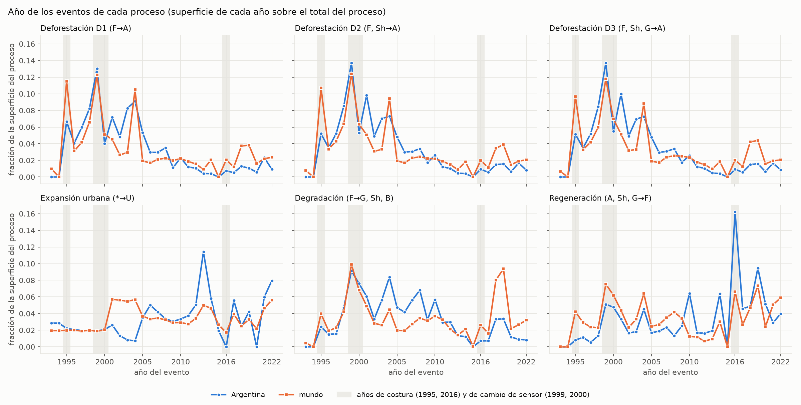

# Pregunta 2: catálogo descriptivo de procesos

**Fecha:** 2026-10-09. Ejecuta el §7.6 del [protocolo de evaluación](protocolo_evaluacion.md) (Parte II): describe cuánto de cada proceso registra el producto ESA CCI, en Argentina y en el mundo, **antes de evaluar ningún método**. No compara métodos.

**Código y salidas**
- Definiciones de eventos y procesos: `src/land2vec/procesos.py` (protocolo §7.2–§7.5).
- Catálogo: `python scripts/validacion/evaluacion_pregunta2.py catalogo` → `data/autoencoder_v3/pregunta2/catalogo_*.csv`.
- Figura: `python scripts/viz/pregunta2_figuras.py` → `docs/autoencoder_v3/figuras/p2/`.

**Universos.** Argentina: las 7.818 trayectorias dinámicas, 2.346.420 píxeles (el censo de Argentina cuenta píxeles; no guarda el área en km²). Mundo: las 69.939 trayectorias dinámicas del censo mundial (incluye las de Argentina), 8.603.553 km². Los porcentajes son sobre la superficie dinámica de cada universo. Una trayectoria tiene un proceso si tiene al menos un evento de ese proceso.

---

## 1. Resumen

1. **Los cuatro procesos tienen superficie de sobra para evaluarse**, en Argentina y en el mundo. El menor es la expansión urbana en Argentina: 619 trayectorias y el 2,0 % de la superficie dinámica.
2. **La deforestación es el proceso dominante en Argentina** (19 % de la superficie dinámica con la variante estricta, 27 % con la amplia). **Sumar Sh → A agrega un 42 % de superficie** a la deforestación estricta; sumar G → A casi no agrega nada en Argentina (+1 %), pero sí en el mundo (+17 %).
3. **La degradación (F → G, Sh, B) ocupa el 29 % de la superficie dinámica de Argentina**, más que la deforestación estricta. Casi toda es F → Sh (96 % en Argentina; 64 % en el mundo, donde F → G suma un 32 %). **La regeneración en Argentina es sobre todo Sh → F (67 %)**; A → F es el 30 %. Las dos dependen, entonces, de la frontera entre bosque y arbustal, la más confundida del producto.
4. **El criterio de persistencia casi no cambia nada.** La superficie con cada proceso es la misma, ±1 %, con y sin el requisito de 3 años, y las oscilaciones (F → Sh → F en pocos años) son casi inexistentes: 0,03 % de la superficie dinámica en Argentina. El producto ya filtra los cambios cortos. **La confusión entre F, Sh y G no aparece como ida y vuelta, sino como reclasificaciones persistentes**, que ninguna regla de persistencia puede separar de un cambio real. Esto refuerza el valor de las tres variantes de deforestación y del Nivel 2.
5. **Las marcas pesan:**
   - entre el 17 y el 19 % de la superficie de deforestación y de degradación tiene su evento en los años del cambio de sensor (1999-2000), con un pico en 1999;
   - el **17 % de la regeneración en Argentina cae en la costura de 2016**. Es la inflación anticipada en el protocolo.
6. **Los procesos casi no se superponen.** La mayor superposición es entre regeneración y degradación en Argentina: el 8 % de la superficie con regeneración también tiene degradación (F → Sh → F con tramos largos).
7. **Un 30 % de la superficie dinámica de Argentina no tiene ninguno de los cuatro procesos** (36 % en el mundo). Son, sobre todo, cambios entre suelo desnudo y vegetación rala (B ↔ Sp), de bosque a humedal (F → Wt) y entre pastizal y vegetación rala.

**Umbral (fijado 2026-10-09, protocolo §13):** evaluar un proceso si tiene al menos el **1 % de la superficie dinámica y 100 trayectorias en Argentina**. Con ese umbral los seis entran (las tres variantes de deforestación y los otros tres procesos). Se fijó antes de evaluar métodos.

---

## 2. Superficie de cada proceso

| proceso | tipos AR | superficie AR (px) | % sup. dinámica AR | tipos mundo | superficie mundo (km²) | % sup. dinámica mundo | año mediano AR / mundo |
|---|--:|--:|--:|--:|--:|--:|--:|
| Deforestación D1 (F→A) | 956 | 452.347 | 19,3 % | 6.292 | 1.430.083 | 16,6 % | 2002 / 2002 |
| Deforestación D2 (F, Sh→A) | 1.706 | 642.876 | 27,4 % | 8.990 | 1.762.802 | 20,5 % | 2001 / 2002 |
| Deforestación D3 (F, Sh, G→A) | 1.792 | 650.268 | 27,7 % | 12.273 | 2.067.766 | 24,0 % | 2001 / 2002 |
| Expansión urbana (*→U) | 619 | 47.177 | 2,0 % | 12.459 | 517.048 | 6,0 % | 2012 / 2008 |
| Degradación (F→G, Sh, B) | 1.606 | 679.880 | 29,0 % | 13.768 | 1.046.022 | 12,2 % | 2004 / 2007 |
| Regeneración (A, Sh, G→F) | 2.495 | 333.263 | 14,2 % | 17.777 | 2.049.863 | 23,8 % | 2014 / 2007 |

El año mediano es el del evento, ponderado por superficie. La deforestación según ESA se concentra en 1995-2005, con mediana en 2001-2002. Conviene contrastar esa cronología con el Monitor de Desmontes en el Nivel 2.

---

## 3. Marcas: costuras, cambio de sensor y censura

Fracción de la superficie de los eventos de cada proceso con cada marca (un evento puede tener más de una):

| proceso | costura AR | sensor AR | censura AR | sin ninguna marca AR | costura mundo | sensor mundo | censura mundo | sin ninguna marca mundo |
|---|--:|--:|--:|--:|--:|--:|--:|--:|
| Deforestación D1 (F→A) | 7,4 % | 17,0 % | 3,3 % | 72,3 % | 13,6 % | 17,4 % | 5,5 % | 63,5 % |
| Deforestación D2 (F, Sh→A) | 6,1 % | 19,0 % | 2,5 % | 72,3 % | 12,7 % | 18,8 % | 4,8 % | 63,8 % |
| Deforestación D3 (F, Sh, G→A) | 6,1 % | 19,2 % | 2,5 % | 72,2 % | 11,7 % | 18,8 % | 4,7 % | 64,9 % |
| Expansión urbana (*→U) | 2,2 % | 4,0 % | 19,6 % | 74,2 % | 3,7 % | 3,9 % | 14,1 % | 78,2 % |
| Degradación (F→G, Sh, B) | 3,1 % | 16,7 % | 1,7 % | 78,4 % | 6,6 % | 16,7 % | 6,3 % | 70,4 % |
| Regeneración (A, Sh, G→F) | 17,0 % | 9,9 % | 6,9 % | 66,2 % | 10,8 % | 13,7 % | 11,0 % | 64,5 % |

"Sin ninguna marca" es la fracción de la superficie del proceso con al menos un evento sin marcas.

Lectura:
- **Cambio de sensor:** el pico de 1999 aparece en deforestación y degradación, en Argentina y en el mundo (figura). Un pico de un solo año, sincronizado en todo el mundo, sugiere un artefacto, aunque el protocolo no lo descuenta: en 1998-2000 hubo desmonte real en el Chaco.
- **Costura de 2016:** concentra el 16 % de la regeneración en Argentina, en un solo año. Es la reclasificación hacia bosque de C3S. En el mundo pesa menos (7 %).
- **Costura de 1995:** pesa en el mundo para la deforestación (10-12 % de la superficie en 1995), menos en Argentina (5-7 %).
- **2015 no tiene eventos** en ningún proceso salvo el urbano, porque el mapa de 2015 es casi una copia del de 2014: los cambios de 2014-2016 se registran en 2016. 1994 tampoco, porque 1992-1994 son casi idénticos.
- **Censura en la expansión urbana (20 % en Argentina):** una parte grande de lo urbano aparece en 2021-2022, al final de la serie. Lo urbano de ESA, además, crece a saltos (en Argentina no hay eventos urbanos en 2016 ni en 2020).

---

## 4. Persistencia y oscilaciones

Superficie con el proceso, con el criterio de persistencia de 3 años, sobre la superficie con la transición de año a año sin ese criterio:

| proceso | Argentina | mundo |
|---|--:|--:|
| Deforestación D1 (F→A) | 1,008 | 1,001 |
| Deforestación D2 (F, Sh→A) | 1,000 | 0,999 |
| Deforestación D3 (F, Sh, G→A) | 1,000 | 0,999 |
| Expansión urbana (*→U) | 1,000 | 1,000 |
| Degradación (F→G, Sh, B) | 0,995 | 0,991 |
| Regeneración (A, Sh, G→F) | 0,999 | 0,996 |

Un valor mayor que 1 indica que la persistencia "une" eventos: por ejemplo, F → Sh (1 año) → A cuenta como un evento F → A, que año a año no aparece.

Oscilaciones más frecuentes (estado base y estado transitorio intermedio):

| conjunto | base | transitorio | trayectorias | % sup. dinámica |
|---|---|---|--:|--:|
| Argentina | Sp | B | 17 | 0,011 % |
| Argentina | Sh | F | 13 | 0,007 % |
| Argentina | F | Sh | 13 | 0,002 % |
| Argentina | F | A | 9 | 0,001 % |
| Argentina | A | F | 12 | 0,001 % |
| Argentina | Sp | G | 7 | 0,001 % |
| mundo | F | Sh | 360 | 0,052 % |
| mundo | B | Wa | 204 | 0,051 % |
| mundo | F | G | 292 | 0,021 % |
| mundo | F | Sp | 186 | 0,020 % |
| mundo | F | B | 102 | 0,016 % |
| mundo | F | Wt | 221 | 0,013 % |

Las trayectorias con alguna oscilación son el 0,03 % de la superficie dinámica de Argentina y el 0,2 % de la del mundo. **Los estados de un año existen como tipos de trayectoria (en el análisis de la Pregunta 1 eran frecuentes entre las trayectorias raras), pero casi no tienen superficie.**

---

## 5. Superposición entre procesos

Fracción de la superficie de las trayectorias con el proceso de la fila que también tiene el proceso de la columna.

**Argentina**

| proceso de la fila | Deforestación D1 | Deforestación D2 | Deforestación D3 | Expansión urbana | Degradación | Regeneración |
|---|--:|--:|--:|--:|--:|--:|
| Deforestación D1 | — | 100,0 % | 100,0 % | 0,1 % | 0,0 % | 2,6 % |
| Deforestación D2 | 70,4 % | — | 100,0 % | 0,1 % | 2,4 % | 2,1 % |
| Deforestación D3 | 69,6 % | 98,9 % | — | 0,1 % | 2,4 % | 2,1 % |
| Expansión urbana | 1,3 % | 1,8 % | 1,8 % | — | 0,3 % | 0,2 % |
| Degradación | 0,0 % | 2,3 % | 2,3 % | 0,0 % | — | 4,0 % |
| Regeneración | 3,6 % | 4,1 % | 4,1 % | 0,0 % | 8,2 % | — |

**Mundo**

| proceso de la fila | Deforestación D1 | Deforestación D2 | Deforestación D3 | Expansión urbana | Degradación | Regeneración |
|---|--:|--:|--:|--:|--:|--:|
| Deforestación D1 | — | 100,0 % | 100,0 % | 0,3 % | 0,0 % | 5,9 % |
| Deforestación D2 | 81,1 % | — | 100,0 % | 0,3 % | 0,4 % | 5,1 % |
| Deforestación D3 | 69,2 % | 85,3 % | — | 0,3 % | 0,4 % | 4,4 % |
| Expansión urbana | 0,9 % | 1,1 % | 1,2 % | — | 0,2 % | 0,1 % |
| Degradación | 0,0 % | 0,7 % | 0,8 % | 0,1 % | — | 6,1 % |
| Regeneración | 4,1 % | 4,4 % | 4,5 % | 0,0 % | 3,1 % | — |

- **Variantes de deforestación:** en Argentina, el 30 % de la superficie de D2 es Sh → A sin F → A; en el mundo, el 31 % de D3 no está en D1.
- **Degradación seguida de deforestación** (F → Sh → A con tramos persistentes, el desmonte en dos pasos): sólo el 2,3 % de la superficie con degradación en Argentina (0,7 % en el mundo). La mayor parte de F → Sh no termina en agricultura dentro del período.
- **Deforestación seguida de regeneración** (F → A → F): 1,8 % de la deforestación estricta en Argentina y 3,9 % en el mundo. El resto de la superposición de la tabla es el orden inverso (A → F → A).

---

## 6. Superficie dinámica sin ninguno de los procesos

| categoría | % sup. dinámica AR | % sup. dinámica mundo |
|---|--:|--:|
| **sin ningún proceso: total** | **29,6 %** | **36,0 %** |
| de ella, sin ningún evento persistente | 0,0 % | 0,1 % |
| evento B→Sp | 5,6 % | 5,3 % |
| evento F→Wt | 5,1 % | 2,3 % |
| evento Sp→B | 3,3 % | 1,7 % |
| evento G→Sp | 2,5 % | 3,1 % |
| evento Wt→F | 1,9 % | 3,2 % |
| evento Sp→G | 1,8 % | 4,8 % |
| evento Wa→Wt | 1,2 % | — |
| evento F→Sp | 0,9 % | 1,2 % |
| evento B→G | — | 2,6 % |
| evento Sp→A | — | 2,3 % |
| evento Sp→F | — | 1,8 % |

(Los 15 eventos de mayor superficie en cada universo; "—" = fuera de esos 15.)

Estas dinámicas no forman parte de la evaluación, pero sí del universo que se agrupa: las tipologías tienen que ubicarlas en algún grupo. En el Nivel 1, pesan en la precisión: un grupo que mezcla deforestación con B ↔ Sp es menos preciso.

---

## 7. Qué implica para la evaluación

- **Todos los procesos son evaluables** con el umbral fijado (§1).
- **Las marcas no son marginales** (un tercio de la superficie de algunos procesos), así que la versión sin eventos marcados (protocolo §7.5) es una sensibilidad importante, sobre todo para la regeneración (costura de 2016) y la deforestación (sensor en 1999).
- **La persistencia no resuelve la confusión entre F, Sh y G**, porque esa confusión es persistente. El único control posible está en el Nivel 2: comparar con fuentes independientes.
- **El fechado de la deforestación según ESA (mediana 2001-2002)** es una hipótesis a contrastar con el Monitor de Desmontes, que en el Nivel 2 da la fecha de cada desmonte desde 2001.
