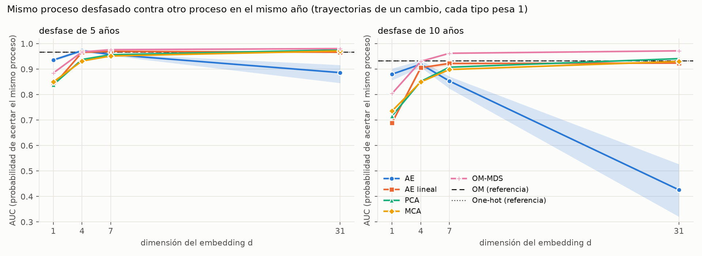
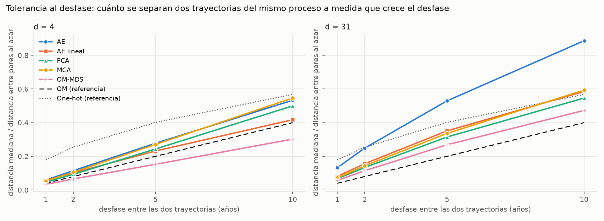
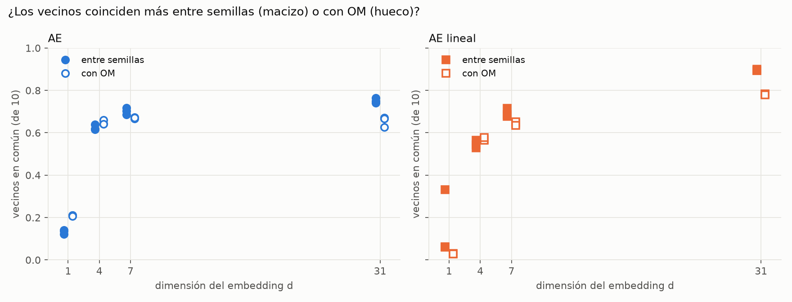
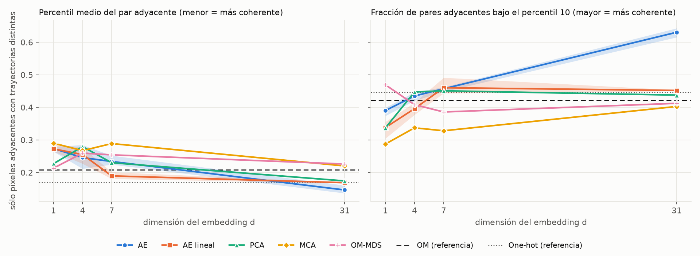

# Pruebas AE contra OM sin usar OM como juez (protocolo y resultados)

**Fecha:** 2026-10-08. Parte del plan de reformulación ([`plan.md`](plan.md)) y de los límites de P1 ([`p1_resultados.md`](p1_resultados.md) §2.9 y §7).
**Estado:** el §1 al §4 es el **protocolo, fijado antes de correr las pruebas** (commit `69cc1e6`). Los resultados están en el §5, agregados sin modificar lo anterior; las desviaciones, si las hay, figuran en el §5.6.

## 1. Pregunta y principio

**Pregunta:** ¿qué aporta el autoencoder respecto de OM y de las alternativas lineales para describir las trayectorias de cobertura de Argentina 1992-2022?

**Por qué no basta la comparación con OM de P1.** Spearman y vecinos en común contra OM (P1 §2.9) usan OM como referencia: miden *parecido a OM*, no calidad. Aquí, cada prueba tiene una respuesta correcta definida por construcción o por los datos, y **OM entra como un competidor más**, evaluado con la misma vara que el autoencoder.

**Decisiones del usuario (2026-10-08):** (1) vale el criterio "el proceso importa más que la fecha"; (2) desfases de 1, 2, 5 y 10 años; (3) OM entra también como embedding, vía MDS clásico; (4) dimensiones d = 1, 4, 7 y 31.

## 2. Espacios que se comparan

Universo: las 7.827 trayectorias de `universo_argentina.csv` (7.818 dinámicas). Todas las distancias entre trayectorias son euclídeas en el espacio correspondiente, salvo OM.

| Espacio | Dimensión | Semillas | Notas |
|---|---|---|---|
| **AE** | d ∈ {1, 4, 7, 31} | 0, 1, 2 | `models/autoencoder_v3/p1/ae_d<d>_s<s>.npz`, clave `z` |
| **AE lineal** | d ∈ {1, 4, 7, 31} | 0, 1, 2 | `lin_d<d>_s<s>.npz` |
| **PCA**, **MCA** | d ∈ {1, 4, 7, 31} | — | determinísticos |
| **OM-MDS** | d ∈ {1, 4, 7, 31} | — | MDS clásico (doble centrado de D², primeros d autovalores positivos) de la matriz OM. Es la **mejor representación euclídea de OM con ese presupuesto de dimensiones**: da a OM las mismas d que a los demás |
| **One-hot crudo** | 341 | — | euclídea sobre el one-hot; referencia sin compresión |
| **OM** | — | — | la matriz completa `om_trate.npy`; referencia sin compresión |

Con semillas, se reporta la media y el rango (mín–máx). **Una diferencia menor que el rango entre semillas no se interpreta.** Ninguna prueba produce un puntaje único "ganador": se leen en conjunto.

## 3. Definiciones comunes

- **Proceso** de una trayectoria: la secuencia de estados sucesivos sin las fechas (por ejemplo, `F→A`). Dos trayectorias son del **mismo proceso** si tienen la misma secuencia.
- **Fechas de cambio:** el año desde el cual rige el nuevo estado (`F>A@1999` = agrícola desde 1999).
- **Desfase k** entre dos trayectorias del mismo proceso: el máximo, entre sus cambios, de la diferencia absoluta de fechas.
- **Ponderación:** se reporta con cada tipo pesando 1 (`tipo`, la principal) y con peso `n_px` (`px`). Los anclajes se ponderan, no los pares.
- **Empates:** una distancia igual cuenta como 0,5 donde se compara.

## 4. Las cinco pruebas

### 4.1 Pares con desfase (discriminación y tolerancia)
**Hipótesis normativa, declarada:** dos trayectorias del mismo proceso son más parecidas entre sí que dos de procesos distintos, **aunque el desfase sea grande**.

Para cada trayectoria dinámica `a` (ancla) y cada k ∈ {1, 2, 5, 10}:
- **Positivos:** las del mismo proceso con desfase exactamente k.
- **Negativos generales:** las de proceso distinto con el mismo número de cambios que `a`.
- **Negativos del mismo año** (sólo trayectorias de un cambio): las de proceso distinto cuyo cambio ocurre en el mismo año que el de `a`. Aíslan la identidad del proceso de la coincidencia de fechas.
- **AUC por ancla** = probabilidad de que un positivo esté más cerca de `a` que un negativo. Se promedia sobre anclas.

**Lectura principal (fijada):** AUC contra negativos del mismo año, k = 5 y k = 10, trayectorias de un cambio, peso `tipo`, d = 4. **Secundarias:** los demás k y d; trayectorias de dos cambios; los negativos generales; peso `px`; y la **tolerancia**: mediana de la distancia a positivos de desfase k, relativa a la mediana de la distancia entre pares al azar del mismo espacio (sin unidades), junto con su correlación con k.

### 4.2 Estabilidad entre semillas
Para AE y AE lineal, por d: proporción de los 10 vecinos más cercanos (en z) que coincide entre cada par de semillas (3 pares) y entre cada semilla y OM; y la disparidad de Procrustes entre semillas. **Criterio:** si la coincidencia entre semillas no supera claramente la coincidencia con OM, la geometría del espacio no es una propiedad reproducible del método.

### 4.3 Sondas lineales (y de vecinos) sobre z
Predecir desde z (estandarizado), sobre las trayectorias dinámicas, con validación cruzada de 5 particiones por tipo (semilla 0):
- estado inicial; estado final; número de cambios (1–4); proceso (para las de un cambio, 62 clases); año del primer cambio (regresión).
- Modelos: logística o Ridge (**sonda lineal**) y 5 vecinos más cercanos (**sonda local**).
- Métricas: exactitud (clasificación), error absoluto medio en años (regresión); tipo y `px`.
- Referencia superior: el one-hot crudo con la misma sonda lineal.

### 4.4 Análisis de desacuerdos
Entre AE (d = 4, semilla 0) y OM, y entre AE lineal (d = 4, semilla 0) y OM. Para cada trayectoria dinámica, sus 10 vecinos en z y sus 10 en OM:
- **z-cerca/OM-lejos:** vecinos en el top-10 de z con rango OM mayor que 100.
- **OM-cerca/z-lejos:** el inverso (rango en z mayor que 100).

Cada par se clasifica con un criterio fijado: *mismo proceso*; *mismos estados inicial y final pero distinta ruta*; *mismo final, distinto inicial*; *mismo inicial, distinto final*; *distinto inicial y final*. **Lectura principal:** la proporción de *mismo proceso* en cada conjunto. Si es alta en z-cerca/OM-lejos, z agrupa lo que OM separa por fechas (a favor de z según el criterio normativo). Si es alta en OM-cerca/z-lejos, z separa pares que OM junta correctamente. Se lee además una muestra de 20 pares por conjunto.

### 4.5 Coherencia espacial
Los píxeles adyacentes (vecinos de 4 direcciones) deberían tener trayectorias parecidas. Ningún espacio usa geografía, así que es un juez independiente.
- Se extraen del `.nc` los pares de píxeles adyacentes, dentro de Argentina, ambos dinámicos y con **trayectorias distintas** (los idénticos tienen distancia 0 en todos los espacios y no discriminan).
- Para cada espacio, se calcula el **percentil de cada par adyacente dentro de la distribución de distancias entre pares al azar** (2.000.000 de pares de píxeles dinámicos con trayectorias distintas, sorteados con probabilidad proporcional a `n_px`). Es adimensional y comparable entre espacios.
- **Lectura principal:** el percentil medio ponderado por número de pares (menor = más coherente) y la fracción de pares por debajo del percentil 10.

## 5. Resultados

**Corrida del 2026-10-08.** Código: `scripts/validacion/pruebas_ae_vs_om.py` (un subcomando por prueba); figuras: `scripts/viz/pruebas_figuras.py`; salidas: `data/autoencoder_v3/pruebas/*.csv` y `docs/autoencoder_v3/figuras/pruebas/`. Cifras: media entre semillas y, para AE y AE lineal, entre paréntesis el rango mín–máx de las tres semillas. PCA, MCA, OM-MDS, one-hot y OM son determinísticos. Siguiendo el protocolo, **una diferencia menor que el rango entre semillas no se interpreta**.

### 5.0 Lectura conjunta

1. **Prueba 1 (desfase), d = 4.** El autoencoder separa el mismo proceso desfasado del mismo año de otro proceso tan bien como OM: AUC 0,972 (0,967–0,980) con desfase de 5 años y 0,919 (0,907–0,935) con 10, frente a 0,967 y 0,934 de OM. **La diferencia con OM cae dentro del rango entre semillas, así que no se interpreta.** El autoencoder supera a PCA y MCA con desfase de 10 años (0,85, fuera del rango) y no se distingue del AE lineal (0,906) ni de OM-MDS (0,931).
2. **Prueba 1, d = 31: el autoencoder se degrada.** Con 31 dimensiones su AUC a 10 años cae a 0,43 (0,32–0,53), por debajo del azar (0,5): dos trayectorias del mismo proceso desfasadas 10 años quedan, en promedio, **más lejos** que dos de procesos distintos del mismo año. PCA, MCA, el AE lineal y OM-MDS suben a 0,92–0,97. Más dimensiones empeoran la tolerancia del autoencoder y mejoran la de todo lo demás.
3. **Prueba 2 (semillas), d = 4.** Dos semillas del autoencoder comparten 0,624 (0,615–0,640) de sus 10 vecinos y cada una comparte 0,649 (0,642–0,660) con OM: **coinciden entre sí menos que con OM**. La disparidad de Procrustes entre semillas es 0,57 (0 = idénticas). La geometría de d = 4 no es reproducible de una semilla a otra más de lo que se parece a OM. Con d = 7 y d = 31 las semillas coinciden más entre sí (0,70 y 0,75) que con OM (0,67 y 0,65).
4. **Prueba 3 (sondas), d = 4.** Los vecinos más cercanos en el autoencoder permiten predecir el año del primer cambio con un error de 1,35 años (OM-MDS: 4,20; PCA: 2,51; MCA: 3,05; AE lineal: 1,28) y el proceso con una exactitud de 0,90 (OM-MDS: 0,41; PCA: 0,60). **Una sonda lineal no recupera casi nada** del año ni del número de cambios en ningún espacio con d ≤ 7 (queda en la línea de base). El AE lineal conserva mejor los estados inicial y final de forma lineal (0,85 y 0,69, contra 0,48 y 0,42 del autoencoder).
5. **Prueba 4 (desacuerdos), d = 4.** Los pares que z considera cercanos y OM lejanos **casi nunca son del mismo proceso** (2,6 % para el autoencoder, 1,2 % para el AE lineal; al azar: 0,9 %). El autoencoder no junta lo que OM separa por fechas. En sentido contrario, el 10,6 % de los pares que OM considera cercanos y z lejanos son del mismo proceso: z separa algunos pares que, por el criterio normativo, deberían estar juntos.
6. **Prueba 5 (coherencia espacial).** Entre píxeles adyacentes con trayectorias distintas, con d = 4 todos los espacios quedan dentro de un rango estrecho (percentil medio 0,25–0,28; el rango entre semillas del autoencoder es 0,21–0,29), de modo que **la prueba no discrimina entre ellos a d = 4**. Con d = 31 el autoencoder es el más coherente (percentil medio 0,146; 63 % de los pares bajo el percentil 10), pero la prueba 1 muestra que ese mismo espacio es el que peor tolera el desfase: las pruebas no coinciden.
7. **Qué no se puede concluir.** Ninguna prueba muestra que el autoencoder produzca una descripción *mejor* que OM; sí muestra que **a d = 4 es equivalente a OM en discriminación y tolerancia al desfase, y más informativo localmente que las otras compresiones de 4 dimensiones** (incluida la de OM). Según estas pruebas, la ventaja del autoencoder no es una geometría distinta que mejore la descripción, sino una representación de 4 números que conserva información que PCA, MCA y OM-MDS pierden con el mismo presupuesto de dimensiones.

### 5.1 Prueba 1: pares con desfase

Universo de la prueba: 1.345 anclas de un cambio con vecino a 1 año de desfase (62 procesos de un cambio) y 4.966 anclas de dos cambios (283 procesos).

**Lectura principal.** AUC contra negativos del **mismo año**, trayectorias de un cambio, cada tipo pesa 1:

| espacio | d=4, k=5 | d=4, k=10 | d=31, k=5 | d=31, k=10 |
|---|--:|--:|--:|--:|
| AE | 0,972 (0,967–0,980) | 0,919 (0,907–0,935) | 0,886 (0,846–0,916) | 0,426 (0,321–0,527) |
| AE lineal | 0,966 (0,964–0,968) | 0,906 (0,895–0,911) | 0,966 (0,965–0,968) | 0,924 (0,922–0,925) |
| PCA | 0,938 | 0,852 | 0,975 | 0,941 |
| MCA | 0,932 | 0,850 | 0,972 | 0,930 |
| OM-MDS | 0,967 | 0,931 | 0,981 | 0,972 |
| One-hot | 0,967 | 0,933 | 0,967 | 0,933 |
| OM | 0,967 | 0,934 | 0,967 | 0,934 |

OM y el one-hot no tienen d: el mismo valor en las dos columnas.

**Contra negativos generales** (cualquier otro proceso con el mismo número de cambios), d = 4:

| espacio (d=4) | 1 cambio, k=1 | k=2 | k=5 | k=10 | 2 cambios, k=1 | k=2 | k=5 | k=10 |
|---|--:|--:|--:|--:|--:|--:|--:|--:|
| AE | 1,000 (1,000–1,000) | 1,000 (1,000–1,000) | 0,995 (0,994–0,996) | 0,951 (0,941–0,962) | 1,000 (1,000–1,000) | 1,000 (1,000–1,000) | 0,990 (0,988–0,993) | 0,915 (0,902–0,935) |
| AE lineal | 1,000 (1,000–1,000) | 0,999 (0,998–0,999) | 0,991 (0,990–0,993) | 0,934 (0,925–0,941) | 1,000 (1,000–1,000) | 0,999 (0,999–0,999) | 0,992 (0,991–0,993) | 0,950 (0,942–0,954) |
| PCA | 1,000 | 0,997 | 0,969 | 0,872 | 0,999 | 0,996 | 0,957 | 0,847 |
| MCA | 0,999 | 0,995 | 0,969 | 0,875 | 0,998 | 0,994 | 0,962 | 0,888 |
| OM-MDS | 0,999 | 0,997 | 0,986 | 0,948 | 0,999 | 0,995 | 0,970 | 0,910 |
| One-hot | 1,000 | 1,000 | 0,997 | 0,977 | 1,000 | 1,000 | 0,995 | 0,953 |
| OM | 1,000 | 1,000 | 0,996 | 0,967 | 1,000 | 1,000 | 0,994 | 0,951 |

**Por superficie y por tipo** (d = 4, un cambio, negativos del mismo año):

| espacio (d=4) | por superficie, k=5 | k=10 | por tipo, k=5 | k=10 |
|---|--:|--:|--:|--:|
| AE | 0,977 (0,974–0,984) | 0,922 (0,913–0,939) | 0,972 (0,967–0,980) | 0,919 (0,907–0,935) |
| AE lineal | 0,990 (0,987–0,994) | 0,961 (0,957–0,967) | 0,966 (0,964–0,968) | 0,906 (0,895–0,911) |
| PCA | 0,971 | 0,903 | 0,938 | 0,852 |
| MCA | 0,984 | 0,953 | 0,932 | 0,850 |
| OM-MDS | 0,986 | 0,959 | 0,967 | 0,931 |
| One-hot | 0,983 | 0,942 | 0,967 | 0,933 |
| OM | 0,985 | 0,944 | 0,967 | 0,934 |

Ponderado por superficie el orden cambia: con desfase de 10 años el autoencoder (0,922) queda por debajo del AE lineal (0,961), de MCA (0,953) y de OM-MDS (0,959). La ventaja o igualdad del autoencoder frente a PCA y MCA vale por tipo y no por superficie.

**Tolerancia.** Distancia mediana entre dos trayectorias del mismo proceso con desfase k, dividida por la distancia mediana entre pares al azar de ese espacio (un valor de 1 = tan lejos como un par cualquiera):

| espacio | k=1 | k=2 | k=5 | k=10 |
|---|--:|--:|--:|--:|
| AE (d=4) | 0,059 | 0,115 | 0,278 | 0,533 |
| AE lineal (d=4) | 0,057 | 0,102 | 0,232 | 0,417 |
| PCA (d=4) | 0,046 | 0,093 | 0,243 | 0,500 |
| MCA (d=4) | 0,053 | 0,106 | 0,271 | 0,547 |
| OM-MDS (d=4) | 0,033 | 0,066 | 0,152 | 0,302 |
| One-hot | 0,180 | 0,254 | 0,402 | 0,568 |
| OM | 0,040 | 0,080 | 0,200 | 0,400 |
| AE (d=31) | 0,132 | 0,249 | 0,529 | 0,887 |
| AE lineal (d=31) | 0,081 | 0,156 | 0,351 | 0,586 |
| PCA (d=31) | 0,067 | 0,134 | 0,315 | 0,546 |
| MCA (d=31) | 0,072 | 0,144 | 0,336 | 0,593 |
| OM-MDS (d=31) | 0,058 | 0,114 | 0,269 | 0,473 |

- OM crece de forma casi **proporcional al desfase** (0,04, 0,08, 0,20, 0,40). El AE lineal con d = 4 es el que más se le parece.
- **El one-hot crudo castiga mucho el primer año de desfase**: con k = 1 la distancia ya es 0,18 y después crece como la raíz de k (0,57 a 10 años), porque dos trayectorias desfasadas k años difieren en exactamente k años. No tiene la proporcionalidad de OM.
- El autoencoder con d = 4 se comporta como PCA y MCA (0,06 a 0,53). Con d = 31 su distancia a 10 años de desfase llega a 0,89, casi la de un par cualquiera.

### 5.2 Prueba 2: estabilidad entre semillas

| espacio | d | vecinos en común entre semillas | vecinos en común con OM | disparidad de Procrustes entre semillas |
|---|--:|--:|--:|--:|
| AE | 1 | 0,133 (0,122–0,141) | 0,210 (0,207–0,212) | 0,375 |
| AE | 4 | 0,624 (0,615–0,640) | 0,649 (0,642–0,660) | 0,571 |
| AE | 7 | 0,701 (0,685–0,717) | 0,671 (0,667–0,674) | 0,476 |
| AE | 31 | 0,752 (0,741–0,765) | 0,654 (0,626–0,671) | 0,286 |
| AE lineal | 1 | 0,151 (0,060–0,331) | 0,029 (0,028–0,031) | 0,085 |
| AE lineal | 4 | 0,546 (0,528–0,565) | 0,570 (0,564–0,577) | 0,481 |
| AE lineal | 7 | 0,693 (0,677–0,715) | 0,644 (0,635–0,651) | 0,527 |
| AE lineal | 31 | 0,896 (0,894–0,899) | 0,782 (0,779–0,784) | 0,099 |

Referencias sin semillas, vecinos en común con OM:

| espacio (sin semillas) | d=1 | d=4 | d=7 | d=31 |
|---|--:|--:|--:|--:|
| PCA | 0,023 | 0,403 | 0,532 | 0,785 |
| MCA | 0,029 | 0,353 | 0,413 | 0,783 |
| OM-MDS | 0,026 | 0,264 | 0,298 | 0,674 |

- **d = 4:** el autoencoder coincide entre semillas (0,624) un poco menos que con OM (0,649). Por el criterio del protocolo, la coincidencia entre semillas **no supera** la coincidencia con OM: a d = 4 la geometría del autoencoder no es una propiedad reproducible. La disparidad de Procrustes (0,57) lo confirma.
- **d = 31:** las semillas coinciden claramente más entre sí (0,75) que con OM (0,65), y la disparidad es 0,29. Existe una geometría reproducible, y es **distinta de la de OM**.
- **AE lineal:** a d = 31 coincide muy bien entre semillas (0,90) y con OM (0,78). Con d = 1, el AE lineal tiene un rango entre semillas enorme (0,06–0,33), señal de que no hay un espacio estable de una dimensión.
- **OM-MDS con d = 4 conserva sólo 0,26 de los vecinos de OM**, menos que el autoencoder (0,65), PCA (0,40) o MCA (0,35): la mejor representación euclídea de 4 dimensiones de OM no reproduce sus propios vecindarios.

### 5.3 Prueba 3: sondas sobre z

Validación cruzada de 5 particiones por tipo. Líneas de base: exactitud de la clase mayoritaria (inicial 0,288; final 0,224; n.º de cambios 0,761; proceso 0,020) y error del año del primer cambio al predecir la media (5,05 años).

**d = 4**

| objetivo | sonda | AE | AE lineal | PCA | MCA | OM-MDS | one-hot (341) | línea de base |
|---|--:|--:|--:|--:|--:|--:|--:|--:|
| estado_inicial (exactitud) | lineal | 0,483 (0,452–0,509) | 0,851 (0,811–0,873) | 0,562 | 0,374 | 0,441 | 0,999 | 0,288 |
| estado_inicial (exactitud) | vecinos | 0,922 (0,916–0,932) | 0,935 (0,921–0,942) | 0,798 | 0,770 | 0,622 | 0,958 |  |
| estado_final (exactitud) | lineal | 0,423 (0,395–0,461) | 0,689 (0,664–0,720) | 0,382 | 0,421 | 0,384 | 1,000 | 0,224 |
| estado_final (exactitud) | vecinos | 0,867 (0,851–0,897) | 0,843 (0,828–0,853) | 0,630 | 0,639 | 0,568 | 0,896 |  |
| n_cambios (exactitud) | lineal | 0,762 (0,761–0,764) | 0,768 (0,767–0,770) | 0,761 | 0,772 | 0,761 | 0,776 | 0,761 |
| n_cambios (exactitud) | vecinos | 0,895 (0,889–0,906) | 0,866 (0,862–0,872) | 0,798 | 0,788 | 0,794 | 0,869 |  |
| proceso_1_cambio (exactitud) | lineal | 0,791 (0,775–0,816) | 0,701 (0,682–0,714) | 0,512 | 0,338 | 0,402 | 0,982 | 0,020 |
| proceso_1_cambio (exactitud) | vecinos | 0,896 (0,888–0,900) | 0,824 (0,814–0,836) | 0,602 | 0,446 | 0,408 | 0,908 |  |
| anio_primer_cambio (MAE años) | lineal | 5,03 (5,01–5,06) | 4,99 (4,98–5,00) | 5,02 | 5,03 | 5,04 | 4,60 | 5,05 (media) / 4,84 (mediana) |
| anio_primer_cambio (MAE años) | vecinos | 1,35 (1,27–1,43) | 1,28 (1,24–1,30) | 2,51 | 3,05 | 4,20 | 0,94 |  |

**d = 31**

| objetivo | sonda | AE | AE lineal | PCA | MCA | OM-MDS | one-hot (341) | línea de base |
|---|--:|--:|--:|--:|--:|--:|--:|--:|
| estado_inicial (exactitud) | lineal | 0,994 (0,992–0,996) | 0,999 (0,999–0,999) | 1,000 | 0,999 | 0,961 | 0,999 | 0,288 |
| estado_inicial (exactitud) | vecinos | 0,948 (0,934–0,959) | 0,968 (0,966–0,970) | 0,974 | 0,965 | 0,954 | 0,958 |  |
| estado_final (exactitud) | lineal | 0,989 (0,987–0,990) | 0,994 (0,994–0,995) | 0,963 | 0,944 | 0,868 | 1,000 | 0,224 |
| estado_final (exactitud) | vecinos | 0,935 (0,933–0,935) | 0,897 (0,894–0,900) | 0,899 | 0,898 | 0,853 | 0,896 |  |
| n_cambios (exactitud) | lineal | 0,806 (0,791–0,817) | 0,775 (0,774–0,776) | 0,773 | 0,772 | 0,787 | 0,776 | 0,761 |
| n_cambios (exactitud) | vecinos | 0,929 (0,925–0,935) | 0,879 (0,877–0,881) | 0,869 | 0,874 | 0,843 | 0,869 |  |
| proceso_1_cambio (exactitud) | lineal | 0,994 (0,993–0,996) | 0,983 (0,981–0,985) | 0,990 | 0,982 | 0,972 | 0,982 | 0,020 |
| proceso_1_cambio (exactitud) | vecinos | 0,886 (0,863–0,903) | 0,926 (0,922–0,930) | 0,933 | 0,906 | 0,884 | 0,908 |  |
| anio_primer_cambio (MAE años) | lineal | 2,71 (2,46–2,99) | 4,81 (4,79–4,85) | 4,74 | 4,75 | 4,72 | 4,60 | 5,05 (media) / 4,84 (mediana) |
| anio_primer_cambio (MAE años) | vecinos | 0,85 (0,81–0,86) | 0,92 (0,91–0,93) | 0,92 | 0,98 | 1,35 | 0,94 |  |

**d = 7**

| objetivo | sonda | AE | AE lineal | PCA | MCA | OM-MDS | one-hot (341) | línea de base |
|---|--:|--:|--:|--:|--:|--:|--:|--:|
| estado_inicial (exactitud) | lineal | 0,830 (0,772–0,861) | 0,944 (0,937–0,954) | 0,626 | 0,443 | 0,469 | 0,999 | 0,288 |
| estado_inicial (exactitud) | vecinos | 0,953 (0,945–0,958) | 0,975 (0,972–0,980) | 0,887 | 0,788 | 0,642 | 0,958 |  |
| estado_final (exactitud) | lineal | 0,683 (0,662–0,695) | 0,859 (0,856–0,864) | 0,425 | 0,491 | 0,416 | 1,000 | 0,224 |
| estado_final (exactitud) | vecinos | 0,908 (0,905–0,914) | 0,918 (0,914–0,921) | 0,695 | 0,660 | 0,588 | 0,896 |  |
| n_cambios (exactitud) | lineal | 0,761 (0,760–0,762) | 0,771 (0,768–0,773) | 0,761 | 0,772 | 0,761 | 0,776 | 0,761 |
| n_cambios (exactitud) | vecinos | 0,926 (0,919–0,931) | 0,906 (0,904–0,908) | 0,819 | 0,799 | 0,798 | 0,869 |  |
| proceso_1_cambio (exactitud) | lineal | 0,933 (0,911–0,955) | 0,907 (0,900–0,921) | 0,782 | 0,654 | 0,484 | 0,982 | 0,020 |
| proceso_1_cambio (exactitud) | vecinos | 0,900 (0,886–0,907) | 0,915 (0,901–0,929) | 0,759 | 0,564 | 0,432 | 0,908 |  |
| anio_primer_cambio (MAE años) | lineal | 4,97 (4,91–5,00) | 4,97 (4,95–4,98) | 5,00 | 5,01 | 5,03 | 4,60 | 5,05 (media) / 4,84 (mediana) |
| anio_primer_cambio (MAE años) | vecinos | 0,97 (0,92–1,02) | 0,97 (0,92–1,05) | 1,71 | 3,02 | 4,03 | 0,94 |  |

**d = 1**

| objetivo | sonda | AE | AE lineal | PCA | MCA | OM-MDS | one-hot (341) | línea de base |
|---|--:|--:|--:|--:|--:|--:|--:|--:|
| estado_inicial (exactitud) | lineal | 0,355 (0,351–0,362) | 0,344 (0,344–0,344) | 0,371 | 0,358 | 0,369 | 0,999 | 0,288 |
| estado_inicial (exactitud) | vecinos | 0,674 (0,648–0,687) | 0,275 (0,268–0,281) | 0,418 | 0,328 | 0,324 | 0,958 |  |
| estado_final (exactitud) | lineal | 0,322 (0,309–0,333) | 0,322 (0,320–0,327) | 0,320 | 0,309 | 0,320 | 1,000 | 0,224 |
| estado_final (exactitud) | vecinos | 0,530 (0,522–0,537) | 0,291 (0,284–0,295) | 0,284 | 0,294 | 0,269 | 0,896 |  |
| n_cambios (exactitud) | lineal | 0,761 (0,761–0,761) | 0,761 (0,761–0,761) | 0,761 | 0,761 | 0,761 | 0,776 | 0,761 |
| n_cambios (exactitud) | vecinos | 0,771 (0,767–0,775) | 0,722 (0,716–0,728) | 0,717 | 0,725 | 0,727 | 0,869 |  |
| proceso_1_cambio (exactitud) | lineal | 0,079 (0,071–0,083) | 0,044 (0,043–0,046) | 0,064 | 0,049 | 0,043 | 0,982 | 0,020 |
| proceso_1_cambio (exactitud) | vecinos | 0,625 (0,604–0,640) | 0,064 (0,057–0,072) | 0,101 | 0,067 | 0,099 | 0,908 |  |
| anio_primer_cambio (MAE años) | lineal | 5,03 (5,03–5,04) | 5,04 (5,04–5,05) | 5,03 | 5,04 | 5,04 | 4,60 | 5,05 (media) / 4,84 (mediana) |
| anio_primer_cambio (MAE años) | vecinos | 3,11 (2,92–3,29) | 5,37 (5,35–5,40) | 5,26 | 5,34 | 5,34 | 0,94 |  |

- **La sonda lineal sobre el n.º de cambios y sobre el año del cambio está en la línea de base en todos los espacios con d ≤ 7**: no hay información *linealmente* accesible. La sonda de vecinos sí recupera el año (MAE de 0,97 años con el autoencoder en d = 7), lo que indica que esa información está codificada de forma **no lineal**.
- **A d = 4 el autoencoder es el espacio más informativo localmente**: mejor que PCA, MCA y OM-MDS en el año del primer cambio, el proceso y el número de cambios; igual al AE lineal (1,35 contra 1,28 años). OM-MDS de d = 4 es de los más pobres en año, proceso y estado final.
- Con d = 31, la sonda lineal mide la información linealmente accesible: el autoencoder queda en 2,71 años de error en el año del cambio (los demás: 4,7 a 4,8), pero **recupera menos que el AE lineal** el estado final a 0,989 contra 0,994, y todos están cerca del one-hot (0,999 y 1,000 en estado inicial y final).

### 5.4 Prueba 4: análisis de desacuerdos

Para cada trayectoria dinámica, sus 10 vecinos en z y sus 10 en OM; "lejos" = rango mayor que 100 en el otro espacio. Distribución de las categorías (porcentaje de los pares de cada conjunto):

| espacio (d=4, s0) | conjunto | pares | mismo proceso | mismo inicio y final, distinta ruta | mismo final, distinto inicio | mismo inicio, distinto final | distinto inicio y final |
|---|--:|--:|--:|--:|--:|--:|--:|
| AE | z cerca / OM lejos | 6.312 | 2,6 % | 2,5 % | 24,9 % | 25,3 % | 44,7 % |
| AE | OM cerca / z lejos | 5.597 | 10,6 % | 30,0 % | 14,8 % | 40,5 % | 4,2 % |
| AE | pares al azar (referencia) | 19.999 | 0,9 % | 1,9 % | 10,3 % | 13,6 % | 73,3 % |
| AE lineal | z cerca / OM lejos | 12.053 | 1,2 % | 12,4 % | 19,1 % | 46,2 % | 21,1 % |
| AE lineal | OM cerca / z lejos | 6.772 | 11,3 % | 5,6 % | 33,1 % | 43,0 % | 7,0 % |
| AE lineal | pares al azar (referencia) | 19.994 | 1,0 % | 2,0 % | 10,2 % | 13,8 % | 73,0 % |

La referencia es la distribución de pares de trayectorias dinámicas tomados al azar.

- **z cerca / OM lejos (el autoencoder):** sólo el 2,6 % son del mismo proceso (vs 0,9 % al azar). La mitad comparte estado inicial o final sin ser el mismo proceso (50,2 % entre las dos categorías de "mismo extremo"), y el 44,7 % no comparte ninguno de los dos. **El autoencoder no está juntando "el mismo proceso en otras fechas" que OM separa.**
- **OM cerca / z lejos:** el 10,6 % (autoencoder) y el 11,3 % (AE lineal) son del mismo proceso, y en el autoencoder otro 30 % comparte inicio y final con otra ruta. Estos son los pares que, por el criterio normativo, z **separa de más**.
- El AE lineal da el mismo diagnóstico, con más pares en z cerca / OM lejos (12.053 contra 6.312).

Muestra de pares del autoencoder (primeros 6 de la muestra de 20 de cada conjunto; la muestra completa está en `data/autoencoder_v3/pruebas/t4_muestra.csv`):

| conjunto | trayectoria a | trayectoria b | categoría |
|---|--:|--:|--:|
| OM_cerca_z_lejos | `A>Sh@2008 Sh>F@2010` | `A>F@2008 F>A@2022` | mismo inicio distinto final |
| OM_cerca_z_lejos | `B>A@2012` | `B>Sp@2011 Sp>A@2016` | mismo inicio y final distinta ruta |
| OM_cerca_z_lejos | `Sh>A@2006 A>Wt@2016` | `Sh>A@2006 A>F@2016` | mismo inicio distinto final |
| OM_cerca_z_lejos | `Sh>A@2000 A>U@2022` | `Sh>F@2000 F>A@2002` | mismo inicio distinto final |
| OM_cerca_z_lejos | `F>Sh@2000 Sh>F@2016 F>Sh@2018` | `F>Sh@2000 Sh>U@2021` | mismo inicio distinto final |
| OM_cerca_z_lejos | `F>Sp@1999 Sp>F@2017` | `F>Sp@2000 Sp>Sh@2019` | mismo inicio distinto final |
| z_cerca_OM_lejos | `F>Sh@2001 Sh>A@2005 A>U@2014` | `A>Wa@2011 Wa>U@2013` | mismo final distinto inicio |
| z_cerca_OM_lejos | `F>Sp@1999 Sp>Sh@2019` | `Sh>Wt@1999 Wt>Sp@2004` | distinto inicio y final |
| z_cerca_OM_lejos | `B>Wa@2001 Wa>F@2021` | `A>Wa@2002 Wa>Sp@2007` | distinto inicio y final |
| z_cerca_OM_lejos | `G>F@1998 F>Wt@2011` | `Sp>F@1998 F>Sh@2010 Sh>Wa@2017` | distinto inicio y final |
| z_cerca_OM_lejos | `Wt>F@2000 F>Sh@2006` | `B>F@1997 F>Sh@2006` | mismo final distinto inicio |
| z_cerca_OM_lejos | `Sh>F@2009 F>A@2021` | `Sh>F@2010 F>B@2019` | mismo inicio distinto final |

**Lectura cualitativa (12 pares, no concluyente).** Entre los pares que el autoencoder acerca y OM aleja predominan trayectorias raras, de dos o tres cambios, sin procesos en común (por ejemplo `F>Sp@1999 Sp>Sh@2019` y `Sh>Wt@1999 Wt>Sp@2004`): parecen ubicaciones arbitrarias de tipos escasos, no agrupaciones con sentido. Entre los pares que OM acerca y el autoencoder aleja aparecen trayectorias que comparten el inicio y difieren por un cambio adicional (por ejemplo `Sh>A@2006 A>Wt@2016` y `Sh>A@2006 A>F@2016`): OM las considera casi iguales y el autoencoder las separa por el destino final.

### 5.5 Prueba 5: coherencia espacial

De 72.130.358 pares de píxeles adyacentes dentro de Argentina, el 83,7 % tiene la **misma** trayectoria (distancia 0 en todos los espacios) y se excluye. Quedan 782.852 pares de píxeles dinámicos con trayectorias distintas.

| espacio | percentil medio (menor = más coherente) | fracción bajo el percentil 10 |
|---|--:|--:|
| AE d=1 | 0,274 (0,264–0,279) | 0,390 (0,374–0,399) |
| AE d=4 | 0,246 (0,212–0,285) | 0,435 (0,421–0,447) |
| AE d=7 | 0,234 (0,225–0,252) | 0,457 (0,448–0,462) |
| AE d=31 | 0,146 (0,136–0,160) | 0,631 (0,615–0,643) |
| AE lineal d=1 | 0,273 (0,265–0,288) | 0,338 (0,304–0,356) |
| AE lineal d=4 | 0,255 (0,227–0,276) | 0,396 (0,377–0,414) |
| AE lineal d=7 | 0,189 (0,180–0,201) | 0,460 (0,443–0,491) |
| AE lineal d=31 | 0,169 (0,167–0,170) | 0,452 (0,450–0,453) |
| PCA d=1 | 0,227 | 0,337 |
| PCA d=4 | 0,279 | 0,447 |
| PCA d=7 | 0,230 | 0,451 |
| PCA d=31 | 0,174 | 0,438 |
| MCA d=1 | 0,290 | 0,287 |
| MCA d=4 | 0,267 | 0,337 |
| MCA d=7 | 0,289 | 0,328 |
| MCA d=31 | 0,220 | 0,403 |
| OM-MDS d=1 | 0,213 | 0,469 |
| OM-MDS d=4 | 0,259 | 0,408 |
| OM-MDS d=7 | 0,254 | 0,386 |
| OM-MDS d=31 | 0,226 | 0,412 |
| One-hot (referencia) | 0,169 | 0,446 |
| OM (referencia) | 0,208 | 0,421 |

- **Con d = 4 no hay diferencias interpretables:** todos los espacios quedan en 0,25–0,28 de percentil medio, y el rango entre semillas del autoencoder (0,21–0,29) cubre a los demás.
- **Con d = 31** el autoencoder es el más coherente (0,146; 63 % de los pares bajo el percentil 10) y supera al one-hot y a OM (0,17 y 0,21). Es el resultado contrario al de la prueba 1 para el mismo espacio.
- El percentil de cada par se calcula dentro de la distribución de distancias del propio espacio, así que mide *posición relativa*, no distancias absolutas. Un espacio donde los pares adyacentes quedan relativamente cerca puede, a la vez, separar mucho el mismo proceso desfasado.

### 5.6 Desviaciones del protocolo y límites

**Desviaciones.** Ninguna que cambie lo declarado en el §1–§4. Detalles de implementación que el protocolo no fijaba: (i) en la prueba 4, el rango de OM se cuenta entre las 7.827 trayectorias; (ii) en la prueba 5 el espacio "OM-MDS" y la comparación de percentiles usan la distribución nula de 2.000.000 de pares dinámicos con trayectorias distintas sorteados por superficie; (iii) en la prueba 3 la sonda lineal es regresión logística (clasificación) o Ridge (año) sobre z estandarizado, y la de vecinos usa 5 vecinos; (iv) la prueba 2 usa los 10 vecinos de las 7.827 trayectorias, no sólo de las dinámicas.

**Límites.**
- **Criterio normativo:** "el proceso importa más que la fecha" es una hipótesis del usuario, no un hecho. Si el momento del cambio importa, la prueba 1 mide otra cosa.
- **OM-MDS** es una representación euclídea truncada de OM, no OM. La comparación justa de OM con 4 dimensiones es OM-MDS; la de OM sin comprimir es la referencia "OM".
- **Tres semillas**: rangos aproximados. No se midió la variación por hiperparámetros ni por muestreo.
- **Prueba 4** sólo con d = 4 y semilla 0. Tiene una categorización gruesa y la muestra se lee, no se codifica.
- **Prueba 3:** las sondas miden información disponible, no utilidad; con d ≤ 7 la sonda lineal es poco informativa en todos los espacios.
- **Prueba 5** compara posiciones relativas dentro de cada espacio y tiene muchos pares idénticos excluidos; el producto de ESA CCI tiene autocorrelación espacial propia.
- **No hay una puntuación única.** Las pruebas 1 y 5 se contradicen a d = 31, y la 2 y la 3 muestran propiedades distintas.
