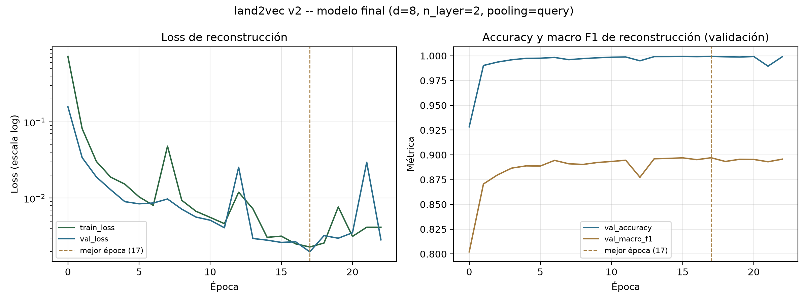
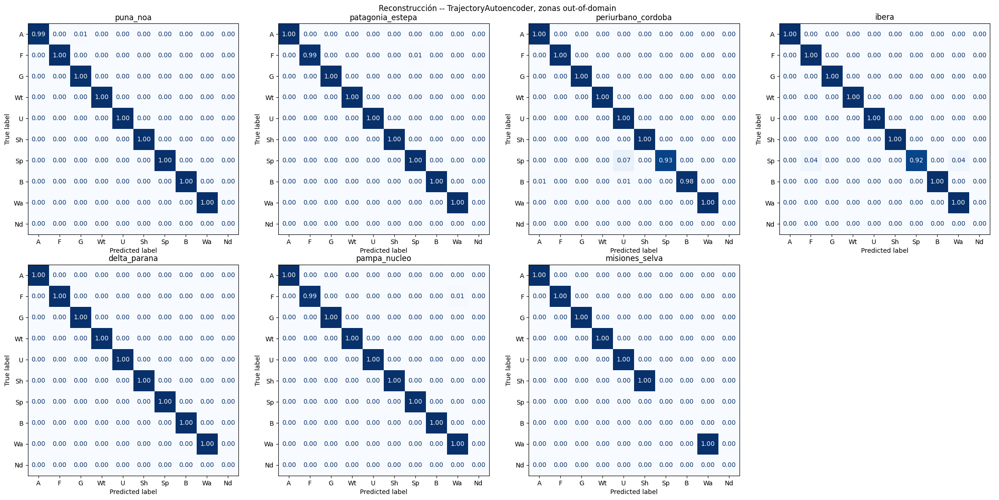
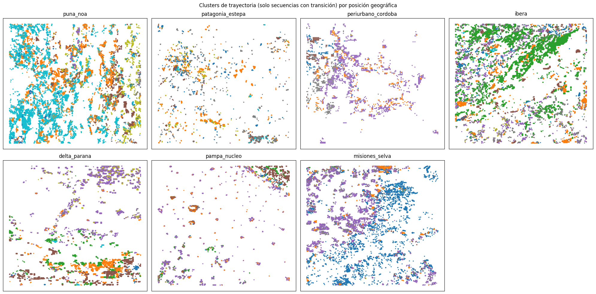
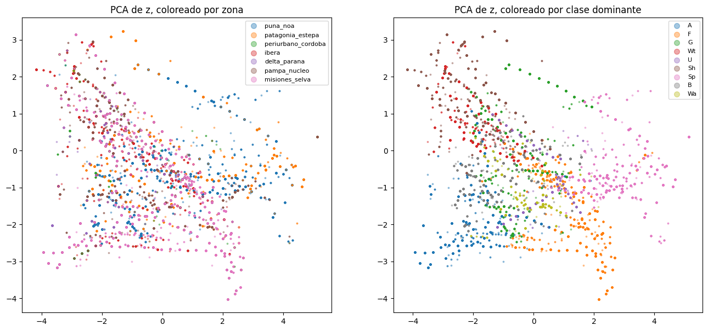

# land2vec v2 — autoencoder de trayectorias

Documento de referencia del entrenamiento de la segunda versión de land2vec:
un autoencoder secuencial que comprime la trayectoria anual de uso del suelo
de una parcela (2000-2022, 23 estados) en un vector de baja dimensión (`z`),
pensado como insumo para clustering/tipología de trayectorias, como variable
de entrada de otros modelos, y para visualización/exploración espacial.

Ver el plan original en `/root/.claude/plans/1-inspeccion-el-repo-scalable-scroll.md`
(sesión de diseño) y el código real en `src/land2vec/model.py`,
`src/land2vec/config.py`, `src/land2vec/utils.py`, `src/land2vec/extract.py`
y `scripts/train_autoencoder.py`.

## 1. Por qué una v2

La v1 (`models/full_model`, `GPTDecoder`) es un transformer causal
decoder-only entrenado para predecir el próximo estado de uso del suelo.
Cumple ese objetivo, pero **no produce un embedding de trayectoria**: nunca
está obligada a resumir la secuencia completa en un vector (su estado
oculto de 128 dims por posición ni siquiera queda expuesto fuera de
`forward()`), y `notebooks/eval_ood_zones.ipynb` mostró que además
generaliza mal fuera de la región de entrenamiento original
(Chaco-Santiago-frontera): macro F1 pooled 0.7507 en 7 zonas out-of-domain,
contra 0.9005 in-domain, con un colapso a 0.4682 en la zona dominada por
clases casi ausentes en entrenamiento (`puna_noa`, con `B`/`Sp`).

La v2 ataca dos problemas a la vez:

1. **Arquitectura con cuello de botella explícito**, que fuerza a comprimir
   toda la trayectoria en un vector `z` de pocas dimensiones (en vez de
   nunca tener que hacerlo, como la v1).
2. **Datos de entrenamiento geográficamente más diversos**: además de
   Chaco-Santiago, se suman 7 zonas nuevas repartidas por el país, elegidas
   en las mismas ecorregiones que las 7 zonas de evaluación out-of-domain
   pero con huella geográfica disjunta de ellas — así el benchmark de la v1
   se puede reutilizar para medir la v2 sin haberlo "quemado" durante el
   entrenamiento.

## 2. Arquitectura: `TrajectoryAutoencoder`

Clase real en `src/land2vec/model.py:149`. Flujo:

```
secuencia (23 años) → ENCODER (bidireccional) → pooling → z (d dims) → DECODER (bidireccional) → secuencia reconstruida (23 años)
```

### 2.1 Encoder

1. **Embeddings de entrada**: cada uno de los 23 tokens se convierte en un
   vector de `n_embd=128` dims (`token_embedding`, tabla 11×128) y se le
   suma el embedding de su posición (`position_embedding`, tabla 23×128).
2. **`n_layer` bloques transformer bidireccionales** (`Block` con
   `is_causal=False`): igual estructura que los bloques de la v1
   (autoatención + feed-forward con GELU), pero cada posición puede atender
   a **todas** las demás, no solo a las anteriores — no hay nada que
   predecir "hacia adelante", el objetivo es resumir toda la secuencia.
3. **Pooling**: colapsa las 23 salidas del encoder (una por año) a un solo
   vector de 128 dims. Dos variantes, seleccionables por `pooling`:
   - `"mean"`: promedio simple de las 23 posiciones.
   - `"query"`: atención de una cabeza contra un vector de consulta
     *aprendido* (`pool_query`), que le puede dar más peso a ciertos años
     que a otros en vez de pesarlos todos igual.
4. **Proyección al cuello de botella** (`to_latent`, `Linear(128 → d)`): de
   los 128 dims contextuales resultantes del pooling a `z`, el embedding
   final de `d` dimensiones.

### 2.2 Decoder

5. **Expansión desde `z`** (`from_latent`, `Linear(d → 128)`): el vector
   `z` se proyecta de vuelta a 128 dims y se **difunde (broadcast)** por
   igual a las 23 posiciones — arrancan siendo idénticas entre sí, solo
   diferenciadas después por el embedding de posición que se suma a
   continuación.
6. **`n_layer` bloques transformer bidireccionales más** (pesos propios,
   no compartidos con el encoder), que despliegan esa información repetida
   en algo que se parezca a 23 años distintos entre sí.
7. **Capa de salida** (`lm_head`, con los mismos pesos que
   `token_embedding` — weight tying, igual que en la v1): logits sobre las
   11 clases del vocabulario, para cada una de las 23 posiciones.

### 2.3 La decisión de diseño central: decoder no autorregresivo

El decoder **nunca ve la secuencia de entrada**, solo `z`. No hay forma de
que "copie" el año 2015 mirando el año 2015 real, porque esa información
no está disponible del otro lado del cuello de botella — todo lo que el
decoder sabe sobre las 23 posiciones tiene que venir comprimido en esos `d`
números. Esto es intencional: un decoder autorregresivo (que sí viera los
tokens ya generados) podría aprender a reconstruir usando contexto local y
aprender a ignorar `z` casi por completo — el modo de falla clásico de los
autoencoders de secuencias.

### 2.4 Pérdida y entrenamiento

Cross-entropy entre la secuencia reconstruida y la original, en las 23
posiciones a la vez (no una a la vez como en la v1), con pesos por clase
inversos a la frecuencia y `ignore_index` en `[UNK]` — reutiliza
`run_epoch()` de `model.py`, sin cambios respecto a la v1.

### 2.5 Tamaño del modelo

| Config | n_layer | pooling | embed_dim (`d`) | Parámetros |
|---|---|---|---|---|
| Barrido primario / secundario (baseline) | 4 | mean | 8 | 1,589,128 |
| **Elegida para el modelo final** | **2** | **query** | **8** | **798,216** |

(Para referencia: la v1 tiene 795,520 parámetros — la v2 con `n_layer=2`
queda en un orden de magnitud comparable, casi la mitad de una v2 con
`n_layer=4`.)

## 3. Estrategia de tuneo: dos barridos

Con un modelo de este tamaño, cada corrida completa (hasta 25 épocas, con
`early stopping` de `patience=5`) tarda entre ~30 minutos y ~2 horas en una
GPU modesta (medido en una GTX 1060 de 6GB: ~145s/época con `n_layer=2`,
~285s/época con `n_layer=4`, sobre las 400,460 secuencias de entrenamiento).
Correr una grilla completa de todos los hiperparámetros a la vez no era
viable en ese presupuesto, así que el tuneo se separó en dos etapas
secuenciales.

### 3.1 Barrido primario: dimensión del embedding (`d`)

Pregunta: ¿cuántas dimensiones hacen falta para comprimir la trayectoria
sin perder demasiada fidelidad de reconstrucción? El resto de los
hiperparámetros se deja fijo (`n_layer=4`, `pooling=mean`, `lr=1e-3`, con
pesos por clase) y se varía solo `d`:

```bash
python scripts/train_autoencoder.py --sweep dim --batch-size 2048 --out-dir models/sweep_dim
```

`d ∈ {4, 8, 12, 16, 32}` — los primeros cuatro son valores comprimidos
(menores a las 23 posiciones de la secuencia); `d=32` es un control
**no compresivo**, para poder medir cuánto se pierde específicamente por
imponer el cuello de botella, comparando contra un `d` que ya no comprime
nada.

**Resultado real** (`models/sweep_dim/summary.csv`, 5 corridas, ~6.8h de
GPU en total):

| d | macro F1 (reconstrucción) | épocas hasta converger |
|---|---:|---:|
| 4 | 0.8919 | 22 |
| 8 | 0.8939 | 13 |
| 12 | 0.8971 | 17 |
| 16 | 0.8921 | 11 |
| 32 (control) | 0.8983 | 23 |

La diferencia entre el `d` más chico (4) y el control no-compresivo (32)
es de solo 0.006 — con 4 números ya se reconstruye casi tan bien como con
32, señal de que la dimensionalidad intrínseca de estas trayectorias es
baja (la mayoría de los píxeles tienen pocas transiciones reales en 23
años). La curva no es perfectamente monótona (`d=16` da menos que `d=8` y
`d=12`); con una sola corrida por valor de `d` no se puede descartar que
sea ruido de entrenamiento antes que una diferencia real.

**Elegido**: `d=8` — el codo más claro de la curva (a solo 0.0044 del
techo con muchas menos dimensiones que 12/16/32).

### 3.2 Barrido secundario: hiperparámetros de entrenamiento, con `d` fijo

Con `d=8` fijo, se prueban otros aspectos del entrenamiento (no la
dimensión del embedding):

```bash
python scripts/train_autoencoder.py --sweep secondary --embed-dim 8 --batch-size 2048 --out-dir models/sweep_secondary
```

8 corridas (`SECONDARY_SWEEP` en `scripts/train_autoencoder.py`), variando
una o dos cosas por vez respecto de un `baseline`:

| Corrida | learning rate | capas (enc/dec) | pooling | pesos por clase |
|---|---|---|---|---|
| `baseline` | 1e-3 | 4 | mean | sí |
| `lr_bajo` | 3e-4 | 4 | mean | sí |
| `n_layer_2` | 1e-3 | 2 | mean | sí |
| `pooling_query` | 1e-3 | 4 | query | sí |
| `sin_pesos` | 1e-3 | 4 | mean | **no** |
| `lr_bajo_query` | 3e-4 | 4 | query | sí |
| `n_layer_2_query` | 1e-3 | 2 | query | sí |
| `lr_bajo_n_layer_2` | 3e-4 | 2 | mean | sí |

Cuatro ejes: **learning rate** (paso de ajuste de pesos), **profundidad**
(2 vs. 4 bloques transformer en encoder y decoder), **pooling** (media vs.
atención con consulta aprendida) y **pesos por clase** (si la loss
pondera más las clases raras como `B`/`Sp`, o no).

**Resultado real** (`models/sweep_secondary/summary.csv`, 8 corridas):

| Corrida | macro F1 | épocas | seg/época |
|---|---:|---:|---:|
| `lr_bajo` | 0.8989 | 25 (tope) | 285 |
| `n_layer_2_query` | 0.8985 | 25 (tope) | 145 |
| `lr_bajo_query` | 0.8985 | 25 (tope) | 285 |
| `baseline` | 0.8977 | 25 (tope) | 285 |
| `lr_bajo_n_layer_2` | 0.8977 | 24 | 145 |
| `n_layer_2` | 0.8966 | 16 | 145 |
| `sin_pesos` | 0.8959 | 12 | 285 |
| `pooling_query` | 0.8953 | 16 | 285 |

**Nota metodológica importante**: `best_val_macro_f1` es un máximo sobre
todas las épocas efectivamente entrenadas. Comparar el máximo de 25 épocas
contra el máximo de 12-16 épocas (las que sí activaron `early stopping`)
no es estrictamente una comparación justa — con más épocas hay más chances
de toparse con un pico alto por ruido, independientemente de si la
configuración es mejor. Mirando las curvas época a época de las dos
mejores corridas, ambas oscilan en una banda de ±0.002-0.003 sobre el
final sin tendencia ascendente clara, así que no parece que llegar al tope
de épocas sea señal de que "les faltaba entrenar" — pero sí hace que el
ranking fino entre las 5 corridas que llegaron a 25 épocas y las 3 que no
no sea del todo comparable. Con esa salvedad, las 4-5 corridas mejores
están esencialmente empatadas (spread de solo 0.0012 entre las 4 mejores).

**Elegida**: `n_layer_2_query` (`lr=1e-3`, `n_layer=2`, `pooling=query`,
con pesos por clase) — empata en la práctica con la mejor corrida
(diferencia de 0.0004, muy por debajo del ruido observado) pero con la
mitad de las capas y la mitad del tiempo por época; relevante porque el
paso siguiente es correr el encoder sobre potencialmente millones de
píxeles de Argentina para extraer embeddings.

## 4. Datos de entrenamiento y validación

### 4.1 Zonas usadas


*Mapa generado con `scripts/plot_v2_zones.py`, a partir de las coordenadas
reales por píxel (`data/lat_long_df_*.zip`). Las 7 zonas de evaluación
(azul) son exactamente las mismas que ya se usaban como benchmark
out-of-domain de la v1 (`notebooks/eval_ood_zones.ipynb`) — **nunca se
tocan para entrenar la v2**. Las 7 zonas nuevas de entrenamiento (verde)
están en las mismas ecorregiones que sus contrapartes de evaluación, pero
con bboxes distintos y geográficamente disjuntos, verificado
automáticamente en `scripts/build_eval_zones.py` (`forbidden_bboxes()`)
antes de generarlas — así no se repite el problema de fuga de datos que
tenía el test set original de la v1.*

Correspondencia entre zona de entrenamiento y su par de evaluación (misma
ecorregión, bbox distinto):

| Zona de entrenamiento (v2) | Zona de evaluación (benchmark, sin tocar) | Ecorregión |
|---|---|---|
| `puna_salta_catamarca` | `puna_noa` | Puna / árido de altura |
| `patagonia_santacruz` | `patagonia_estepa` | Estepa patagónica |
| `periurbano_gba` | `periurbano_cordoba` | Periurbano |
| `corrientes_humedal` | `ibera` | Humedal |
| `delta_oeste` | `delta_parana` | Humedal fluvial (Delta) |
| `pampa_deprimida` | `pampa_nucleo` | Agricultura extensiva |
| `yungas` | `misiones_selva` | Bosque húmedo subtropical |

### 4.2 Composición del dataset de entrenamiento

`load_training_sequences()` en `scripts/train_autoencoder.py` combina:

1. **Chaco-Santiago-frontera** (`data/id_seqs_text_2000_2022_chaco_santiago_frontier.zip`),
   la base heredada de la v1 (1,424,457 píxeles), **submuestreada en el
   momento de entrenar** con `subsample_constant_sequences(max_fraction=0.15)`:
   como la enorme mayoría de los píxeles de cualquier zona no cambia nunca
   en 23 años, sin este submuestreo el modelo aprendería poco más que
   reconstruir "23 años de lo mismo". Se recorta a que las secuencias
   constantes sean como mucho el 15% del subconjunto de Chaco → queda en
   **302,034** filas.
2. **Las 7 zonas nuevas**, ya submuestreadas de la misma forma al momento
   de construirlas (`scripts/build_eval_zones.py --zone-set train
   --max-constant-fraction 0.15`) → **98,426** filas en total.

Total combinado: **400,460 secuencias** (número real impreso al arrancar
cada corrida de entrenamiento).

*Nota sobre el mapa de la sección 4.1*: el polígono gris de Chaco-Santiago
muestra su huella **completa** (los 1.4M píxeles), porque el submuestreo
de esa zona se aplica de forma aleatoria sobre las filas en el momento de
entrenar (no es un recorte espacial, así que no se puede visualizar como
un subconjunto geográfico limpio). Las 7 zonas nuevas, en cambio, ya
vienen submuestreadas en el archivo — su patrón disperso en el mapa
(puntos salteados en vez de un bloque sólido) refleja exactamente qué
píxeles quedaron después de aplicar el mismo criterio.

### 4.3 Composición por clase de cada zona nueva de entrenamiento

Distribución de clases (sobre el total de tokens, 23 años × N píxeles) tras
el submuestreo — es decir, la mezcla real que ve el modelo:

| Zona | n (filas) | Clases dominantes |
|---|---:|---|
| `puna_salta_catamarca` | 31,518 | B=65.2%, Sp=25.0%, Sh=6.4%, F=1.5% |
| `patagonia_santacruz` | 20,821 | Sp=56.6%, G=24.5%, Sh=11.7%, B=5.1% |
| `periurbano_gba` | 4,003 | U=48.2%, A=29.9%, F=10.6%, Sh=6.9% |
| `corrientes_humedal` | 17,314 | F=35.3%, Wt=32.3%, Sh=15.3%, A=13.4% |
| `delta_oeste` | 3,561 | Wt=56.0%, F=18.9%, A=17.2%, Wa=4.3% |
| `pampa_deprimida` | 704 | A=58.2%, U=13.5%, Sh=10.2%, Wt=8.1% |
| `yungas` | 20,505 | F=40.6%, A=33.4%, Sh=24.8%, G=1.0% |

Para contraste, la composición de las 7 zonas de evaluación (sin
submuestrear, tal como se usan en `eval_ood_zones.ipynb`) está documentada
en el README (sección "Evaluación out-of-domain") y en
`scripts/build_eval_zones.py`.

### 4.4 Split de entrenamiento/validación

Dentro de las 400,460 secuencias combinadas, `train_one()`
(`scripts/train_autoencoder.py`) hace un `random_split` 90/10 (semilla
fija, `config.seed=42`) para separar entrenamiento de validación — la
validación usada para el `early stopping` y para elegir la mejor época
(`best_val_macro_f1`) es una muestra aleatoria *dentro* de las mismas
zonas de entrenamiento, no las zonas de evaluación out-of-domain. Las 7
zonas de evaluación quedan completamente afuera de este proceso y solo se
usan después, con el modelo ya entrenado y fijo, para medir generalización
real (igual que se hizo con la v1).

## 5. Configuración final del modelo

```bash
python scripts/train_autoencoder.py --embed-dim 8 --n-layer 2 --pooling query --lr 1e-3 --batch-size 2048
```

| Hiperparámetro | Valor |
|---|---|
| `embed_dim` (`d`) | 8 |
| `n_layer` (encoder y decoder) | 2 |
| `pooling` | query |
| `n_embd` | 128 |
| `n_head` | 4 |
| `lr` | 1e-3 |
| `dropout` | 0.1 |
| `batch_size` | 2048 |
| `epochs` (máximo) | 25 |
| `patience` | 5 |
| pesos por clase | sí (inverso a frecuencia) |
| Parámetros totales | 798,216 |
| Datos de entrenamiento | 400,460 secuencias (Chaco-Santiago submuestreado + 7 zonas nuevas) |

Guarda en `models/autoencoder_v2/` (`config.json` + `model.pt` +
`train_data.csv`), cargable con `land2vec.utils.load_config`/`load_model`
sin pasos adicionales.

## 6. Resultados de la corrida final

Modelo entrenado con la config de la sección 5
(`models/autoencoder_v2/config.json` + `model.pt` + `train_data.csv`).

- **Macro F1 de reconstrucción (mejor época)**: **0.8971** (época 17).
- **Accuracy de reconstrucción (mejor época)**: **0.9993**.
- **Épocas**: corrió **23** (0 a 22) y activó `early stopping` en la
  época 22 (`patience=5`: la 17 fue la mejor, y de la 18 a la 22 —5
  épocas— no volvió a superarla). No llegó al tope de 25.
- **Tiempo total de entrenamiento**: no quedó un log con el tiempo por
  época de esta corrida puntual (`train_data.csv` no lo registra); usando
  el ritmo medido para esta misma configuración en el barrido secundario
  (`n_layer_2_query`, ~145s/época), **23 épocas ≈ 56 minutos** — es una
  estimación por analogía, no una medición directa de esta corrida.
- **Parámetros**: 798,216 (coincide con `sweep_secondary/n_layer_2_query`,
  misma arquitectura).



*Generado a partir de `models/autoencoder_v2/train_data.csv`. El panel
izquierdo (loss, escala log) y el derecho (accuracy/macro F1) muestran el
mismo patrón que ya se había visto en el barrido secundario: converge
rápido en las primeras ~10 épocas y después entra en una meseta ruidosa
(picos de loss en las épocas 7, 12 y 21, que se recuperan al toque) sin
una tendencia de mejora sostenida — consistente con la lectura de la
sección 3.2 de que el `early stopping` tardío no es señal de que "le
faltaba entrenar".*

### Comparación contra el resto del barrido

| Corrida | macro F1 | Diferencia vs. este modelo |
|---|---:|---:|
| `sweep_secondary/lr_bajo` (la mejor del barrido, 4 capas) | 0.8989 | +0.0018 |
| `sweep_secondary/n_layer_2_query` (misma config, corrida del barrido) | 0.8985 | +0.0014 |
| **`autoencoder_v2` (este modelo, corrida final)** | **0.8971** | — |
| `sweep_dim/d8` (mismo `d`, config del barrido primario: 4 capas, mean) | 0.8939 | -0.0032 |
| `sweep_dim/d32` (control no-compresivo) | 0.8983 | +0.0012 |

El modelo final queda 0.0014 por debajo de su propia corrida gemela en el
barrido secundario (misma config exacta: `d=8, n_layer=2, pooling=query`)
— una diferencia bien adentro del ruido de ±0.002-0.003 que se observó en
todas las curvas de esta etapa, no una señal de que algo haya cambiado
entre una corrida y la otra (incluso con la misma semilla, hay fuentes de
no-determinismo en GPU — orden de reducción en operaciones paralelas,
kernels no deterministas de cuDNN/CUDA — que pueden mover el resultado en
ese rango). Confirma lo esperado: reconstruye casi tan bien como el
control no-compresivo (`d=32`, -0.0012) con 8 dimensiones y menos de la
mitad de los parámetros de las corridas de 4 capas.

## 7. Resultados de la evaluación de embeddings (`eval_embeddings_v2.ipynb`)

Con el modelo final entrenado, se extrajeron embeddings sobre las 7 zonas
de evaluación out-of-domain (`scripts/extract_embeddings.py`) y se corrió
`notebooks/eval_embeddings_v2.ipynb` completo: fidelidad de reconstrucción
por zona, clustering/tipología de trayectorias, probing contra la v1, y
visualización 2D.

### 7.1 Reconstrucción por zona -- y un hallazgo metodológico

| Zona | Accuracy | Macro F1 |
|---|---:|---:|
| `puna_noa` | 0.9996 | 0.8985 |
| `patagonia_estepa` | 0.9999 | 0.8577 |
| `periurbano_cordoba` | 0.9995 | 0.8949 |
| `ibera` | 0.9998 | 0.8941 |
| `delta_parana` | 0.9998 | 0.8926 |
| `pampa_nucleo` | 0.9999 | 0.8976 |
| `misiones_selva` | 0.9999 | 0.6992 |



A primera vista, `misiones_selva` parece la zona más difícil por mucho
margen. Mirando su matriz de confusión, sin embargo, la diagonal está en
~1.00 en **todas** las clases que efectivamente aparecen ahí -- la
reconstrucción es prácticamente perfecta también en esa zona. Lo que pasa
es que `compute_metrics` (fix de una sesión anterior, para que las
comparaciones entre corridas del barrido con distinta composición de
clases fueran justas) promedia el F1 sobre las **10 clases del vocabulario
completo**, y una clase sin ninguna muestra en el ground truth de una zona
cuenta como F1=0 en ese promedio (`zero_division=0`). `misiones_selva`
tiene 3 de 10 clases con soporte cero (`Sp`, `B`, `Nd`):
`(7 clases×1.0 + 3 clases×0) / 10 = 0.70`, exactamente el número
reportado. El mismo patrón explica el resto de las zonas (todas con 9/10
clases presentes, así que el descuento es de solo una clase ausente
-- macro F1 ≈0.86-0.90).

**Conclusión corregida**: la varianza de macro F1 entre zonas refleja casi
enteramente cuántas de las 10 clases del vocabulario aparecen en cada
zona, no una diferencia real en la calidad de reconstrucción -- el modelo
generaliza de forma consistentemente buena en las 7 zonas out-of-domain.
Esto no invalida las comparaciones *entre modelos* del barrido (sección 3),
que usan siempre el mismo `pooled_seqs` para todas las corridas y por lo
tanto no están afectadas por este problema -- solo invalida comparar el
macro F1 de una zona *contra otra*. El mismo artefacto contamina el
desglose constante/transición: la reconstrucción en secuencias con
transición tiene accuracy 0.986-0.998 (alta) pero macro F1 más bajo
(0.69-0.89) por el mismo motivo, no porque el modelo falle
específicamente en las transiciones.

### 7.2 Clustering / tipología de trayectorias

Filtrado a las secuencias con al menos una transición (3.2% del pool,
107,362 de 3,344,976 -- el resto son trayectorias constantes, triviales de
agrupar y que antes de este filtro ahogaban cualquier tipología real, ver
nota metodológica de una sesión anterior). Con `k=8`: silhouette 0.43.



Los clusters forman parches espacialmente coherentes dentro de cada zona
(frontera este-oeste nítida en `puna_noa`, banda diagonal en `ibera`,
región dominada por un cluster en `misiones_selva`) -- evidencia de que el
embedding captura tipologías de trayectoria geográficamente reales, no
ruido. Las trayectorias prototípicas (centroide de cada cluster,
decodificado) son variadas e interpretables: `F→Wt` (deforestación a
humedal), `Wt→B→Sp` (humedal a pastizal/estepa), `F↔A` oscilante (frontera
agrícola), `F→Sh`, `B→Sp`, `F→G→Sp`, entre otras -- no clases constantes
triviales.

### 7.3 Probing: `z` vs. secuencia cruda vs. estado oculto de la v1

| Tarea | `z` (v2, 8 dims) | one-hot crudo (253 dims) | hidden v1 pooled (128 dims) |
|---|---:|---:|---:|
| Clase dominante | 0.9998 | 0.9999 | 0.9995 |
| Hubo transición | **0.9665** | 0.9926 | 0.9889 |
| Ecorregión | 0.7918 | 0.7992 | 0.7953 |

En 2 de las 3 tareas, el embedding de 8 dimensiones empata en la práctica
con representaciones 16-30x más grandes -- señal fuerte de que la
compresión no pierde la información relevante para identificar la clase
dominante ni la ecorregión de origen (las tres representaciones tocan el
mismo techo de ~80% en ecorregión, probablemente un límite intrínseco de
la tarea -- hay trayectorias legítimamente ambiguas entre zonas -- más que
una limitación de `z`). La brecha real está en "hubo transición" (-2.6
puntos contra el one-hot crudo): es la señal más rara del dataset (3.2%
positivos) y la más fácil de atenuar en un cuello de botella optimizado
sobre todo para reconstruir la secuencia completa -- el costo de
compresión más honesto que aparece en todo el análisis.

### 7.4 Visualización 2D (PCA)



2 componentes principales capturan 75.8% de la varianza de `z`. Coloreado
por clase dominante, el plano separa grupos con bastante claridad;
coloreado por zona se mezcla mucho más -- consistente con el probing
(clase dominante ~100% de accuracy, ecorregión ~80%).

## 8. Próximos pasos

1. **Optimizar el proceso de clustering** (prioridad siguiente): `k=8` fue
   elegido arbitrariamente, no por un criterio de selección de modelo.
   Concretamente: barrer `k` con silhouette/elbow sobre las secuencias con
   transición para elegir un número de clusters basado en datos; probar
   alternativas que no requieren fijar `k` de antemano ni asumen clusters
   esféricos (`HDBSCAN`, `GaussianMixture` con selección por BIC); evaluar
   si conviene estandarizar `z` antes de clusterizar (las 8 dimensiones no
   tienen por qué compartir escala); y, si se busca una tipología más
   fina, generar prototipos por cluster desagregados por zona (hoy el
   centroide se decodifica una sola vez de forma global).
2. Calcular una versión de macro F1 restringida a las clases con soporte
   real en cada subconjunto (por zona, o constante/transición) -- ver
   7.1 -- para tener una comparación de fidelidad de reconstrucción entre
   zonas que no esté sesgada por cuántas clases del vocabulario aparecen
   en cada una.
